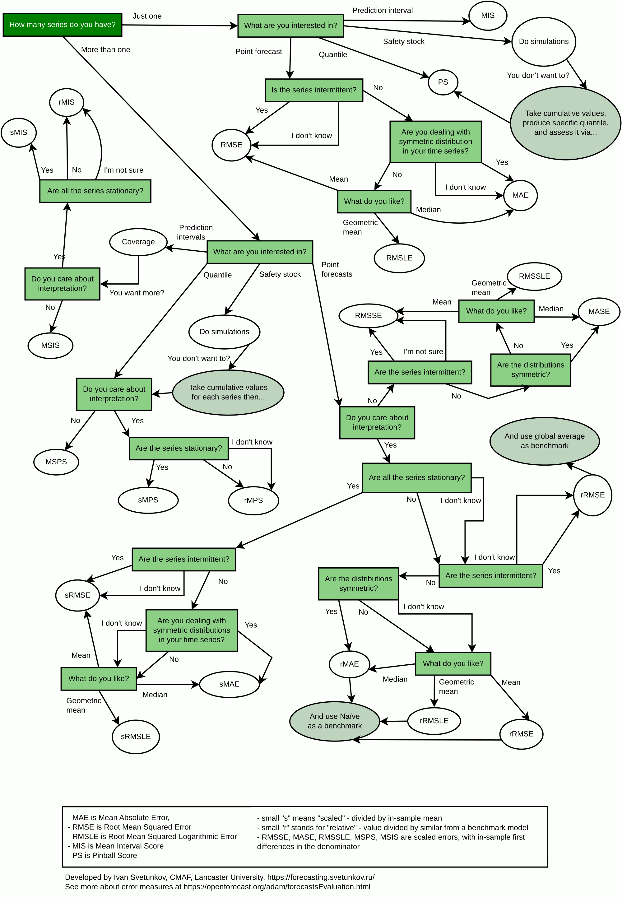

--- 
title: "Forecasting and Analytics with ADAM"
author: "Ivan Svetunkov"
date: "`r Sys.Date()`"
site: bookdown::bookdown_site
output: bookdown::gitbook
documentclass: book
bibliography: [library.bib, packages.bib, websites.bib]
csl: elsevier-harvard.csl
biblio-style: elsarticle-harv
link-citations: true
github-repo: config-i1/adam
description: "This textbook explains how to do time series analysis and forecasting using Augmented Dynamic Adaptive Model, implemented in smooth package for R."
---

# Preface {-}

```{r ADAMFSM, echo=FALSE, out.width='60%', fig.align='center'}
knitr::include_graphics("images/Adam-Title-web.jpg")
```


What is ADAM?

ADAM stands for "Augmented Dynamic Adaptive Model". The term "adaptive model" means that the parameters of the model change over time according to some assumed process. The word "dynamic" reflects the idea that the model has time series related components (ETS, ARIMA). Finally, the word "augmented" is included, because ADAM is the model that supports additional features not included in the conventional ETS / ARIMA. ADAM is a unified framework for constructing ETS / ARIMA / Regression, based on more advanced statistical instruments. For example, classical ARIMA is built on the assumption of normality of the error term, but ADAM lifts this assumption and allows using [other distributions](#distributions) as well (e.g. Generalised Normal, Inverse Gaussian etc). Another example, typically the conventional models are estimated either via the maximisation of the likelihood function or using basic losses like [MSE or MAE](#errorMeasures), but ADAM has a wider spectrum of losses and allows using custom ones. There is much more, and different aspects of ADAM will be discussed in detail later in this textbook. The ADAM model includes:

1. ETS;
2. ARIMA;
3. Regression;
4. TVP regression;
5. Combination of (1), (2) and either (3), or (4);
6. Automatic selection / combination of states for ETS;
7. Automatic orders selection for ARIMA;
8. Variables selection for regression part;
9. Normal and non-normal distributions;
10. Automatic selection of most suitable distributions;
11. Multiple seasonality;
12. Occurrence part of the model to handle zeroes in data (intermittent demand);
13. Handling uncertainty of estimates of parameters.

All these extensions are needed in order to solve specific real life problems, so we will have examples and case studies later in the book, in order to see how all of this can be used. The `adam()` function from `smooth` package implements ADAM and supports the following features:

1. Model diagnostics using plot() and other methods;
2. Confidence intervals for parameters of models;
3. Automatic outliers detection;
4. Handling missing data;
5. Fine tuning of persistence vector (smoothing parameters);
6. Fine tuning of initial values of the state vector (e.g. level / trend / seasonality);
7. Two initialisation options (optimal / backcasting);
8. Advanced and custom loss functions;
9. Provided ETS, ARMA and regression parameters;
10. Fine tuning of optimiser (selection of optimisation algorithm and convergence criteria);

This textbook uses two packages from R, namely `greybox`, which focuses on forecasting using regression models, and `smooth`, which implements Single Source of Error (SSOE) state space models for purposes of time series analysis and forecasting. The textbook focuses on explaining how ADAM ("ADAM is Dynamic Adaptive Model" - recursive acronym), one of the `smooth` functions (introduced in v3.0.0) works, also showing how it can be used in practice with examples from R.


If you want to run examples from the textbook, two packages are needed [@R-greybox; @R-smooth]:
```{r eval=FALSE}
install.packages("greybox")
install.packages("smooth")
```

Some explanations of functions from the packages are given in my blog: [Package greybox for R](https://forecasting.svetunkov.ru/en/category/r-en/greybox/), [Package smooth for R](https://forecasting.svetunkov.ru/en/category/r-en/smooth/).

A very important thing to note is that this textbook **does not use `tidyverse` packages**. I like base R, and, to be honest, I am sure that `tidyverse` packages are great, but I have never needed them in my research. So, I will not use pipeline operators, `tibble` or `tsibble` objects and `ggplot2`. It is assumed throughout the textbook that you can do all those nice tricks on your own if you want to.

```{r include=FALSE}
# automatically create a bib database for R packages
knitr::write_bib(c(
  .packages(), 'bookdown', 'knitr', 'rmarkdown', 'smooth', 'greybox', 'vioplot', 'pracma', 'legion'
), 'packages.bib')
# Load the necessary packages
library("latex2exp")
library("kableExtra")
library("statmod")
library("pracma")
library("greybox")
library("smooth")
library("vioplot")
```

---

You can use the following to cite the online version of this book:

::: adamCitation
- Svetunkov, I. (2021) Forecasting and Analytics with ADAM: Lancaster, UK. openforecast.org/adam. Accessed on [current date].
:::

If you use LaTeX, the following can be used instead:

```{r eval=FALSE}
@MISC{SvetunkovAdam,
    title = {Forecasting and Analytics with ADAM},
    author = {Ivan Svetunkov},
    howpublished = {OpenForecast},
    note = {(version: [current date])},
    url = {https://openforecast.org/adam/},
    year = {2021}
}
```

### License {-}

This textbook is licensed under [Creative Common License by-nc-sa 4.0](https://creativecommons.org/licenses/by-nc-sa/4.0/), which means that you can share, copy, redistribute and remix the content of the textbook for non-commercial purposes as long as you give appropriate credit to the author and provide the link to the original license. If you remix, transform, or build upon the material, you must distribute your contributions under the same CC-BY-NC-SA 4.0 license. See [the explanation on the Creative Commons website](https://creativecommons.org/licenses/by-nc-sa/4.0/).

### Acknowledgments {-}
I would like to thank Tobias Schmidt for his help in refining earlier parts of the textbook and correcting grammatical mistakes.

<!--chapter:end:index.Rmd-->

# Introduction {#intro}
I started writing this book in 2020 during the COVID-19 pandemic, having figured out that it had been more than 10 years since the publishing of the fundamental textbook of @Hyndman2008b, who discuss ETS (Error-Trend-Seasonality) model in the Single Source of Error (SSOE) form and that the topic has not been updated substantially since then. If you are interested in learning more about exponential smoothing, then this is a must-read material on the topic.

However, there has been some progress in the area since 2008, and I have developed some models and functions based on SSOE, making the framework more flexible and general. Given that publication of all aspects of these models in peer-reviewed journals would be very time consuming, I have decided to summarise all progress in this book, showing what happens inside the models and how to use the functions in different cases, so that there is a source to refer to.

Many parts of this textbook rely on such topics as model, scales of information, model uncertainty, likelihood, information criteria and model building. All these topics are discussed in detail in the online textbook of @SvetunkovSBA. You are recommended to familiarise yourself with them before moving to the more advanced modelling topics of ADAM.

In this chapter, we explain what is forecasting, how it is different from planning and analytics and what are the main forecasting principles one should follow in order not to fail in trying to predict the future.


## Forecasting, planning and analytics {#forecastingPlanningAnalytics}
While there are many definitions of what is forecast, I like the following one, proposed by Sergey Svetunkov [@Svetunkov2014Textbook]: **Forecast is a scientifically justified assertion about possible states of an object in future**. This definition does not have the word "probability" in it, because in some cases forecasts do not rely on rigorous statistical methods and theory of probabilities. For example, Delphi method allows obtaining judgmental forecasts, typically focusing on what to expect, not on the probability side of things. An important word in the definition is "scientific". If a prediction is done based on coffee grounds, then it is not a forecast. Judgmental predictions on the other hand can be considered as forecasts if a person has a reason behind them. If they do not, then they would be called "guesses", not forecasts. Finally, the word "future" is important as it shows the focus of the discipline: without the future there is no forecasting, only overfitting. As for the definition of **forecasting**, it is a process of producing forecasts - as simple as that.

Forecasting is a very important activity, carried by many companies, some of which do that unconsciously or label it as "demand planning" or "predictive analytics". There is a difference, however, between the terms "forecasting" and "planning". The latter relies on the former and implies actions made by the company in order to adjust its decision. For example, if we forecast that the sales will go down, a company should make some marketing decisions in order to increase the demand on the product. The first part relates to forecasting, while the second one relates to planning. This also means that if a company does not like a forecast, it should change something in its activities, not in the forecast itself. It is important not to confuse these terms in practice, when important decisions are made.

Another important thing to keep in mind is that any forecasting activity should be done to inform decisions. Forecasting for the sake of forecasting is pointless. Yes, we can forecast the overall number of hospitalisations due to SARS-CoV-2 virus in the world for the next decade, but what decisions can be made based on that? If there are some decisions, then this exercise is useful. If not, then this is just a waste of time.

```{example}
Retailers typically need to order some amount of milk that they will sell over the next week. They do not know how much they will sell so they usually order, hoping to satisfy, let us say, 95% of demand. This situation tells us that the forecasts need to be made a week ahead, they should be cumulative (considering the overal demand during a week before the next order) and that they should focus on an upper bound of a 95% prediction interval. Producing only point forecasts would not be useful in this situation.
```

Related to this is the question of forecasts accuracy. In reality, the accurate forecasts do not always translate to good decisions. This is because there are many different aspects of reality that need to be taken into account, and forecasting focuses only on one of them. Capturing the variability of demand correctly is sometimes more useful than producing very accurate forecasts - this is because many decisions are based on distributions of values rather than on point forecasts. The classical example of this situation is the inventory management, where the ordering decisions are made based on quantiles of distribution to form safety stock. Furthermore, the orders are typically done in pallets, so it is not important, whether the expected demand is 99 or 95 units, if a pallet includes 100 units of a product. This means that whenever we produce forecasts, we need to keep in mind how they will be used and by whom.

In some cases, the very accurate forecasts might go to waste if people make decisions differently and / or do not trust to what they see. For example, a demand planner might decide that a straight line is not a good point forecast and would start changing the values, introducing noise. This might happen due to lack of experience, expertise or trust in models, and this means that it is important to understand who will use the forecasts and how.

Finally, in practice, not everything can be solved with forecasting. In some cases companies can make decisions based on other reasons. For example, promotional decisions can be dictated by the existing stock of the product that needs to be moved out. Another case, if the holding costs for a product are very low, then there is no need in spending time on forecasting the demand on it - a company can implement a simple replenishment policy, ordering, when stock reaches some threshold. And in times of crysis, some decisions are dictated by the financial situation of a company, not by forecasts: you do not need to predict demand on products that are sold out of prestige if they are not profitable and a company needs to cut the costs.

Summarising all above, before diving into forecasting, it makes sense to find out what decisions will be made based on it, by whom and how. There is no need to waste time and effort on improving the forecasting accuracy if the process in company is flawed and forecasts are then ignored, not needed or amended inadequately.

As for analytics, this is a relatively new term, which implies a set of activities based on analysis, forecasting and optimisation to support informed managerial decisions. The term is large and relies on many research areas, including forecasting, simulations, optimisation etc. In this textbook, we will focus on the forecasting side, occasionally discussing how to analyse the existing processes (thus touching the analytics part) and how various models could help in making adequate practical decisions.


## Forecasting principles {#forecastingPrinciples}
If you have decided that you need to forecast something, then it makes sense to keep several important forecasting principles in mind.

First, as discussed earlier, you need to understand why the forecast is needed, how it will be used and by whom. Answers to these questions will guide you in deciding, what technique to use, how specifically to do forecasting and what should be reported. For example, if a client does not know machine learning, it might be unwise to use Neural Networks for forecasting - the client will not trust the technique and thus will not trust the forecasts, switching to simpler methods. If the final decision is to order some number of units, then it would be more reasonable to produce cumulative forecasts over the lead time (time between the order and product delivery) and form safety stock based on the model and assumed distribution.

When you have an understanding of what to forecast and how, the second principle comes into play. Select the relevant error measure. You need to decide how to measure the accuracy of forecasting methods, keeping in mind that accuracy needs to be as close to the final decision, as possible. For example, if you need to decide the number of nurses for a specific day in the A&E department based on the patients attendance, then it would be more reasonable to compare models in terms of their quantile performance (see Section \@ref(uncertainty)) rather than expectation or median. Thus, it would be more appropriate to calculate pinball loss instead of MAE or RMSE (see details in Section \@ref(forecastsEvaluation)).

Third, you should always test your models on a sample of data not seen by them. Train your model on one part of a sample (*train set* or *in-sample*) and test it on another one (*test set* or *holdout sample*). This way you can have some guarantees that the model will not overfit the data and that when you need to produce a final forecast, it will be reasonable. Yes, there are cases, when you do not have enough data to do that. All you can do in these situations, is use simpler, robust models [for example, such as damped trend exponential smoothing by @Roberts1982; and @Gardner1985a; or Theta by @Assimakopoulos2000] and to use judgment in deciding, whether the final forecasts are reasonable or not. But in all the other cases, you should test model on the data they are not aware of. The recommended approach in this case is rolling origin, discussed in more detail in Section \@ref(rollingOrigin).

Fourth, the forecast horizon should be aligned with specific decisions in practice. If you need predictions for a week ahead there is no need to produce forecasts for the next 52 weeks. On one hand this is costly and excessive, on the other hand the measured accuracy will not align with the needs of the company. The related issues is the test set (or holdout) size selection. There is no unique guideline for this, but it should not be shorter than the forecasting horizon.

Fifth, the time series aggregation level should be as close to the specific decisions as possible: there is no need to produce forecasts on hourly level for the next week (168 hours ahead) if the decision is based on the order of a product for that period of time - we would not need such a granularity of data for the decision, data aggregated to weekly level will do the trick, but we would waste a lot of time making complicated models work on hourly level.

Sixth, you need to have benchmark models. Always compare forecasts from your favourite approach with those from Naïve, global average and / or regression - depending on what you deal with specifically. If your fancy Neural Network performs worse than Naïve, then it does not bring value and should not be used in practice. Comparing one Neural Network with another is also not a good idea, because Simple Exponential Smoothing (see Section \@ref(SES)), being much simpler model, might beat both networks, and you would never find out about that. If possible, also compare forecasts from the proposed approach with forecasts of other well established benchmarks, such as ETS [@Hyndman2008b], ARIMA [@Box1976] and Theta [@Assimakopoulos2000].

Finally, when comparing forecasts from different models, you might end up with several very similar performing approaches. If the difference between them is not significant, then the general recommendation is to select the one that is faster and simpler. This is because simpler models are more difficult to break and those that work faster are more attractive in practice due to reduced energy consumption [save the planet and stop global warming! @Dhar2020].

These principles do not guarantee that you will end up with the most accurate forecasts, but at least you will not end up with the unreasonable ones.


## Types of forecasts {#typesOfForecasts}
Depending on circumstances, we might require different types of forecasts with different characteristics. It is important to understand what your model produces in order to measure its performance correctly (see Section \@ref(errorMeasures)) and make correct decisions in practice. There are several things that are typically produced for forecasting purposes. We start with the most popular one.

### Point forecasts {#typesOfForecastsPoint}
The classical and most often produced thing is the point forecast, which corresponds to some trajectory from a model. This however might align with different types of statistics depending on the model and its assumptions. In case of pure additive model (such as linear regression), the point forecasts correspond to the conditional expectation (**mean**) from the model. The conventional interpretation of this value is that it shows what to expect on average if the situation would repeat itself many times (e.g. if we have the day with similar conditions, then the average temperature will be 10 degrees Celsius). In case of time series, this interpretation is difficult to digest, given that time does not repeat itself, but this is the best we can have. The technicalities of producing conditional expectations from ADAM will be discussed in Section \@ref(ADAMForecastingExpectation).

Another type of point forecast is the (conditional) geometric expectation (**geometric mean**). It typically arises, when the model is applied to the data in logarithms and the final forecast is only exponentiated. This becomes apparent from the following definition of geometric mean:
\begin{equation}
    \check{y} = \sqrt[T]{\prod_{t=1}^T y_t} = \exp \left(\frac{1}{T} \sum_{t=1}^T \log(y_t) \right) ,
    (\#eq:GeoMean)
\end{equation}
where $y_t$ is the actual value and $T$ is the sample size. In order to use the geometric mean, it is assumed that the actual values can only be positive, otherwise the root in c might produce imaginary units (due to, for example, taking a square root out of a negative number) or be equal to zero (if one of the values is zero). In general, the arithmetic and geometric means are related via the following inequality:
\begin{equation}
    \check{y} \leq \mu ,
    (\#eq:GeoAndArithMeans)
\end{equation}
where $\check{y}$ is the geometric mean and $\mu$ is the arithmetic one. Although geometric mean makes sense in many contexts, it is more difficult to explain than the arithmetic one to decision makers.

Finally, sometimes **medians** are used in place of point forecasts. In this case we can say that the forecast splits the sample in two halves and shows the level, below which 50% of observations will lie in the future.

**Note**, the specific type of point forecast will differ with the model used in construction. For example, in case of pure additive model, assuming some symmetric distribution (e.g. Normal one), the arithmetic mean, geometric mean and median will coincide. In this case, there is nothing to choose from. On the other hand, a model constructed in logarithms will assume an asymmetric distribution for the original data, leading to the following relation between the means and the median (in case of positively skewed distribution):
\begin{equation}
    \check{y} \leq \tilde{y}\leq \mu ,
    (\#eq:GeoAndArithMeansAndMedian)
\end{equation}
where $\tilde{y}$ is the median of distribution.

### Quantiles and prediction intervals {#typesOfForecastsInterval}
As some forecasters say, all point forecasts are wrong. They will never correspond to the actual values, because they only capture the mean (or median) performance of the model, as discussed in the previous subsection. Everything that is not included in the point forecast can be considered as an uncertainty of demand. For example, we never will be able to say specifically how many cups of coffee we will sell next Monday, but we can at least capture the main tendencies and the uncertainty around our point forecast.

```{r adamExampleNormal, fig.cap="An example of a well behaved data, point forecast and a 95% prediction interval.", echo=FALSE}
testAdam <- adam(rnorm(100,100,10), "ANN", persistence=0, h=10, holdout=TRUE)
testAdamForecast <- forecast(testAdam, h=10, interval="approx")
plot(testAdamForecast, main="")
```

Figure \@ref(fig:adamExampleNormal) shows an example, with a well behaved demand, for which the best point forecast is the straight line. In order to capture the uncertainty of demand, we can construct the prediction interval, which will tell in which bound the demand will lie in $1-\alpha$ percent of cases. The interval in Figure \@ref(fig:adamExampleNormal) has the width of 95% ($\alpha=0.05$) and shows that if the situation is repeated many times, the actual demand will be between `r round(testAdamForecast$lower[1],2)` and `r round(testAdamForecast$upper[1],2)`. Capturing the uncertainty correctly is important, because the real life decisions need to be made based on the full information, not only on the point forecasts.

We will discuss how to produce prediction intervals in more detail in Section \@ref(ADAMForecastingPI). For more detailed discussion on the concepts of prediction and confidence intervals, see Chapter 5 of @SvetunkovSBA.

Another way to capture the uncertainty (related to the prediction interval) is via specific quantiles of distribution. The prediction interval typically has two sides, leaving $\frac{\alpha}{2}$ values on the left and the same on the right, outside the bounds of the interval. Instead of producing the interval, in some cases we might need just a specific quantile, essentially producing the one-sided prediction interval (see Section \@ref(forecastingADAMOtherOneSided) for technicalities). The bound in this case will show the specific value, below which the pre-selected percentage of cases would lie. This becomes especially useful, in such contexts as safety stock calculation (because we are not interested in knowing the lower bound, we want to have products to satisfy some proportion of demand).


### Forecast horizon
Finally, an important aspect in forecasting is the horizon, for which we need to produce forecasts. Depending on the context, we might need:

1. Only a specific value h steps ahead, e.g. what the temperature next Monday will be.
2. All values from 1 to h steps ahead, e.g. how many patients we will have each day next week.
3. Cumulative values for the period from 1 to h steps ahead, e.g. what the cumulative demand over the lead time (the time between the order and product delivery) will be (see discussion in Section \@ref(forecastingADAMOtherCumulative)).

It is important to understand how decisions are made in practice and align them with the forecast horizon. In combination with the point forecasts and prediction intervals discussed above, this will give us an understanding of what to produce from the model and how. For example, in case of safety stock calculation it would be more reasonable to produce quantile of the cumulative over the lead time demand than to produce point forecasts from the model.


## Models, methods and typical assumptions {#modelsMethods}
While we do not aim to fully cover the topic of models, methods and typical assumptions of statistical models, we need to make several important definitions, so that it becomes clear what we will discuss in this textbook. For a more detailed discussion, see Chapters 1 and 12 of @SvetunkovSBA.

Cambridge dictionary [@CambridgeMethod] defines **method** as a particular way of doing something. So, the method does not necessarily explain how the structure appears or how the error term interacts with it, it only explains how a value is produced. In our context, forecasting method would be a formula that generates point forecasts based on some parameters and available data. It would not explain how what underlies the data.

**Statistical model** on the other hand, is a 'mathematical representation of a real phenomenon with a complete specification of distribution and parameters' [@Svetunkov2019a]. It explains what happens inside the data, reveals the structure and shows how the error term interacts with the structure.

While we discuss statistical models, we should also define **true model**. It is "the idealistic statistical model that is correctly specified (has all the necessary components in correct form), and applied to the data in population" [@SvetunkovSBA]. Note that some statisticians also use the term **Data Generating Process** (DGP), when talking about the true model, but I think that we need to make a distinction between the two terms, as DGP implies that the data is somehow generated using a mathematical formula. In real life, the data is not generated from any function, it comes from a measurement of a complex process, influenced by many factors (e.g. behaviour of a group of customers based on their individual preferences and mental states). The DGP is useful when we want to conduct some experiments on a simulated data, in a control environment, but it is not helpful, when it comes to applying models to the data. Finally, the true model is an abstract notion, because it is never known or reachable. But it is still a useful one, as it allows not only to see what would happen in case when we know the model, but more importantly what would happen, when the model we use is wrong.

The related to this definition is the **estimated** or **applied model**, which is the statistical model that is applied to the available sample of data. This model will almost always be wrong, because even if we know for some mysterious reason the specification of the true model, we would still need to estimate it on our data. In this case the estimates of parameters would differ from the ones in the population and thus the model will still be wrong.

Mathematically, in the simplest case the true model can be written as:
\begin{equation}
    y_t = \mu_{y,t} + \epsilon_t,
    (\#eq:TrueModel)
\end{equation}
where $y_t$ is the actual value, $\mu_{y,t}$ is the structure and $\epsilon_t$ is the true noise. If we manage to capture the structure correctly, the model applied to the sample of data would be written as:
\begin{equation}
    y_t = \hat{\mu}_{y,t} + e_t,
    (\#eq:AppliedModel)
\end{equation}
where $\hat{\mu}_{y,t}$ is the estimate of the structure $\mu_{y,t}$ and $e_t$ is the estimate of the noise $\epsilon_t$ (also known as "**residuals**"). If the structure is captured correctly, then there would still be a difference between \@ref(eq:TrueModel) and \@ref(eq:AppliedModel), because the latter is estimated on the data. However, if the sample size increases and we use an adequate estimation procedure, then due to Central Limit Theorem [see Chapter 4 of @SvetunkovSBA] the distance between the two models will decrease and asymptotically (with the increase of sample size) $e_t$ would converge to $\epsilon_t$. This does not happen automatically, and there are some assumptions that should hold in order for this to happen.

### Assumptions of statistical models {#assumptions}
Very roughly, the typical assumptions of statistical models can be split into following categories [@SvetunkovSBA]:

1. Model is correctly specified:
a. We have not omitted important variables in the model (underfitting the data);
b. We do not have redundant variables in the model (overfitting the data);
c. The necessary transformations of the variables are applied;
d. We do not have outliers in the model;
2. Residuals are independent and identically distributed (i.i.d.):
a. There is no autocorrelation in the residuals;
b. The residuals are homoscedastic;
c. The expectation of residuals is zero, no matter what;
d. The variable follows the assumed distribution;
e. More generally speaking, distribution of residuals does not change over time;
3. The explanatory variables are not correlated with anything but the response variable:
a. No multicollinearity;
b. No endogeneity.

Many of these assumptions come to the idea that we have correctly captured the structure, meaning that we have not omitted any important variables, we have not included the redundant ones and that we transformed all the variables in the correct way (e.g. took logarithms, where needed). If all these assumptions hold, then we would expect the applied model to converge to the true one with the increase of the sample size. If some of them do not hold, then the point forecasts from our model might be biased or we might end up producing prediction intervals that are wider (or narrower) than needed. 

These assumptions with their implications on example of multiple regression are discussed in detail in Chapter 12 of @SvetunkovSBA. The diagnostics of dynamic models based on these assumptions is discussed in Chapter \@ref(diagnostics).

<!--chapter:end:Chapters//01-Introduction.Rmd-->

# Forecasts evaluation {#forecastsEvaluation}
As discussed in Section \@ref(forecastingPlanningAnalytics), forecasts ought to serve a specific purpose. They should not be made "just because" but be useful in the making of a decision. The decision then dictates the kind of forecast that should be made -- its form and its time horizon(s). It also dictates how the forecast should be evaluated -- a forecast only being as good as the quality of the decisions it enables.

When you understand how your system works and what sort of forecasts you should produce, you can start an evaluation process; measuring the performance of different forecasting models / methods and selecting the most appropriate for your data. There are different ways to measure and compare the performance of models / methods.

In this chapter, we discuss the most common approaches, first focusing on the evaluation of point forecasts, then moving towards prediction intervals and quantile forecasts. After that we discuss how to choose the appropriate error measure and finally, how to make sure that the model performs consistently on the available data via rolling origin evaluation and statistical tests.


## Measuring accuracy of point forecasts {#errorMeasures}
We start with a setting in which we are interested in point forecasts only. In this case we typically start by splitting the available data into train and test sets, apply the models under consideration to the former and produce forecasts on the latter, not showing that part to the models. This is called the "fixed origin" approach: we fix the point in time from which to produce forecasts, we produce them, calculate some sort of error measure and compare the models.

There are different error measures that can be used in this case. Which measure ought to be used depends on the specific need. Here we briefly discuss the most important measures and refer to [@Davydenko2013; @SvetunkovAccuracy2019; @SvetunkovAPEs2017] for the gory details.

The majority of point forecast measures relies on the following two popular metrics:

**Root Mean Squared Error** (RMSE):
\begin{equation}
    \mathrm{RMSE} = \sqrt{\frac{1}{h} \sum_{j=1}^h \left( y_{t+j} - \hat{y}_{t+j} \right)^2 },
    (\#eq:RMSE)
\end{equation}
and **Mean Absolute Error** (MAE):
\begin{equation}
    \mathrm{MAE} = \frac{1}{h} \sum_{j=1}^h \left| y_{t+j} - \hat{y}_{t+j} \right| ,
    (\#eq:MAE)
\end{equation}
where $y_{t+j}$ is the actual value $j$ steps ahead from the holdout, $\hat{y}_{t+j}$ is the $j$ steps ahead point forecast and $h$ is the forecast horizon. As you see, these error measures aggregate the performance of competing forecasting methods across the forecasting horizon, averaging out the specific performances on each $j$. If this information needs to be retained, then the summation can be dropped to obtain a set of "SE" and "AE".

It is well-known [see, for example, @Kolassa2016] that **RMSE is minimised by the mean value** of a distribution, and **MAE is minimised by the median**. So, when selecting between the two, you should consider this property. This means, for example, that MAE-based error measures should not be used for the evaluation of models on intermittent demand, because zero forecast will minimise MAE, when the sample contains more than 50% of zeroes [see for example, @Wallstrom2010].

Another error measure that has been used in some cases is Root Mean Squared Logarithmic Error [RMSLE, see discussion in @Tofallis2015]:
\begin{equation}
    \mathrm{RMSLE} = \exp\left(\sqrt{\frac{1}{h} \sum_{j=1}^h \left( \log y_{t+j} - \log \hat{y}_{t+j} \right)^2} \right).
    (\#eq:RMSLE)
\end{equation}
It assumes that the actual values and the forecasts are positive and is **minimised by geometric mean**. In the formula \@ref(eq:RMSLE), I have added the exponentiation, which is sometimes omitted. The reason for this is to bring the metric to the original scale, so that it has the same units as the actual values $y_t$.

The main difference in the three measures arises, when the data we deal with is not symmetric - in that case the arithmetic, geometric means and median will be different and thus the error measures might recommend different appraoches depending on what specifically is produced as a point forecast from the model (see discussion in Section \@ref(typesOfForecastsPoint)).

### An example in R
In order to see how the error measures work, we consider the following example based on a couple of forecasting functions from `smooth` package for R [@Hyndman2008b and @Svetunkov2015] and measures from `greybox`:
```{r eval=FALSE}
y <- rnorm(100,100,10)
model1 <- es(y,h=10,holdout=TRUE)
model2 <- ces(y,h=10,holdout=TRUE)
# RMSE
setNames(sqrt(c(MSE(model1$holdout, model1$forecast),
                MSE(model2$holdout, model2$forecast))),
         c("ETS","CES"))
# MAE
setNames(c(MAE(model1$holdout, model1$forecast),
           MAE(model2$holdout, model2$forecast)),
         c("ETS","CES"))
# RMSLE
setNames(exp(sqrt(c(MSE(log(model1$holdout), log(model1$forecast)),
                    MSE(log(model2$holdout), log(model2$forecast))))),
         c("ETS","CES"))
```

```{r echo=FALSE}
load("data/errorMeasures.Rdata")

# RMSE
setNames(sqrt(c(MSE(model1$holdout, model1$forecast),
                MSE(model2$holdout, model2$forecast))),
         c("ETS","CES"))
# MAE
setNames(c(MAE(model1$holdout, model1$forecast),
           MAE(model2$holdout, model2$forecast)),
         c("ETS","CES"))
# RMSLE
setNames(exp(sqrt(c(MSE(log(model1$holdout), log(model1$forecast)),
                    MSE(log(model2$holdout), log(model2$forecast))))),
         c("ETS","CES"))
```

Given that the distribution of the original data is symmetric, all three error measures should in general recommend the same model. But also given that the data we generated for the example is stationary, the two models will produce very similar forecasts. The values above demonstrate the latter point - the accuracy between the two models is roughly the same. Note that we have evaluated the same point forecasts from the models using different error measures, which would be wrong if the distribution of the data would be skewed. In our case, the model relies on normal distribution, so the point forecast from it would coincide with arithmetic mean, geometric mean and median.


### Aggregating error measures {#errorMeasuresAggregate}
The main advantage of the error measures discussed in the previous subsection is that they are very simple and have a clear interpretations: they reflect the "average" distances between the point forecasts and the observed values. They are perfect for the work with only one time series. However, they are not suitable, when a set of time series is under consideration, and a forecasting method needs to be selected across them. This is because they are scale dependent and contain specific units: if you measures sales of apples in units, then MAE, RMSE and RMSLE (defined in equation \@ref(eq:RMSLE)) will show the error in units as well. And, as we know, you should not add up apples with oranges - the result might not make sense.

In order to tackle this issue, different error scaling techniques have been proposed, resulting in a zoo of error measures:

1. MAPE - Mean Absolute Percentage Error:
\begin{equation}
    \mathrm{MAPE} = \frac{1}{h} \sum_{j=1}^h \frac{|y_{t+j} - \hat{y}_{t+j}|}{y_{t+j}},
    (\#eq:MAPE)
\end{equation}
2. MASE - Mean Absolute Scaled Error [@Hyndman2006]:
\begin{equation}
    \mathrm{MASE} = \frac{1}{h} \sum_{j=1}^h \frac{|y_{t+j} - \hat{y}_{t+j}|}{\bar{\Delta}_y},
    (\#eq:MASE)
\end{equation}
where $\bar{\Delta}_y = \frac{1}{t-1}\sum_{j=2}^t |\Delta y_{j}|$ is the mean absolute value of the first differences $\Delta y_{j}=y_j-y_{j-1}$ of the in-sample data;
3. rMAE - Relative Mean Absolute Error [@Davydenko2013]:
\begin{equation}
    \mathrm{rMAE} = \frac{\mathrm{MAE}_a}{\mathrm{MAE}_b},
    (\#eq:rMAE)
\end{equation}
where $\mathrm{MAE}_a$ is the mean absolute error of the model under consideration and $\mathrm{MAE}_b$ is the MAE of the benchmark model;
4. sMAE - scaled Mean Absolute Error [@Petropoulos2015]:
\begin{equation}
    \mathrm{sMAE} = \frac{\mathrm{MAE}}{\bar{y}},
    (\#eq:sMAE)
\end{equation}
where $\bar{y}$ is the mean of the in-sample data.
5. and others.

There is no "best" error measure. All have advantages and disadvantages, but some of them are more suitable in some circumstances than the others. For example:

1. MAPE is scale sensitive (if the actual values are measured in thousands of units, the resulting error will be much lower than in the case of hundreds of units) and cannot be estimated on data with zeroes. Furthermore, this error measure is biased, preferring when models underforecast the data [see for example, @Makridakis1993] and is not minimised by median, but in general by an unknown quantity. Accidentally, in case of log normal distribution it is minimised by the mode [see discussion in @Kolassa2016]. Despite all the limitations, MAPE has a simple interpretation as it shows the percentage error (as the name suggests);
2. MASE avoids the disadvantages of MAPE, but does so at the cost of a simple interpretation due to the division by the first differences of the data (some interpret this as an in-sample one-step-ahead Naïve forecast, which does not simplify the interpretation);
3. rMAE avoids the disadvantages of MAPE, has a simple interpretation (it shows by how much one model is better than the other), but fails, when either $\mathrm{MAE}_a$ or $\mathrm{MAE}_b$ for a specific time series is equal to zero. In practice, this happens more often than desired, and can be considered as a serious limitation of the error measure. Furthermore, the increase of rMAE (for example, with the increase of sample size) might mean that either the method A is performing better than before, or that the method B is performing worse than before - it is not possible to tell the difference unless the denominator in the formula \@ref(eq:rMAE) is fixed;
4. sMAE avoids the disadvantages of MAPE has an interpretation close to it, but breaks down when the data has a trend.

When comparing different forecasting methods it might make sense to calculate several error measures for comparison. The choice of metric might depend on the specific needs of the forecaster. Here's a few rules of thumb, however:

- If you want a robust measure that works consistently, but you do not care about the interpretation, then go with MASE.
- If you want an interpretation, then either go with rMAE, or sMAE (just keep in mind that if you decide to use rMAE or any other relative measure, you might get attacked by its creator, Andrey Davydenko, who might blame you for stealing his creation, even if you put a reference to his work).
- If the data does not exhibit trends (stationary), then you can use sMAE.
- You should typically avoid MAPE and other percentage error measures because they are highly influenced by the actual values you have in the holdout.

Furthermore, similar to the measures above, there have been proposed RMSE-based scaled and relative error metrics, which would measure the performance of methods in terms of means rather than medians. Here is a brief list of some of them:

1. RMSSE - Root Mean Squared Scaled Error [@Makridakis2020a]:
\begin{equation}
    \mathrm{RMSSE} = \sqrt{\frac{1}{h} \sum_{j=1}^h \frac{(y_{t+j} - \hat{y}_{t+j})^2}{\bar{\Delta}_y^2}} ;
    (\#eq:RMSSE)
\end{equation}
3. rRMSE - Relative Root Mean Squared Error [@Stock2004]:
\begin{equation}
    \mathrm{rRMSE} = \frac{\mathrm{RMSE}_a}{\mathrm{RMSE}_b} ;
    (\#eq:rRMSE)
\end{equation}
4. sRMSE - scaled Root Mean Squared Error [@Petropoulos2015]:
\begin{equation}
    \mathrm{sRMSE} = \frac{\mathrm{RMSE}}{\bar{y}} .
    (\#eq:sRMSE)
\end{equation}

Similarly, RMSSLE, rRMSLE and sRMSLE can be proposed, using the same principles as in \@ref(eq:RMSSE), \@ref(eq:rRMSE) and \@ref(eq:sRMSE) to assess performance of models in terms of geometric means across time series.

Finally, when aggregating the performance of forecasting methods across several time series, sometimes it makes sense to look at the distribution of errors - this way you will know which of the methods fails seriously and which does a consistently good job. If an aggregate measure is needed, then **use mean and median of the chosen metric**. The mean might be non-finite for some of error measures, especially when a method performs extremely poorly on a time series (an outlier), but it will give you an information about the average performance of the method and might flag the extreme cases. The median at the same time is robust to outliers and is always calculable, no matter what the distribution of the error term is. Furthermore, the comparison of mean and median might provide an additional information about the tail of distribution without reverting to histograms or calculation of quantiles. @Davydenko2013 argues for the use of geometric mean for relative and scaled measures, but as discussed earlier, it might become equal to zero or to infinity if the data contains outliers (e.g. two cases, when one of methods produced perfect forecast, or the benchmark in rMAE produced a perfect forecast). At the same time, if the distribution of errors in logarithms is symmetric [which is the main argument of @Davydenko2013], then geometric mean will coincide with median, so there is no point in calculating the geometric mean at all.


### Demonstration in R {#errorMeasuresExampleBig}
In R, there is a variety of functions that calculate the error measures discussed above, including the `accuracy()` function from `forecast` package and `measures()` from `greybox`. Here is an example of how the measures can be calculated based on a couple of forecasting functions from `smooth` package for R and a set of generated time series:

```{r eval=FALSE}
# Apply a model to a test data to get names of error measures
y <- rnorm(100,100,10)
test <- es(y,h=10,holdout=TRUE)
# Define number of iterations
nsim <- 100
# Create an array for nsim time series, 2 models and a set of error measures
errorMeasures <- array(NA, c(nsim,2,length(test$accuracy)),
                       dimnames=list(NULL,c("ETS","CES"),
                                     names(test$accuracy)))
# Start a loop for nsim iterations
for(i in 1:nsim){
  # Generate a time series
  y <- rnorm(100,100,10)
  # Apply ETS
  testModel1 <- es(y,"ANN",h=10,holdout=TRUE)
  errorMeasures[i,1,] <- measures(testModel1$holdout, testModel1$forecast,
                                  actuals(testModel1))
  # Apply CES
  testModel2 <- ces(y,h=10,holdout=TRUE)
  errorMeasures[i,2,] <- measures(testModel2$holdout, testModel2$forecast,
                                  actuals(testModel2))
}
```

The default benchmark methods for relative measures above is Naïve. In order to see how the distribution of error measures would look like, we can produce violinplots via `vioplot()` function from `vioplot` package. We will focus on rRMSE measure (see Figure \@ref(fig:errorMeasuresrRMSEDistLog)).

```{r errorMeasuresrRMSEDist, fig.cap="Distribution of rRMSE on the original scale."}
vioplot::vioplot(errorMeasures[,,"rRMSE"])
```

The distributions in Figure \@ref(fig:errorMeasuresrRMSEDistLog) look similar, and it is hard to tell, which one of them performs better. Besides, they do not look symmetric so we will take logarithms to see if this fixes the issue with the skewness (Figure \@ref(fig:errorMeasuresrRMSEDistLog)).

```{r errorMeasuresrRMSEDistLog, fig.cap="Distribution of rRMSE on the log scale."}
vioplot::vioplot(log(errorMeasures[,,"rRMSE"]))
```

Figure \@ref(fig:errorMeasuresrRMSEDistLog) demonstrates that the distribution in logarithms is skewed, so the geometric mean in this case would not be suitable and might provide a misleading information. So, we calculate mean and median rRMSE to check the overall performance of the two models:

```{r}
# Calculate mean rRMSE
apply(errorMeasures[,,"rRMSE"],2,mean)
# Calculate median rRMSE
apply(errorMeasures[,,"rRMSE"],2,median)
```

Based on the values above, we cannot make any solid conclusion about the performance of the two models: in terms of both mean and median rRMSE, CES is doing slightly better, but the difference between the two models is not substantial so we can probably choose the one that is easier to work with.


## Measuring uncertainty {#uncertainty}
As discussed in Section \@ref(typesOfForecastsInterval), point forecasts are not sufficient for adequate decision making - prediction intervals and quantiles are needed in order to capture the uncertainty of demand around the point forecast. As with point forecasts multiple measures can be used to evaluate them. There are several useful measures for evaluation of intervals. We start with the simplest of them, coverage.

1. **Coverage** shows the percentage of observations lying inside the interval:
\begin{equation}
    \mathrm{coverage} = \frac{1}{h} \sum_{j=1}^h \left( \mathbb{1}(y_{t+j} < l_{t+j}) \times \mathbb{1}(y_{t+j} > u_{t+j}) \right),
    (\#eq:coverage)
\end{equation}
where $l_{t+j}$ is the lower bound and $u_{t+j}$ is the upper bound of the interval and $\mathbb{1}(\cdot)$ is the indicator function, returning one, when the condition is true and zero otherwise. Ideally, the coverage should be equal to the confidence level of the interval, but in reality, this can only be observed asymptotically (with the increase of the sample size), as the sample size increases due to the inheritted randomness of any sample estimates of parameters;
2. **Range** shows the width of the prediction interval:
\begin{equation}
    \mathrm{range} = \frac{1}{h} \sum_{j=1}^h (u_{t+j} -l_{t+j});
    (\#eq:range)
\end{equation}
If the range of interval from one model is lower than the range of the other one, then the uncertainty about the future values is lower for the first one. However, the narrower interval might not include as many actual values in the holdout sample, leading to lower coverage. So, there is a natural trade-off between the two measures.
3. **Mean Interval Score** [@Gneiting2007] combines the properties of the previous two measures:
\begin{equation}
    \begin{aligned}
    \mathrm{MIS} = & \frac{1}{h} \sum_{j=1}^h \left( (u_{t+j} -l_{t+j}) + \frac{2}{\alpha} (l_{t+j} -y_{t+j}) \mathbb{1}(y_{t+j} < l_{t+j}) +\right. \\
    & \left. \frac{2}{\alpha} (y_{t+j} -u_{t+j}) \mathbb{1}(y_{t+j} > u_{t+j}) \right) ,
    \end{aligned}
    (\#eq:MIS)
\end{equation}
where $\alpha$ is the significance level. If the actual values lie outside of the interval, they get penalised with a ratio of $\frac{2}{\alpha}$, proportional to the distance from the interval bound. At the same time the width of the interval positively influences the value of the measure: the wider the interval, the higher the score. The ideal model with $\mathrm{MIS}=0$ should have all the actual values in the holdout lying on the bounds of the interval and $u_{t+j}=l_{t+j}$, implying that the bounds coincide with each other and that there is no uncertainty about the future (which is not possible in real life).
4. **Pinball Score** [@Koenker1978] measures the accuracy of models in terms of specific quantiles (this is usually applied to different quantiles produced from the model, not just to the lower and upper bounds of 95% interval):
\begin{equation}
    \mathrm{PS} = (1 -\alpha) \sum_{y_{t+j} < q_{t+j}, j=1,\dots,h } |y_{t+j} -q_{t+j}| + \alpha \sum_{y_{t+j} \geq q_{t+j} , j=1,\dots,h } |y_{t+j} -q_{t+j}|,
    (\#eq:pinball)
\end{equation}
where $q_{t+j}$ is the value of the specific quantile of the distribution. What PS shows, is how well we capture the specific quantile in the data. The lower the value of pinball is, the closer the bound is to the specific quantile of the holdout distribution. If the PS is equal to zero, then we have done the perfect job in hitting that specific quantile. The main issue with PS is that it is very difficult to assess the quantiles correctly on small samples. For example, in order to get a better idea of how the 0.975 quantile performs, we would need to have at least 40 observations, so that 39 of them would be expected to lie below this bound $\left(\frac{39}{40} = 0.975\right)$. In fact, quantiles are not always uniquely defined [see, for example, @Taylor2020], which makes the measurement difficult.

Similar to the pinball function, it is possible to propose the expectile-based score, but while it has nice statistical properties [@Taylor2020], it is more difficult to interpret.

Range, MIS and PS are unit-dependent. In order to be able to aggregate them over several time series they need to be scaled (as we did with MAE and RMSE in Section \@ref(errorMeasures)) either via division by the in-sample mean or in-sample mean absolute differences in order to obtain the scaled counterparts of the measures or via division by the values from the benchmark model in order to obtain the relative one.

If you are interested in the overall performance of the model, then MIS provides this information. However, it does not show what specifically happens inside and is difficult to interpret. Coverage and range are easier to interpret but they only give information about the specific prediction interval and typically must be traded off against each other (i.e. one can either cover more or have a narrower interval). Academics prefer the pinball for the purposes of uncertainty assessment, as it shows more detailed information about the predictive distribution from each model, but, while it is easier to interpret than MIS, it is still not as straightforward as coverage and range. So, the selection of the measure, again, depends on your specific situation and on the understanding of statistics by decision makers.


### Example in R
Continuing the example from Section \@ref(errorMeasures), we could produce prediction intervals from the two models and compare them using MIS and pinball:

```{r}
model1Forecast <- forecast(model1,h=10,interval="p",level=0.95)
model2Forecast <- forecast(model2,h=10,interval="p",level=0.95)

# Mean Interval Score
setNames(c(MIS(model1$holdout, model1Forecast$lower,
               model1Forecast$upper, 0.95),
           MIS(model2$holdout, model2Forecast$lower,
               model2Forecast$upper, 0.95)),
         c("Model 1", "Model 2"))

# Pinball for the upper bound
setNames(c(pinball(model1$holdout, model1Forecast$upper, 0.975),
           pinball(model2$holdout, model2Forecast$upper, 0.975)),
         c("Model 1", "Model 2"))


# Pinball for the lower bound
setNames(c(pinball(model1$holdout, model1Forecast$lower, 0.025),
           pinball(model2$holdout, model2Forecast$lower, 0.025)),
         c("Model 1", "Model 2"))

# Coverage
setNames(c(mean(model1$holdout > model1Forecast$lower &
                model1$holdout < model1Forecast$upper),
           mean(model2$holdout > model2Forecast$lower &
                model2$holdout < model2Forecast$upper)),
         c("Model 1", "Model 2"))
```

The values above imply that the first model (ETS) performed better than the second one in terms of MIS and pinball loss (it interval was narrower). However, these measures do not tell much in terms of performance of models, when only applied to one time series. In order to see more solid results, we need to apply models to a set of time series, produce prediction intervals, calculate measures and then look at their aggregate performance, e.g. via mean / median or quantiles. The loop and the analysis would be similar to the one discussed in Section \@ref(#errorMeasuresExampleBig), so we do not repeat it here.


## How to choose appropriate error measure {#errorMeasuresSelection}
While in general the selection of error measure should be dictated by the specific problem at hand, there are some guidelines that might be helpful in the process. I have summarised them in the flowchart in Figure \@ref(fig:errorMeasuresFlowChart).

```{r errorMeasuresFlowChart, out.width="100%", fig.cap="Error measures selection flowchart.", echo=FALSE}
if (knitr:::is_latex_output()) {
    knitr::asis_output('\\includegraphics{./images/errorMeasuresFlowChart.pdf}')
} else {
    
}
```

The flowchart does not provide the excessive options, and is a simplification of the possible process. It does not discuss the quantile and interval measures in detail, as there are many options for them in this direction, and the idea of the flowchart is to list the most important ones. The aim of the this is to provide a guideline for selection based on:

1. Number of time series under consideration. If there is several of them and you need to aggregate the error measure, then you need to use either scaled or relative ones. In case of just one time series, you do not need to scale the error measure;
2. What specifically you want to measure: point forecasts, quantiles, prediction interval or something else;
3. Whether the interpretability of the error measure is important or not. If not, then scaled measures similar to @Hyndman2006 can be used. If yes, then the choice is between relative and scaled using mean measures;
4. Whether the data is stationary or not. If it is then it is safe to use scaled measures similar to @Petropoulos2015, because the division by in-sample mean would be meaningful. Otherwise you should either use @Hyndman2006 scaling or relative measures;
5. Whether the data is intermittent or not. If it is and you are interested in point forecasts, then you should use RMSE based measures - other measures might recommend zero forecast as the best one;
6. Symmetry of distribution of demand. If it is symmetric (which does not happen very often), then median will coincide with mean and geometric mean, and it would not be important, whether to use RMSE-, MAE- or RMSLE- based measure. In that case, just use MAE-based one;
7. What you need (denoted as "What do you like?" in the flowchart). If you are interested in mean performance then use RMSE based measures. MAE is minimised by median, and RMSLE is minimised by geometric mean. This relates to the discussion in Section \@ref(typesOfForecasts).

The point forecast related error measures have been discussed in Section \@ref(errorMeasures), while the interval and quantile ones - in Section \@ref(uncertainty).

You can also download this flowchart in pdf format via [this link](./images/errorMeasuresFlowChart-v2.pdf).


## Rolling origin {#rollingOrigin}
::: remark
The text in this section is based on the vignette for the [greybox package](https://cran.r-project.org/package=greybox), written by the author of this textbook.
:::

When there is a need to select the most appropriate forecasting model or method for the data, the forecaster usually splits the sample into two parts: in-sample (aka "training set") and holdout sample (aka out-sample or "test set"). The model is estimated on the in-sample and its forecasting performance is evaluated [using some error measure](#errorMeasures) on the holdout sample.

Using this procedure only once is known as "fixed origin" evaluation. However, this might give a misleading impression of the accuracy of forecasting methods. If, for example, the time series contains outliers or level shifts a poor model might perform better in fixed origin evaluation than a more appropriate one. Besides, a good performance might happen by chance. So it makes sense to have a more robust evaluation technique. An alternative procedure known as "rolling origin" evaluation is one of such techniques.

In rolling origin evaluation the forecasting origin is repeatedly moved forward and forecasts are produced from each origin [@Tashman2000]. This technique allows obtaining several forecast errors for time series, which gives a better understanding of how the models perform. This can be considered as a time series analogue to cross-validation techniques [@WikipediaCrossValidation2020]. Here is a simple graphical representation, courtesy of [Nikos Kourentzes](https://kourentzes.com/forecasting/).

```{r ROProcessAnimation, out.width="75%", fig.cap="Rolling origin illustrated, by Nikos Kourentzes", echo=FALSE}
if (knitr:::is_latex_output()) {
    knitr::asis_output('\\includegraphics{./images/03-ROAnimation.jpg}')
} else {
    knitr::include_graphics("./images/03-ROAnimation.gif")
}
```

There are different options of how this can be done.

### Principles of Rolling origin

Figure \@ref(fig:ROProcessCO) [@Svetunkov2017] illustrates the basic idea behind rolling origin. White cells correspond to the in-sample data while the light grey cells correspond to the three-steps-ahead forecasts. The time series in the figure has 25 observations and forecasts are produced for 8 origins starting from observation 15. The model is estimated on the first in-sample set and forecasts are produced for the holdout. Next, another observation is added to the end of the in-sample set, the test set is advanced and the procedure is repeated. The process stops when there is no more data left. This is a rolling origin with a **constant holdout** sample size. As a result of this procedure 8 one to three steps ahead forecasts are produced. Based on them we can calculate the preferred error measures and choose the best performing model (see Section \@ref(errorMeasuresAggregate)).

```{r ROProcessCO, out.width="75%", echo=FALSE, fig.cap="Rolling origin with constant holdout size"}
if (knitr:::is_latex_output()) {
    knitr::asis_output('\\includegraphics{./images/03-ROProcessCO.jpg}')
} else {
    knitr::include_graphics("./images/03-ROProcessCO.gif")
}
```

Another option for producing forecasts via rolling origin would be to continue with rolling origin even, when the test sample is smaller than the forecast horizon, as shown in Figure \@ref(fig:ROProcessNoCO). In this case the procedure continues until origin 22 when the last full set of three-steps-ahead forecasts can be produced but then continues with a decreasing forecasting horizon. So the two-steps-ahead forecast is produced from origin 23 and only a one-step-ahead forecast is produced from origin 24. As a result we obtain 10 one-step-ahead forecasts, 9 two-steps-ahead forecasts and 8 three-steps-ahead forecasts. This is a rolling origin with a **non-constant holdout** sample size, which can be useful with small samples when we don't have enough observations.

```{r ROProcessNoCO, out.width="75%", echo=FALSE, fig.cap="Rolling origin with non-constant holdout size"}
if (knitr:::is_latex_output()) {
    knitr::asis_output('\\includegraphics{./images/03-ROProcessNoCO.jpg}')
} else {
    knitr::include_graphics("./images/03-ROProcessNoCO.gif")
}
```

Finally, in both of the cases above we had the **increasing in-sample** size. However for some research purposes we might need a **constant in-sample**. Figure \@ref(fig:ROProcessCOCI) demonstrates such a setup. In this case, in each iteration we add an observation to the end of the in-sample series and remove one from the beginning (dark grey cells).

```{r ROProcessCOCI, out.width="75%", echo=FALSE, fig.cap="Rolling origin with constant in-sample size"}
if (knitr:::is_latex_output()) {
    knitr::asis_output('\\includegraphics{./images/03-ROProcessCOCI.jpg}')
} else {
    knitr::include_graphics("./images/03-ROProcessCOCI.gif")
}
```

### Rolling origin in R
The function `ro()` from `greybox` package (written by Yves Sagaert and Ivan Svetunkov in 2016 on the way to the International Symposium on Forecasting) implements the rolling origin evaluation for any function you like with a predefined `call` and returns the desired `value`. It heavily relies on the two variables: `call` and `value` - so it is quite important to understand how to formulate them in order to get the desired results. `ro()` is a very flexible function but as a result it is not very simple. In this subsection we will see how it work on a couple of examples.

We start with a simple example, generating a series from normal distribution:
```{r}
y <- rnorm(100,100,10)
```

We use an ARIMA(0,1,1) model implemented in the `stats` package (this model is discussed in Section \@ref(ARIMA)):
```{r}
ourCall <- "predict(arima(x=data,order=c(0,1,1)),n.ahead=h)"
```

The call that we specify includes two important elements: `data` and `h`. `data` specifies where the in-sample values are located in the function that we want to use, and **it needs to be called "data"** in the call. `h` will tell our function, where the forecasting horizon is specified in the selected function. Note that in this example we use `arima(x=data,order=c(0,1,1))`, which produces a desired ARIMA(0,1,1) model and then we use `predict(..., n.ahead=h)`, which produces an h steps ahead forecast from that model.

Having the call, we need also to specify what the function should return. This can be the conditional mean (point forecasts), prediction intervals, the parameters of a model, or, in fact, anything that the model returns (e.g. name of the fitted model and its likelihood). However, there are some differences in what `ro()` returns depending on what the function returns. If it is a vector, then `ro()` will produce a matrix (with values for each origin in columns). If it is a matrix then an array is returned. Finally, if it is a list, then a list of lists is returned.

In order not to overcomplicate things, we start from collecting the conditional mean from the `predict()` function:
```{r}
ourValue <- c("pred")
```

**NOTE**: If you do not specify the value to return, the function will try to return everything, but it might fail, especially if a lot of values are returned. So, in order to be on the safe side, **always provide the `value`, when possible**.

Now that we have specified `ourCall` and `ourValue`, we can produce forecasts from the model using rolling origin. Let's say that we want three-steps-ahead forecasts and 8 origins with the default values of all the other parameters:
```{r}
returnedValues1 <- ro(y, h=3, origins=8,
                      call=ourCall, value=ourValue)
```

The same can be achieved using the following loop:
```{r eval=FALSE}
obs <- 100
roh <- 8
h <- 3
data <- y
returnedValues1 <- setNames(vector("list",3),
                            c("actuals","holdout","pred"))
returnedValues1$actuals <- y
returnedValues1$holdout <- returnedValues1$pred <- matrix(NA,h,roh,
                                  dimnames=list(paste0("h",1:h),
                                                paste0("origin",1:roh)))
for(i in 1:roh){
  testModel <- arima(x=data[1:(obs-roh+i-h)],order=c(0,1,1))
  returnedValues1$holdout[,i] <- data[-c(1:(obs-roh+i-h))]
  returnedValues1$pred[,i] <- predict(testModel, n.ahead=h)$pred
}
```

The function returns a list with all the values that we asked for plus the actual values from the holdout sample. We can calculate some basic error measure based on those values, for example, scaled Absolute Error [@Petropoulos2015]:
```{r}
apply(abs(returnedValues1$holdout - returnedValues1$pred),
      1, mean, na.rm=TRUE) /
  mean(returnedValues1$actuals)
```

In this example we use `apply()` function in order to distinguish between the different forecasting horizons and to have an idea of how the model performs for each of them. These numbers do not tell us much on their own, but if we compare the performance of this model with another one, then we could infer if one model is more appropriate for the data than the other one. For example, applying ARIMA(1,1,2) to the same data, we will get:
```{r}
ourCall <- "predict(arima(x=data,order=c(1,1,2)),n.ahead=h)"
returnedValues2 <- ro(y, h=3, origins=8,
                      call=ourCall, value=ourValue)
apply(abs(returnedValues2$holdout - returnedValues2$pred),
      1, mean, na.rm=TRUE) /
  mean(returnedValues2$actuals)
```
Comparing these errors with the ones from the previous model, we can conclude, which of the approaches is more adequate for the data.

We can also plot the forecasts from the rolling origin, which shows how the models behave:
```{r roExample01, fig.cap="Rolling origin performance of two forecasting methods", fig.width=8, fig.height=6}
par(mfcol=c(2,1), mar=c(4,4,1,1))
plot(returnedValues1)
plot(returnedValues2)
```

In Figure \@ref(fig:roExample01), the forecasts from different origins are close to each other. This is because the data is stationary and both models produce flat lines as forecasts.

The rolling origin function from the `greybox` package also allows working with explanatory variables and returning prediction intervals if needed. Some further examples are discussed in the vignette of the package: `vignette("ro","greybox")`.

Practically speaking, if we have a set of forecasts from different models we can analyse the distribution of error measures and come to conclusions about performance of models. Here is an example with analysis of performance for $h=1$ based on absolute errors:

```{r roExample02, fig.cap="Boxplots of error measures of two methods."}
aeValuesh1 <- cbind(abs(returnedValues1$holdout -
                          returnedValues1$pred)[1,],
                    abs(returnedValues1$holdout -
                          returnedValues2$pred)[1,])
colnames(aeValuesh1) <- c("ARIMA(0,1,1)","ARIMA(1,1,2)")
boxplot(aeValuesh1)
points(apply(aeValuesh1,2,mean),pch=16,col="red")
```

The boxplots in Figure \@ref(fig:roExample02) can be interpreted as any other boxplots applied to random variables [see for example, discussion in Section 2.2 of @SvetunkovSBA].


## Statistical comparison of forecasts {#statisticalTests}
After applying several competing models to the data and obtaining a distribution of error terms, we might find that some of them performed very similar. In this case, there might be a question, whether the difference is significant and which of the forecasting models we should select. Consider the following artificial example, where we have 4 competing models and measure their performance in terms of RMSSE:
```{r eval=FALSE}
smallCompetition <- matrix(NA, 100, 4,
                           dimnames=list(NULL,
                                         paste0("Method",c(1:4))))
smallCompetition[,1] <- rnorm(100,1,0.35)
smallCompetition[,2] <- rnorm(100,1.2,0.2)
smallCompetition[,3] <- runif(100,0.5,1.5)
smallCompetition[,4] <- rlnorm(100,0,0.3)
```

```{r echo=FALSE}
load("data/smallCompetition.Rdata")
```
We can check the mean and median error measures in this example in order to see, how the methods perform overall:
```{r}
overalResults <- matrix(c(colMeans(smallCompetition), 
                          apply(smallCompetition, 2, median)),
                        4, 2, dimnames=list(colnames(smallCompetition),
                                            c("Mean","Median")))
round(overalResults,5)
```
In this artificial example, it looks like the most accurate method in terms of mean and median RMSSE is Method 4, and the least accurate one is Method 2. However, the difference in terms of accuracy between methods 1, 3 and 4 does not look substantial. So, should we conclude that the Method 4 is the best? Let's first look at the distribution of errors using `vioplot()` function from `vioplot` package (Figure \@ref(fig:smallCompetitionBoxplot)).

```{r smallCompetitionBoxplot, fig.cap="Boxplot of RMSE for the artificial example"}
vioplot::vioplot(smallCompetition)
points(colMeans(smallCompetition), col="red", pch=16)
```

What the violin plots in Figure \@ref(fig:smallCompetitionBoxplot) show is that the distribution of errors for the Method 2 is shifted higher than the distributions of other methods, but it also looks like Method 2 is working more consistently, meaning that the variability of the errors is lower (the size of the box on the graph). It is difficult to tell whether Method 1 is better than Methods 3 and 4 or not - their boxes intersect and roughly look similar, with Method 4 having slightly shorter box and Method 3 having the box slightly lower positioned.

This is all the basics of descriptive statistics, which allows to conclude that in general Methods 1, 3 and 4 do better job than the Method 2. This is also reflected in the mean and median error measures, discussed above. So, what should we conclude?

We should not make hasty decisions and we should remember that we are dealing with a sample of data (100 time series), so inevitably the performance of methods will change if we try them on different data sets. If we had a population of all the time series in the world, then we could run our methods and make a more solid conclusion about their performances. But here we deal with a sample. So it might make sense to see, whether the difference in performance of methods is significant. How should we do that?

First, we can **compare means** of distributions of errors using a parametric statistical test. We can try F-test [@WikipediaFTest], which will tell us whether the mean performance of methods is similar or not. Unfortunately, this will not tell us, how the methods compare. But t-test [@WikipediaTTest] could be used to do that instead for pairwise comparison. One could also use a regression with dummy variables for methods, which will then give us parameters and their confidence intervals (based on t-statistics), telling us, how the means of methods compare. However F-test, t-test and t-statistics from regression rely on strong assumptions related to the distribution of the means of error measures (normality). If we had large sample (e.g. a thousand of series) and well behaved distribution, then we could try it, hoping that central limit theorem would work, and might get something relatively meaningful. However, on 100 observations this still could be an issue, especially given that the distribution of error measures is typically asymmetric (this means that the estimate of mean might be biased, which leads to a lot of issues).

Second, we could **compare medians** of distributions of errors. They are robust to outliers, so their estimates should not be too biased in case of skewed distributions on smaller samples. In order to have a general understanding of performance (is everything the same or is there at least one method that performs differently), we could try Friedman test [@WikipediaFriedmanTest], which could be considered as a non-parametric alternative of F-test. This should work in our case, but won't tell us how specifically the methods compare. We could try Wilcoxon signed-ranks test [@WikipediaWilcoxonTest], which could be considered as a non-parametric counterpart of t-test, but it is only applicable for the comparison of two variables, while we want to compare four.

Luckily, there is Nemenyi test [@Demsar2006], which is equivalent to MCB test [@Koning2005; @KourentzesWeb2012]. What the test does, is it ranks performance of methods for each time series and then takes mean of those ranks and produces confidence bounds for those means. The means of ranks correspond to medians, so this means that by using this test, we compare medians of errors of different methods. If the confidence bounds for different methods intersect, then we can conclude that the medians are not different from statistical point of view. Otherwise, we can see which of the methods has higher rank, and which has the lower one. There are different ways how to present the results of the test and there are several R functions that implement it, including `nemenyi()` from `tsutils` package. However, we will use a function `rmcb()` from `greybox` which has more flexible plotting capabilities, supporting all the default parameters for `plot()` method.

```{r eval=FALSE}
smallCompetitionTest <- rmcb(smallCompetition, plottype="none")
smallCompetitionTest
plot(smallCompetitionTest, "mcb", main="")
```

```{r mcbForCompetition, fig.cap="MCB test results for small competition.", echo=FALSE}
smallCompetitionTest
plot(smallCompetitionTest, "mcb", main="")
```

Figure \@ref(fig:mcbForCompetition) shows that Methods 1, 3 and 4 are not statistically different - their intervals intersect, so we cannot really tell the difference between them, even though the mean rank of Method 4 is lower than for the other methods. Method 2, on the other hand, is significantly worse than the other methods: it has the highest mean rank of all and its interval does not intersect intervals of other methods.

Note that while this is a good way of presenting the results, all the MCB test does is comparison of mean ranks. It does not tell much about the distribution of errors and neglects the distances between values (i.e. 0.1 is lower than 0.11, so the first method has lower rank, which is exactly the same result as with comparing 0.1 and 100). This happens because by doing the test, we move from numerical scale to the ordinal one [see Section 1.2 of @SvetunkovSBA]. Finally, as any other statistical test, it will get its power, when the sample increases - we know that the null hypothesis "variables are equal to each other" in reality is always wrong [see Section 5.3 of @SvetunkovSBA], so the increase of sample size will lead at some point to the right conclusion: methods are statistically different. Here is a demonstration of this assertion:

```{r eval=FALSE}
largeCompetition <- 
  matrix(NA, 100000, 4,
         dimnames=list(NULL, paste0("Method",c(1:4))))
# Generate data
largeCompetition[,1] <- rnorm(100000,1,0.35)
largeCompetition[,2] <- rnorm(100000,1.2,0.2)
largeCompetition[,3] <- runif(100000,0.5,1.5)
largeCompetition[,4] <- rlnorm(100000,0,0.3)
# Run the test
largeCompetitionTest <- rmcb(largeCompetition, plottype="none")
plot(largeCompetitionTest, "mcb", main="")
```

```{r mcbForCompetitionLarge, fig.cap="MCB test results for large competition.", echo=FALSE}
plot(largeCompetitionTest, "mcb", main="")
```

In the plot in Figure \@ref(fig:mcbForCompetitionLarge), Method 4 has become significantly worse than Methods 1 and 3 in terms of mean ranks (note that it was winning in the small competition). The difference between Methods 1 and 3 is still not significant, but it would become if we continue increasing the sample size. This example tells us that we need to be careful, when selecting the best method, as this might change under different circumstances. At least we knew from the start that Method 2 is not good.

<!--chapter:end:Chapters//02-Forecasting-Evaluation.Rmd-->

# From time series components to ETS {#tsDecomposition}
Before we turn to state space framework, ETS, ARIMA and other models we need to discuss time series decomposition and the ETS taxonomy. These topics lie at the heart of ETS models and are essential for the understanding of the further material.

In this chapter we start with a discussion of time series components, then move to the idea of decomposing time series into distinct components and then to the conventional ETS taxonomy, as formulated by @Hyndman2008b, demonstrating its connection with the previous topics.

## Time series components {#tsComponents}
The main idea behind many forecasting techniques is that any time series can contain several unobservable components, such as:

1. **Level** of the series - the average value for specific period of time,
2. **Growth** of the series - the average increase or decrease of the value over a period of time,
3. **Seasonality** - a pattern that repeats itself with a fixed periodicity.
4. **Error** - unexplainable white noise.

Level is the basic component that is present in any time series. In the simplest form (without variability), when plotted on its own without other components, it will look like a straight line, shown, for example, in Figure \@ref(fig:levelExample).

```{r levelExample, fig.cap="Level of time series without any variability."}
level <- rep(100,40)
plot(ts(level, frequency=4),
     type="l", xlab="Time", ylab="Sales", ylim=c(80,160))
```

If the time series exhibits growth, the level will change depending on the observation. For example, if the growth is positive and constant, we can update the level in Figure \@ref(fig:levelExample) to have a straight line with a non-zero slope as shown in Figure \@ref(fig:trendExample).

```{r trendExample, fig.cap="Time series with a positive trend and no variability."}
growth <- c(1:40)
plot(ts(level+growth, frequency=4),
     type="l", xlab="Time", ylab="Sales", ylim=c(80,160))
```

The seasonal pattern will introduce some similarities from one period to another. This pattern does not have to literally be seasonal, like beer sales being higher in Summer than they are in Winter (season of year). Any pattern with a fixed periodicity works: the number of hospital visitors is higher on Mondays than on Saturdays or Sundays because people tend to stay at home over the weekend (day of week seasonality), and sales are higher during daytime than they are at night (hour of the day seasonality). Adding a deterministic seasonal component to the example above will result in fluctuations around the straight line as shown in Figure \@ref(fig:seasonalExample).

```{r seasonalExample, fig.cap="Time series with a positive trend, seasonal pattern and no variability."}
seasonal <- rep(c(10,15,-20,-5),10)
plot(ts(level+growth+seasonal, frequency=4),
     type="l", xlab="Time", ylab="Sales", ylim=c(80,160))
```

Finally, we can introduce the random error to the plots above to have more realistic time series as shown in Figure \@ref(fig:allExample).

```{r allExample, fig.cap="Time series with random errors.", echo=FALSE}
par(mfcol=c(3,1),mar=c(2,2,2,1))
error <- rnorm(40,0,5)
plot(ts(level+error, frequency=4),
     type="l", xlab="Time", ylab="Sales", ylim=c(80,160), main="Level time series")
plot(ts(level+growth+error, frequency=4),
     type="l", xlab="Time", ylab="Sales", ylim=c(80,160), main="Time series with growth")
plot(ts(level+growth+seasonal+error, frequency=4),
     type="l", xlab="Time", ylab="Sales", ylim=c(80,160), main="Trend-seasonal time series")
```

The plots in Figure \@ref(fig:allExample) show artificial time series with the components discussed above. The level, growth and seasonal components in those plots are **deterministic**, they are fixed and do not evolve over time (growth is positive and equal to 1 from year to year). However, in real life, typically these components will have a more complex dynamics, changing over time and thus demonstrating their **stochastic** nature. For example, in case of stochastic seasonality, the seasonal shape might change and instead of having peaks in sales in January the data would exhibit peaks in May due to the change in consumers' behaviour.

Note that each textbook and paper might use slightly different names to refer to the components discussed above. For example, in classical decomposition [@Persons1919] it is assumed that (1) and (2) jointly represent a "trend" component so a model will contain error, trend and seasonality. There are modifications of this decomposition, which also contain cyclical component(s).

When it comes to ETS, the growth component (2) is called "trend", so the model consists of the four components: level, trend, seasonal and error term. We will use the ETS formulation in this textbook. According to this formulation the components can interact with each other in one of two ways: additively or multiplicatively. The pure additive model in this case can be summarised as:
\begin{equation}
    y_t = l_{t-1} + b_{t-1} + s_{t-m} + \epsilon_t ,
    (\#eq:PureAdditive)
\end{equation}
where $l_{t-1}$ is the level, $b_{t-1}$ is the trend, $s_{t-m}$ is the seasonal component with periodicity $m$ (e.g. 12 for months of year data, implying that something is repeated every 12 months) - all these components are produced on the previous observations and are used on the current one. Finally, $\epsilon_t$ is the error term, which follows some distribution and has zero mean. The pure additive models were plotted in Figure \@ref(fig:allExample). Similarly, the pure multiplicative model is:
\begin{equation}
    y_t = l_{t-1} b_{t-1} s_{t-m} \varepsilon_t ,
    (\#eq:PureMultiplicative)
\end{equation}
where $\varepsilon_t$ is the error term that has mean of one. The interpretation of the model \@ref(eq:PureAdditive) is that the different components add up to each other, so, for example, the sales increase over time by the value $b_{t-1}$, each January they typically change by the amount $s_{t-m}$, and that there is still some randomness in the model. The pure additive models can be applied to data that can have positive, negative and zero values. In case of the multiplicative model \@ref(eq:PureMultiplicative), the interpretation is different, showing by how many times the sales change over time and from one season to another. The sales in this case will change every January by $(s_{t-m}-1)$% from the baseline. The model \@ref(eq:PureMultiplicative) only work on data with strictly positive values (data with purely negative values are also possible but rare in practice).

It is also possible to define mixed models in which, for example, the trend is additive but the other components are multiplicative:
\begin{equation}
    y_t = (l_{t-1} + b_{t-1}) s_{t-m} \varepsilon_t
    (\#eq:MixedAdditiveTrend)
\end{equation}
These models work well in practice when the data has large values far from zero. In other cases, however, they might break and produce strange results (e.g. negative values on positive data) so the conventional decomposition techniques only consider the pure models.


## Classical Seasonal Decomposition {#ClassicalDecomposition}
### How to do?
One of the classical textbook methods for decomposing the time series into unobservable components is called "Classical Seasonal Decomposition" [@Persons1919]. It assumes either a pure additive or pure multiplicative model, is done using centred moving averages and is focused on approximation, not on forecasting. The idea of the method can be summarised in the following steps:

1. Decide, which of the models to use based on the type of seasonality in the data: additive \@ref(eq:PureAdditive) or multiplicative \@ref(eq:PureMultiplicative)
2. Smooth the data using a centred moving average (CMA) of order equal to the periodicity of the data $m$. If $m$ is the an number then the formula is:
\begin{equation}
    d_t = \frac{1}{m}\sum_{i=-(m-1)/2}^{(m-1)/2} y_{t+i},
    (\#eq:CMAOdd)
\end{equation}
which means that, for example, the value on Thursday is the average of values from Monday to Sunday. If $m$ is an even number then a different weighting scheme is typically used, involving the inclusion of additional an value:
\begin{equation}
    d_t = \frac{1}{m}\left(\frac{1}{2}\left(y_{t+(m-1)/2}+y_{t-(m-1)/2}\right) + \sum_{i=-(m-2)/2}^{(m-2)/2} y_{t+i}\right),
    (\#eq:CMAEven)
\end{equation}
which means that we use half of the December of the previous year and half of the December of the current year in order to calculate the centred moving average in June. The values $d_t$ are placed in the middle of the window going through the series (e.g. on Thursday the average will contain values from Monday to Sunday).

The resulting series is deseasonalised. When we average e.g. sales in a year we automatically remove the potential seasonality, which can be observed individually in each month. A drawback of using CMA is that we inevitably lose $\frac{m}{2}$ observations at the beginning and the end of the series.

In R, the `ma()` function from the `forecast` package implements CMA.

3. De-trend the data:
- For the additive decomposition this is done using: ${y^\prime}_t = y_t - d_t$;
- For the multiplicative decomposition, it is: ${y^\prime}_t = \frac{y_t}{d_t}$;
4. If the data is seasonal, then the average value for each period is calculated based on the de-trended series. e.g. we produce average seasonal indices for each January, February, etc. This will give us the set of seasonal indices $s_t$;
5. Calculate the residuals based on what you assume in the model:
- additive seasonality: $e_t = y_t - d_t - s_t$;
- multiplicative seasonality: $e_t = \frac{y_t}{d_t s_t}$;
- no seasonality: $e_t = {y^\prime}_t$.

Note that the functions in R typically allow you to select between additive and multiplicative seasonality. There is no option for "none" and so even if the data is not seasonal you will nonetheless get values for $s_t$ in the output. Also, notice that the classical decomposition assumes that there is a deseasonalised series $d_t$ but does not make any further split of this variable into level $l_t$ and trend $b_t$.

### A couple of examples
An example of the classical decomposition in R is the `decompose()` function from `stats` package. Here is an example with pure multiplicative model and `AirPassengers` data:
```{r decomposeAirPassengers}
ourDecomposition <- decompose(AirPassengers,
                              type="multiplicative")
plot(ourDecomposition)
```

We can see that the function has smoothed the original series and produced the seasonal indices. Note that the trend component has gaps at the beginning and at the end. This is because the method relies on CMA (see above). Note also that the error term still contains some seasonal elements, which is a downside of such a simple decomposition procedure. However, the lack of precision in this method is compensated by the simplicity and speed of calculation. Note again that the trend component in `decompose()` function is in fact $d_t = l_{t}+b_{t}$.

Here is an example of decomposition of the **non-seasonal data** (we assume pure additive model in this example):
```{r decomposeRandomNoise}
y <- ts(c(1:100)+rnorm(100,0,10),frequency=12)
ourDecomposition <- decompose(y, type="additive")
plot(ourDecomposition)
```

As you can see, the original data is not seasonal but the decomposition assumes that it is and proceeds with the default approach returning a seasonal component. You get what you ask for.

### Other techniques
There are other techniques that decompose series into error, trend and seasonal components but make different assumptions about each component. The general procedure, however, always remains the same: (1) smooth the original series, (2) extract the seasonal components, (3) smooth them out. The methods differ in the smoother they use (LOESS, e.g., uses a bisquare function instead of CMA) and in some cases multiple rounds of smoothing are performed to make sure that the components are split correctly.

There are many functions in R that implement seasonal decomposition. Here is a small selection:

- `decomp()` from the `tsutils` package does classical decomposition and fills in the tail and head of the smoothed trend with forecasts from exponential smoothing;
- `stl()` from the `stats` package uses a different approach - seasonal decomposition via LOESS. It is an iterative algorithm that smoothes the states and allows them to evolve over time. So, for example, the seasonal component in STL can change;
- `mstl()` from the `forecast` package does the STL for data with several seasonalities;
- `msdecompose()` from the `smooth` package does a classical decomposition for multiple seasonal series.

### "Why bother?"
"Why decompose?" you may wonder at this point. Understanding the idea behind decompositions and how to perform them helps in understanding ETS, which relies on it. From a practical point of view it can be useful if you want to see if there is a trend in the data and whether the residuals contain outliers or not. It will _not_ show you if the data is seasonal as the seasonality is _assumed_ in the decomposition (I stress this because many students think otherwise). Additionally, when seasonality cannot be added to the model under consideration decomposing the series, predicting the trend and then reseasonalising can be a viable solution. Finally, the values from the decomposition can be used as starting points for the estimation of components in ETS or other dynamic models relying on the error-trend-seasonality.


## Simple forecasting methods {#simpleForecastingMethods}
Now that we understand that time series might contain different components and that there are approaches for their decomposition, we can introduce several simple forecasting methods that can be used in practice at least as benchmarks. Their usage aligns with the idea of forecasting principles, discussed in Section \@ref(forecastingPrinciples).

### Naïve {#Naive}
Naïve is one of the simplest forecasting methods. According to each, the one step ahead forecast is equal to the most recent actual value:
\begin{equation}
    \hat{y}_t = y_{t-1} .
    (\#eq:Naive)
\end{equation}
Using this approach might sound naïve indeed, but there are cases, where it is very hard to outperform the method. Consider an example with temperature forecasting. If we want to know what the temperature outside will be in 5 minutes, then Naïve would be typically very accurate: the temperature in 5 minutes will be the same as it is right now. The statistical model underlying Naïve is called "Random Walk" and is written as:
\begin{equation}
    y_t = y_{t-1} + \epsilon_t.
    (\#eq:RandomWalk)
\end{equation}
The variability of $\epsilon_t$ will impact the speed of change of the data: the higher it is, the more rapid the values will change. Graphically Random Walk and Naïve can be represented in Figure \@ref(fig:naiveExample). In the example below we use simple moving average (discussed later in Section \@ref(SMA)) of order 1 to generate the data from Random Walk and then produce forecasts using Naïve.

```{r naiveExample, fig.cap="A Random Walk example."}
y <- sim.sma(1, 120)
testModel <- sma(y$data, 1,
                 h=10, holdout=TRUE)
plot(testModel, 7, main="")
```

As it can be seen from the plot in Figure \@ref(fig:naiveExample), Naïve lags behind the actual time series by one observation, because of how it is constructed via equation \@ref(eq:Naive). The point forecast corresponds to the straight line, parallel to x-axis. Given that the data was generated from Random Walk, the point forecast shown in Figure \@ref(fig:naiveExample) is the best possible forecast for the time series, even though it exhibits rapid changes in the level.

Note that if the time series exhibits level shifts or other types of unexpected changes in dynamics, Naïve will update rapidly and reach the new level instantaneously. However, because it only has a memory of one (last observation), it will not filter out the noise in the data, but rather copy it into the future. So, it has a limited usefulness in practice. However, being the simplest possible forecasting method, it is considered as one of the basic forecasting benchmarks. If your model cannot beat it, then it is not worth using.


### Global Mean {#GlobalMean}
While Naïve considered only one observation (the most recent one), global mean (aka "global average") relies on all the observations in the data:
\begin{equation}
    \hat{y}_t = \bar{y} = \frac{1}{T} \sum_{t=1}^T y_{t} ,
    (\#eq:GlobalMean)
\end{equation}
where $T$ is the sample size. The model underlying this forecasting method is called "global level" and is written as:
\begin{equation}
    y_t = \mu + \epsilon_t,
    (\#eq:GlobalLevel)
\end{equation}
so that the $\bar{y}$ is an estimate of the fixed expectation $\mu$. Graphically, this is represented with a straight line going through the series as shown in Figure \@ref(fig:globalMeanExample).

```{r globalMeanExample, fig.cap="A global level example."}
y <- rnorm(120, 100, 10)
testModel <- es(y, "ANN", persistence=0,
                 h=10, holdout=TRUE)
plot(testModel, 7, main="")
```

The series shown in Figure \@ref(fig:globalMeanExample) is generated from the global level model and the point forecast corresponds to the forecast from the global mean method. Note that the method assumes that the weights between the in sample observation are equal, i.e. the first observation has exactly the same weight of $\frac{1}{T}$ as the last one. If the series exhibits some changes in level over time, global mean will not be suitable, because it will produce the averaged out forecast, considering values for parts before and after the change.


### Simple Moving Average {#SMA}
Naïve and Global Mean can be considered as opposite points in the spectrum of possible level time series (although, there are series beyond Naïve, see for example ARIMA(0,1,1) with $\theta_1>0$, discussed in Section \@ref(ARIMA)). The series between them exhibit slow changes in level and can be modelled using different forecasting approaches. One of those is Simple Moving Average (SMA), which uses the mechanism of the mean for a small part of time series. It relies on the formula:
\begin{equation}
    \hat{y}_t = \frac{1}{m}\sum_{j=1}^{m} y_{t-j},
    (\#eq:SMA)
\end{equation}
which implies going through time series with something like a "window" of $m$ observations and using their average for forecasting. The order $m$ determines the length of the memory of the method: if it is equal to 1, then \@ref(eq:SMA) turns into Naïve, while in case of $m=T$ it transforms into Global Mean. The order $m$ is typically decided by a forecaster, keeping in mind that the lower $m$ corresponds to the shorter memory method, while the higher one corresponds to the longer one.

@Svetunkov2017 have shown that SMA has an underlying non-stationary AR(m) model with $\phi_j=\frac{1}{m}$ for all $j=1, \dots, m$. While the conventional approach to forecasting from SMA is to produce the straight line, equal to the last obtained observation, @Svetunkov2017 demonstrate that in general the point forecast does not correspond to the straight line.

```{r SMAExample, fig.cap="Examples of SMA time series and several SMA models of different orders applied to it."}
y <- sim.sma(10,120)
par(mfcol=c(2,2), mar=c(2,2,2,1))
# SMA(1)
testModel <- sma(y, order=1,
                 h=10, holdout=TRUE)
plot(testModel, 7, main=testModel$model)
# SMA(10)
testModel <- sma(y, order=10,
                 h=10, holdout=TRUE)
plot(testModel, 7, main=testModel$model)
# SMA(20)
testModel <- sma(y, order=20,
                 h=10, holdout=TRUE)
plot(testModel, 7, main=testModel$model)
# SMA(110)
testModel <- sma(y, order=110,
                 h=10, holdout=TRUE)
plot(testModel, 7, main=testModel$model)
```

Figure \@ref(fig:SMAExample) demonstrates the time series generated from SMA(10) and several SMA models applied to it. We can see that the higher orders of SMA lead to smoother fitted lines and calmer point forecasts. On the other hand, the SMA of very high order, such as SMA(110) does not follow the changes in time series efficiently, ignoring the potential changes in level. Given the difficulty with the selection of the order $m$, @Svetunkov2017 proposed using information criteria for the order selection of SMA in practice.

Finally, an attentive reader has already spotted that the formula for SMA corresponds to the formula of CMA of an odd order from equation \@ref(eq:CMAOdd). They are indeed similar, but they have a different purpose: CMA is needed in order to smooth out the series, the calculated values are inserted in the middle of the average, while SMA is used for forecasting, and the point forecasts are inserted at the end of the average.


### Random Walk with drift {#RWWithDrift}
So far we have discussed the methods used for level time series. But as discussed in the Section \@ref(tsComponents), there are other components in time series as well. In case of the series with a trend, Naïve, Global Mean and SMA will be inappropriate, because they would be missing the important component. The simplest model that can be used in this case is called "Random Walk with drift", which is formulated as:
\begin{equation}
    y_t = y_{t-1} + a_0 + \epsilon_t,
    (\#eq:RandomWalkWithDrift)
\end{equation}
where $a_0$ is a constant term, the introduction of which leads to increasing or decreasing trajectories, depending on the value of $a_0$. The point forecast from this model is calculated as:
\begin{equation}
    \hat{y}_{t+h} = y_{t} + a_0 h,
    (\#eq:RandomWalkWithDriftForecast)
\end{equation}
implying that the forecast from the model is a straight line with the slope parameter $a_0$. Figure \@ref(fig:RWDriftExample) shows how the data generated from Random Walk with drift and $a_0=10$ looks like. This model is discussed in some detail in Section \@ref(ARIMA).

```{r RWDriftExample, fig.cap="Random Walk with drift data and the model applied to that data."}
y <- sim.ssarima(orders=list(i=1), lags=1, obs=120,
                 constant=10)
testModel <- msarima(y, orders=list(i=1), constant=TRUE,
                     h=10, holdout=TRUE)
plot(testModel, 7, main="")
```

The data in Figure \@ref(fig:RWDriftExample) demonstrates positive trend (because $a_0>0$) and a randomness from one observation to another. The model is useful as a benchmark and as a special case for several other models, because it is simple and requires the estimation of only one parameter.


### Seasonal Naïve {#NaiveSeasonal}
Finally, in case of seasonal data, there is a simple forecasting method that can be considered as a good benchmark in many situations. Similar to Naïve, Seasonal Naïve relies only on one observation, but instead of taking the most recent value, it uses the value from the same period a season ago. For example, for producing a forecast for January 1984, we would use the value from the January 1983. Mathematically this is written as:
\begin{equation}
    \hat{y}_t = y_{t-m} ,
    (\#eq:NaiveSeasonal)
\end{equation}
where $m$ is the seasonal frequency. This method has an underlying model, Seasonal Random Walk:
\begin{equation}
    \hat{y}_t = y_{t-m} + \epsilon_t.
    (\#eq:RWSeasonal)
\end{equation}
Similar to Naïve, the higher is the variability of the error term $\epsilon_t$ in \@ref(eq:RWSeasonal), the faster will the data exhibit changes. Seasonal Naïve does not require estimation of any parameters and thus is considered as one of the popular benchmarks in case of seasonal data. Figure \@ref(fig:NaiveSeasonalExample) demonstrates how the data generated from seasonal Random Walk looks like and how the point forecast from the seasonal Naïve applied to this data performs.

```{r NaiveSeasonalExample, fig.cap="Seasonal Random Walk and Seasonal Naïve."}
y <- sim.ssarima(orders=list(i=1), lags=4,
                 obs=120, sd=50)
testModel <- msarima(y, orders=list(i=1), lags=4,
                     h=10, holdout=TRUE)
plot(testModel, 7, main="")
```

Similarly to the previous methods, if Seasonal Naïve cannot be outperformed by other approaches under consideration, then it is not worth spending time on those approaches.


## ETS taxonomy {#ETSTaxonomy}
Building on the idea of time series components (from Section \@ref(tsComponents)) we can move to the ETS taxonomy. ETS stands for "Error-Trend-Seasonality" and defines how specifically the components interact with each other. Based on the type of error, trend and seasonality, @Pegels1969 proposed a taxonomy, which was then developed further by @Hyndman2002 and refined by @Hyndman2008b. According to this taxonomy, error, trend and seasonality can be:

1. Error: "Additive" (A), or "Multiplicative" (M);
2. Trend: "None" (N), or "Additive" (A), or "Additive damped" (Ad), or "Multiplicative" (M), or "Multiplicative damped" (Md);
3. Seasonality: "None" (N), or "Additive" (A), or "Multiplicative" (M).

According to this taxonomy, the model \@ref(eq:PureAdditive) is denoted as ETS(A,A,A) while the model \@ref(eq:PureMultiplicative) is denoted as ETS(M,M,M), and \@ref(eq:MixedAdditiveTrend) is ETS(M,A,M).

The components in ETS taxonomy have clear interpretations. Furthermore, ETS supports 30 models with different types of error, trend and seasonality. Figure \@ref(fig:ETSTaxonomyAdditive) shows examples of different time series with deterministic (they do not change over time) level, trend, seasonality and with additive error term.

```{r ETSTaxonomyAdditive, echo=FALSE, warning=FALSE, message=FALSE, fig.cap="Time series corresponding to the additive error ETS models"}
modelsList <- c("ANN","AAN","AAdN","AMN","AMdN","ANA","AAA","AAdA","AMA","AMdA","ANM","AAM","AAdM","AMM","AMdM",
                "MNN","MAN","MAdN","MMN","MMdN","MNA","MAA","MAdA","MMA","MMdA","MNM","MAM","MAdM","MMM","MMdM")
level <- 500
trend <- c(100,1.05)
seasonality <- list((c(1.3,1.1,0.9,0.75)-1)*2*level,c(1.3,1.1,0.9,0.75))
generatedData <- vector("list", length(modelsList))
scale <- 0.05
for(i in 1:length(modelsList)){
  initial <- switch(substr(modelsList[i],2,2),
                    "A"=c(level,trend[1]),
                    "M"=c(level,trend[2]),
                    level*2);
  initialSeason <- switch(substr(modelsList[i],nchar(modelsList[i]),nchar(modelsList[i])),
                    "A"=seasonality[[1]],
                    "M"=seasonality[[2]],
                    NULL);
  if(nchar(modelsList[i])==4){
    phi <- 0.95;
  }
  else{
    phi <- 1;
  }
  sdValue <- switch(substr(modelsList[i],1,1),
                    "A"=sqrt(level^2*(exp(scale^2)-1)*exp(scale)),
                    "M"=scale)
  meanValue <- switch(substr(modelsList[i],1,1),
                      "A"=0,
                      "M"=1)
  generatedData[[i]] <- smooth::sim.es(modelsList[i], obs=36, frequency=4, persistence=0, phi=phi,
                                       initial=initial, initialSeason=initialSeason, mean=meanValue, sd=sdValue)$data
}

# Prepare the canvas
par(mfcol=c(5,3),mar=c(2,3,2,1))
# The matrix that corresponds to the i
ylimValues <- matrix(c(1:15),5,3)
for(i in 1:15){
  if(i>15){
    ylimRow <- which(ylimValues == i-15,arr.ind=T)[1]
    ylim <- range(unlist(generatedData[ylimValues[ylimRow,]+15]))
  }
  else{
    ylimRow <- which(ylimValues == i,arr.ind=T)[1]
    ylim <- range(unlist(generatedData[ylimValues[ylimRow,]]))
  }
  plot(generatedData[[i]], main=paste0("ETS(",modelsList[i],")"),ylim=ylim,ylab="")
}
```

Things to note from the plots in Figure \@ref(fig:ETSTaxonomyAdditive):

1. When seasonality is multiplicative its amplitude increases with the increase of level of the data while with additive seasonality the amplitude is constant. Compare, for example, ETS(A,A,A) with ETS(A,A,M): the distance between the highest and the lowest points for the former in the first year is roughly the same as in the last year. In the case of ETS(A,A,M) the distance increases with the increase in the level of series.
2. When the trend is multiplicative data exhibits exponential growth / decay result.
3. The damped trend models slow down both additive and multiplicative trends.
4. It is practically impossible to distinguish additive and multiplicative seasonality if the level series does not change because the amplitude of seasonality will be constant in both cases (compare ETS(A,N,A) and ETS(A,N,M)).

Figure \@ref(fig:ETSTaxonomyMultiplicative) demonstrates a similar plot for the multiplicative error models.

```{r ETSTaxonomyMultiplicative, echo=FALSE, warning=FALSE, fig.cap="Time series corresponding to the multiplicative error ETS models"}
# Prepare the canvas
par(mfcol=c(5,3),mar=c(2,3,2,1))
# The matrix that corresponds to the i
ylimValues <- matrix(c(1:15),5,3)
for(i in 16:30){
  if(i>15){
    ylimRow <- which(ylimValues == i-15,arr.ind=T)[1]
    ylim <- range(unlist(generatedData[ylimValues[ylimRow,]+15]))
  }
  else{
    ylimRow <- which(ylimValues == i,arr.ind=T)[1]
    ylim <- range(unlist(generatedData[ylimValues[ylimRow,]]))
  }
  plot(generatedData[[i]], main=paste0("ETS(",modelsList[i],")"),ylim=ylim,ylab="")
}
```

The plots in Figure \@ref(fig:ETSTaxonomyMultiplicative) show roughly the same idea as the additive case, the main difference being that the variance of the error increases with the increase of the level of the data - this becomes clearer on ETS(M,A,N) and ETS(M,M,N) data. This property is called heteroscedasticity in statistics and @Hyndman2008b argue that the main benefit of the multiplicative error models is being able to capture this feature.

In the next chapters we will discuss the most important members of the ETS family. Not all the models in this taxonomy are particularly sensible and some are typically ignored entirely. Although ADAM implements the entire taxonomy we will discuss potential issues and what to expect from them.


## Mathematical models in the ETS taxonomy {#ETSTaxonomyMaths}
I hope that it becomes clearer to the reader how the ETS framework is built upon the idea of time series decomposition (from Section \@ref(tsComponents)). By introducing different components and defining their types and by adding the equations for their update, we can construct models that would work better on the time series at hands. The equations discussed in Section \@ref(tsComponents) represent so called "measurement" or "observation" equations of the ETS models. But we should also take into account the potential change in components over time. The "transition" or "state" equation is supposed to reflect this change: they explain, how the level, trend or seasonal components evolve over time.

As discussed in Section \@ref(ETSTaxonomy), given different types of components and their interactions, we end up with 30 models in the taxonomy. Tables \@ref(tab:ETSAdditiveError) and \@ref(tab:ETSMultiplicativeError) summarise mathematically all 30 ETS models shown graphically on Figures \@ref(fig:ETSTaxonomyAdditive) and \@ref(fig:ETSTaxonomyMultiplicative), presenting formulae for measurement and transition equations.

```{r ETSAdditiveError, echo=FALSE}
# T="N"
etsAdditiveTable <- c("$\\begin{aligned} &y_{t} = l_{t-1} + \\epsilon_t \\\\
      &l_t = l_{t-1} + \\alpha \\epsilon_t
    \\end{aligned}$",
    "$\\begin{aligned} &y_{t} = l_{t-1} + s_{t-m} + \\epsilon_t \\\\
      &l_t = l_{t-1} + \\alpha \\epsilon_t \\\\
      &s_t = s_{t-m} + \\gamma \\epsilon_t
    \\end{aligned}$",
    "$\\begin{aligned} &y_{t} = l_{t-1} s_{t-m} + \\epsilon_t \\\\
      &l_t = l_{t-1} + \\alpha \\frac{\\epsilon_t}{s_{t-m}} \\\\
      &s_t = s_{t-m} + \\gamma \\frac{\\epsilon_t}{l_{t-1}}
    \\end{aligned}$",
# T="A"
    "$\\begin{aligned} &y_{t} = l_{t-1} + b_{t-1} + \\epsilon_t \\\\
      &l_t = l_{t-1} + b_{t-1} + \\alpha \\epsilon_t \\\\
      &b_t = b_{t-1} + \\beta \\epsilon_t
    \\end{aligned}$",
    "$\\begin{aligned}
      &y_{t} = l_{t-1} + b_{t-1} + s_{t-m} + \\epsilon_t \\\\
      &l_t = l_{t-1} + b_{t-1} + \\alpha \\epsilon_t \\\\
      &b_t = b_{t-1} + \\beta \\epsilon_t \\\\
      &s_t = s_{t-m} + \\gamma \\epsilon_t
    \\end{aligned}$",
    "$\\begin{aligned} &y_{t} = (l_{t-1} + b_{t-1}) s_{t-m} + \\epsilon_t \\\\
      &l_t = l_{t-1} + b_{t-1} + \\alpha \\frac{\\epsilon_t}{s_{t-m}} \\\\
      &b_t = b_{t-1} + \\beta \\frac{\\epsilon_t}{s_{t-m}} \\\\
      &s_t = s_{t-m} + \\gamma \\frac{\\epsilon_t}{l_{t-1} + b_{t-1}}
    \\end{aligned}$",
# T="Ad"
    "$\\begin{aligned} &y_{t} = l_{t-1} + \\phi b_{t-1} + \\epsilon_t \\\\
      &l_t = l_{t-1} + \\phi b_{t-1} + \\alpha \\epsilon_t \\\\
      &b_t = \\phi b_{t-1} + \\beta \\epsilon_t
    \\end{aligned}$",
    "$\\begin{aligned} &y_{t} = l_{t-1} + \\phi b_{t-1} + s_{t-m} + \\epsilon_t \\\\
      &l_t = l_{t-1} + \\phi b_{t-1} + \\alpha \\epsilon_t \\\\
      &b_t = \\phi b_{t-1} + \\beta \\epsilon_t \\\\
      &s_t = s_{t-m} + \\gamma \\epsilon_t
    \\end{aligned}$",
    "$\\begin{aligned} &y_{t} = (l_{t-1} + \\phi b_{t-1}) s_{t-m} + \\epsilon_t \\\\
      &l_t = l_{t-1} + \\phi b_{t-1} + \\alpha \\frac{\\epsilon_t}{s_{t-m}} \\\\
      &b_t = \\phi b_{t-1} + \\beta \\frac{\\epsilon_t}{s_{t-m}} \\\\
      &s_t = s_{t-m} + \\gamma \\frac{\\epsilon_t}{l_{t-1} + \\phi b_{t-1}}
    \\end{aligned}$",
# T="M"
    "$\\begin{aligned} &y_{t} = l_{t-1} b_{t-1} + \\epsilon_t \\\\
      &l_t = l_{t-1} b_{t-1} + \\alpha \\epsilon_t \\\\
      &b_t = b_{t-1} + \\beta \\frac{\\epsilon_t}{l_{t-1}}
    \\end{aligned}$",
    "$\\begin{aligned} &y_{t} = l_{t-1} b_{t-1} + s_{t-m} + \\epsilon_t \\\\
      &l_t = l_{t-1} b_{t-1} + \\alpha \\epsilon_t \\\\
      &b_t = b_{t-1} + \\beta \\frac{\\epsilon_t}{l_{t-1}} \\\\
      &s_t = s_{t-m} + \\gamma \\epsilon_t
    \\end{aligned}$",
    "$\\begin{aligned} &y_{t} = l_{t-1} b_{t-1} s_{t-m} + \\epsilon_t \\\\
      &l_t = l_{t-1} b_{t-1} + \\alpha \\frac{\\epsilon_t}{s_{t-m}} \\\\
      &b_t = b_{t-1} + \\beta \\frac{\\epsilon_t}{l_{t-1}s_{t-m}} \\\\
      &s_t = s_{t-m} + \\gamma \\frac{\\epsilon_t}{l_{t-1} b_{t-1}}
    \\end{aligned}$",
# T="Md"
    "$\\begin{aligned} &y_{t} = l_{t-1} b_{t-1}^\\phi + \\epsilon_t \\\\
      &l_t = l_{t-1} b_{t-1}^\\phi + \\alpha \\epsilon_t \\\\
      &b_t = b_{t-1}^\\phi + \\beta \\frac{\\epsilon_t}{l_{t-1}}
    \\end{aligned}$",
    "$\\begin{aligned} &y_{t} = l_{t-1} b_{t-1}^\\phi + s_{t-m} + \\epsilon_t \\\\
      &l_t = l_{t-1} b_{t-1}^\\phi + \\alpha \\epsilon_t \\\\
      &b_t = b_{t-1}^\\phi + \\beta \\frac{\\epsilon_t}{l_{t-1}} \\\\
      &s_t = s_{t-m} + \\gamma \\epsilon_t
    \\end{aligned}$",
    "$\\begin{aligned} &y_{t} = l_{t-1} b_{t-1}^\\phi s_{t-m} + \\epsilon_t \\\\
      &l_t = l_{t-1} b_{t-1}^\\phi + \\alpha \\frac{\\epsilon_t}{s_{t-m}} \\\\
      &b_t = b_{t-1}^\\phi + \\beta \\frac{\\epsilon_t}{l_{t-1}s_{t-m}} \\\\
      &s_t = s_{t-m} + \\gamma \\frac{\\epsilon_t}{l_{t-1} b_{t-1}}
    \\end{aligned}$")
etsAdditiveTable <- matrix(etsAdditiveTable, 5, 3, byrow=TRUE,
                           dimnames=list(c("**No trend**","**Additive trend**","**Additive damped trend**",
                                           "**Multiplicative trend**","**Multiplicative damped trend**"),
                                         c("N","A","M")))
kableTable <- kableExtra::kable(etsAdditiveTable, escape=FALSE, caption="Additive error ETS models",
                                col.names=c("Nonseasonal","Additive seasonality","Multiplicative seasonality"))
kable_styling(kableTable, font_size=12, protect_latex=TRUE)
```


```{r ETSMultiplicativeError, echo=FALSE}
# T="N"
etsMultiplicativeTable <- c("$\\begin{aligned} &y_{t} = l_{t-1}(1 + \\epsilon_t) \\\\
      &l_t = l_{t-1}(1 + \\alpha \\epsilon_t)
    \\end{aligned}$",
    "$\\begin{aligned} &y_{t} = (l_{t-1} + s_{t-m})(1 + \\epsilon_t) \\\\
      &l_t = l_{t-1} + \\alpha \\mu_{y,t} \\epsilon_t \\\\
      &s_t = s_{t-m} + \\gamma \\mu_{y,t} \\epsilon_t
    \\end{aligned}$",
    "$\\begin{aligned} &y_{t} = l_{t-1} s_{t-m}(1 + \\epsilon_t) \\\\
      &l_t = l_{t-1}(1 + \\alpha \\epsilon_t) \\\\
      &s_t = s_{t-m}(1 + \\gamma \\epsilon_t)
    \\end{aligned}$",
# T="A"
    "$\\begin{aligned} &y_{t} = (l_{t-1} + b_{t-1})(1 + \\epsilon_t) \\\\
      &l_t = (l_{t-1} + b_{t-1})(1 + \\alpha \\epsilon_t) \\\\
      &b_t = b_{t-1} + \\beta \\mu_{y,t} \\epsilon_t
    \\end{aligned}$",
    "$\\begin{aligned} &y_{t} = (l_{t-1} + b_{t-1} + s_{t-m})(1 + \\epsilon_t) \\\\
      &l_t = l_{t-1} + b_{t-1} + \\alpha \\mu_{y,t} \\epsilon_t \\\\
      &b_t = b_{t-1} + \\beta \\mu_{y,t} \\epsilon_t \\\\
      &s_t = s_{t-m} + \\gamma \\mu_{y,t} \\epsilon_t
    \\end{aligned}$",
    "$\\begin{aligned} &y_{t} = (l_{t-1} + b_{t-1}) s_{t-m}(1 + \\epsilon_t) \\\\
      &l_t = (l_{t-1} + b_{t-1})(1 + \\alpha \\epsilon_t) \\\\
      &b_t = b_{t-1} + \\beta (l_{t-1} + b_{t-1}) \\epsilon_t \\\\
      &s_t = s_{t-m} (1 + \\gamma \\epsilon_t)
    \\end{aligned}$",
# T="Ad"
    "$\\begin{aligned} &y_{t} = (l_{t-1} + \\phi b_{t-1})(1 + \\epsilon_t) \\\\
      &l_t = (l_{t-1} + \\phi b_{t-1})(1 + \\alpha \\epsilon_t) \\\\
      &b_t = \\phi b_{t-1} + \\beta \\mu_{y,t} \\epsilon_t
    \\end{aligned}$",
    "$\\begin{aligned} &y_{t} = (l_{t-1} + \\phi b_{t-1} + s_{t-m})(1 + \\epsilon_t) \\\\
      &l_t = l_{t-1} + \\phi b_{t-1} + \\alpha \\mu_{y,t} \\epsilon_t \\\\
      &b_t = \\phi b_{t-1} + \\beta \\mu_{y,t} \\epsilon_t \\\\
      &s_t = s_{t-m} + \\gamma \\mu_{y,t} \\epsilon_t
    \\end{aligned}$",
    "$\\begin{aligned} &y_{t} = (l_{t-1} + \\phi b_{t-1}) s_{t-m}(1 + \\epsilon_t) \\\\
      &l_t = l_{t-1} + \\phi b_{t-1} (1 + \\alpha \\epsilon_t) \\\\
      &b_t = \\phi b_{t-1} + \\beta (l_{t-1} + \\phi b_{t-1}) \\epsilon_t \\\\
      &s_t = s_{t-m}(1 + \\gamma \\epsilon_t)
    \\end{aligned}$",
# T="M"
    "$\\begin{aligned} &y_{t} = l_{t-1} b_{t-1} (1 + \\epsilon_t) \\\\
      &l_t = l_{t-1} b_{t-1} (1 + \\alpha \\epsilon_t) \\\\
      &b_t = b_{t-1} (1 + \\beta \\epsilon_t)
    \\end{aligned}$",
    "$\\begin{aligned} &y_{t} = (l_{t-1} b_{t-1} + s_{t-m})(1 + \\epsilon_t) \\\\
      &l_t = l_{t-1} b_{t-1} + \\alpha \\mu_{y,t} \\epsilon_t \\\\
      &b_t = b_{t-1} + \\beta \\frac{\\mu_{y,t}}{l_{t-1}} \\epsilon_t \\\\
      &s_t = s_{t-m} + \\gamma \\mu_{y,t} \\epsilon_t
    \\end{aligned}$",
    "$\\begin{aligned} &y_{t} = l_{t-1} b_{t-1} s_{t-m} (1 + \\epsilon_t) \\\\
      &l_t = l_{t-1} b_{t-1} (1 + \\alpha \\epsilon_t) \\\\
      &b_t = b_{t-1} (1 + \\beta \\epsilon_t) \\\\
      &s_t = s_{t-m} (1 + \\gamma \\epsilon_t)
    \\end{aligned}$",
# T="Md"
    "$\\begin{aligned} &y_{t} = l_{t-1} b_{t-1}^\\phi (1 + \\epsilon_t) \\\\
      &l_t = l_{t-1} b_{t-1}^\\phi (1 + \\alpha \\epsilon_t) \\\\
      &b_t = b_{t-1}^\\phi (1 + \\beta \\epsilon_t)
    \\end{aligned}$",
    "$\\begin{aligned} &y_{t} = (l_{t-1} b_{t-1}^\\phi + s_{t-m})(1 + \\epsilon_t) \\\\
      &l_t = l_{t-1} b_{t-1}^\\phi + \\alpha \\mu_{y,t} \\epsilon_t \\\\
      &b_t = b_{t-1}^\\phi + \\beta \\frac{\\mu_{y,t}}{l_{t-1}} \\epsilon_t \\\\
      &s_t = s_{t-m} + \\gamma \\mu_{y,t} \\epsilon_t
    \\end{aligned}$",
    "$\\begin{aligned} &y_{t} = l_{t-1} b_{t-1}^\\phi s_{t-m} (1 + \\epsilon_t) \\\\
      &l_t = l_{t-1} b_{t-1}^\\phi \\left(1 + \\alpha \\epsilon_t\\right) \\\\
      &b_t = b_{t-1}^\\phi \\left(1 + \\beta \\epsilon_t\\right) \\\\
      &s_t = s_{t-m} \\left(1 + \\gamma \\epsilon_t\\right)
    \\end{aligned}$")
etsMultiplicativeTable <- matrix(etsMultiplicativeTable, 5, 3, byrow=TRUE,
                           dimnames=list(c("**No trend**","**Additive trend**","**Additive damped trend**",
                                           "**Multiplicative trend**","**Multiplicative damped trend**"),
                                         c("N","A","M")))
kableTable <- kableExtra::kable(etsMultiplicativeTable, escape=FALSE, caption="Multiplicative error ETS models",
                                col.names=c("Nonseasonal","Additive seasonality","Multiplicative seasonality"))
kable_styling(kableTable, font_size=12, protect_latex=TRUE)
```

 The formulae summarised in Table \@ref(tab:ETSModelsForecasts) 


From statistical point of view, formulae in Tables \@ref(tab:ETSAdditiveError) and \@ref(tab:ETSMultiplicativeError) correspond to the "true models" [see Section 1.2 of @SvetunkovSBA], they explain the models underlying potential data, but when it comes to their construction and estimation, the $\epsilon_t$ is substituted by the estimated $e_t$ (which is calculated differently depending on the error type), and time series components and smoothing parameters are also substituted by their estimated analogues (e.g. $\hat{\alpha}$ instead of $\alpha$). However, if the values of parameters of these models were known, then it would be possible to produce point forecasts and conditional h steps ahead expectations from these models. Table \@ref(tab:ETSModelsForecasts) summarises:

- Conditional one step ahead expectation $\mu_{y,t} = \mu_{y,t|t-1}$;
- Multiple steps ahead point forecast $\hat{y}_{t+h}$;
- Conditional multiple steps ahead expectation $\mu_{y,t+h|t}$;

In case of the additive error models, the point forecasts correspond to the expectations only when the expectation of the error term is zero, i.e. $\text{E}(\epsilon_t)=0$, while in case of the multiplicative one the condition is changed to $\text{E}(1+\epsilon_t)=1$.

::: remark
**Not all the point forecasts of ETS models correspond to conditional expectations**. This issue applies to the models with multiplicative trend and / or multiplicative seasonality. This is because ETS model assumes that different states are correlated (they have the same source of error) and as a result multiple steps ahead values (when h>1) of states introduce products of error terms. So, the conditional expectations in these cases might not have analytical forms ("n.c.f." in Table \@ref(tab:ETSModelsForecasts) stands for "no closed form"), and when working with these models, simulations might be required. This does not apply to the one step ahead forecasts, for which all the classical formulae work.
:::

```{r ETSModelsForecasts, echo=FALSE}
# T="N"
etsAdditiveTable <- c("$\\begin{aligned}
      &\\mu_{y,t} = l_{t-1} \\\\
      &\\hat{y}_{t+h} = l_{t} \\\\
      &\\mu_{y,t+h|t} = \\hat{y}_{t+h}
    \\end{aligned}$",
    "$\\begin{aligned}
      &\\mu_{y,t} = l_{t-1} + s_{t-m} \\\\
      &\\hat{y}_{t+h} = l_{t} + s_{t+h-m\\lceil\\frac{h}{m}\\rceil} \\\\
      &\\mu_{y,t+h|t} = \\hat{y}_{t+h}
    \\end{aligned}$",
    "$\\begin{aligned}
      &\\mu_{y,t} = l_{t-1} s_{t-m} \\\\
      &\\hat{y}_{t+h} = l_{t} s_{t+h-m\\lceil\\frac{h}{m}\\rceil} \\\\
      &\\mu_{y,t+h|t} = \\hat{y}_{t+h} \\text{ only for } h \\leq m
    \\end{aligned}$",
# T="A"
    "$\\begin{aligned}
      &\\mu_{y,t} = l_{t-1} + b_{t-1} \\\\
      &\\hat{y}_{t+h} = l_{t} + h b_t \\\\
      &\\mu_{y,t+h|t} = \\hat{y}_{t+h}
    \\end{aligned}$",
    "$\\begin{aligned}
      &\\mu_{y,t} = l_{t-1} + b_{t-1} + s_{t-m} \\\\
      &\\hat{y}_{t+h} = l_{t} + h b_{t-1} + s_{t+h-m\\lceil\\frac{h}{m}\\rceil} \\\\
      &\\mu_{y,t+h|t} = \\hat{y}_{t+h}
    \\end{aligned}$",
    "$\\begin{aligned}
      &\\mu_{y,t} = (l_{t-1} + b_{t-1}) s_{t-m} \\\\
      &\\hat{y}_{t+h} = \\left(l_{t} + h b_{t-1}\\right) s_{t+h-m\\lceil\\frac{h}{m}\\rceil} \\\\
      &\\mu_{y,t+h|t} = \\hat{y}_{t+h} \\text{ only for } h \\leq m
    \\end{aligned}$",
# T="Ad"
    "$\\begin{aligned}
      &\\mu_{y,t} = l_{t-1} + \\phi b_{t-1} \\\\
      &\\hat{y}_{t+h} = l_{t} + \\sum_{j=1}^h \\phi^j b_t \\\\
      &\\mu_{y,t+h|t} = \\hat{y}_{t+h}
    \\end{aligned}$",
    "$\\begin{aligned}
      &\\mu_{y,t} = l_{t-1} + \\phi b_{t-1} + s_{t-m} \\\\
      &\\hat{y}_{t+h} = l_{t} + \\sum_{j=1}^h \\phi^j b_{t-1} + s_{t+h-m\\lceil\\frac{h}{m}\\rceil} \\\\
      &\\mu_{y,t+h|t} = \\hat{y}_{t+h}
    \\end{aligned}$",
    "$\\begin{aligned}
      &\\mu_{y,t} = (l_{t-1} + \\phi b_{t-1}) s_{t-m} \\\\
      &\\hat{y}_{t+h} = \\left(l_{t} + \\sum_{j=1}^h \\phi^j b_t \\right) s_{t+h-m\\lceil\\frac{h}{m}\\rceil} \\\\
      &\\mu_{y,t+h|t} = \\hat{y}_{t+h} \\text{ only for } h \\leq m
    \\end{aligned}$",
# T="M"
    "$\\begin{aligned}
      &\\mu_{y,t} = l_{t-1} b_{t-1} \\\\
      &\\hat{y}_{t+h} = l_{t} b_t^h \\\\
      &\\mu_{y,t+h|t} \\text{ - n.c.f. for } h>1
    \\end{aligned}$",
    "$\\begin{aligned}
      &\\mu_{y,t} = l_{t-1} b_{t-1} + s_{t-m} \\\\
      &\\hat{y}_{t+h} = l_{t} b_{t-1}^h + s_{t+h-m\\lceil\\frac{h}{m}\\rceil} \\\\
      &\\mu_{y,t+h|t} \\text{ - n.c.f. for } h>1
    \\end{aligned}$",
    "$\\begin{aligned}
      &\\mu_{y,t} = l_{t-1} b_{t-1} s_{t-m} \\\\
      &\\hat{y}_{t+h} = l_{t} b_{t-1}^h s_{t+h-m\\lceil\\frac{h}{m}\\rceil} \\\\
      &\\mu_{y,t+h|t} \\text{ - n.c.f. for } h>1
    \\end{aligned}$",
# T="Md"
    "$\\begin{aligned}
      &\\mu_{y,t} = l_{t-1} b_{t-1}^\\phi \\\\
      &\\hat{y}_{t+h} = l_{t} b_t^{\\sum_{j=1}^h \\phi^j} \\\\
      &\\mu_{y,t+h|t} \\text{ - n.c.f. for } h>1
    \\end{aligned}$",
    "$\\begin{aligned}
      &\\mu_{y,t} = l_{t-1} b_{t-1}^\\phi + s_{t-m} \\\\
      &\\hat{y}_{t+h} = l_{t} b_{t-1}^{\\sum_{j=1}^h \\phi^j} + s_{t+h-m\\lceil\\frac{h}{m}\\rceil} \\\\
      &\\mu_{y,t+h|t} \\text{ - n.c.f. for } h>1
    \\end{aligned}$",
    "$\\begin{aligned}
      &\\mu_{y,t} = l_{t-1} b_{t-1}^\\phi s_{t-m} \\\\
      &\\hat{y}_{t+h} = l_{t} b_{t-1}^{\\sum_{j=1}^h \\phi^j} s_{t+h-m\\lceil\\frac{h}{m}\\rceil} \\\\
      &\\mu_{y,t+h|t} \\text{ - n.c.f. for } h>1
    \\end{aligned}$")
etsAdditiveTable <- matrix(etsAdditiveTable, 5, 3, byrow=TRUE,
                           dimnames=list(c("**No trend**","**Additive trend**","**Additive damped trend**",
                                           "**Multiplicative trend**","**Multiplicative damped trend**"),
                                         c("N","A","M")))
kableTable <- kableExtra::kable(etsAdditiveTable, escape=FALSE, caption="Point forecasts and expectations of ETS models. n.c.f. stands for \"No Closed Form\".",
                                col.names=c("Nonseasonal","Additive seasonality","Multiplicative seasonality"))
kable_styling(kableTable, font_size=12, protect_latex=TRUE)
```

The multiplicative error models have the same one step ahead expectations and the same point forecasts as the additive error ones, but due to the multiplication by the error term, the multiple steps ahead conditional expectations between the two models might differ, specifically for the multiplicative trend and multiplicative seasonal models. These values do not have closed forms and can only be obtained via simulations.

Although there are 30 potential ETS models, not all of them are stable. So, Rob Hyndman has reduced the pool of models under consideration in the `ets()` function of `forecast` package to the following 19: ANN, AAN, AAdN, ANA, AAA, AAdA, MNN, MAN, MAdN, MNA, MAA, MAdA, MNM, MAM, MAdM, MMN, MMdN, MMM, MMdM. In addition, the multiplicative trend models and are unstable in cases of data with outliers, so they are switched off in the `ets()` function by default, which reduces the pool of models further to the first 15.

<!--chapter:end:Chapters//03-Decomposition-and-ETS.Rmd-->

# Conventional Exponential Smoothing {#ETSConventional}

Now that we know how time series can be decomposed into components, we can discuss the exponential smoothing methods, focusing on the most popular ones. We do not go into many details of how the methods were originally derived and how to work with them. Instead, we focus on their connection with ETS and then on the main ideas behind the conventional ETS.

The reader interested in the topic of the history of exponential smoothing, how it was developed and what papers contributed towards the development of the field, can refer to the reviews of @Gardner1985 and @Gardner2006. They summarise all the progress in the area of exponential smoothing up until 1985 and until 2006 respectively.


## Simple Exponential Smoothing {#SES}
We start our discussion of exponential smoothing with the original Simple Exponential Smoothing (SES) forecasting method, which was formulated by [@Brown1956]:
\begin{equation}
  \hat{y}_{t+1} = \hat{\alpha} {y}_{t} + (1 - \hat{\alpha}) \hat{y}_{t},
  (\#eq:BrownMethod)
\end{equation}
where $\hat{\alpha}$ is the smoothing parameter, defined by analyst and which is typically restricted with (0, 1) region (this region is actually arbitrary and we will see in Section \@ref(ETSParametersBounds) what is the correct one). This is one of the simplest forecasting methods, and the smoothing parameter in it is typically interpreted as a weight between the actual value and the one-step-ahead predicted one. If the smoothing parameter is close to zero, then more weight is given to the previous fitted value $\hat{y}_{t}$ and the new information is neglected. If $\hat{\alpha}=0$ then the method becomes equivalent to Global Mean method, discussed in Section \@ref(GlobalMean). When it is close to one, then mainly the actual value ${y}_{t}$ is taken into account. If $\hat{\alpha}=1$, then the method transforms into Naïve, discussed in Section \@ref(Naive). By changing the smoothing parameter value, the forecaster can decide how to approximate the data and filter out the noise.

Also, notice that this is a recursive method, meaning that there needs to be some starting point $\hat{y}_1$ in order to apply \@ref(eq:BrownMethod) to the existing data. Different initialisation and estimation methods for SES have been discussed in the literature, but the state of the art one is to estimate $\hat{\alpha}$ and $\hat{y}_{1}$ together by minimising some loss function [@Hyndman2002]. Typically MSE (see Section \@ref(errorMeasures)) is used as one, minimising the squares of one step ahead forecast errors.


### Examples of application
Here is an example of how this method works on different time series. We start with generating a stationary series and using `es()` function from `smooth` package. Although it implements the ETS model, we will see later the connection between SES and ETS(A,N,N). We start with the stationary time series and $\hat{\alpha}=0$:

```{r SESExample1, fig.cap="An example with a time series and SES forecast. $\\hat{\\alpha}=0$"}
y <- rnorm(100,100,10)
ourModel <- es(y, model="ANN", h=10, persistence=0)
plot(ourModel, 7, main="")
```

As we see from Figure \@ref(fig:SESExample1), the SES works well in this case, capturing the deterministic level of the series and filtering out the noise. In this case, it works like a global average applied to the data. As mentioned before, the method is flexible, so if we have a level shift in the data and increase the smoothing parameter, it will adapt and get to the new level. Figure \@ref(fig:SESExample2) shows an example with level shift in the data.

```{r SESExample2, fig.cap="An example with a time series and SES forecast. $\\hat{\\alpha}=0.1$"}
y <- c(rnorm(50,100,10),rnorm(50,130,10))
ourModel <- es(y, model="ANN", h=10, persistence=0.1)
plot(ourModel, 7, main="")
```

With $\hat{\alpha}=0.1$, SES manages to get to the new level, but now the method starts adapting to noise a little bit - it follows the peaks and troughs and repeats them with a lag, but with much smaller magnitude (see Figure \@ref(fig:SESExample2)). If we increase the smoothing parameter, it will react to the changes much faster, but it will also react more to noise. This is shown in Figure \@ref(fig:SESExamples) with different smoothing parameters values.

```{r SESExamples, fig.cap="SES with different smoothing parameters applied to the same data.", echo=FALSE}
par(mfcol=c(3,1), mar=c(2,2,3,1))
ourModel <- es(y, model="ANN", h=10, persistence=0.2)
plot(ourModel, 7, main=paste0("SES with alpha=",
                              ourModel$persistence))
ourModel <- es(y, model="ANN", h=10, persistence=0.3)
plot(ourModel, 7, main=paste0("SES with alpha=",
                              ourModel$persistence))
ourModel <- es(y, model="ANN", h=10, persistence=0.5)
plot(ourModel, 7, main=paste0("SES with alpha=",
                              ourModel$persistence))
```

If we set $\hat{\alpha}=1$, we will end up with Naive forecasting method (see Section \@ref(Naive)), which is not appropriate for our example (see Figure \@ref(fig:SESExampleNaive)).

```{r SESExampleNaive, fig.cap="SES with $\\hat{\\alpha}=1$.", echo=FALSE}
par(mfcol=c(1,1))
ourModel <- es(y, model="ANN", h=10, persistence=1)
plot(ourModel, 7, main="")
```

So, when working with SES, we need to make sure that the reasonable smoothing parameter is selected. This can be done automatically via minimising the MSE (see Figure \@ref(fig:SESExample3)):

```{r SESExample3, fig.cap="SES with optimal smoothing parameter."}
ourModel <- es(y, model="ANN", h=10, loss="MSE")
plot(ourModel, 7, main=paste0("SES with alpha=",
                              round(ourModel$persistence,3)))
```

This approach won't guarantee that we will get the most appropriate $\hat{\alpha}$, but it has been shown in the literature that the optimisation of smoothing parameter on average leads to improvements in terms of forecasting accuracy [see, for example, @Fildes1992].


### Why "exponential"? {#whyExponential}
Now, **why is it called "exponential"**? Because the same method can be represented in a different form, if we substitute $\hat{y}_{t}$ in right hand side of \@ref(eq:BrownMethod) by the formula for the previous step:
\begin{equation}
  \begin{aligned}
  \hat{y}_{t} = &\hat{\alpha} {y}_{t-1} + (1 - \hat{\alpha}) \hat{y}_{t-1}, \\
  \hat{y}_{t+1} = &\hat{\alpha} {y}_{t} + (1 - \hat{\alpha}) \hat{y}_{t} = \\
  & \hat{\alpha} {y}_{t} + (1 -\hat{\alpha}) \left( \hat{\alpha} {y}_{t-1} + (1 -\hat{\alpha}) \hat{y}_{t-1} \right).
  \end{aligned}
  (\#eq:BrownMethodExponential1)
\end{equation}
By repeating this procedure for each $\hat{y}_{t-1}$, $\hat{y}_{t-2}$ etc, we will obtain a different form of the method:
\begin{equation}
  \hat{y}_{t+1} = \hat{\alpha} {y}_{t} + \hat{\alpha} (1 -\hat{\alpha}) {y}_{t-1} + \hat{\alpha} (1 -\hat{\alpha})^2 {y}_{t-2} + \dots  + \hat{\alpha} (1 -\hat{\alpha})^{t-1} {y}_{1} + (1 -\hat{\alpha})^t \hat{y}_1 
  (\#eq:BrownMethodExponential2)
\end{equation}
or equivalently:
\begin{equation}
  \hat{y}_{t+1} = \hat{\alpha} \sum_{j=0}^{t-1} (1 -\hat{\alpha})^j {y}_{t-j} + (1 -\hat{\alpha})^t \hat{y}_1 .
  (\#eq:BrownMethodExponential3)
\end{equation}
In the form \@ref(eq:BrownMethodExponential3), each actual observation has a weight infront of it. For the most recent observation it is equal to $\hat{\alpha}$, for the previous one it is $\hat{\alpha} (1 -\hat{\alpha})$, then $\hat{\alpha} (1 -\hat{\alpha})^2$ etc. These form the geometric series or an exponential curve. Figure \@ref(fig:BrownExponentialExample) shows an example with $\hat{\alpha} =0.25$ for a sample of 30 observations:

```{r BrownExponentialExample, fig.cap="Example of weights distribution for $\\hat{\\alpha}=0.25$"}
plot(0.25*(1-0.25)^c(0:30), type="b", 
     xlab="Time lags", ylab="Weights")
```

This explains the name "exponential". The term "smoothing" comes from the idea that the parameter $\hat{\alpha}$ should be selected so that the method smooths the original time series and not to react to noise.

### Error correction form of SES
Finally, an alternative form of SES is known as error correction form and involves some simple permutations, taking that $e_t=y_t-\hat{y}_t$ is the one step ahead forecast error, formula \@ref(eq:BrownMethod) can be written as:
\begin{equation}
  \hat{y}_{t+1} = \hat{y}_{t} + \hat{\alpha} e_{t}.
  (\#eq:SESErrorCorrection)
\end{equation}
In this form, the smoothing parameter $\hat{\alpha}$ has a different meaning: it regulates how much the model reacts to the forecast error. In this interpretation it no longer needs to be restricted with (0, 1) region, but we would still typically want it to be closer to zero, in order to filter out the noise, not to adapt to it.

As you see, SES is a very simple method. It is easy to explain to practitioners and it is very easy to implement in practice. However, this is just a forecasting method (see Section \@ref(modelsMethods)), so it just provides a way of generating point forecasts, but does not explain where the error comes from and how to generate prediction intervals.


## SES and ETS {#SESandETS}
### ETS(A,N,N)
There have been several tries to develop statistical models, underlying SES, and we know now that it has underlying ARIMA(0,1,1), local level MSOE [Multiple Source of Error, @Muth1960] and SSOE [Single Source of Error, @Snyder1985] models. According to @Hyndman2002, the ETS(A,N,N) model also underlies the SES method. It can be formulated in the following way, as discussed in Section \@ref(ETSTaxonomyMaths):
\begin{equation}
  \begin{aligned}
    & y_{t} = l_{t-1} + \epsilon_t \\
    & l_t = l_{t-1} + \alpha \epsilon_t
  \end{aligned} ,
  (\#eq:ETSANN)
\end{equation}
where, as we know from Section \@ref(tsComponents), $l_t$ is the level of the data, $\epsilon_t$ is the error term and $\alpha$ is the smoothing parameter. Note that we use $\alpha$ without the "hat" symbol, which implies that there is a "true" value of the parameter (which could be obtained if we had all the data in the world or just knew it for some reason). It is easy to show that ETS(A,N,N) underlies SES. In order to see this, we need to move towards estimation phase and use $\hat{l}_{t-1}=l_{t-1}$ and $\hat{\alpha}$ instead of $\alpha$ and $e_t$ as estimate of $\epsilon_t$:
\begin{equation}
  \begin{aligned}
    & y_{t} = \hat{l}_{t-1} + e_t \\
    & \hat{l}_t = \hat{l}_{t-1} + \hat{\alpha} e_t
  \end{aligned} ,
  (\#eq:ETSANNEstimation)
\end{equation}
Inserting the second equation in the first one, we get:
\begin{equation}
    y_{t} = \hat{l}_{t-2} + \hat{\alpha} e_{t-1} + e_t .
  (\#eq:ETSANNEstimation01)
\end{equation}
The one step ahead forecast from ETS(A,N,N) is $\hat{y}_t=\hat{l}_{t-1}$ (see Section \@ref(ETSTaxonomyMaths)), while the actual value can be represented as $y_t = \hat{y}_t + e_t$, leading to:
\begin{equation}
    \hat{y}_t + e_t = \hat{y}_{t-1} + \hat{\alpha} e_{t-1} + e_t .
  (\#eq:ETSANNEstimation2)
\end{equation}
Cancelling out $e_t$ and shifting everything by one step ahead, we obtain the error correction form \@ref(eq:SESErrorCorrection) of SES. But now, the main benefit of having the model \@ref(eq:ETSANN) instead of just the method \@ref(eq:SESErrorCorrection) is in having a flexible framework, which allows adding other components, selecting the most appropriate ones, estimating parameters in a consistent way [see Section 4.3 of @SvetunkovSBA], producing prediction intervals etc.

In order to see the data that corresponds to the ETS(A,N,N) we can use `sim.es()` function from `smooth` package. Here are several examples with different smoothing parameters values:

```{r}
# list with generated data
y <- vector("list",6)
# Parameters for DGP
initial <- 1000
meanValue <- 0
sdValue <- 20
alphas <- c(0.1,0.3,0.5,0.75,1,1.5)
# Go through all alphas and generate respective data
for(i in 1:length(alphas)){
  y[[i]] <- sim.es("ANN", 120, 1, 12, persistence=alphas[i],
                   initial=initial, mean=meanValue, sd=sdValue)
}
```

The generated data can be plotted the following way:

```{r DGPetsANNExample, fig.cap="Local level data corresponding to ETS(A,N,N) model with different smoothing parameters."}
par(mfrow=c(3,2), mar=c(2,2,2,1))
for(i in 1:6){
  plot(y[[i]], main=paste0("alpha=",y[[i]]$persistence),
       ylim=initial+c(-500,500))
}
```

This simple simulation shows that the smoothing parameter in ETS(A,N,N) controls the variability in the data (Figure \@ref(fig:DGPetsANNExample)): the higher $\alpha$ is, the higher variability is and less predictable the data becomes. With the higher values of $\alpha$, the level changes faster, also leading to the increased uncertainty about the future values of the level in the data.

When it comes to the application of this model to the data, the conditional h steps ahead mean corresponds to the point forecast and is equal to the last observed level:
\begin{equation}
    \mu_{y,t+h|t} = \hat{y}_{t+h} = l_{t} ,
  (\#eq:ETSANNForecast)
\end{equation}
this holds because it is assumed (see Section \@ref(assumptions)) that $\text{E}(\epsilon_t)=0$, which implies that the conditional h steps ahead expectation of the level in the model is (from the second equation in \@ref(eq:ETSANN)):
\begin{equation}
  \text{E}(l_{t+h}|t) = l_t + \text{E}(\alpha\sum_{j=1}^{h-1}\epsilon_{t+j}|t) = l_t .
  (\#eq:ETSANNForecasthStepsAhead)
\end{equation}

Here is an example of a forecast from ETS(A,N,N) with automatic parameter estimation using `es()` function from `smooth` package:

```{r ETSANNExample, fig.cap="An example of ETS(A,N,N) applied to the data generated from the same model."}
# Generate the data
y <- sim.es("ANN", 120, 1, 12, persistence=0.3, initial=1000)
# Apply ETS(A,N,N) model
es(y$data, "ANN", h=12, interval=TRUE, holdout=TRUE, silent=FALSE)
```

As we see from Figure \@ref(fig:ETSANNExample), the true smoothing parameter is 0.3, but the estimated one is not exactly 0.3, which is expected, because we deal with an in-sample estimation. Also, notice that with such a smoothing parameter, the prediction interval is widening with the increase of the forecast horizon. If the smoothing parameter was lower, then the bounds would not increase, but this might not reflect the uncertainty about the level correctly. Here is an example with $\alpha=0.01$ on the same data (Figure \@ref(fig:ETSANNExamplealpha0.1))

```{r ETSANNExamplealpha0.1, fig.cap="ETS(A,N,N) with $\\hat{\\alpha}=0.01$ applied to the data generated from the same model with $\\alpha=0.3$."}
ourModel <- es(y$data, "ANN", h=12, interval=TRUE,
               holdout=TRUE, silent=FALSE, persistence=0.01)
```

Figure \@ref(fig:ETSANNExamplealpha0.1) shows that the prediction interval does not expand, but at the same time is wider than needed, and the forecast is biased - the model does not keep up to the fast changing time series. So, it is important to correctly estimate the smoothing parameters not only to approximate the data, but also to produce less biased point forecast and more appropriate prediction interval.

### ETS(M,N,N)
@Hyndman2008b demonstrate that there is another ETS model, underlying SES. It is the model with multiplicative error, which is formulated in the following way, as mentioned in Chapter \@ref(ETSTaxonomyMaths):
\begin{equation}
  \begin{aligned}
    & y_{t} = l_{t-1}(1 + \epsilon_t) \\
    & l_t = l_{t-1}(1 + \alpha \epsilon_t)
  \end{aligned} ,
  (\#eq:ETSMNN)
\end{equation}
where $(1+\epsilon_t)$ corresponds to the $\varepsilon_t$ discussed in Section \@ref(tsComponents). In order to see the connection of this model with SES, we need to revert to the estimation of the model on the data again:
\begin{equation}
  \begin{aligned}
    & y_{t} = \hat{l}_{t-1}(1 + e_t) \\
    & \hat{l}_t = \hat{l}_{t-1}(1 + \hat{\alpha} e_t)
  \end{aligned} .
  (\#eq:ETSMNNEstimation)
\end{equation}
where one step ahead forecast is (Section \@ref(ETSTaxonomyMaths)) $\hat{y}_t = \hat{l}_{t-1}$ and $e_t=\frac{y_t - \hat{y}_t}{\hat{y}_t}$. Substituting these values in second equation of \@ref(eq:ETSMNNEstimation) we obtain:
\begin{equation}
    \hat{y}_{t+1} = \hat{y}_t \left(1 + \hat{\alpha} \frac{y_t - \hat{y}_t}{\hat{y}_t} \right)
  (\#eq:ETSMNNEstimation2)
\end{equation}
Finally, opening the brackets, we get the SES in the form similar to \@ref(eq:SESErrorCorrection):
\begin{equation}
    \hat{y}_{t+1} = \hat{y}_t + \hat{\alpha} (y_t - \hat{y}_t).
  (\#eq:ETSMNNEstimation4)
\end{equation}

This example demonstrates once again the difference between a forecasting method and a model. When we use SES, we ignore the distributional assumptions, which restricts the usage of the method. When we use a model, we assume a specific structure, which on one hand makes it more restrictive, but on the other hand gives it additional features. The main ones in case of ETS(M,N,N) in comparison with ETS(A,N,N) are:

1. The variance of the actual values in ETS(M,N,N) increases with the increase of the level $l_{t}$. This allows modelling heteroscedasticity situation in the data;
2. If $(1+\epsilon_t)$ is always positive, then the ETS(M,N,N) model will always produce only positive forecasts (both point and interval). This makes this model applicable in principle to the data with low level.

An alternative to \@ref(eq:ETSMNN) would be the model \@ref(eq:ETSANN) applied to the data in logarithms (assuming that the data we work with is always positive), implying that:
\begin{equation}
  \begin{aligned}
    & \log y_{t} = l_{t-1} + \epsilon_t \\
    & l_t = l_{t-1} + \alpha \epsilon_t
  \end{aligned} .
  (\#eq:ETSANNLogs)
\end{equation}
However, in order to produce forecasts from \@ref(eq:ETSANNLogs) exponentiation is needed, which might make the application of the model more difficult than needed. The ETS(M,N,N) on the other hand does not rely on exponentiation, making it safe in cases, when very high values are produced by the model (e.g. `exp(1000)` returns infinity in R).

Finally, the conditional h steps ahead mean of ETS(M,N,N) corresponds to the point forecast and is equal to the last observed level, but only if $\text{E}(1+\epsilon_t)=1$:
\begin{equation}
    \mu_{y,t+h|t} = \hat{y}_{t+h} = l_{t} .
  (\#eq:ETSMNNForecast)
\end{equation}

And here is an example with the ETS(M,N,N) data (Figure \@ref(fig:ETSMNNExample)):

```{r ETSMNNExample, fig.cap="ETS(M,N,N) model applied to the data generated from the same model."}
y <- sim.es("MNN", 120, 1, 12, persistence=0.3, initial=1000)
ourModel <- es(y$data, "MNN", h=12, holdout=TRUE,
               interval=TRUE, silent=FALSE)
ourModel
```

Conceptually, the data in Figure \@ref(fig:ETSMNNExample) looks very similar to the one from ETS(A,N,N) (Figure \@ref(fig:ETSANNExample)), but demonstrating the changing variance of the error term with the change of the level.


## Several examples of ETS and related exponential smoothing methods {#ETSExamples}
There are other exponential smoothing methods, which include more components, as discussed in Section \@ref(tsComponents). This includes but is not limited to: Holt's [@Holt2004b, originally proposed in 1957], Holt-Winter's [@Winters1960], multiplicative trend [@Pegels1969], Damped trend [originally proposed by @Roberts1982 and then picked up by @Gardner1985a], Damped trend Holt-Winters [@Gardner1989] and damped multiplicative trend [@Taylor2003] methods. We will not discuss them here one by one, as we will not use them further in this textbook. Instead we will focus on ETS models, underlying them.

We already understand that there can be different components in time series and that they can interact with each other either in an additive or a multiplicative way, which gives us the aforementioned taxonomy, discussed in Section \@ref(ETSTaxonomy). In this section, we consider several examples of ETS models and their relations to the conventional exponential smoothing methods.

### ETS(A,A,N) {#ETSAAN}
This is also sometimes known as local trend model and is formulated similar to ETS(A,N,N), but with addition of the trend equation. It underlies Holt's method [@Ord1997]:
\begin{equation}
  \begin{aligned}
    & y_{t} = l_{t-1} + b_{t-1} + \epsilon_t \\
    & l_t = l_{t-1} + b_{t-1} + \alpha \epsilon_t \\
    & b_t = b_{t-1} + \beta \epsilon_t
  \end{aligned} ,
  (\#eq:ETSAAN)
\end{equation}
where $\beta$ is the smoothing parameter for the trend component. It has a similar idea as ETS(A,N,N): the states evolve over time, and the speed of their change depends on the values of $\alpha$ and $\beta$. The trend is not deterministic in this model: both the intercept and the slope change over time. The higher the smoothing parameters are, the more uncertain it is, what the level and the slope will be, thus higher the uncertainty about the future values is.

Here is an example of the data that corresponds to the ETS(A,A,N) model:

```{r ETSAANExample, fig.cap="Data generated from ETS(A,A,N) model."}
y <- sim.es("AAN", 120, 1, 12, persistence=c(0.3,0.1),
            initial=c(1000,20), mean=0, sd=20)
plot(y)
```

The series in Figure \@ref(fig:ETSAANExample) demonstrates trend that changes over time. If we needed to produce forecasts for this data, we would capture the dynamics of trend component and then use the last values of it for the several steps ahead prediction. 

The point forecast h steps ahead from this model is a straight line with a slope $b_t$ (as shown in Table \@ref(tab:ETSAdditiveError) from Section \@ref(ETSTaxonomyMaths)):
\begin{equation}
    \mu_{y,t+h|t} = \hat{y}_{t+h} = l_{t} + h b_t.
  (\#eq:ETSAANForecast)
\end{equation}
This becomes apparent if one takes the conditional expectations E$(l_{t+h}|t)$ and E$(b_{t+h}|t)$ in the second and third equations of \@ref(eq:ETSAAN) and then inserts them in the measurement equation. Graphically it will look as shown in Figure \@ref(fig:ETSAANExampleForecast):

```{r ETSAANExampleForecast, fig.cap="ETS(A,A,N) and a point forecast produced from it."}
esModel <- es(y, h=10, silent=FALSE)
```

If you want to experiment with the model and see how its parameters influence the fit and forecast, you can use the following R code:

```{r eval=FALSE}
esModel <- es(y$data, h=10, silent=FALSE, persistence=c(0.2,0.1))
```
where `persistence` is the vector of smoothing parameters (first $\hat\alpha$, then $\hat\beta$). By changing their values, we will make model less / more responsive to the changes in the data.


### ETS(A,Ad,N) {#ETSAAdN}
This is the model that underlies Damped trend method [@Roberts1982]:
\begin{equation}
  \begin{aligned}
    & y_{t} = l_{t-1} + \phi b_{t-1} + \epsilon_t \\
    & l_t = l_{t-1} + \phi b_{t-1} + \alpha \epsilon_t \\
    & b_t = \phi b_{t-1} + \beta \epsilon_t
  \end{aligned} ,
  (\#eq:ETSAAdN)
\end{equation}
where $\phi$ is the dampening parameter, typically lying between 0 and 1. If it is equal to zero, then the model reduces to ETS(A,N,N), \@ref(eq:ETSANN). If it is equal to one, then it becomes equivalent to ETS(A,A,N), \@ref(eq:ETSAAN). The dampening parameter slows down the trend, making it non-linear. An example of data that corresponds to ETS(A,Ad,N) is provided in Figure \@ref(fig:ETSAAdNExample).

```{r ETSAAdNExample, fig.cap="An example of ETS(A,Ad,N) data."}
y <- sim.es("AAdN", 120, 1, 12, persistence=c(0.3,0.1),
            initial=c(1000,20), phi=0.95, mean=0, sd=20)
plot(y)
```

Visually it is typically difficult to distinguish ETS(A,A,N) from ETS(A,Ad,N) data. So, when applying ETS, some other model selection techniques are recommended (see Section \@ref(ETSSelection)).

The point forecast from this model is a bit more complicated (see Section \@ref(ETSTaxonomyMaths)):
\begin{equation}
    \mu_{y,t+h|t} = \hat{y}_{t+h} = l_{t} + \sum_{j=1}^h \phi^j b_t.
  (\#eq:ETSAAdNForecast)
\end{equation}
It corresponds to the slowing down trajectory, as shown in Figure \@ref(fig:ETSAAdNExampleForecast).

```{r ETSAAdNExampleForecast, fig.cap="A point forecast from ETS(A,Ad,N).", echo=FALSE}
esModel <- es(y, h=10, silent=FALSE)
```

As can be seen in Figure \@ref(fig:ETSAAdNExampleForecast), the forecast trajectory from the ETS(A,Ad,N) has a slowing down element in it. This is because of the $\phi=0.95$ in our example.


### ETS(A,A,M) {#ETSAAMModel}
Finaly, this is an exotic model with additive error and trend, but multiplicative seasonality. Still, we list it here, because it underlies the Holt-Winters method [@Winters1960]:
\begin{equation}
  \begin{aligned}
    & y_{t} = (l_{t-1} + b_{t-1}) s_{t-m} + \epsilon_t \\
    & l_t = l_{t-1} + b_{t-1} + \alpha \frac{\epsilon_t}{s_{t-m}} \\
    & b_t = b_{t-1} + \beta \frac{\epsilon_t}{s_{t-m}} \\
    & s_t = s_{t-m} + \gamma \frac{\epsilon_t}{l_{t-1}+b_{t-1}}
  \end{aligned} ,
  (\#eq:ETSAAM)
\end{equation}
where $s_t$ is the seasonal component and $\gamma$ is its smoothing parameter. This is one of the potentially unstable models, which due to the mix of components might produce unreasonable forecasts, because the seasonal component might become negative, while in the multiplicative model it should always be positive. Still, it might work on the strictly positive high level data. Figure \@ref(fig:ETSAAMExample) shows how the data for this model can look like.

```{r ETSAAMExample, fig.cap="An example of ETS(A,A,M) data."}
y <- sim.es("AAM", 120, 1, 4, persistence=c(0.3,0.05,0.2),
            initial=c(1000,20), initialSeason=c(0.9,1.1,0.8,1.2),
            mean=0, sd=20)
plot(y)
```

The data in Figure \@ref(fig:ETSAAMExample) exhibits an additive trend with increasing seasonal amplitude, which are the two characteristics of the model.

Finally, the point forecast from this model build upon the ETS(A,A,N), introducing seasonal component:
\begin{equation}
    \hat{y}_{t+h} = (l_{t} + h b_t) s_{t+h-m\lceil\frac{h}{m}\rceil},
  (\#eq:ETSAAAForecast)
\end{equation}
where $\lceil\frac{h}{m}\rceil$ is the rounded up value of the fraction in the brackets. The point forecast from this model is shown in Figure \@ref(fig:ETSAAMExampleForecast).

```{r ETSAAMExampleForecast, fig.cap="A point forecast from ETS(A,A,M).", echo=FALSE}
esModel <- es(y, h=10, silent=FALSE)
```


::: remark
The point forecasts produced from this model do not correspond to the conditional expectations. This was discussed in Section \@ref(ETSTaxonomyMaths).
:::

@Hyndman2008b argue that in ETS models, the error term should be aligned with the seasonal component, because it is difficult to motivate why the amplitude of seasonality increases with the increase of level, while the variability of the error term stays the same. So, they recommend using ETS(M,A,M) instead of ETS(A,A,M), if you deal with positive high volume data. This is a reasonable recommendation, but keep in mind that both models might break if you deal with low volume data.


## ETS assumptions, estimation and selection
There are several assumptions that need to hold for the conventional ETS models in order for them to work properly. Some of them have already been discussed in Section \@ref(assumptions), and we will not discuss them here again. What is important in our context is that the conventional ETS assumes that the error term $\epsilon_t$ follows normal distribution with zero mean and variance $\sigma^2$. Normal distribution is defined for positive, negative and zero values. This is not a big deal for additive models, which assume that the actual value can be anything. And it is not an issue for the multiplicative models, when we deal with high level positive data (e.g. thousands of units): the variance of the error term will be small enough for the $\epsilon_t$ not to become less than minus one. However, if the level of the data is low, then the variance of the error term can be large enough for the normally distributed error to cover negative values, less than minus one. This implies that the error term $1+\epsilon_t$ can become negative, and the model will break. This is a potential flaw in the conventional ETS model with the multiplicative error term. So, what the conventional multiplicative error ETS model assumes in fact is that **the data we work with is strictly positive and has high level values**.

Based on the assumption of normality of error term, the ETS model can be estimated via the maximisation of likelihood [see Chapter 13 of @SvetunkovSBA], which is equivalent to the minimisation of the mean squared one step ahead forecast error $e_t$. Note that in order to apply the ETS models to the data, we also need to know the initial values of components, $\hat{l}_0, \hat{b}_0, \hat{s}_{-m+2}, \hat{s}_{-m+3}, \dots, \hat{s}_{0}$. The conventional approach is to estimate these values together with the smoothing parameters during the maximisation of likelihood. As a result, the optimisation might involve a large number of parameters. In addition, the variance of the error term is considered as an additional parameter in the maximum likelihood estimation, so the number of parameters for different models is (here "*" stands for any type):

1. ETS(\*,N,N) - 3 parameters: $\hat{l}_0$, $\hat{\alpha}$ and $\hat{\sigma}^2$;
2. ETS(\*,\*,N) - 5 parameters: $\hat{l}_0$, $\hat{b}_0$, $\hat{\alpha}$, $\hat{\beta}$ and $\hat{\sigma}^2$;
3. ETS(\*,\*d,N) - 6 parameters: $\hat{l}_0$, $\hat{b}_0$, $\hat{\alpha}$, $\hat{\beta}$, $\hat{\phi}$ and $\hat{\sigma}^2$;
4. ETS(\*,N,\*) - 4+m-1 parameters: $\hat{l}_0$, $\hat{s}_{-m+2}, \hat{s}_{-m+3}, \dots, \hat{s}_{0}$, $\hat{\alpha}$, $\hat{\gamma}$ and $\hat{\sigma}^2$;
5. ETS(\*,\*,\*) - 6+m-1 parameters: $\hat{l}_0$, $\hat{b}_0$, $\hat{s}_{-m+2}, \hat{s}_{-m+3}, \dots, \hat{s}_{0}$, $\hat{\alpha}$, $\hat{\beta}$, $\hat{\gamma}$ and $\hat{\sigma}^2$;
6. ETS(\*,\*d,\*) - 7+m-1 parameters: $\hat{l}_0$, $\hat{b}_0$, $\hat{s}_{-m+2}, \hat{s}_{-m+3}, \dots, \hat{s}_{0}$, $\hat{\alpha}$, $\hat{\beta}$, $\hat{\gamma}$, $\hat{\phi}$ and $\hat{\sigma}^2$.

Note that in case of seasonal models we typically make sure that the initial seasonal indices are normalised, so we only need to estimate $m-1$ of them, the last one is calculated based on the linear combination of the others. For example, for the additive seasonality, it is equal to $-\sum_{j=1}^{m-1} s_j$, because the sum of all the indices should be equal to zero.

When it comes to the selection of the most appropriate model, the conventional approach involves the application of all models to the data and then selecting the most appropriate of them based on an information criteria [see Section 13.4 of @SvetunkovSBA]. This was first proposed by @Hyndman2002. In case of the conventional ETS model, this relies on the likelihood value of normal distribution, used in the estimation of the model.

Finally, the assumption of normality is used for the generation of prediction intervals from the model. There are typically two ways of doing that:

1. Calculating the variance of multiple steps ahead forecast error and then using it for the intervals construction [see Chapter 6 of @Hyndman2008b];
2. Generating thousands of possible paths for the components of the series and the actual values and then taking the necessary quantiles for the prediction intervals;

Typically, (1) is applied for pure additive models, where the closed forms for the variances are known and the assumption of normality holds for several steps ahead. In some special cases of mixed models, there are approximations for variances that work on small horizons [see Section 6.4 of @Hyndman2008b]. But in all the other cases (2) should be used, despite being typically slower than (1) and producing bounds that differ slightly from run to run due to randomness.


## State space form of ETS {#ETSConventionalModel}
One of the main advantages of the ETS model is its state space form, which gives it the flexibility. @Hyndman2008b use the following general formulation of the model with the first equation called "measurement equation" and the second one "transition equation":
\begin{equation}
  \begin{aligned}
  & {y}_{t} = w(\mathbf{v}_{t-1}) + r(\mathbf{v}_{t-1}) \epsilon_t \\
  & \mathbf{v}_{t} = f(\mathbf{v}_{t-1}) + g(\mathbf{v}_{t-1}) \epsilon_t
  \end{aligned},
  (\#eq:ETSConventionalStateSpace)
\end{equation}
where $\mathbf{v}_t$ is the state vector, containing the components of series (level, trend and seasonal), $w(\cdot)$ is the measurement, $r(\cdot)$ is the error, $f(\cdot)$ is the transition and $g(\cdot)$ is the persistence functions. Depending on the types of components these functions can have different values:

1. Depending on the types of trend and seasonality $w(\mathbf{v}_{t-1})$ will be equal either to the addition or multiplication of components. The special cases were presented in tables \@ref(tab:ETSAdditiveError) and \@ref(tab:ETSMultiplicativeError) in the Section \@ref(ETSTaxonomyMaths). For example, in case of ETS(M,M,M) it is: $w(\mathbf{v}_{t-1}) = l_{t-1} b_{t-1} s_{t-m}$;
2. If the error is additive, then $r(\mathbf{v}_{t-1})=1$, otherwise (in case of multiplicative error) it is $r(\mathbf{v}_{t-1})=w(\mathbf{v}_{t-1})$. For example, for ETS(M,M,M) it will be $r(\mathbf{v}_{t-1}) = l_{t-1} b_{t-1} s_{t-m}$;
3. The transition function $f(\cdot)$ will produce values depending on the types of trend and seasonality and will correspond to the first parts in the Tables \@ref(tab:ETSAdditiveError) and \@ref(tab:ETSMultiplicativeError) of the transition equations (dropping the error term). This function records how components interact with each other and how they change from one observation to another (thus the term "transition"). An example is the ETS(M,M,M) model, for which the transition function will produce three values: $l_{t-1}b_{t-1}$, $b_{t-1}$ and $s_{t-m}$ respectively for the level, trend and seasonal components. So, if we drop the persistence function $g(\cdot)$ and the error term $\epsilon_t$ for a moment, the second equation in \@ref(eq:ETSConventionalStateSpace) will be:
\begin{equation}
  \begin{aligned}
  & {l}_{t} = l_{t-1} b_{t-1} \\
  & b_t = b_{t-1} \\
  & s_t = s_{t-m}
  \end{aligned},
  (\#eq:ETSMMMTransitionFunction)
\end{equation}
4. Finally, the persistence function will differ from one model to another, but in some special cases it can either be: $g(\mathbf{v}_{t-1})=\mathbf{g}$ if all components are additive, or $g(\mathbf{v}_{t-1})=f(\mathbf{v}_{t-1})\mathbf{g}$ if they are all multiplicative. $\mathbf{g}$ is the vector of smoothing parameters, called in the ETS context the "persistence vector". An example of persistence function is the ETS(M,M,M) model, for which it is: $l_{t-1}b_{t-1}\alpha$, $b_{t-1}\beta$ and $s_{t-m}\gamma$ respectively for the level, trend and seasonal components. Uniting this with the transition function \@ref(eq:ETSMMMTransitionFunction) we get the equation from the table \@ref(tab:ETSMultiplicativeError):
\begin{equation}
  \begin{aligned}
  & {l}_{t} = l_{t-1} b_{t-1} + l_{t-1} b_{t-1} \alpha\epsilon_t \\
  & b_t = b_{t-1} + b_{t-1} \beta\epsilon_t \\
  & s_t = s_{t-m} + s_{t-m} \gamma\epsilon_t
  \end{aligned},
  (\#eq:ETSMMMTransitionEquation01)
\end{equation}
which can be simplified to:
\begin{equation}
  \begin{aligned}
  & {l}_{t} = l_{t-1}b_{t-1} (1+\alpha\epsilon_t)\\
  & b_t = b_{t-1} (1+\beta\epsilon_t)\\
  & s_t = s_{t-m} (1+\gamma\epsilon_t)
  \end{aligned} .
  (\#eq:ETSMMMTransitionEquation)
\end{equation}
Some of mixed models have more complicated persistence function values. For example, for ETS(A,A,M) it is:
\begin{equation}
  g(\mathbf{v}_{t-1}) =
  \begin{pmatrix}
      \alpha \frac{1}{s_{t-m}} \\
      \beta \frac{1}{s_{t-m}} \\
      \gamma \frac{1}{l_{t-1} + b_{t-1}}
  \end{pmatrix} ,
\end{equation}
which results in the state space model discussed in subsection \@ref(ETSAAMModel).

The compact form \@ref(eq:ETSConventionalStateSpace) is thus convenient, it underlies all the 30 ETS models discussed in the Sections \@ref(ETSTaxonomy) and \@ref(ETSTaxonomyMaths). Unfortunately, they cannot be used directly for the derivation of conditional values, so they are needed just for the general understanding of ETS and can be used in coding.


### Pure additive state space model {#ETSConventionalModelAdditive}
The more useful state space model in ETS framework is the pure additive one, which, based on the discussion above, is formulated as:
\begin{equation}
  \begin{aligned}
  & {y}_{t} = \mathbf{w}' \mathbf{v}_{t-1} + \epsilon_t \\
  & \mathbf{v}_{t} = \mathbf{F} \mathbf{v}_{t-1} + \mathbf{g} \epsilon_t
  \end{aligned},
  (\#eq:ETSConventionalStateSpaceAdditive)
\end{equation}
where $\mathbf{w}$ is the measurement vector, showing how the components form the structure, $\mathbf{F}$ is the transition matrix, showing how components interact with each other and change over time (e.g. level is equal to the previous level plus trend) and $\mathbf{g}$ is the persistence vector, containing smoothing parameters. The conditional expectation and variance can be derived based on \@ref(eq:ETSConventionalStateSpaceAdditive), together with bounds on the smoothing parameters for any model that can be formulated in this way. And, as mentioned above, any pure additive ETS model can be written in the form \@ref(eq:ETSConventionalStateSpaceAdditive), which means that all of them have relatively simple analytical formulae for the aforementioned statistics. For example, the h steps ahead conditional expectation and variance of the model \@ref(eq:ETSConventionalStateSpaceAdditive) are [@Hyndman2008b, Chapter 6]:
\begin{equation}
  \begin{aligned}
    \mu_{y,t+h} = \text{E}(y_{t+h}|t) = & \mathbf{w}^\prime \mathbf{F}^{h-1} \mathbf{v}_{t} \\
    \sigma^2_{h} = \text{V}(y_{t+h}|t) = & \left(\mathbf{w}^\prime \mathbf{F}^{j-1} \mathbf{g} \mathbf{g}^\prime \mathbf{F}^\prime \mathbf{w} + 1 \right) \sigma^2
  \end{aligned},
  (\#eq:ETSConventionalStateSpaceAdditiveExpectation)
\end{equation}
where $\sigma^2$ is the variance of the error term. Formulae \@ref(eq:ETSConventionalStateSpaceAdditiveExpectation) can be used for generation of respective moments from any pure additive ETS model. The conditional expectation can also be used for some mixed models as an approximation for the true conditional mean.


## Parameters bounds {#ETSParametersBounds}
While, it is accepted by many practitioners and academics that the smoothing parameters of ETS models should lie between zero and one, this is not entirely true for the models. There are, in fact, several possible restrictions on smoothing parameters, and it is worth discussing them separately:

1. **Classical or conventional** bounds are $\alpha, \beta, \gamma \in (0,1)$. The idea behind them originates from the simple exponential smoothing method (Section \@ref(SES)), where it is logical to restrict the bounds with this region, because then the smoothing parameters regulate, what weight the actual value $y_t$ will have and what weight will be asigned to the predicted one $\hat{y}_t$. @Hyndman2008b showed that this condition is sometimes too loose and in other cases is too restrictive to some ETS models. @Brenner1968 was one of the first to show that the bounds are wider than this region for many exponential smoothing methods. Still, the conventional restriction is the most often used in practice, just because it is nice to work with.

2. **Usual or traditional** bounds are those that satisfy the set of the following equations:
\begin{equation}
  \begin{aligned}
  &\alpha \in [0, 1)\\
  &\beta \in [0, \alpha) \\
  &\gamma \in [0, 1-\alpha)
  \end{aligned},
  (\#eq:ETSUsualBounds)
\end{equation}
This set of restrictions guarantees that the weights decline over time exponentially (see Section \@ref(whyExponential)) and the ETS models have the property of "averaging" the values over time. In the lower boundary condition, the components of the model become deterministic and we can say that they are calculated as the global averages of the values over time.

3. **Admissible** bounds, satisfying stability condition. The idea here is that the most recent observation should have higher weight than the older ones, which is regulated via the smoothing parameters. However, in this case we do not impose the restriction of exponential decay of weights on the models, so they can oscillate or decay harmonially, as long as their absolute values decrease over time. The condition is more complicated mathematically than the previous two and will be discussed later in the textbook for the pure additive models (see Section \@ref(ADAMETSPureAdditive)), but here are several examples for bounds, satisfying this condition [from Chapter 10 of @Hyndman2008b]:

- ETS(A,N,N): $\alpha \in (0, 2)$;
- ETS(A,A,N): $\alpha \in (0, 2); \beta \in (0, 4-2\alpha)$;
- ETS(A,N,A): $\alpha \in \left(\frac{-2}{m-1}, 2-\gamma\right); \gamma \in (\max(-m\alpha, 0), 2-\alpha)$;

As you see, the admissible bounds are much wider than the conventional and usual ones. In fact, smoothing parameters can become either negative or greater than one in some cases for some models, which is hard to interpret, but might inicate that the data is difficult to predict. Furthermore, the admissible bounds correspond to the parameters restrictions for ARIMA models, underlying some of pure additive ETS models. In a way, they are more natural for the ETS models than the other two, because they follow from the formulation and arise naturally. However, their usage in practice has been met with mixed success, with only handful of papers using them instead of (1) or (2) [e.g. @Gardner2008; mention that they appear in some cases and @Snyder2017 use them in their model].

In the R code, the admissible bounds are calculated based on the discount matrix, which will be discussed in the context of pure additive ADAM ETS models in the chapter \@ref(ADAMETSPureAdditive).

<!--chapter:end:Chapters//04-ETS-Methods.Rmd-->

# Pure additive ADAM ETS {#ADAMETSIntroduction}
Now that we are familiar with the conventional ETS, we can move to the discussion of ADAM implementation of it, which has several important differences from the classical one. We start the discussion with the pure additive models, which are much easier to work with than other ETS models. This chapter focuses on technical details of the model, discussing general formulation in algebraic form, then moving to recursive relations, that are needed in order to understand how to produce forecasts from the model and how to estimate it correctly (i.e. impose restrictions on the parameters). Finally, we discuss the distributional assumptions for ADAM ETS, introducing not only the Normal distribution, but also showing how to use Laplace, S, Generalised Normal, Log Normal, Gamma and Inverse Gaussian distributions in the context.


## Model formulation {#ADAMETSPureAdditive}
The pure additive case is interesting, because this is the group of models that have closed forms for both conditional mean and variance. In order to understand how we can get to the general model form, we consider an example of ETS(A,A,A) model, which, as discussed in Section \@ref(ETSTaxonomyMaths), is formulated as:
\begin{equation}
  \begin{aligned}
    y_{t} = & l_{t-1} & + & b_{t-1} & + & s_{t-m} & + & \epsilon_t \\
    l_t = & l_{t-1} & + & b_{t-1} & & & + & \alpha \epsilon_t \\
    b_t = & & & b_{t-1} & & & + & \beta \epsilon_t \\
    s_t = & & & & & s_{t-m} & + & \gamma \epsilon_t 
  \end{aligned}.
  (\#eq:ETSADAMAAA)
\end{equation}
The same model can be represented in the matrix form based on \@ref(eq:ETSADAMAAA):
\begin{equation}
  \begin{aligned}
    y_t & = \begin{pmatrix} 1 & 1 & 1 \end{pmatrix}
    \begin{pmatrix}
      l_{t-1} \\ b_{t-1} \\ s_{t-m}
    \end{pmatrix} +
    \epsilon_t \\
    \begin{pmatrix}
      l_t \\ b_t \\ s_t
    \end{pmatrix} & =
    \begin{pmatrix}
      1 & 1 & 0 \\ 0 & 1 & 0 \\ 0 & 0 & 1
    \end{pmatrix}
    \begin{pmatrix}
      l_{t-1} \\ b_{t-1} \\ s_{t-m}
    \end{pmatrix} +
    \begin{pmatrix}
      \alpha \\ \beta \\ \gamma
    \end{pmatrix}
    \epsilon_t 
  \end{aligned}.
  (\#eq:ETSADAMAAAMatrixForm)
\end{equation}
I use spaces in equation \@ref(eq:ETSADAMAAA) to show how the matrix form is related to the general one. The positions of $l_{t-1}$, $b_{t-1}$ and $s_{t-m}$ correspond to the non-zero values in the matrices in \@ref(eq:ETSADAMAAAMatrixForm). Now we can give names to each matrix and vector, for example:
\begin{equation}
  \begin{aligned}
    \mathbf{w} = \begin{pmatrix} 1 \\ 1 \\ 1 \end{pmatrix}, & \mathbf{F} = \begin{pmatrix} 1 & 1 & 0 \\ 0 & 1 & 0 \\ 0 & 0 & 1 \end{pmatrix}, & \mathbf{g} = \begin{pmatrix} \alpha \\ \beta \\ \gamma \end{pmatrix}, \\
    \mathbf{v}_{t} = \begin{pmatrix} l_t \\ b_t \\ s_t \end{pmatrix}, & \mathbf{v}_{t-\mathbf{l}} = \begin{pmatrix} l_{t-1} \\ b_{t-1} \\ s_{t-m} \end{pmatrix}, & \mathbf{l} = \begin{pmatrix} 1 \\ 1 \\ m \end{pmatrix}
  \end{aligned}.
  (\#eq:ETSADAMAAAMatrices)
\end{equation}
Substituting \@ref(eq:ETSADAMAAAMatrices) into \@ref(eq:ETSADAMAAAMatrixForm), we get the general pure additive ADAM ETS model:
\begin{equation}
  \begin{aligned}
    {y}_{t} = &\mathbf{w}^\prime \mathbf{v}_{t-\mathbf{l}} + \epsilon_t \\
    \mathbf{v}_{t} = &\mathbf{F} \mathbf{v}_{t-\mathbf{l}} + \mathbf{g} \epsilon_t
  \end{aligned},
  (\#eq:ETSADAMStateSpacePureAdditive)
\end{equation}
where $\mathbf{w}$ is the measurement vector, $\mathbf{F}$ is the transition matrix, $\mathbf{g}$ is the persistence vector and $\mathbf{v}_{t-\mathbf{l}}$ is the vector of lagged components and $\mathbf{l}$ is the vector of lags. The important thing to note is that ADAM model is based on the model discussed in Section \@ref(ETSConventionalModelAdditive), it is formulated using lags of components rather than the transition of them over time. This comes to the elements of the vector $\mathbf{l}$. Just for the comparison, the conventional ETS(A,A,A), formulated according to \@ref(eq:ETSConventionalStateSpace) would have the following transition matrix (instead of \@ref(eq:ETSADAMAAAMatrices)):
\begin{equation}
  \mathbf{F} = \begin{pmatrix} 1 & 1 & \mathbf{0}^\prime_{m-1} & 0 \\ 0 & 1 & \mathbf{0}^\prime_{m-1} & 0 \\ 0 & 0 & \mathbf{0}^\prime_{m-1} & 1 \\ \mathbf{0}_{m-1} & \mathbf{0}_{m-1} & \mathbf{I}_{m-1} & \mathbf{0}_{m-1} \end{pmatrix},
  (\#eq:ETSADAMAAAMatricesTransition)
\end{equation}
where $\mathbf{I}_{m-1}$ is the identity matrix of the size $(m-1) \times (m-1)$ and $\mathbf{0}_{m-1}$ is the vector of zeroes of size $m-1$. The main benefit of using the vector of lags $\mathbf{l}$ instead of the conventional mechanism in the transition equation is in the reduction of dimensions of matrices (the transition matrix contains $3\times 3$ elements in case of ETS(A,A,A) instead of $(2+m)\times (2+m)$ as for the conventional ETS model). The model \@ref(eq:ETSADAMStateSpacePureAdditive) is more parsimonious than the conventional one and simplifies some of the calculations, making it realistic, for example, to apply models to data with large frequency $m$ (e.g. 24, 48, 52, 365). The main disadvantage of this approach is in the complications arising in the derivation of conditional expectation and variance, which still have closed forms, but are more cumbersome. They are discussed later in this chapter in Section \@ref(pureAdditiveExpectationAndVariance).


## Recursive relation {#adamETSPureAdditiveRecursive}
A useful thing that can be derived from the pure additive model \@ref(eq:ETSADAMStateSpacePureAdditive) is the recursive value, which can be used for further inference.

First, when we produce forecast for $h$ steps ahead, it is important to understand what the actual value $h$ steps ahead might be, given all the information we have on the observation $t$:
\begin{equation}
  \begin{aligned}
    & {y}_{t+h} = \mathbf{w}^\prime \mathbf{v}_{t+h-\mathbf{l}} + \epsilon_{t+h} \\
    & \mathbf{v}_{t+h} = \mathbf{F} \mathbf{v}_{t+h-\mathbf{l}} + \mathbf{g} \epsilon_{t+h}
  \end{aligned},
  (\#eq:ETSADAMStateSpacePureAdditiveRecursion01)
\end{equation}
where $\mathbf{v}_{t+h-\mathbf{l}}$ is the vector of previous states, given the lagged values $\mathbf{l}$. In order to obtain the recursion, we need to split the measurement and persisitence vectors together with the transition matrix into parts for the same lags of components, leading to the following transition equation in \@ref(eq:ETSADAMStateSpacePureAdditiveRecursion01):
\begin{equation}
  \begin{aligned}
    & {y}_{t+h} = (\mathbf{w}_{m_1}^\prime + \mathbf{w}_{m_2}^\prime + \dots + \mathbf{w}_{m_d}^\prime) \mathbf{v}_{t-h{l}} + \epsilon_{t+h} \\
    & \mathbf{v}_{t+h} = (\mathbf{F}_{m_1} + \mathbf{F}_{m_2} + \dots + \mathbf{F}_{m_d}) \mathbf{v}_{t-h{l}} + (\mathbf{g}_{m_1} + \mathbf{g}_{m_2} + \dots \mathbf{g}_{m_d}) \epsilon_{t+h}
  \end{aligned},
  (\#eq:ETSADAMStateSpacePureAdditiveRecursion02)
\end{equation}
where $m_1, m_2, \dots, m_d$ are the distinct seasonal frequencies. So, for example, in case of ETS(A,A,A) model on quarterly data (periodicity is equal to four), $m_1=1$, $m_2=4$, leading to $\mathbf{F}_{1} = \begin{pmatrix} 1 & 1 & 0 \\ 0 & 1 & 0 \\ 0 & 0 & 0 \end{pmatrix}$ and $\mathbf{F}_{4} = \begin{pmatrix} 0 & 0 & 0 \\ 0 & 0 & 0 \\ 0 & 0 & 1 \end{pmatrix}$, where the split of the transition matrix is done column-wise. This split of matrices and vectors into distinct sub matrices and subvectors is needed in order to get the correct recursion and obtain the correct conditional expectation and variance.

By substituting the values in the transition equation of \@ref(eq:ETSADAMStateSpacePureAdditiveRecursion02) with their previous values until we reach $t$, we get:
\begin{equation}
  \begin{aligned}
    \mathbf{v}_{t-h{l}} = & \mathbf{F}_{m_1}^{\lceil\frac{h}{m_1}\rceil-1} \mathbf{v}_{t} + \sum_{j=1}^{\lceil\frac{h}{m_1}\rceil-1} \mathbf{F}_{m_1}^{j-1} \mathbf{g}_{m_1} \epsilon_{t+m_1\lceil\frac{h}{m_1}\rceil-j} + \\
    & \mathbf{F}_{m_2}^{\lceil\frac{h}{m_2}\rceil-1} \mathbf{v}_{t} + \sum_{j=1}^{\lceil\frac{h}{m_2}\rceil-1} \mathbf{F}_{m_2}^{j-1} \mathbf{g}_{m_2} \epsilon_{t+m_2\lceil\frac{h}{m_2}\rceil-j} + \\
    & \dots \\
    & \mathbf{F}_{m_d}^{\lceil\frac{h}{m_d}\rceil-1} \mathbf{v}_{t} + \sum_{j=1}^{\lceil\frac{h}{m_d}\rceil-1} \mathbf{F}_{m_d}^{j-1} \mathbf{g}_{m_d} \epsilon_{t+m_d\lceil\frac{h}{m_d}\rceil-j}
  \end{aligned}.
  (\#eq:ETSADAMStateSpacePureAdditiveRecursion03)
\end{equation}
Inserting \@ref(eq:ETSADAMStateSpacePureAdditiveRecursion03) in the measurement equation of \@ref(eq:ETSADAMStateSpacePureAdditiveRecursion02), we get:
\begin{equation}
  \begin{aligned}
    y_{t+h} = & \mathbf{w}_{m_1}^\prime \mathbf{F}_{m_1}^{\lceil\frac{h}{m_1}\rceil-1} \mathbf{v}_{t} + \mathbf{w}_{m_1}^\prime \sum_{j=1}^{\lceil\frac{h}{m_1}\rceil-1} \mathbf{F}_{m_1}^{j-1} \mathbf{g}_{m_1} \epsilon_{t+m_1\lceil\frac{h}{m_1}\rceil-j} + \\
    & \mathbf{w}_{m_2}^\prime \mathbf{F}_{m_2}^{\lceil\frac{h}{m_2}\rceil-1} \mathbf{v}_{t} + \mathbf{w}_{m_2}^\prime \sum_{j=1}^{\lceil\frac{h}{m_2}\rceil-1} \mathbf{F}_{m_2}^{j-1} \mathbf{g}_{m_2} \epsilon_{t+m_2\lceil\frac{h}{m_2}\rceil-j} + \\
    & \dots + \\
    & \mathbf{w}_{m_d}^\prime \mathbf{F}_{m_d}^{\lceil\frac{h}{m_d}\rceil-1} \mathbf{v}_{t} + \mathbf{w}_{m_d}^\prime \sum_{j=1}^{\lceil\frac{h}{m_d}\rceil-1} \mathbf{F}_{m_d}^{j-1} \mathbf{g}_{m_d} \epsilon_{t+m_d\lceil\frac{h}{m_d}\rceil-j} + \\
    & \epsilon_{t+h}
  \end{aligned}.
  (\#eq:ETSADAMStateSpacePureAdditiveRecursion04)
\end{equation}
Substituting the specific values of $m_1, m_2, \dots, m_d$ in \@ref(eq:ETSADAMStateSpacePureAdditiveRecursion04) will simplify the equation and make it easier to understand. For example, for ETS(A,N,N), $m_1=1$ and all the other frequencies are equal to zero, so the recursion \@ref(eq:ETSADAMStateSpacePureAdditiveRecursion04) simplifies to:
\begin{equation}
    y_{t+h} = \mathbf{w}_{1}^\prime \mathbf{F}_{1}^{h-1} \mathbf{v}_{t} + \mathbf{w}_{1}^\prime \sum_{j=1}^{h-1} \mathbf{F}_{1}^{j-1} \mathbf{g}_{1} \epsilon_{t+h-j} + \epsilon_{t+h} ,
  (\#eq:ETSADAMStateSpacePureAdditiveRecursion06)
\end{equation}
which is the recursion obtained by @Hyndman2008b, page 103.


## Conditional expectation and variance {#pureAdditiveExpectationAndVariance}
Now, why is the recursion \@ref(eq:ETSADAMStateSpacePureAdditiveRecursion04) important? This is because we can take the expectation and variance of \@ref(eq:ETSADAMStateSpacePureAdditiveRecursion04) conditional on the values of the state vector $\mathbf{v}_{t}$ on the observation $t$ (assuming that the error term is homoscedastic, uncorrelated and has the expectation of zero) in order to get:
\begin{equation}
  \begin{aligned}
    \mu_{y,t+h} = \text{E}(y_{t+h}|t) = & \sum_{i=1}^d \left(\mathbf{w}_{m_i}^\prime \mathbf{F}_{m_i}^{\lceil\frac{h}{m_i}\rceil-1} \right) \mathbf{v}_{t} \\
    \sigma^2_{h} = \text{V}(y_{t+h}|t) = & \left( \sum_{i=1}^d \left(\mathbf{w}_{m_i}^\prime \sum_{j=1}^{\lceil\frac{h}{m_i}\rceil-1} \mathbf{F}_{m_i}^{j-1} \mathbf{g}_{m_i} \mathbf{g}^\prime_{m_i} (\mathbf{F}_{m_i}^\prime)^{j-1} \mathbf{w}_{m_i} \right) + 1 \right) \sigma^2
  \end{aligned},
  (\#eq:ETSADAMStateSpacePureAdditiveRecursionMeanAndVariance)
\end{equation}
where $\sigma^2$ is the variance of the error term. These two formulae are cumbersome, but they give the analytical solutions to the two moments. Having obtained both of them, we can construct prediction intervals, assuming, for example, that the error term follows normal distribution (see Section \@ref(ADAMForecastingPI) for details):
\begin{equation}
    y_{t+h} \in \left( \text{E}(y_{t+h}|t) + z_{\frac{\alpha}{2}} \sqrt{\text{V}(y_{t+h}|t)}, \text{E}(y_{t+h}|t) + z_{1-\frac{\alpha}{2}} \sqrt{\text{V}(y_{t+h}|t)} \right),
  (\#eq:ETSADAMStateSpacePureAdditivePredictionInterval)
\end{equation}
where $z_{\frac{\alpha}{2}}$ is quantile of standardised normal distribution for the level $\alpha$. When it comes to other distributions (see Section \@ref(ADAMETSAdditiveDistributions)), in order to get the conditional h steps ahead scale parameter, we can first calculate the variance using \@ref(eq:ETSADAMStateSpacePureAdditiveRecursionMeanAndVariance) and then using the relation between the scale and the variance for the specific distribution [see discussion in Chapter 3 of @SvetunkovSBA] to get the necessary value.


### Example with ETS(A,N,N)
For example, for the ETS(A,N,N) model, discussed above, we get:
\begin{equation}
  \begin{aligned}
    \text{E}(y_{t+h}|t) = & \mathbf{w}_{1}^\prime \mathbf{F}_{1}^{h-1} \mathbf{v}_{t} \\
    \text{V}(y_{t+h}|t) = & \left(\mathbf{w}_{1}^\prime \sum_{j=1}^{h-1} \mathbf{F}_{1}^{j-1} \mathbf{g}_{1} \mathbf{g}^\prime_{1} (\mathbf{F}_{1}^\prime)^{j-1} \mathbf{w}_{1} + 1 \right) \sigma^2
  \end{aligned},
  (\#eq:ETSADAMStateSpaceANNRecursionMeanAndVarianceGeneral)
\end{equation}
or by substituting $\mathbf{F}=1$, $\mathbf{w}=1$, $\mathbf{g}=\alpha$ and $\mathbf{v}_t=l_t$:
\begin{equation}
  \begin{aligned}
    \mu_{y,t+h} = & l_{t} \\
    \sigma^2_{h} = & \left((h-1) \alpha^2 + 1 \right) \sigma^2
  \end{aligned},
  (\#eq:ETSADAMStateSpaceANNRecursionMeanAndVariance)
\end{equation}
which is the same conditional expectation and variance as in the Section \@ref(ETSTaxonomyMaths) and in the @Hyndman2008b textbook.


## Stability and forecastability conditions {#stabilityConditionAdditiveError}
Another important aspect of the pure additive model \@ref(eq:ETSADAMStateSpacePureAdditive) is the restriction on the smoothing parameters. This is related to the stability and forecastability conditions of the model. The **stability** implies that the weights for observations decay over time (Section \@ref(whyExponential)), guaranteeing that the newer ones will have higher weights than the older ones. If this condition holds, then the model behaves "steadily", forgetting eventually the past values. The **forecastability** does not guarantee that the weights decay, but it guarantees that the initial value of the state vector will have a constant impact on forecasts, i.e. will not increase in weight with the increase of the forecast horizon. An example of the non-stable, but forecastable model is ETS(A,N,N) with $\alpha=0$. In this case it reverts to the global level model (Section \@ref(GlobalMean)), where the initial value impacts the final forecast in the same way as it does for the first observation.

In order to obtain both conditions, we need to use a reduced form of ETS by inserting the measurement equation in the transition equation via $\epsilon_t= {y}_{t} - \mathbf{w}^\prime \mathbf{v}_{t-\mathbf{l}}$:
\begin{equation}
  \begin{aligned}
    \mathbf{v}_{t} = &\mathbf{F} \mathbf{v}_{t-\mathbf{l}} + \mathbf{g} \left({y}_{t} - \mathbf{w}^\prime \mathbf{v}_{t-\mathbf{l}} \right)\\
    = & \left(\mathbf{F} - \mathbf{g}\mathbf{w}^\prime \right) \mathbf{v}_{t-\mathbf{l}} + \mathbf{g} {y}_{t} \\
  \end{aligned}.
  (\#eq:ETSADAMStateSpacePureAdditiveBackRecursion01)
\end{equation}
The matrix $\mathbf{D}=\mathbf{F} - \mathbf{g}\mathbf{w}^\prime$ is called the discount matrix and it shows how the weights diminish over time. It is the main part of the model that determines, whether the model will be stable / forecastable or not.


### Example with ETS(A,N,N)
In order to better understand what we plan to discuss in this section, consider an example of ETS(A,N,N) model, for which $\mathbf{F}=1$, $\mathbf{w}=1$, $\mathbf{g}=\alpha$, $\mathbf{v}_t=l_t$ and $\mathbf{l}=1$. Inserting these values in \@ref(eq:ETSADAMStateSpacePureAdditiveBackRecursion01), we get:
\begin{equation}
  \begin{aligned}
    l_{t} = & \left(1 - \alpha \right) {l}_{t-1} + \alpha {y}_{t},
  \end{aligned}.
  (\#eq:ETSADAMStateSpaceANNBackRecursion01)
\end{equation}
which corresponds to the formula of Simple Exponential Smoothing from Section \@ref(SES). The discount matrix in this case is $\mathbf{D}=1-\alpha$. If we now substitute the values for the level on the right hand side of the equation \@ref(eq:ETSADAMStateSpaceANNBackRecursion01) by the previous values of the level, we will obtain the recursion that we have already discussed in Section \@ref(whyExponential), but now in terms of the "true" components and parameters:
\begin{equation}
  \begin{aligned}
    l_{t} = & {\alpha} \sum_{j=0}^{t-1} (1 -{\alpha})^j {y}_{t-j} + (1 -{\alpha})^t l_0,
  \end{aligned}.
  (\#eq:ETSADAMStateSpaceANNBackRecursion02)
\end{equation}
The *stability* condition for ETS(A,N,N) is that the discount value $1-\alpha$ is less than or equal to one by absolute value. This way the weights will decay in time because of the exponentiation in \@ref(eq:ETSADAMStateSpaceANNBackRecursion02) to the power of $j$. This condition is satisfied, when $\alpha \in(0, 2)$, which is the admissible bound discussed in Section \@ref(ETSParametersBounds).

As for the *forecastability* condition, in this case it implies that $\lim\limits_{t\rightarrow\infty}(1 -{\alpha})^t = \text{const}$, which means that the effect of the initial state on future values stays the same. This is achievable, for example, when $\alpha=0$, but is violated, when $\alpha<0$ or $\alpha\geq 2$. So, the bounds for the smoothing parameters in the ETS(A,N,N) model, guaranteeing the forecastability of the model (i.e. making it useful) are:
\begin{equation}
  \alpha \in [0, 2) .
  (\#eq:ETSADAMStateSpaceANNBounds)
\end{equation}

### Comming back to the general case
In general case, the logic is the same as with ETS(A,N,N), but it implies the usage of linear algebra. Due to our lagged formulation, the recursion becomes more complicated:
\begin{equation}
  \begin{aligned}
    \mathbf{v}_{t} = & \mathbf{D}_{m_1}^{\lceil\frac{t}{m_1}\rceil} \mathbf{v}_{0} + \sum_{j=0}^{\lceil\frac{t}{m_1}\rceil-1} \mathbf{D}_{m_1}^{j} y_{t - j m_1} + \\
    & \mathbf{D}_{m_2}^{\lceil\frac{t}{m_2}\rceil} \mathbf{v}_{0} + \sum_{j=0}^{\lceil\frac{t}{m_2}\rceil-1} \mathbf{D}_{m_2}^j y_{t - j m_2} + \\
    & \dots + \\
    & \mathbf{D}_{m_d}^{\lceil\frac{t}{m_d}\rceil} \mathbf{v}_{0} + \sum_{j=0}^{\lceil\frac{t}{m_d}\rceil-1} \mathbf{D}_{m_d}^j y_{t - j m_d}
  \end{aligned},
  (\#eq:ETSADAMStateSpacePureAdditiveRecursion05)
\end{equation}
where $\mathbf{D}_{m_i} = \mathbf{F}_{m_i} - \mathbf{g}_{m_i} \mathbf{w}_{m_i}^\prime$ is the discount matrix for each lagged part of the model. The stability condition in this case is that the absolute values of all the non-zero eigenvalues of the discount matrices $\mathbf{D}_{m_i}$ are lower than one. This condition can be checked at the model construction stage, ensuring that the selected parameters guarantee the stability of the model. As for the forecastability, the idea is that the initial value of the state vector should not have an increasing impact on the last observed value, which is obtained by inserting \@ref(eq:ETSADAMStateSpacePureAdditiveRecursion05) in the measurement equation:
\begin{equation}
  \begin{aligned}
  y_t = & \mathbf{w}_{m_1}^\prime \mathbf{D}_{m_1}^{\lceil\frac{t-1}{m_1}\rceil} \mathbf{v}_{0} + \mathbf{w}_{m_1}^\prime \sum_{j=0}^{\lceil\frac{t-1}{m_1}\rceil-1} \mathbf{D}_{m_1}^{j} y_{t-1 - j m_1} + \\
        & \mathbf{w}_{m_2}^\prime \mathbf{D}_{m_2}^{\lceil\frac{t-1}{m_2}\rceil} \mathbf{v}_{0} + \mathbf{w}_{m_2}^\prime \sum_{j=0}^{\lceil\frac{t-1}{m_2}\rceil-1} \mathbf{D}_{m_2}^j y_{t-1 - j m_2} + \\
        & \dots + \\
        & \mathbf{w}_{m_d}^\prime \mathbf{D}_{m_d}^{\lceil\frac{t-1}{m_d}\rceil} \mathbf{v}_{0} + \mathbf{w}_{m_d}^\prime \sum_{j=0}^{\lceil\frac{t-1}{m_d}\rceil-1} \mathbf{D}_{m_d}^j y_{t-1 - j m_d}
  \end{aligned},
  (\#eq:ETSADAMStateSpacePureAdditiveRecursionForecastability)
\end{equation}
and analysing the impact of $\mathbf{v}_0$ on the actual value $y_t$. In our case **forecastability** condition implies that:
\begin{equation}
  \lim\limits_{t\rightarrow\infty}\left(\mathbf{w}_{m_i}^\prime\mathbf{D}_{m_i}^{\lceil\frac{t-1}{m_i}\rceil} \mathbf{v}_{0}\right) = \text{const for all } i=1, \dots, d.
  (\#eq:ETSADAMStateSpacePureAdditiveRecursionForecastabilityFinal)
\end{equation}


## Distributional assumptions in pure additive ETS {#ADAMETSAdditiveDistributions}
While the conventional ETS assumes that the error term follows Normal distribution, ADAM ETS proposes some flexibility, implementing the following options for the error term distribution in the additive error models:

1. Normal: $\epsilon_t \sim \mathcal{N}(0, \sigma^2)$;
2. Laplace: $\epsilon_t \sim \mathcal{Laplace}(0, s)$;
3. S: $\epsilon_t \sim \mathcal{S}(0, s)$;
4. Generalised Normal: $\epsilon_t \sim \mathcal{GN}(0, s, \beta)$.
<!-- 5. Logistic: $\epsilon_t \sim \mathcal{Logis}(0, s)$; -->
<!-- 6. Student's t: $\epsilon_t \sim \mathcal{t}(\nu)$; -->
<!-- 5. Asymmetric Laplace: $\epsilon_t \sim \mathcal{ALaplace}(0, s, \alpha)$ -->

The conditional moments and stability / forecastability conditions do not change for the model with these new assumptions. The main element that changes is the scale and the width of prediction intervals. Given that scales of these distributions are linearly related to the variance, one can calculate the conditional variance as discussed in Section \@ref(pureAdditiveExpectationAndVariance) and then use it in order to obtain the respective scales. Having the scales it becomes straightforward to calculate the needed quantiles for the prediction intervals. Here are the formulae for the scales of distributions mentioned above:

1. Normal: scale is $\sigma^2_h$;
2. Laplace: $s_h = \sigma_h \sqrt{\frac{1}{2}}$;
3. S: $s_h = \sqrt{\sigma_h}\sqrt[4]{\frac{1}{120}}$;
4. Generalised Normal: $s_h = \sigma_h \sqrt{\frac{\Gamma(1/\beta)}{\Gamma(3/\beta)}}$.

The estimation of pure additive ETS models can be done via the maximisation of the likelihood of the assumed distribution [see Chapter 13 of @SvetunkovSBA], which in some cases coincide with the popular losses (e.g. Normal and MSE, or Laplace and MAE).

In addition, the following more exotic options for the additive error models are available in ADAM ETS:

1. Log Normal: $\left(1+\frac{\epsilon_t}{\mu_{y,t}} \right) \sim \text{log}\mathcal{N}\left(-\frac{\sigma^2}{2}, \sigma^2\right)$.
Here $\mu_{y,t} = \mathbf{w}^\prime \mathbf{v}_{t-\mathbf{l}}$ is one step ahead point forecast, $\sigma^2$ is the variance of the error term in logarithms and the $-\frac{\sigma^2}{2}$ appears due to the restriction $\text{E}(\epsilon_t)=0$.
2. Inverse Gaussian: $\left(1+\frac{\epsilon_t}{\mu_{y,t}} \right) \sim \mathcal{IG}(1, s)$;
3. Gamma: $\left(1+\frac{\epsilon_t}{\mu_{y,t}} \right) \sim \mathcal{\Gamma}(s^{-1}, s)$;
  
The possibility of application of these distributions arises from the reformulation of the original pure additive model \@ref(eq:ETSADAMStateSpacePureAdditive) into:
\begin{equation}
  \begin{aligned}
    {y}_{t} = &\mathbf{w}^\prime \mathbf{v}_{t-\mathbf{l}}\left(1 + \frac{\epsilon_t}{\mathbf{w}^\prime \mathbf{v}_{t-\mathbf{l}}}\right) \\
    \mathbf{v}_{t} = &\mathbf{F} \mathbf{v}_{t-\mathbf{l}} + \mathbf{g} \epsilon_t
  \end{aligned}.
  (\#eq:ETSADAMStateSpacePureAdditiveReformulated)
\end{equation}
The connection between the two formulations becomes apparent, when opening the brackets in the measurement equation of \@ref(eq:ETSADAMStateSpacePureAdditiveReformulated). Note that in this case the model assumes that the data is strictly positive and while it might be possible to fit the model on the data with negative values, the calculation of the scale and the likelihood might become impossible. Using alternative losses (e.g. MSE) is a possible solution in this case.


## Examples of application {#ADAMETSPureAdditiveExamples}
### Non-seasonal data
In order to see how the pure additive ADAM ETS works, we will try it out using `adam()` function from `smooth` package for R on Box-Jenkins sales data. We start with plotting the data:

```{r BJsalesDataPlot, fig.cap="Box-Jenkins sales data."}
plot(BJsales)
```

The series in Figure \@ref(fig:BJsalesDataPlot) seem to exhibit trend, so we will apply ETS(A,A,N) model:
```{r}
adamModel <- adam(BJsales, "AAN")
adamModel
```

The output of the model summarises, which specific model was estimated, assuming what distribution, how it was estimated and what the values of smoothing parameters are. It also reports the sample size, degrees of freedom and also produces [see Section 13.4 of @SvetunkovSBA]. We can compare this model with the ETS(A,N,N) in order to see, which of them performs better in terms of information criteria (e.g. in terms of AICc):
```{r}
adam(BJsales, "ANN")
```
In this situation the AICc for ETS(A,N,N) is higher than for ETS(A,A,N), so we should use the latter for forecasting purposes. We can produce point forecasts and prediction interval (in this example we will construct 90% and 95% ones) and plot them (Figure \@ref(fig:BJsalesAANForecast)):

```{r BJsalesAANForecast, fig.cap="Forecast for Box-Jenkins sales data from ETS(A,A,N) model."}
plot(forecast(adamModel, h=10,
              interval="prediction", level=c(0.9,0.95)))
```

Notice that the smoothing parameters of ETS(A,A,N) are very high, with $\alpha=1$. This might mean that the maximum of the likelihood is achieved in the *admissible* bounds. We can try it out and see what happens:

```{r}
adamModel <- adam(BJsales, "AAN", bounds="admissible")
adamModel
```

Both smoothing parameters are now higher, which implies that the uncertainty about the future values of states is higher as well, which is then reflected in the slightly wider prediction interval (Figure \@ref(fig:BJsalesAANForecastAdmissible)):

```{r BJsalesAANForecastAdmissible, fig.cap="Forecast for Box-Jenkins sales data from ETS(A,A,N) model with admissible bounds."}
plot(forecast(adamModel, h=10,
              interval="prediction", level=c(0.9,0.95)))
```

Although the values of smoothing parameters are larger than one, the model is still stable. In order to see that, we can calculate the discount matrix $\mathbf{D}$ using the objects returned by the function:
```{r}
discountMatrix <- adamModel$transition - adamModel$persistence %*%
  adamModel$measurement[nobs(adamModel),,drop=FALSE]
eigen(discountMatrix)$values
```
Notice that the absolute values of both eigenvalues in the matrix are less than one, which means that the newer observations have higher weights than the older ones and that the absolute values of weights decrease over time, making the model stable.

If we want to test ADAM ETS with another distribution, it can be done using the respective parameter (here we use Generalised Normal, estimating the shape together with the other parameters):
```{r}
adamModel <- adam(BJsales, "AAN", distribution="dgnorm")
print(adamModel, digits=3)
```

Similar to the previous cases, we can plot the forecasts from the model:

```{r BJsalesAANForecastGN, fig.cap="Forecast for Box-Jenkins sales data from ETS(A,A,N) model with Generalised Normal distribution."}
plot(forecast(adamModel, h=10, interval="prediction"))
```

The prediction interval in this case is slightly wider than in the previous one, because $\mathcal{GN}$ distribution with $\beta=$ `r round(adamModel$other$shape,2)` has fatter tails than the normal distribution (Figure \@ref(fig:BJsalesAANForecastGN)).


### Seasonal data {#ADAMETSPureAdditiveExamplesETSAAA}
```{r AirPassengersPlot, fig.cap="Air passengers data from Box-Jenkins textbook.", echo=FALSE}
plot(AirPassengers)
```

Now we will check what happens in the case of seasonal data. We use `AirPassengers` data, plotted in Figure \@ref(fig:AirPassengersPlot), which actually has multiplicative seasonality. But for purposes of demonstration, we will see what happens, when we use the wrong model with additive seasonality. We will withhold 12 observations to look closer at the performance of the ETS(A,A,A) model in this case:

```{r}
adamModel <- adam(AirPassengers, "AAA", lags=12,
                  h=12, holdout=TRUE)
```

::: remark
The `lags` parameter in this specific case is not necessary, because the function will get the frequency from the `ts` object automatically. If we were to provide a vector of values instead of the `ts` object, we would need to specify the correct lag. Note that `1` (lag for level and trend) is not needed - the function will always use it anyway.
:::

::: remark
In some cases, the optimiser might converge to the local minimum, so if you find the results unsatisfactory, it might make sense to reestimate the model tuning the parameters of the optimiser (see Section \@ref(ADAMInitialisation) for details). Here is an example (we increase the number of iterations in the optimisation and set new starting values for the smoothing parameters):
:::

```{r}
adamModel$B[1:3] <- c(0.2,0.1,0.3)
adamModel <- adam(AirPassengers, "AAA", lags=12,
                  h=12, holdout=TRUE,
                  B=adamModel$B, maxeval=1000)
adamModel
```

Notice that because we fit the additive seasonal model to the data with multiplicative seasonality, the smoothing parameter $\gamma$ has become large - the seasonal component needs to be updated in order to keep up with the changing seasonal profile. In addition, because we use `holdout` parameter, the function now also reports the error measures for the point forecasts on that part of data. This can be useful, when you want to compare the performance of several models on a time series. Here how the forecast from ETS(A,A,A) looks on this data:

```{r AirPassengersAAAForecast, fig.cap="Forecast for air passengers data using ETS(A,A,A) model.", echo=FALSE}
plot(forecast(adamModel, h=12, interval="prediction"))
```

Figure \@ref(fig:AirPassengersAAAForecast) demonstrates that while the fit to the data is far from perfect, due to a pure coincidence the point forecast from this model is decent.

In order to see how the ADAM ETS decomposes the data into components, we can plot it via the `plot()` method with `which` parameter:

```{r AirPassengersAAADecomposition, fig.cap="Decomposition of air passengers data using ETS(A,A,A) model.", echo=FALSE}
plot(adamModel, which=12)
```

We can see on the graph in Figure \@ref(fig:AirPassengersAAADecomposition) that the residuals still contain some seasonality in them, so there is a room for improvement. Most probably, this happened because the data exhibits multiplicative seasonality rather than the additive one. For now, we do not aim to fix this issue.

<!--chapter:end:Chapters//05-ADAM-ETS-Additive.Rmd-->

# Pure multiplicative ADAM ETS {#ADAMETSPureMultiplicativeChapter}
There is a reason, why we discuss pure multiplicative ADAM ETS models separately: they are suitable for the positive data, especially when the level is low, yet they do not rely on prior data transformations (such as taking logarithms or applying a power transform). Yet the models discussed in this chapter are not easy to work with - they typically do not have closed forms for the conditional h steps ahead mean and variance, and do not have well defined parameters space. Furthermore they make more sense in conjunction with positive-valued distributions, although they also work with the normal one. All these aspects are discussed in this chapter.


## Model formulation {#ADAMETSPureMultiplicative}
The pure multiplicative ETS implemented in ADAM framework can be formulated using logarithms, similar to how the pure additive ADAM ETS is formulated in \@ref(eq:ETSADAMStateSpacePureAdditive):
\begin{equation}
  \begin{aligned}
		\log y_t = & \mathbf{w}' \log(\mathbf{v}_{t-\mathbf{l}}) + \log(1 + \epsilon_{t}) \\
		\log \mathbf{v}_{t} = & \mathbf{F} \log \mathbf{v}_{t-\mathbf{l}} + \log(\mathbf{1}_k + \mathbf{g} \epsilon_t)
  \end{aligned},
  (\#eq:ETSADAMStateSpacePureMultiplicative)
\end{equation}
where $\mathbf{1}_k$ is the vector of ones, containing $k$ elements (number of components in the model), $\log$ is the natural logarithm, applied element-wise to the vectors and all the other values have been discussed in the previous sections. An example of a pure multiplicative model is ETS(M,M,M), for which we have the following values:
\begin{equation}
  \begin{aligned}
    \mathbf{w} = \begin{pmatrix} 1 \\ 1 \\ 1 \end{pmatrix}, & \mathbf{F} = \begin{pmatrix} 1 & 1 & 0 \\ 0 & 1 & 0 \\ 0 & 0 & 1 \end{pmatrix}, & \mathbf{g} = \begin{pmatrix} \alpha \\ \beta \\ \gamma \end{pmatrix}, \\
    \mathbf{v}_{t} = \begin{pmatrix} l_t \\ b_t \\ s_t \end{pmatrix}, & \mathbf{l} = \begin{pmatrix} 1 \\ 1 \\ m \end{pmatrix}, & \mathbf{1}_k = \begin{pmatrix} 1 \\ 1 \\ 1 \end{pmatrix}
  \end{aligned}.
  (\#eq:ETSADAMMMMMatrices)
\end{equation}
By inserting these values in the equation \@ref(eq:ETSADAMStateSpacePureMultiplicative), we obtain model in logarithms:
\begin{equation}
	\begin{aligned}
		\log y_t = & \log l_{t-1} + \log b_{t-1} + \log s_{t-m} + \log \left(1 + \epsilon_{t} \right) \\
		\log l_{t} = & \log l_{t-1} + \log b_{t-1} + \log( 1  + \alpha \epsilon_{t}) \\ 
		\log b_{t} = & \log b_{t-1} + \log( 1  + \beta \epsilon_{t}) \\
		\log s_{t} = & \log s_{t-m} + \log( 1  + \gamma \epsilon_{t}) \\
	\end{aligned} ,
	(\#eq:ETSADAMMMMLogs)
\end{equation}
which after exponentiation becomes equal to the one, discussed in Section \@ref(ETSTaxonomyMaths):
\begin{equation}
  \begin{aligned}
    y_{t} = & l_{t-1} b_{t-1} s_{t-m} (1 + \epsilon_t) \\
    l_t = & l_{t-1} b_{t-1} (1 + \alpha \epsilon_t) \\
    b_t = & b_{t-1} (1 + \beta \epsilon_t) \\
    s_t = & s_{t-m} (1 + \gamma \epsilon_t) 
  \end{aligned}.
  (\#eq:ETSADAMMMM)
\end{equation}
An interesting observation is that the model \@ref(eq:ETSADAMMMMLogs) will produce values similar to the model ETS(A,A,A) applied to the data in logarithms, when the values of smoothing parameters are close to zero. This becomes apparent, when recalling the limit:
\begin{equation}
  \lim\limits_{x \to 0}\log(1+x) = x .
  (\#eq:limitOf1x)
\end{equation}
Based on that, the model will become close to the following one in cases of small values of smoothing parameters:
\begin{equation}
	\begin{aligned}
		\log y_t = & \log l_{t-1} + \log b_{t-1} + \log s_{t-m} + \epsilon_{t} \\
		\log l_{t} = & \log l_{t-1} + \log b_{t-1} + \alpha \epsilon_{t} \\ 
		\log b_{t} = & \log b_{t-1} + \beta \epsilon_{t} \\
		\log s_{t} = & \log s_{t-m} + \gamma \epsilon_{t} \\
	\end{aligned} ,
	(\#eq:ETSADAMMMMLogsEquivalent)
\end{equation}
which is the ETS(A,A,A) applied to the data in the logarithms. In many cases the smoothing parameters will be small enough for the limit \@ref(eq:limitOf1x) to hold, so the two models will produce similar forecasts. The main benefit of \@ref(eq:ETSADAMMMMLogsEquivalent) is that it has closed forms for the conditional mean and variance, so the model \@ref(eq:ETSADAMMMMLogsEquivalent) can be used instead of \@ref(eq:ETSADAMMMMLogs), when the smoothing parameters are close to zero and the variance of the error term is small in order to get conditional moments and quantiles of distribution. However, the form \@ref(eq:ETSADAMMMMLogsEquivalent) does not permit mixed components - it only supports the multiplicative ones, which makes it detached from the other ETS models.


## Recursive relation {#adamETSPuremultiplicativeRecursive}
Similarly to how it was done for the pure additive model in Section \@ref(adamETSPureAdditiveRecursive), we can show what the recursive relation will look like for the pure multiplicative one (the logic here is the same, the main difference is in working with logarithms instead of the original values):
\begin{equation}
  \begin{aligned}
    \log y_{t+h} = & \mathbf{w}_{m_1}' \mathbf{F}_{m_1}^{\lceil\frac{h}{m_1}\rceil-1} \log \mathbf{v}_{t} + \mathbf{w}_{m_1}' \sum_{j=1}^{\lceil\frac{h}{m_1}\rceil-1} \mathbf{F}_{m_1}^{j-1} \log \left(\mathbf{1}_k + \mathbf{g}_{m_1} \epsilon_{t+m_1\lceil\frac{h}{m_1}\rceil-j}\right) + \\
    & \mathbf{w}_{m_2}' \mathbf{F}_{m_2}^{\lceil\frac{h}{m_2}\rceil-1} \log \mathbf{v}_{t} + \mathbf{w}_{m_2}' \sum_{j=1}^{\lceil\frac{h}{m_2}\rceil-1} \mathbf{F}_{m_2}^{j-1} \log \left(\mathbf{1}_k + \mathbf{g}_{m_2} \epsilon_{t+m_2\lceil\frac{h}{m_2}\rceil-j}\right) + \\
    & \dots \\
    & \mathbf{w}_{m_d}' \mathbf{F}_{m_d}^{\lceil\frac{h}{m_d}\rceil-1} \log \mathbf{v}_{t} + \mathbf{w}_{m_d}' \sum_{j=1}^{\lceil\frac{h}{m_d}\rceil-1} \mathbf{F}_{m_d}^{j-1} \log \left(\mathbf{1}_k + \mathbf{g}_{m_d} \epsilon_{t+m_d\lceil\frac{h}{m_d}\rceil-j}\right) + \\
    & \log \left(1 + \epsilon_{t+h}\right)
  \end{aligned}.
  (\#eq:ETSADAMStateSpacePureMultiplicativeRecursion)
\end{equation}
In order to see how this recursion works, we can take the example of ETS(M,N,N), for which $m_1=1$ and all the other frequencies are equal to zero:
\begin{equation}
    y_{t+h} = \exp\left(\mathbf{w}_{1}' \mathbf{F}_{1}^{h-1} \log\mathbf{v}_{t} + \mathbf{w}_{1}' \sum_{j=1}^{h-1} \mathbf{F}_{1}^{j-1} \log \left(\mathbf{1}_k + \mathbf{g}_{1} \epsilon_{t+h-j}\right) +\log \left(1 + \epsilon_{t+h}\right)\right) ,
  (\#eq:ETSMNNADAMStateSpacePureMultiplicativeRecursion01)
\end{equation}
or after inserting $\mathbf{w}_{1}=1$, $\mathbf{F}_{1}=1$, $\mathbf{v}_{t}=l_t$, $\mathbf{g}_{1}=\alpha$ and $\mathbf{1}_k=1$:
\begin{equation}
    y_{t+h} = l_t \prod_{j=1}^{h-1} \left(1 + \alpha \epsilon_{t+h-j}\right) \left(1 + \epsilon_{t+h}\right) .
  (\#eq:ETSMNNADAMStateSpacePureMultiplicativeRecursion02)
\end{equation}

This recursion is useful in order to understand how the states evolve over time and in case of ETS(M,N,N) it allows obtaining the conditional expectation and variance. But in general for models with trend and / or seasonality, it cannot be used for the calculation of moments, as the one for the pure additive ADAM ETS. This is discussed in Section \@ref(pureMultiplicativeExpectationAndVariance)).


## The problem with moments in pure multiplicative ETS {#pureMultiplicativeExpectationAndVariance}
The recursion \@ref(eq:ETSADAMStateSpacePureMultiplicativeRecursion) obtained in the previous subsection shows how the logarithms of states are influenced by the previous values. While it is possible to calculate the expectation of the logarithm of the variable $y_{t+h}$, in general this does not allow deriving the expectation of the variable in the original scale. This is because of the convolution of terms $\log(\mathbf{1}_k + \mathbf{g}_{m_i} \epsilon_{t+j})$ for different $j$. In order to better understand this issue, we consider this persistence part of equation for the ETS(M,N,N) model:
\begin{equation}
    \log(1+\alpha\epsilon_t) = \log(1-\alpha + \alpha(1+\epsilon_t)).
  (\#eq:ETSMNNADAMPersistenceIssue)
\end{equation}
Whatever we assume about the distribution of the variable $(1+\epsilon_t)$, the distribution of \@ref(eq:ETSMNNADAMPersistenceIssue) will be more complicated. For example, if we assume that $(1+\epsilon_t)\sim\mathrm{log}\mathcal{N}(0,\sigma^2)$, then the distribution of \@ref(eq:ETSMNNADAMPersistenceIssue) is something like exp three-parameter log normal distribution [@Sangal1970]. The convolution of \@ref(eq:ETSMNNADAMPersistenceIssue) for different $t$ does not follow a known distribution, so it is not possible to calculate the conditional expectation and variance based on \@ref(eq:ETSADAMStateSpacePureMultiplicativeRecursion). Similar issues arrise if we assume any other distribution. The problem is worsened in case of multiplicative trend and / or multiplicative seasonality models, because then the recursion \@ref(eq:ETSADAMStateSpacePureMultiplicativeRecursion) contains several errors on the same observation (e.g. $\log(1+\alpha\epsilon_t)$ and $\log(1+\beta\epsilon_t)$).

The only way to derive the conditional expectation and variance for the pure multiplicative models is to use the formalue from tables \@ref(tab:ETSAdditiveError) and \@ref(tab:ETSMultiplicativeError) in Section \@ref(ETSTaxonomyMaths) and manually derive the values in the original scale. This works well only for the ETS(M,N,N) model, for which it is possible to take conditional expectation and variance of the recursion \@ref(eq:ETSMNNADAMStateSpacePureMultiplicativeRecursion02) in order to obtain:
\begin{equation}
    \begin{aligned}
	    \mu_{y,t+h} = \mathrm{E}(y_{t+h}|t) = & l_{t} \\
	    \mathrm{V}(y_{t+h}|t) = & l_{t}^2 \left(  \left(1+ \alpha^2 \sigma^2 \right)^{h-1} (1 + \sigma^2) - 1 \right),
	\end{aligned}
	(\#eq:ETSMNNADAMConditionalValues)
\end{equation}
where $\sigma^2$ is the variance of the error term. For the other models, the conditional moments do not have a general closed forms because of the product of $\log(1+\alpha\epsilon_t)$, $\log(1+\beta\epsilon_t)$ and $\log(1+\gamma\epsilon_t)$. It is still possible to derive the moments for special cases of $h$, but this is a tedious process. In order to see that, we demonstrate here how the recursion looks for ETS(M,Md,M) model:
\begin{equation}
	\begin{aligned}
	    & y_{t+h} = l_{t+h-1} b_{t+h-1}^\phi s_{t+h-m} \left(1 + \epsilon_{t+h} \right) = \\
	    & l_{t} b_{t}^{\sum_{j=1}^h{\phi^j}} s_{t+h-m\lceil\frac{h}{m}\rceil} \prod_{j=1}^{h-1} \left( (1 + \alpha \epsilon_{t+j}) \prod_{i=1}^{j} (1 + \beta \epsilon_{t+i})^{\phi^{j-i}} \right) \prod_{j=1}^{\lceil\frac{h}{m}\rceil} \left(1 + \gamma \epsilon_{t+j}\right) \left(1 + \epsilon_{t+h} \right) .
	\end{aligned}
	(\#eq:ETSMMdMADAMRecursion)
\end{equation}
The conditional expectation of the recursion \@ref(eq:ETSMMdMADAMRecursion) does not have a simple form, because of the difficulties in calculating the expectation of $(1 + \alpha \epsilon_{t+j})(1 + \beta \epsilon_{t+i})^{\phi^{j-i}}(1 + \gamma \epsilon_{t+j})$. In a simple example of $h=2$ and $m>h$ the conditional expectation based on \@ref(eq:ETSMMdMADAMRecursion) can be simplified to:
\begin{equation}
	\mu_{y,t+2} = l_{t} b_{t}^{\phi+\phi^2} \left(1 + \alpha \beta \sigma^2 \right),
	(\#eq:ETSMMdMADAMRecursionHorizon2)
\end{equation}
introducing the second moment, the variance of the error term $\sigma^2$. The case of $h=3$ implies the appearance of the third moment, the $h=4$ - the fourth etc. This is the reason, why there are no closed forms for the conditional moments for the pure multiplicative models with trend and / or seasonality. In some special cases, when smoothing parameters and the variance of error term are low, it is possible to use approximate formulae for some of multiplicative models proposed by @Hyndman2008b in Chapter 6, and in a special case, when all smoothing parameters are equal to zero or when $h=1$, the conditional expectation will coincide with the point forecast from the Tables \@ref(tab:ETSAdditiveError) and \@ref(tab:ETSMultiplicativeError) in Section \@ref(ETSTaxonomyMaths). But in general, the best thing that can be done in this case is the simulation of possible paths (using the formulae from the tables mentioned above) and then calculation of mean and variance based on them. Finally, it can be shown for pure multiplicative models that:
\begin{equation}
    \hat{y}_{t+h} \leq \check{y}_{t+h} \leq \mu_{y,t+h} ,
    (\#eq:ETSADAMpointValueInequality)
\end{equation}
where $\mu_{y,t+h}$ is the conditional h steps ahead expectation, $\check{y}_{t+h}$ is the conditional h steps ahead geometric expectation (expectation in logarithms) and $\hat{y}_{t+h}$ is the point forecast [@Svetunkov2020ETS].


## Smoothing parameters bounds {#stabilityConditionMultiplicativeError}
Similar to the pure additive ADAM ETS, it is possible to have different types of restrictions on smoothing parameters for pure multiplicative models. However, in this case, the classical and the usual restrictions become more reasonable from the point of view of the model itself, while the derivation of admissible bounds becomes a challenging task. Consider the ETS(M,N,N) model, for which the level is updated using the following relation:
\begin{equation}
    l_t = l_{t-1} (1 + \alpha\epsilon_t) = l_{t-1} (1-\alpha + \alpha(1+\epsilon_t)).
  (\#eq:ETSMNNADAMLevelUpdate)
\end{equation}
As discussed previously, the main benefit of pure multiplicative models is in dealing with positive data. So, it is reasonable to assume that $(1 + \epsilon_t)>0$, which then implies that the actual values will always be positive, and that each component of the model should also be positive. This means that $\alpha(1 + \epsilon_t)>0$, which implies that $(1-\alpha + \alpha(1+\epsilon_t))>1-\alpha$ or equivalently based on \@ref(eq:ETSMNNADAMPersistenceIssue) $(1 + \alpha\epsilon_t)>1-\alpha$ should always hold. In order for the model to make sense, the condition $(1 + \alpha\epsilon_t)>0$ should hold as well, ensuring that the level is always positive. Connecting the two inequalities, this can be achieved when $1-\alpha \geq 0$, meaning that $\alpha \leq 1$. Furthermore, in order for the level to be positive irrespective of the specific error on observation $t$, the smoothing parameter should be non-negative. So, in general the bounds $[0, 1]$ guarantee that the model ETS(M,N,N) will produce positive values only. The two special cases $\alpha=0$ and $\alpha=1$ make sense, because the level in \@ref(eq:ETSMNNADAMLevelUpdate) will be positive in both of them, implying that for the former the model becomes equivalent to the global level, while for the latter the model is equivalent to Random Walk. Using similar logic, it can be shown that the **classical restriction** $\alpha, \beta, \gamma \in [0, 1]$ guarantees that the model will always produce positive values.

The more restrictive condition of the **usual bounds**, discussed in Section \@ref(ETSParametersBounds) makes sense as well, although it might be more restrictive than needed. But it has a different idea: guaranteeing that the model exhibits averaging properties.

Finally, the **admissible bounds** might still make sense for the pure multiplicative models, but the condition for parameters bounds becomes more complicated and implies that the distribution of the error term becomes trimmed from below in order to satisfy the classical restrictions discussed above. Very crudely, the conventional restriction from pure additive models can be used to get an approximation to the proper admissible bounds, given the limit \@ref(eq:limitOf1x), but this should be used with care, given the discussion above.

From the practical point of view, the pure multiplicative models typically have low smoothing parameters, close to zero, because they rely on multiplication of components rather than on addition, so even the classical restriction might seem wide in many situations.


## Distributional assumptions in pure multiplicative ETS {#ADAMETSMultiplicativeDistributions}
The conventional assumption for the error term in ETS is that $\epsilon_t\sim\mathcal{N}(0,\sigma^2)$, which guarantees that the conditional expectation of the model will be equal to the point forecasts, when the trend and seasonal components are not multiplicative. In general, ETS works well in many cases with this assumption, mainly when the data is strictly positive and the level of series is high (e.g. thousands of units). However, when dealing with lower level data, this assumption might become unhelpful, because the models may start generating non-positive values, which contradicts the idea of pure multiplicative ETS models. @Akram2009 studied the ETS models with multiplicative error and suggested that applying ETS on data in logarithms is a better approach than just using ETS(M,Y,Y) models (here "Y" stands for non-additive components). However, this approach sidesteps the ETS taxonomy, creating a new group of models. An alternative (also discussed in @Akram2009) is to assume that the error term $1+\epsilon_t$ follows some distribution for positive data. The authors mentioned log Normal, truncated and Gamma distributions, but never explored them further.

@Svetunkov2020ETS discussed several options for the distribution of $1+\epsilon_t$ in ETS, including log Normal, Gamma and Inverse Gaussian. Other distributions for positive data can be applied as well, but their usage might become complicated, because they need to meet condition $\mathrm{E}(1+\epsilon_t)=1$ in order for the expectation to coincide with the point forecasts for models with non-multiplicative trend and seasonality. For example, if the error term follows log Normal distribution, then this restriction implies that the location of the distribution should be non-zero: $1+\epsilon_t\sim\mathrm{log}\mathcal{N}\left(-\frac{\sigma^2}{2},\sigma^2\right)$. Using this principle the following distributions can be used for ADAM ETS:

1. Inverse Gaussian: $\left(1+\epsilon_t \right) \sim \mathcal{IG}(1, s)$;
2. Gamma: $\left(1+\epsilon_t \right) \sim \mathcal{\Gamma}(s^{-1}, s)$;
3. Log Normal: $\left(1+\epsilon_t \right) \sim \mathrm{log}\mathcal{N}\left(-\frac{\sigma^2}{2}, \sigma^2\right)$.

The MLE of $s$ in $\mathcal{IG}$ is straightforward and is:
\begin{equation}
	\hat{s} = \frac{1}{T} \sum_{t=1}^{T} \frac{e_{t}^2}{1+e_t} ,
	(\#eq:ETSMultiplicativeErrorMLESigmaIG)
\end{equation}
where $e_t$ is the estimate of the error term $\epsilon_t$. However, when it comes to the MLE of scale parameter for the log Normal distribution with the aforementioned restrictions, it is more complicated and is [@Svetunkov2020ETS]:
\begin{equation}
	\hat{\sigma}^2 = 2\left(1-\sqrt{ 1-\frac{1}{T} \sum_{t=1}^{T} \log^2(1+e_{t})}\right).
	(\#eq:ETSMultiplicativeErrorMLESigmaLogN)
\end{equation}
Finally, MLE of $s$ in $\mathcal{\Gamma}$ does not have a closed form. Luckily, method of moments can be used to obtain its value [@Svetunkov2020ETS]:
\begin{equation}
	\hat{s} = \frac{1}{T} \sum_{t=1}^{T} e_{t}^2 .
	(\#eq:ETSMultiplicativeErrorMLESigmaGamma)
\end{equation}

Even if we deal with strictly positive high level data, it is not necessary to limit the distribution with Normal only. The following distributions can be applied as well:

1. Normal: $\epsilon_t \sim \mathcal{N}(0, \sigma^2)$, implying that $y_t = \mu_t (1+\epsilon_t) \sim \mathcal{N}(\mu_t, \mu_t^2 \sigma^2)$;
2. Laplace: $\epsilon_t \sim \mathcal{Laplace}(0, s)$, meaning that $y_t = \mu_t (1+\epsilon_t) \sim \mathcal{Laplace}(\mu_t, \mu_t s)$;
3. S: $\epsilon_t \sim \mathcal{S}(0, s)$, so that $y_t = \mu_t (1+\epsilon_t) \sim \mathcal{S}(\mu_t, \sqrt{\mu_t} s)$;
4. Generalised Normal: $\epsilon_t \sim \mathcal{GN}(0, s, \beta)$ and $y_t = \mu_t (1+\epsilon_t) \sim \mathcal{GN}(\mu_t, \mu_t^\beta s)$;
<!-- 5. Logistic: $\epsilon_t \sim \mathcal{Logis}(0, s)$; -->
<!-- 6. Student's t: $\epsilon_t \sim \mathcal{t}(\nu)$; -->
<!-- 5. Asymmetric Laplace: $\epsilon_t \sim \mathcal{ALaplace}(0, s, \alpha)$ with $y_t = \mu_t (1+\epsilon_t) \sim \mathcal{ALaplace}(\mu_t, \mu_t s, \alpha)$. -->

Note that the MLE of scale parameters for these distributions will be calculated differently than in the case of pure additive models. For example, for the normal distribution it is:
\begin{equation}
	\hat{\sigma}^2 = \frac{1}{T}\sum_{t=1}^T \frac{y_t-\hat{\mu}_t}{\hat{\mu}_t} ,
	(\#eq:ETSMultiplicativeErrorMLESigmaNormal)
\end{equation}
where the main difference from the additive error case arises from the measurement equation of the multiplicative error models:
\begin{equation}
	y_t = \mu_t (1+\epsilon_t),
	(\#eq:ETSMultiplicativeErrorMeasurement)
\end{equation}
implying that 
\begin{equation}
	e_t = \frac{y_t-\hat{\mu}_t}{\hat{\mu}_t}.
	(\#eq:ETSMultiplicativeErrorFormula)
\end{equation}
The estimates of scale can then be used in the next phase, when parameters are optimised via the maximisation of respective log-likelihood function. The maximum likelihood approach is in case of ADAM models is discussed in detail in Section \@ref(ADAMETSEstimationLikelihood).

The distributional assumptions impacts not only the estimation of models, but also the prediction intervals. In case of asymmetric distributions (such as log Normal, Gamma and Inverse Gaussian), the intervals will typically be asymmetric as well, with upper bound being further away from the point forecast than the lower one. Furthermore, even with the comparable estimates of scales of distributions, Inverse Gaussian distribution will typically produce wider bounds than Log Normal and Gamma. The width of intervals relates to the kurtosis of distributions, which is discussed in Chapter 3 of @SvetunkovSBA.


## Examples of application {#ADAMETSMultiplicativeExamples}
### Non-seasonal data
We continue our examples with the same Box-Jenkins sales data by fitting the ETS(M,M,N) model, but this time with a holdout of 10 observations:

```{r}
adamModel <- adam(BJsales, "MMN", h=10, holdout=TRUE)
adamModel
```

The output above is similar to the one we discussed in Section \@ref(ADAMETSPureAdditiveExamples), so we can compare the two models using a variety of criteria and select the most appropriate. Even though the default distribution for the multiplicative error models in ADAM is $\Gamma$, we can compare this model with the ETS(A,A,N) via information criteria. For example, here are the AICc for the two models:
```{r}
# ETS(M,M,N)
AICc(adamModel)
# ETS(A,A,N)
AICc(adam(BJsales, "AAN", h=10, holdout=TRUE))
```
The comparison is fair, because both models were estimated via likelihood and both likelihoods are formulated correctly, without omitting any terms (e.g. `ets()` from `forecast` package omits the $-\frac{T}{2} \log\left(2\pi e \frac{1}{T}\right)$ for convenience, which makes it incomparable with other models). In this example, it seems that the pure additive model is more suitable for the data than the pure multiplicative one.

Figure \@ref(fig:BJSalesadamETSMMN) shows how the model fits the data and what forecast it produces. Note that the function produces the **point forecast** in this case, which is not equivalent to the conditional expectation! Evidently, the point forecast undershoots the actual values in the holdout.

```{r BJSalesadamETSMMN, fig.cap="Model fit for Box-Jenkins Sales data from ETS(M,M,N).", echo=FALSE}
plot(adamModel,7,main="")
```

If we want to produce the forecasts (conditional expectation and prediction interval) from the model, we can do it, using the same command as in Section \@ref(ADAMETSPureAdditiveExamples):

```{r BJSalesadamETSMMNForecast, fig.cap="Forecast for Box-Jenkins Sales data from ETS(M,M,N).", echo=FALSE}
plot(forecast(adamModel, h=10,
              interval="prediction", level=0.95))
```

Note that, when we ask for "prediction" interval, the `forecast()` function will automatically decide what to use based on the estimated model: in case of pure additive one it will use analytical solutions, while in the other cases, it will use simulations (see Section \@ref(ADAMForecastingPI)). The point forecast obtained from forecast function corresponds to the conditional expectation and is calculated based on the simulations. This also means that it will differ slightly from one run of the function to another (reflecting the uncertainty in the error term), but the difference in general should be negligible for a large number of simulation paths.

The forecast with prediction interval are shown in Figure \@ref(fig:BJSalesadamETSMMNForecast). Evidently, the conditional expectation is not very different from the point forecast in this example. This is because the variance of the error term is close to zero, thus brining the two close to each other:
```{r}
sigma(adamModel)^2
```

We can also compare the performance of ETS(M,M,N) with $\Gamma$ distribution and the conventional ETS(M,M,N), assuming normality:

```{r}
adamModelNormal <- adam(BJsales, "MMN", h=10, holdout=TRUE,
                        distribution="dnorm")
adamModelNormal
```
In this specific example the two distributions produce very similar results with almost indistinguishable estimates of parameters.


### Seasonal data
The `AirPassengers` data used in Section \@ref(ADAMETSPureAdditiveExamples) has (as we discussed) multiplicative seasonality. So, the ETS(M,M,M) model might be more suitable than the pure additive one that we used previously:

```{r}
adamModel <- adam(AirPassengers, "MMM", h=12, holdout=TRUE)
adamForecast <- forecast(adamModel, h=12, interval="prediction")
adamModel
```

Notice that the smoothing parameter $\gamma=0$ in this case, which implies that we deal with the data with deterministic multiplicative seasonality. Comparing the information criteria (e.g. AICc) with the ETS(A,A,A) (discussed in Section \@ref(ADAMETSPureAdditiveExamplesETSAAA)), the pure multiplicative model does a better job at fitting the data than the additive one:
```{r}
adamModelAdditive <- adam(AirPassengers, "AAA", lags=12, h=12, holdout=TRUE)
AICc(adamModelAdditive)
```
The conditional expectation and prediction interval from this model are mroe adequate as well (Figure \@ref(fig:AirPassengersMMMForecast)):

```{r AirPassengersMMMForecast, fig.cap="Forecast for air passengers data using ETS(M,M,M) model.", echo=FALSE}
plot(adamForecast, main="")
```

If we want to calculate the error measures based on the conditional expectation, we can use the `measures()` function from `greybox` package the following way:
```{r}
measures(adamModel$holdout,adamForecast$mean,actuals(adamModel))
```
These can be compared with the measures from the ETS(A,A,A) model:
```{r}
measures(adamModel$holdout,adamModelAdditive$forecast,actuals(adamModel))
```

Comparing, for example, MSE from the two models, we can conclude that the pure multiplicative model is more accurate than the pure additive one.

We can also produce the plot of the time series decomposition according to ETS(M,M,M) (see Figure \@ref(fig:AirPassengersMMMDecomposition)).

```{r AirPassengersMMMDecomposition, fig.cap="Decomposition of air passengers data using ETS(M,M,M) model.", echo=FALSE}
plot(adamModel,12)
```

The plot in Figure \@ref(fig:AirPassengersMMMDecomposition) shows that the residuals are more random for the pure multiplicative model than for the ETS(A,A,A), but there still might be some structure left. The autocorrelation and partial autocorrelation functions (discussed in Section \@ref(BJApproach)) might help in understanding this better:

```{r AirPassengersMMMACFPACF, fig.cap="ACF and PACF of residuals of ETS(M,M,M) model."}
par(mfcol=c(2,1), mar=c(2,4,2,1))
plot(adamModel,10:11)
```

The plot in Figure \@ref(fig:AirPassengersMMMDecomposition) shows that there is still some correlation left in the residuals, which could be either due to pure randomness or due to the imperfect estimation of the model. Tuning the parameters of the optimiser or selecting a different model might solve the problem.

<!--chapter:end:Chapters//06-ADAM-ETS-Multiplicative.Rmd-->

# General ADAM ETS model {#ADAMETSOther}
Now that we have discussed two special cases of ADAM ETS models (namely pure additive from Chapter \@ref(ADAMETSPureAdditive) and pure multiplicative from Chapter \@ref(ADAMETSPureMultiplicative) ADAM ETS), we can move to the discussion of the general model and special cases of it, including some of mixed models. We will consider two important groups of mixed ADAM ETS models: with non-multiplicative and with multiplicative trends. They have very different properties that are worth mentioning. Finally, we will discuss the question of normalisation of seasonal indices. This topic has been studied in the literature back in 80s, when we still did not have a proper ETS model, but has not been thoroughly discussed since then. In Section \@ref(ADAMETSSeasonalNormalisation), we take a more critical view towards the topic.


## Model formulation {#ADAMETSGeneral}
Based on the discussion in previous chapters, we can summarise the general ADAM ETS model. It is built upon the conventional model discussed in Section \@ref(ETSConventionalModel) but has several important differences, the most important of which is that it is formulated using lags of components rather than the transition of them over time (this was discussed in Chapter \@ref(ADAMETSPureAdditive) for the pure additive model). General ADAM ETS model is formulated in the following way:
\begin{equation}
  \begin{aligned}
    {y}_{t} = &w(\mathbf{v}_{t-\mathbf{l}}) + r(\mathbf{v}_{t-\mathbf{l}}) \epsilon_t \\
    \mathbf{v}_{t} = &f(\mathbf{v}_{t-\mathbf{l}}) + g(\mathbf{v}_{t-\mathbf{l}}) \epsilon_t
  \end{aligned},
  (\#eq:ETSADAMStateSpace)
\end{equation}
where $\mathbf{v}_{t-\mathbf{l}}$ is the vector of lagged components and $\mathbf{l}$ is the vector of lags, while all the other functions correspond to the ones used in \@ref(eq:ETSConventionalStateSpace). This model form is mainly useful for the formulation, rather than for the derivations, as discussed in Section \@ref(ETSConventionalModel). Not only it encompasses any pure models, it also allows formulating any of the mixed ones. For example, the ETS(M,A,M) will have the following values:
\begin{equation*}
  \begin{aligned}
    w(\mathbf{v}_{t-\mathbf{l}}) = (l_{t-1}+b_{t-1}) s_{t-m}\text{, } &
    r(\mathbf{v}_{t-\mathbf{l}}) = w(\mathbf{v}_{t-\mathbf{l}}), \\
    f(\mathbf{v}_{t-\mathbf{l}}) = \begin{pmatrix} l_{t-1} + b_{t-1} \\ b_{t-1} \\ s_{t-m} \end{pmatrix}\text{, } &
    g(\mathbf{v}_{t-\mathbf{l}}) = \begin{pmatrix} \alpha (l_{t-1} + b_{t-1}) \\ \beta (l_{t-1} + b_{t-1}) \\ \gamma s_{t-m} \end{pmatrix}, \\
    \mathbf{v}_{t} = \begin{pmatrix} l_t \\ b_t \\ s_t \end{pmatrix}\text{, } &
    \mathbf{l} = \begin{pmatrix} 1 \\ 1 \\ m \end{pmatrix}, \\
    \mathbf{v}_{t-\mathbf{l}} = \begin{pmatrix} l_{t-1} \\ b_{t-1} \\ s_{t-m} \end{pmatrix}
  \end{aligned}.
\end{equation*}
By inserting \@ref(eq:ETSADAMMAMMatrices) in \@ref(eq:ETSADAMStateSpace) we will get the classical ETS(M,A,M) model, mentioned in Section \@ref(ETSTaxonomyMaths):
\begin{equation}
  \begin{aligned}
    y_{t} = & (l_{t-1} + b_{t-1}) s_{t-m}(1 + \epsilon_t) \\
    l_t = & (l_{t-1} + b_{t-1})(1 + \alpha \epsilon_t) \\
    b_t = & b_{t-1} + (l_{t-1} + b_{t-1}) \beta \epsilon_t \\
    s_t = & s_{t-m} (1 + \gamma \epsilon_t) 
  \end{aligned}.
  (\#eq:ETSADAMMAM)
\end{equation}
The model \@ref(eq:ETSADAMStateSpace) with different values for the functions is the basis of `adam()` function from `smooth` package.


## Mixed ADAM ETS models {#ADAMETSMixedModels}
@Hyndman2008b proposed five classes of ETS models, based on the types of their components:

1. ANN; AAN; AAdN; ANA; AAA; AAdA;
2. MNN; MAN; MAdN; MNA; MAA; MAdA;
3. MNM; MAM; MAdM;
4. MMN; MMdN; MMM; MMdM;
5. ANM; AAM; AAdM; MMA; MMdA; AMN; AMdN; AMA; AMdA; AMM; AMdM

The idea behind this split is to distinguish the models by their complexity and by the availability of analytical expressions for conditional moments. Class 1 models have been discuss in Chapter \@ref(ADAMETSPureAdditive). They have analytical expressions for conditional mean and variance, they can be applied to any type of data and simple formulae for prediction intervals.

@Hyndman2008b demonstrate that models from the Class 2 have closed forms for conditional expectation and variance, with the former corresponding to the point forecasts. However, the conditional distribution from these models is not Gaussian, so there are no formulae for the prediction intervals from these models. Yes, in some cases Normal distribution might be used as a fine approximation for the real one, but in general simulations should be preferred.

Class 3 models suffer from similar issues, but the situation worsens: there are no analytical solutions for the conditional mean and variance, and there are only approximations to these statistics.

Class 4 models have been discussed in the Chapter \@ref(ADAMETSPureMultiplicative). They do not have analytical expressions for the moments, their conditional h steps ahead distributions represent a complex convolution of products of the basic distribution, but they are appropriate for the positive data and become more useful, when the level of series is low, as already discussed in the Chapter \@ref(ADAMETSPureMultiplicative).

Finally, Class 5 models might have infinite variances, specifically on long horizons and when the data has low values. Indeed, when the level in one of these models becomes close to zero, there is an increased chance of breaking the model due to the appearance of negative values (consider an example of ETS(A,A,M) model, which might have a negative trend, leading to negative values, which are then multiplied by the positive seasonal indices). That is why in practice these models should only be used, when the level of the series is high. Furthermore, some of the models from the Class 5 are very difficult to estimate and are very sensitive to the smoothing parameters values.

The `ets()` function from `forecast` package supports only the Classes 1 - 4 for the reasons explained above.

To be fair, any mixed model can potentially break, when the level of series is close to zero. For example, ETS(M,A,N) can have the negative trend, which might lead to the negative level and as a result to the multiplication of pure positive error term by the negative components. Estimating such a model on real data becomes a non-trivial task.

In addition, as discussed above, simulations are typically needed in order to get prediction interval for models of Classes 2 - 5 and conditional mean and variance for models for Classes 4 - 5. All of this in my opinion means that the more useful classification of ETS models is the following [this classification was first proposed by @Akram2009]:

A. Pure additive models (Chapter \@ref(ADAMETSPureAdditive)): ANN; AAN; AAdN; ANA; AAA; AAdA;
B. Pure multiplicative models (Chapter \@ref(ADAMETSPureMultiplicative)): MNN; MMN; MMdN; MNM; MMM; MMdM;
C. Mixed models with non-multiplicative trend (Section \@ref(ADAMETSMixedModelsGroup3)): MAN; MAdN; MNA; MAA; MAdA; MAM; MAdM; ANM; AAM; AAdM;
D. Mixed models with multiplicative trend (Section \@ref(ADAMETSMixedModelsGroup4): MMA; MMdA; AMN; AMdN; AMA; AMdA; AMM; AMdM;

The main idea behind the split to (C) and (D) is because the presence of multiplicative trend makes it almost impossible to derive the formulae for the conditional moments of distribution. So this class of models can be considered as the most challenging one.

`adam()` function supports all 30 ETS models, but you should keep in mind the limitations of some of them discussed in this section.


## Mixed models with non-multiplicative trend {#ADAMETSMixedModelsGroup3}
In this class of models, there are two subclasses: one with non-multiplicative seasonal component (MAN, MAdN, MNA, MAA, MAdA) and another one with the multiplicative one (MAM; MAdM; ANM; AAM; AAdM). The conditional mean for the former models coincides with the point forecasts, while the conditional variance can be calculated using the following recursive formula [@Hyndman2008b, page 84]:
\begin{equation}
	\begin{aligned}
	& \text{V}(y_{t+h}|t) = (1+\sigma^2) \xi_h - \mu_{t+h|t}^2 \\
	& \text{where } \xi_{1} = \mu_{t+1|t}^2 \text{ and } \xi_h = \mu_{t+h|t}^2 + \sigma^2 \sum_{j=1}^{h-1} c_{j}^2 \xi_{h-j}
	\end{aligned} ,
	(\#eq:ETSADAMMixedModels31Variance)
\end{equation}
where $\sigma^2$ is the variance of the error term. As for the second subgroup, the conditional mean corresponds to the point forecasts, when the forecast horizon is less than or equal to the seasonal frequency of the component (i.e. $h\leq m$), and there is a cumbersome formula for calculating the conditional mean to some of models in this subgroup for the $h>m$. When it comes to the conditional variance, there exists a formula for some of models in the second subgroup, but they are cumbersome as well. The interested reader is directed to @Hyndman2008b, page 85.

When it comes to the parameters bounds for the models in this group, the first subgroup of models should have similar bounds to the ones for the respective additive error (Section \@ref(stabilityConditionAdditiveError)) models (because both underlie the same exponential smoothing methods), but with additional restrictions, coming from the multiplicative error (Section \@ref(stabilityConditionMultiplicativeError)).

1. The *traditional bounds* (aka "usual") should work fine for these models for the same reasons they work for the pure additive ones, although they might be too restrictive in some cases;
2. The *admissible bounds* for smoothing parameters for the models in this group might be too wide and violate the condition of $(1+ \alpha \epsilon_t)>0, (1+ \beta \epsilon_t)>0, (1+ \gamma \epsilon_t)>0$, which is important in order not to break the models.

The second subgroup is more challenging in terms of parameters bounds because of the multiplication of states by the seasonal components. 


## Mixed models with multiplicative trend {#ADAMETSMixedModelsGroup4}
This is the most difficult class of models (MMA; MMdA; AMN; AMdN; AMA; AMdA; AMM; AMdM). These do not have analytical formulae for conditional moments, they are very sensitive to the values of smoothing parameters and may lead to explosive forecasting trajectories. So, in order to obtain conditional expectation, variance and prediction interval from the models of this classes, simulations should be used.

One of the issues that can be encountered, when using these models is the explosive trajectories because of the multiplicative trend. As a result, when these models are estimated, it makes sense to set the initial value of trend to 1 or a lower value, so that the optimiser does not encounter difficulties in the calculations.

Furthermore, the combination of components for the models in this class makes even less sense than the combination for the Class C (discussed in Section \ref(ADAMETSMixedModelsGroup3)). For example, the multiplicative trend assumes either the explosive growth or decay as shown on the plots in Figure \@ref(fig:plotsOfExponent).

```{r plotsOfExponent, echo=FALSE, fig.cap="Plots of exponential increase and exponential decline."}
par(mfcol=c(1,2))
plot(exp(0.05*c(1:100)),type="l",ylab="Demand",xlab="Time")
plot(exp(-0.05*c(1:100)),type="l",ylab="Demand",xlab="Time")
```

However, assuming that either seasonal component, or the error term, or both will have exactly the same impact on the final value irrespective of the point of time is unrealistic for these situation. The more reasonable would be for the amplitude of seasonality to decrease together with the exponential decay of the trend and for the variance of the error term to do the same. But this means that we are talking about the pure multiplicative models (Chapter \@ref(ADAMETSPureMultiplicative)), not the mixed ones. There is only one situation, where such mixed models could make sense: when the speed of change of the exponential trajectory is close to zero, meaning that the level of the series does not change rapidly and when the volume of the data is high. In this case the mixed models might perform well and even produce more accurate forecasts than the models from the other classes.

When it comes to the parameters bounds, this is a mystery for the mixed models of this class. This is because the recursive relations are complicated and calculating the discount matrix or anything like that becomes a challenging task. Using the usual bounds should still be okay, but keep in mind that these mixed models are typically not very stable, so from my experience the smoothing parameters should be as low as possible, assuming that the initial values guarantee a working model (not breaking at some of observations).


## Normalisation of seasonal indices in ETS models {#ADAMETSSeasonalNormalisation}
One of the ideas arising from time series decomposition (Section \@ref(ClassicalDecomposition)), inherited by the conventional ETS, is the idea of renormalisation of seasonal indices. It comes to one of the two principles, depending on the type of seasonality:

1. If the model has additive seasonality, then the seasonal indices should add up to zero in a specific period of time, e.g. monthly indices should add up to 0 over the yearly period;
2. If the model has multiplicative seasonality, then the geometric mean of seasonal indices over a specific period should be equal to one.

Condition (2) in the conventional ETS is substituted by "the arithmetic mean of multiplicative indices should be equal to one", which does not have good grounds behind it - if we deal with multiplicative effect, then the geometric mean should be used, not the arithmetic one, otherwise by multiplying components by indices we introduce bias in the model. While the normalisation is a natural element of the time series decomposition and works fine for the initial seasonal indices, renormalising the seasonal indices over time might not be natural for the ETS.

@Hyndman2008b discuss different mechanisms for the renormalisation of seasonal indices, which as the authors claim are needed in order to make the principles (1) and (2) hold from period to period in the data. However, I argue that this is an unnatural idea for the ETS models, that the indices should only be normalised during the initialisation of the model (at the moment $t=0$) and that they should vary independently for the rest of the sample. The rationale for this comes from the model itself. To illustrate it, I will use ETS(A,N,A), but the idea can be easily applied to any other ETS model with any types of components and any number of seasonal frequencies. Just a reminder, this model is formulated as:
\begin{equation}
  \begin{aligned}
  y_t = &l_{t-1} + s_{t-m} + \epsilon_t \\
  {l}_{t} = &l_{t-1} + \alpha\epsilon_t \\
  s_t = &s_{t-m} + \gamma\epsilon_t
  \end{aligned}.
  (\#eq:ETSANAExampleNormalisation)
\end{equation}
Let's assume that this is the true model (as discussed in Section \@ref(modelsMethods)) for whatever data we have for whatever reason. In this case the set of equations \@ref(eq:ETSANAExampleNormalisation) tells us that the seasonal indices change over time, depending on the values of the smoothing parameter $\gamma$ and each specific values of $\epsilon_t$, which is assumed to be i.i.d. All seasonal indeces $s_{t+i}$ in a specific period (e.g. monthly indices in a year) can be written down explicitly based on \@ref(eq:ETSANAExampleNormalisation):
\begin{equation}
  \begin{aligned}
  s_{t+1} = &s_{t+1-m} + \gamma\epsilon_{t+1} \\
  s_{t+2} = &s_{t+2-m} + \gamma\epsilon_{t+2} \\
  \vdots \\
  s_{t+m} = &s_{t} + \gamma\epsilon_{t+m}
  \end{aligned}.
  (\#eq:ETSANAExampleNormalisationIndices01)
\end{equation}
If this is how the data is "generated" and the seasonality evolves over time, then there is only one possibility, for the indices $s_{t+1}, s_{t+2}, \dots, s_{t+m}$ to add up to zero:
\begin{equation}
  s_{t+1}+ s_{t+2}+ \dots+ s_{t+m} = 0
  (\#eq:ETSANAExampleNormalisationIndices02a)
\end{equation}
or after inserting in \@ref(eq:ETSANAExampleNormalisationIndices01):
\begin{equation}
  s_{t+1-m}+ s_{t+2-m}+ \dots+ s_{t} + \gamma \left(\epsilon_{t+1}+ \epsilon_{t+2}+ \dots+ \epsilon_{t+m}\right) = 0
  (\#eq:ETSANAExampleNormalisationIndices02b)
\end{equation}
meaning that:

a. the previous indices $s_{t+1-m}, s_{t+2-m}, \dots, s_{t}$ add up to zero **and**
b. either $\gamma=0$,
c. or the sum of error terms $\epsilon_{t+1}, \epsilon_{t+2}, \dots, \epsilon_{t+m}$ is zero.

Note that we do not consider the situation $s_{t+1-m}+ \dots+ s_{t} = - \gamma \left(\epsilon_{t+1}+ \dots+ \epsilon_{t+m}\right)$ as it does not make sense. The condition (a) can be considered reasonable if the previous indices are normalised. (b) means that the seasonal indices do not evolve over time. However, (c) implies that the error term is not independent, because $\epsilon_{t+m} = -\epsilon_{t+1}- \epsilon_{t+2}- \dots- \epsilon_{t+m-1}$, which violates one of the basic assumptions of the model from Section \@ref(assumptions), meaning that \@ref(eq:ETSANAExampleNormalisationIndices02) cannot be considered as the "true" model any more, as it omits some important elements. Thus renormalisation is unnatural for ETS from the "true" model point of view.

Alternatively each seasonal index could be updated on each observation $t$ (to make sure that the indices are renormalised). In this situation we have:
\begin{equation*}
  \begin{aligned}
  &s_t = s_{t-m} + \gamma\epsilon_t \\
  &s_{t-m+1}+ s_{t-m+2}+ \dots+ s_{t-1} + s_{t} = 0
  \end{aligned},
\end{equation*}
which can be rewritten as $s_{t-m} + \gamma\epsilon_t = -s_{t+1-m}- s_{t+2-m}- \dots- s_{t-1}$, meaning that:
\begin{equation*}
  \begin{aligned}
  s_{t-m}+ s_{t+1-m}+ s_{t+2-m}+ \dots+ s_{t-1} = -\gamma\epsilon_t
  \end{aligned},
\end{equation*}
but due to the renormalisation, the sum on the left hand side should be equal to zero, implying that either $\gamma=0$ or $\epsilon_t=0$. While former might hold in some cases (deterministic seasonality), the latter cannot hold for all $t=1,\dots,T$ and violates the assumptions of the model. The renormalisation is thus impossible without changing the structure of the model. @Hyndman2008b acknowledge that and propose in Chapter 8 some modifications for seasonal ETS model (i.e. introducing new models), which we do not aim to discuss in this Chapter.

The discussion in this section demonstrates that the renormalisation of seasonal indices is unnatural for the ETS model and should not be used. Having said that, this does not imply that the initial seasonal indices (those that correspond to the observation $t=0$) cannot be normalised. On the contrary, this is a desired approach as it allows reducing the number of estimated parameters in the model.

<!--chapter:end:Chapters//07-ADAM-ETS-Mixed.Rmd-->

# Conventional ARIMA {#ARIMA}
Another important dynamic element in ADAM is ARIMA model [developed originally by @Box1976]. ARIMA stands for "AutoRegressive Integrated Moving Average", although the name does not tell much on its own and needs additional explanation, which will be provided in this chapter.

The main idea of the model is that the data might have dynamic relations over time, where the new values depend on the values on the previous observations. This becomes more obvious in case of engineering systems and modelling physical processes. For example, @Box1976 use an example of a series of CO$_2$ output of a furnace, when the input gas rate changes. In this case, the elements of ARIMA process are natural, as the CO$_2$ cannot just drop to zero, when the gas is switched off - it will leave the furnace, in reducing quantity over time (i.e. leaving $\phi_1\times100\%$ of CO$_2$ in the next minute, where $\phi_1$ is a parameter in the model).

Another example, where AR processes are natural is the temperature in the room, measured with 5 minutes intervals. In this case the temperature at 5:30pm will depend on the one at 5:25pm (if the temperature outside the room is lower, then the one in the room will go down slightly due to the loss of heat). So, in these examples, ARIMA model can be considered as a true model (see discussion in Section \@ref(modelsMethods)). Unfortunately, when it comes to time series from the social or business domains, it becomes very difficult to motivate the usage of ARIMA from the modelling point of view. For example, the demand on products does not reproduce itself and in real life does not depend on the demand on previous observations, unless we are talking about a repetitive purchases by the same group of consumers. So, if we construct ARIMA for such process, we turn blind eye to the fact that the observed time series relations in the data are most probably spurious. At best, ARIMA in this case can be considered as a very crude approximation of a complex true process (demand is typically influenced by price changes, consumer behaviour and promotional activities). Thus, whenever we work with ARIMA models in social or business domains, we should keep in mind that they are wrong even from the philosophical point of view. Nevertheless, they still can be useful, which is why we discuss them in this chapter. We focus our discussion on forecasting with ARIMA. A reader interested in time series analysis is directed to @Box1976.

In this chapter, we will discuss the main theoretical properties of ARIMA processes (i.e. what would happen if the data indeed followed the specified model), moving to more practical aspects in the next chapter. We start the discussion with the non-seasonal ARIMA models, explaining how the forecasts from those models would look like, then move to the seasonal and multi-seasonal ARIMA, after that discussing the classical Box-Jenkins approach for ARIMA order selection and its limitations. Finally, we explain the connection between ARIMA and ETS models.


## Introduction to ARIMA {#ARIMAIntro}
ARIMA contains several elements:

1. AR(p) - the AutoRegressive part, showing how the variable is impacted by its values on the previous observations. It contains $p$ lags. For example, the quantity of the liquid in a vessel with an opened tap on some observation will depend on the quantity on the previous steps;
2. I(d) - the number of differences $d$ taken in the model (I stands for "Integrated"). Working with differences rather than with the original data means that we deal with changes and rates of changes, not with just values. Technically, differences are needed in order to make data stationary (i.e. with fixed expectation and variance, although there are different definitions of the term *stationarity*, see below);
3. MA(q) - the Moving Average component, explaining how the variable is impacted by the previous white noise. It contains $q$ lags. Once again, in technical systems, the idea that the random error can impact the value, has a relatively simple explanation. For example, when the liquid drips out of a vessel, we might not be able to predict the air fluctations, which would impact the flow and could be perceived as elements of random noise. This randomness might in turn impact the quantity of liquid in a vessel on a next observation, thus introducing the MA elements in the model.

I intentionally do not provide ARIMA examples from the demand forecasting area, as these are much more difficult to motivate and explain than the examples from the more technical areas.

Before we continue our discussion, we should define the term **stationarity**. There are two definitions in the literature, one refers to "strict stationarity", while the other refers to the "weak stationarity":

- Time series is said to be **weak stationary**, when its conditional expectation and variance are constant and the variance is finite for all times;
- Time series is said to be **strong stationary**, when its unconditional joint probability distribution does not change over time. This automatically implies that all its moments are constant (i.e. the process is also weak stationary).

The stationarity is essential in ARIMA context and also plays important role in regression analysis. If the series is not stationary, then it might be difficult to estimate its moments correctly using the conventional methods and in some cases it might be impossible to get the correct parameters at all (e.g. there is infinite combination of parameters that would produce the minimum of the selected loss function). In order to avoid this issue, the series is transformed to make sure that the moments are finite and constant (e.g. take logarithms or do Box-Cox transform, take differences or detrend the series). After that the model becomes easier to identify. Note that in contrast with ARIMA, the ETS models are almost always all non-stationary and do not require for the series to be stationary. We will see the connection between the two approaches later in this chapter.


### AR(p) {#AR}
We start with a simple AR(1) model, which is written as:
\begin{equation}
  {y}_{t} = \phi_1 y_{t-1} + \epsilon_t ,
  (\#eq:ARIMA100Example)
\end{equation}
where $\phi_1$ is the parameter of the model. This formula tells us that the value on the previous observation is carried out to the new one in the proportion of $\phi_1$. Typically, the parameter $\phi_1$ is restricted with the region (-1, 1), in order to make the model stationary, but very often in real life $\phi_1$ actually lies in (0, 1) region. If the parameter is equal to 1, then the model becomes equivalent to Random Walk (Section \@ref(Naive)).

The forecast trajectory (conditional expectation several steps ahead) of this model would typically correspond to the exponentially declining curve. Here is a simple example in R of a very basic forecast from AR(1) with $\phi_1=0.9$ (see Figure \@ref(fig:AR1Trajectory)):

```{r AR1Trajectory, fig.cap="Forecast trajectory for AR(1) with $\\phi_1=0.9$."}
y <- vector("numeric", 20)
y[1] <- 100
phi <- 0.9
for(i in 2:length(y)){
    y[i] <- phi * y[i-1]
}
plot(y, type="l", xlab="horizon", ylab="Forecast")
```

If for some reason we get $\phi_1>1$, then the trajectory corresponds to exponential increase, becoming explosive, implying non-stationary behaviour. The model in this case becomes very difficult to work with,  even if the parameter is close to one. So it is typically advised to restrict the parameter with stationarity region (we will discuss this in more detail later in this chapter).

In general, it is possible to imagine the situation, when the value at the moment of time $t$ would depend on several previous values, so the model AR(p) would be needed:
\begin{equation}
  {y}_{t} = \phi_1 y_{t-1} + \phi_2 y_{t-2} + \dots + \phi_p y_{t-p} + \epsilon_t ,
  (\#eq:ARIMAp00Example)
\end{equation}
where $\phi_i$ is the parameter for the $i$-th lag of the model. So, the model assumes that the data on the recent observation is influenced by the $p$ previous observations. The more lags we introduce in the model, the more complicated the forecasting trajectory becomes, potentially demonstrating harmonic behaviour. Here is an example of a point forecast from AR(3) model ${y}_{t} = 0.9 y_{t-1} -0.7 y_{t-2} + 0.6 y_{t-3} + \epsilon_t$ (Figure \@ref(fig:AR3Trajectory)):

```{r AR3Trajectory, fig.cap="Forecast trajectory for an AR(3) model."}
y <- vector("numeric", 30)
y[1:3] <- c(100, 75, 30)
phi <- c(0.9,-0.7,0.6)
for(i in 4:30){
    y[i] <- phi[1] * y[i-1] + phi[2] * y[i-2] + phi[3] * y[i-3]
}
plot(y, type="l", xlab="horizon", ylab="Forecast")
```

No matter what the forecast trajectory of AR model is, it will asymptotically converge to zero, as long as the model is stationary.

### MA(q) {#MA}
Before discussing the "Moving Averages" model, we should acknowledge that the name is quite misleading, and that the model has *nothing to do* with Centred Moving Averages used in time series decomposition (Section \@ref(ClassicalDecomposition)) or Simple Moving Averages (discussed in Section \@ref(SMA)). The idea of the simplest MA(1) model can be summarised in the following mathematical way:
\begin{equation}
  {y}_{t} = \theta_1 \epsilon_{t-1} + \epsilon_t ,
  (\#eq:ARIMA001Example)
\end{equation}
where $\theta_1$ is the parameter of the model, typically lying between (-1, 1), showing what part of the error is carried out to the next observation. Because of the conventional assumption that the error term has a zero mean ($\mathrm{E}(\epsilon_{t})=0$), the forecast trajectory of this model is just a straight line coinciding with zero starting from the $h=2$. But for the one step ahead forecast we have:
\begin{equation}
  \mathrm{E}({y}_{t+1}|t) = \theta_1 \mathrm{E}(\epsilon_{t}|t) + \mathrm{E}(\epsilon_{t+1}|t) = \theta_1 \epsilon_{t}.
  (\#eq:ARIMA001ExampleForecast)
\end{equation}
Starting from $h=2$ there are no observable error terms $\epsilon_t$, so all the values past that are equal to zero:
\begin{equation}
  \mathrm{E}({y}_{t+2}|t) = \theta_1 \mathrm{E}(\epsilon_{t+1}|t) + \mathrm{E}(\epsilon_{t+2}|t) = 0.
  (\#eq:ARIMA001ExampleForecastInSample)
\end{equation}
So, the forecast trajectory for MA(1) model converges to zero, when $h>1$.

More generally, MA(q) model is written as:
\begin{equation}
  {y}_{t} = \theta_1 \epsilon_{t-1} + \theta_2 \epsilon_{t-2} + \dots + \theta_q \epsilon_{t-q} + \epsilon_t ,
  (\#eq:ARIMA00qExample)
\end{equation}
where $\theta_i$ is the parameters for the $i$-th lag of the error term, which are typically restricted with the so called invertibility region (discussed in the next section). In this case, the model implies that the recent observation is influenced by several errors on previous observations (your mistakes in the past will haunt you in the future). The more lags we introduce, the more complicated the model becomes. As for the forecast trajectory, it will reach zero, when $h>q$.

### ARMA(p,q) {#ARMA}
Connecting the models \@ref(eq:ARIMAp00Example) and \@ref(eq:ARIMA00qExample), we get the more complicated model, ARMA(p,q):
\begin{equation}
  {y}_{t} = \phi_1 y_{t-1} + \phi_2 y_{t-2} + \dots + \phi_p y_{t-p} + \theta_1 \epsilon_{t-1} + \theta_2 \epsilon_{t-2} + \dots + \theta_q \epsilon_{t-q} + \epsilon_t ,
  (\#eq:ARIMAp0q)
\end{equation}
which has the properties of the two models discussed above. The forecast trajectory from this model will have a combination of trajectories for AR and MA for $h \leq q$ and then will correspond to AR(p) for $h>q$.

In order to simplify the work with ARMA models, the equation \@ref(eq:ARIMAp0q) is typically rewritten, by moving all terms with $y_t$ to the left hand side:
\begin{equation}
  {y}_{t} - \phi_1 y_{t-1} - \phi_2 y_{t-2} - \dots - \phi_p y_{t-p} = \theta_1 \epsilon_{t-1} + \theta_2 \epsilon_{t-2} + \dots + \theta_q \epsilon_{t-q} + \epsilon_t .
  (\#eq:ARIMAp0qLeft)
\end{equation}
Furthermore, in order to make this even more compact, the backshift operator B can be introduced. It just shows by how much the subscript of the variable is shifted back in time:
\begin{equation}
  {y}_{t} B^i = {y}_{t-i}.
  (\#eq:backshiftOperator)
\end{equation}
Using \@ref(eq:backshiftOperator), the ARMA model can be written as:
\begin{equation}
  {y}_{t} (1 - \phi_1 B - \phi_2 B^2 - \dots - \phi_p B^p) = \epsilon_t (1 + \theta_1 B + \theta_2 B^2 + \dots + \theta_q B^q) .
  (\#eq:ARIMAp0qCompacter)
\end{equation}
Finally, we can also introduce the AR and MA polynomial functions to make the model even more compact:
\begin{equation}
\begin{aligned}
  & \varphi^p(B) = 1 - \phi_1 B - \phi_2 B^2 - \dots - \phi_p B^p \\ 
  & \vartheta^q(B) = 1 + \theta_1 B + \theta_2 B^2 + \dots + \theta_q B^q .
\end{aligned}
  (\#eq:ARMAPolynomials)
\end{equation}
Inserting the functions \@ref(eq:ARMAPolynomials) in \@ref(eq:ARIMAp0qCompacter) leads to the compact presentation of ARMA model:
\begin{equation}
  {y}_{t} \varphi^p(B) = \epsilon_t \vartheta^q(B) .
  (\#eq:ARIMAp0qCompact)
\end{equation}
The model \@ref(eq:ARIMAp0qCompact) can be considered as a compact form of \@ref(eq:ARIMAp0q). It is more difficult to understand and interpret, but easier to work with from mathematical point of view. In addition, this form permits introducing additional elements, which will be discussed later in this chapter.

Coming back to the ARMA model \@ref(eq:ARIMAp0q), as discussed earlier, it assumes convergence of forecast trajectory to zero, the speed of which is regulated via the parameters. In fact, this implies that the data has the mean of zero, and ARMA should be applied to somehow pre-processed data, so that it is stationary and varies around zero. This means that if you work with non-stationary and / or with non-zero mean data, the pure AR / MA or ARMA will be inappropriate - some prior transformations are in order.

### ARMA with constant {#ARMAConstant}
One of the simpler ways to deal with the issue with zero forecasts is to introduce the constant (or intercept) in ARMA:
\begin{equation}
  {y}_{t} = a_0 + \phi_1 y_{t-1} + \phi_2 y_{t-2} + \dots + \phi_p y_{t-p} + \theta_1 \epsilon_{t-1} + \theta_2 \epsilon_{t-2} + \dots + \theta_p \epsilon_{t-p} + \epsilon_t 
  (\#eq:ARIMAp0qExample)
\end{equation}
or
\begin{equation}
  {y}_{t} \varphi^p(B) = a_0 + \epsilon_t \vartheta^q(B) ,
  (\#eq:ARIMAp0qCompactConstant)
\end{equation}
where $a_0$ is the constant parameter, which in this case also works as the unconditional mean of the series. The forecast trajectory in this case would converge to $a_0$ instead of zero, but with some minor distinctions from the ARMA without constant. For example, in case of ARMA(1,1) with constant we will have:
\begin{equation}
  {y}_{t} = a_0 + \phi_1 y_{t-1} + \theta_1 \epsilon_{t-1} + \epsilon_t .
  (\#eq:ARIMA101ConstExample01)
\end{equation}
The conditional expectation of $y_{t+h}$ for $h=1$ and $h=2$ can be written as (based on the discussions in previous sections):
\begin{equation}
\begin{aligned}
  & \mathrm{E}({y}_{t+1}|t) = a_0 + \phi_1 y_{t} + \theta_1 \epsilon_{t} \\
  & \mathrm{E}({y}_{t+2}|t) = a_0 + \phi_1 \mathrm{E}(y_{t+1}|t) = a_0 + \phi_1 a_0 + \phi_1^2 y_{t} + \phi_1 \theta_1 \epsilon_t
\end{aligned} ,
  (\#eq:ARIMA101ConstExampleForecasth1)
\end{equation}
or in general for the horizon $h$:
\begin{equation}
  \mathrm{E}({y}_{t+h}|t) = \sum_{j=1}^h a_0\phi_1^{j-1} + \phi_1^h y_{t} + \phi_1^{h-1} \theta_1 \epsilon_{t} .
  (\#eq:ARIMA101ConstExampleForecast)
\end{equation}
So, the forecast trajectory from this model dampens out, similar to the ETS(A,Ad,N) model (Subsection \@ref(ETSAAdN)), and the rate of dampening is regulated by the value of $\phi_1$. The following simple example demonstrates this point (see Figure \@ref(fig:ARMAConstantTrajectory); I drop the MA(1) part because it does not change the shape of the curve):

```{r ARMAConstantTrajectory, fig.cap="Forecast trajectory for an ARMA(1,1) model with constant."}
y <- vector("numeric", 20)
y[1] <- 100
phi <- 0.9
for(i in 2:length(y)){
    y[i] <- 100 + phi * y[i-1]
}
plot(y, type="l", xlab="horizon", ylab="Forecast")
```

The more complicated ARMA(p,q) models with p>1 will have more complicated trajectories with potential harmonics, but the idea of dampening in AR(p) part of the model stays.

Finally, as alternative to adding $a_0$, each actual value of $y_t$ can be centred via $y^\prime_t = y_t - \bar{y}$, making sure that the mean of $y^\prime_t$ is zero and ARMA can be applied to the $y^\prime_t$ data instead of $y_t$. However, this approach introduces additional steps, but the result on stationary data is typically the same as adding the constant.

### I(d) {#Differences}
Based on the previous discussion, we can conclude that ARMA cannot be applied to non-stationary data. So, if we deal with one, we need to make it stationary somehow. The convetional way of doing that is by taking differences of the data. The logic behind this is straight forward: if the data is not stationary, then the mean somehow changes over time. This can be, for example, due to a trend in the data. In this case we should be taking about the change of variable $y_t$ rather than the variable itself. So we should work on the following data instead:
\begin{equation}
  \Delta y_t = y_t - y_{t-1} = y_t (1 - B),
  (\#eq:ARIMADifferencesFirst)
\end{equation}
if the differences have constant mean. The simplest model with differences is I(1), which is also known as the **Random walk** (see Section \@ref(Naive)):
\begin{equation}
  \Delta y_t = \epsilon_t,
  (\#eq:ARIMARandomWalk)
\end{equation}
which can be reformulated in a simpler, more interpretable form by inserting \@ref(eq:ARIMADifferencesFirst) in \@ref(eq:ARIMARandomWalk) and regrouping elements:
\begin{equation}
  y_t = y_{t-1} + \epsilon_t.
  (\#eq:ARIMARandomWalk02)
\end{equation}
The model \@ref(eq:ARIMARandomWalk02) can also be perceived as AR(1) with $\phi_1=1$. This is a non-stationary model, meaning that the unconditional mean of $y_t$ is not constant. The forecast from this model corresponds to the Naïve method (see Section \@ref(Naive)) with straight line equal to the last observed actual value (again, assuming that $\mathrm{E}(\epsilon_{t})=0$ and that other basic assumptions from Section \@ref(assumptions) hold):
\begin{equation}
  \mathrm{E}(y_{t+h}|t) = \mathrm{E}(y_{t+h-1}|t) + \mathrm{E}(\epsilon_{t+h}|t) = y_{t} .
  (\#eq:ARIMARandomWalkForecast)
\end{equation}

Another simple model that relies on differences of the data is called **Random Walk with drift** (which was discussed in Section \@ref(RWWithDrift)) and is formulated by adding constant $a_0$ to the right hand side of equation \@ref(eq:ARIMARandomWalk):
\begin{equation}
  \Delta y_t = a_0 + \epsilon_t.
  (\#eq:ARIMARandomWalkWithDrift)
\end{equation}
This model has some similarities with the global level model, which is formulated via the actual value rather than differences (see Section \@ref(GlobalMean)):
\begin{equation}
  {y}_{t} = a_0 + \epsilon_t.
  (\#eq:ARIMAGlobalMean)
\end{equation}
Using a similar regrouping as with the Random Walk, we can obtain a simpler form of \@ref(eq:ARIMARandomWalkWithDrift):
\begin{equation}
  y_t = a_0 + y_{t-1} + \epsilon_t.
  (\#eq:ARIMARandomWalkWithDrift02)
\end{equation}
which is, aain, equivalent to AR(1) model with $\phi_1=1$, but this time with a constant. The term "drift" appears because $a_0$ acts as an additional element, showing what the tendency in the data will be: if it is positive, the model will exhibit positive trend, if it is negative, the trend will be negative. This can be seen for the conditional mean, for example, for the case of $h=2$:
\begin{equation}
  \mathrm{E}(y_{t+2}|t) = \mathrm{E}(a_0) + \mathrm{E}(y_{t+1}|t) + \mathrm{E}(\epsilon_{t+2}|t) = a_0 + \mathrm{E}(a_0 + y_t + \epsilon_t|t) = 2 a_0 + y_t ,
  (\#eq:ARIMARandomWalkWithDriftForecasth2)
\end{equation}
or in general for the horizon $h$:
\begin{equation}
  \mathrm{E}(y_{t+h}|t) = h a_0 + y_t .
  (\#eq:ARIMARandomWalkWithDriftForecasth)
\end{equation}

In a manner similar to \@ref(eq:ARIMADifferencesFirst), we can also introduce second differences of the data (differences of differences) if we suspect that the change of variable over time is not stationary, which would be written as:
\begin{equation}
  \Delta^2 y_t = \Delta y_t - \Delta y_{t-1} = y_t - y_{t-1} - y_{t-1} + y_{t-2},
  (\#eq:ARIMADifferencesSecond)
\end{equation}
which can also be written using the backshift operator:
\begin{equation}
  \Delta^2 y_t = y_t(1 - 2B + B^2) = y_t (1-B)^2.
  (\#eq:ARIMADifferencesSecondBackshift)
\end{equation}
In fact, we can introduce higher level differences if we want (but typically we should not) based on the idea of \@ref(eq:ARIMADifferencesSecondBackshift):
\begin{equation}
  \Delta^d = (1-B)^d.
  (\#eq:ARIMADifferences)
\end{equation}
Using \@ref(eq:ARIMADifferences), the I(d) model is formulated as:
\begin{equation}
  \Delta^d y_t = \epsilon_t.
  (\#eq:ARIMA0d0)
\end{equation}


### ARIMA(p,d,q)
Finally, having made the data stationary via the differences, we can introduce ARMA elements \@ref(eq:ARIMAp0qCompact) to it which would be done on the differenced data, instead of the original $y_t$:
\begin{equation}
  y_t \Delta^d(B) \varphi^p(B) = \epsilon_t \vartheta^q(B) ,
  (\#eq:ARIMApdqCompact)
\end{equation}
or in a more general form \@ref(eq:ARIMAp0qCompacter) with \@ref(eq:ARIMADifferencesSecondBackshift):
\begin{equation}
  y_t (1-B)^d (1 - \phi_1 B - \dots - \phi_p B^p) = \epsilon_t (1 + \theta_1 B + \dots + \theta_q B^q),
  (\#eq:ARIMApdq)
\end{equation}
which is ARIMA(p,d,q) model. This model allows producing trends with some values of differences and also inherits the trajectories from both AR(p) and MA(q). This implies that the point forecasts from the model can exhibit complicated trajectories, depending on the values of parameters of the model.

The model \@ref(eq:ARIMApdq) is difficult to interpret in a general form, but opening the brackets and moving all elements but $y_t$ to the right hand side typically helps in understanding each specific model.


### Parameters bounds {#ARIMABounds}
ARMA models have two conditions that need to be satisfied in order for them to be useful and to work appropriately:

1. Stationarity,
2. Invertibility.

The condition (1) has already been discussed in Section \@ref(ARIMAIntro), and is imposed on AR parameters of the model, making sure that the forecast trajectories do not exhibit explosive behaviour (in terms of both mean and variance). (2) is equivalent to the stability condition in ETS (Section \@ref(stabilityConditionAdditiveError)) and refers to the MA parameters: it guarantees that the old observations do not have increasing impact on the recent ones. The term "invertibility" comes from the idea that any MA process can be represented as an infinite AR process via the inversion of the parameters. For example, MA(1) model, which is written as:
\begin{equation}
  y_t = \epsilon_t + \theta_1 \epsilon_{t-1} = \epsilon_t (1 + \theta_1 B) ,
  (\#eq:ARIMA100Example01)
\end{equation}
can be rewritten as:
\begin{equation}
  y_t (1 + \theta_1 B)^{-1} = \epsilon_t,
  (\#eq:ARIMA100Example02)
\end{equation}
or in a slightly easier to digest form (based on \@ref(eq:ARIMA100Example01) and the idea that $\epsilon_{t} = y_{t} - \theta_1 \epsilon_{t-1}$, implying that $\epsilon_{t-1} = y_{t-1} - \theta_1 \epsilon_{t-2}$):
\begin{equation}
  y_t = \theta_1 y_{t-1} - \theta_1^2 \epsilon_{t-2} + \epsilon_t = \theta_1 y_{t-1} - \theta_1^2 y_{t-2} + \theta_1^3 \epsilon_{t-2} + \epsilon_t = \sum_{j=1}^\infty -1^{j-1} \theta_1^j y_{t-j} + \epsilon_t.
  (\#eq:ARIMA100Example03)
\end{equation}
The recursion in \@ref(eq:ARIMA100Example03) shows that the recent actual value $y_t$ depends on the previous infinite number of values of $y_{t-j}$ for $j=\{1,\dots,\infty\}$. The parameter $\theta_1$ in this case is exponentiated and leads to the distribution of weights in this infinite series in an exponential way (reminds SES from Section \@ref(SES), doesn't it?). The *invertibility* condition makes sure that those weights decline over time with the increase of $j$, so that the older observations do not have an increasing impact on the most recent $y_t$.

There are different ways how to check both conditions, the conventional one is by calculating the roots of the polynomial equations:
\begin{equation}
\begin{aligned}
  & \varphi^p(B) = 0 \text{ for AR} \\
  & \vartheta^q(B) = 0 \text{ for MA}
\end{aligned} ,
  (\#eq:ARIMApdqConditionsCompact)
\end{equation}
or expanding the functions in \@ref(eq:ARIMApdqConditionsCompact) and substituting $B$ with a variable $x$ (for convenience):
\begin{equation}
\begin{aligned}
  & 1 - \phi_1 x - \phi_2 x^2 - \dots - \phi_p x^p = 0 \text{ for AR} \\
  & 1 + \theta_1 x + \theta_2 x^2 + \dots + \theta_q x^q = 0 \text{ for MA}
\end{aligned} .
  (\#eq:ARIMApdqConditions)
\end{equation}
Solving the first equation for $x$ in \@ref(eq:ARIMApdqConditions), we get $p$ roots (some of them might be complex numbers). In order for the model to be stationary all the roots need to be greater than one by absolute value. Similarly, if all the roots of the second equation in \@ref(eq:ARIMApdqConditions) are greater than one by absolute value, then the model is invertible (aka stable).

Calculating roots of polynomials is a difficult task, so there are simpler special cases for both conditions that guarantee that the more complicated ones are satisfied:
\begin{equation}
\begin{aligned}
  & 0 < \sum_{j=1}^p \phi_j < 1 \\
  & 0 < \sum_{j=1}^q \theta_j < 1
\end{aligned} .
  (\#eq:ARIMApdqConditionsSpecial)
\end{equation}
But note that the condition \@ref(eq:ARIMApdqConditionsSpecial) is rather restrictive and is not applicable in general for all ARIMA models. It can be used to skip the check of the more complicated condition \@ref(eq:ARIMApdqConditions) if it is satisfied by a set of estimated parameters.

Finally, in a special case with AR(p) model with $0 < \sum_{j=1}^p \phi_j < 1$ and $\sum_{j=1}^p \phi_j = 1$, we end up with the moving weighted average, which is a non-stationary model. This becomes apparent from the connection between Simple Moving Average and AR processes [@Svetunkov2017].


## Seasonal ARIMA
### Single seasonal ARIMA
When it comes to the real data, we typically have not only relations between consecutive observations, but also between observations happening with some fixed seasonal lags. In ETS framework, these relations are taken care of via seasonal indices, which are repeated every $m$ observations. In ARIMA framework, this is done via introducing lags in the elements of the model. For example, seasonal AR(P)$_m$ with lag $m$ can be written similar to AR(p), but with some minor modifications:
\begin{equation}
  {y}_{t} = \phi_{m,1} y_{t-m} + \dots + \phi_{m,P} y_{t-Pm} + \varepsilon_t ,
  (\#eq:SARIMAP00Example)
\end{equation}
where $\phi_{m,i}$ is the parameter for the lagged $im$ actual value in the model and $\varepsilon_t$ is the error term of the seasonal AR model. We use the underscore "m" just to show that the parameters here refer to the seasonal part of the model. The idea of the model \@ref(eq:SARIMAP00Example) on example of monthly data is that the current observation is influenced by the similar value, the same month a year ago, then the same month two years ago etc. This is hard to justify from the theoretical point of view, but this model allows capturing complex relations in the data.

Similarly to seasonal AR(P), we can have seasonal MA(Q)$_m$:
\begin{equation}
    {y}_{t} = \theta_{m,1} \varepsilon_{t-m} + \dots + \theta_{m,Q} \varepsilon_{t-Qm} + \varepsilon_t ,
  (\#eq:SARIMA00QExample)
\end{equation}
where $\theta_{m,i}$ is the parameter for the lagged error term in the model. This model is even more difficult to justify than the MA(q), because it is difficult to explain, how the white noise the same month last year can impact the actual value this year. Still, this is a useful instrument for forecasting purposes.

Finally, we have the seasonal differences, I(D)$_m$, which are easier to present using the backshift operator:
\begin{equation}
  y_t (1-B^m)^D = \varepsilon_t.
  (\#eq:SARIMA0D0Example)
\end{equation}
The seasonal differences allow dealing with the seasonality that changes its amplitude in the data, i.e. model the multiplicative seasonality via ARIMA by making the seasonality itself stationary.

A special case of I(D) model is I(1)$_m$, which is a seasonal **Random Walk**, underlying Seasonal Naïve method from Section \@ref(NaiveSeasonal):
\begin{equation}
  y_t (1-B^m) = \varepsilon_t,
  (\#eq:SARIMA010Example1)
\end{equation}
or equivalently:
\begin{equation}
  y_t = y_{t-m} + \varepsilon_t.
  (\#eq:SARIMA010Example2)
\end{equation}

Combining \@ref(eq:SARIMAP00Example), \@ref(eq:SARIMA00QExample) and \@ref(eq:SARIMA0D0Example) we get pure seasonal ARIMA(P,D,Q)$_m$ model in the compact notation, similar to the one we had for ARIMA(p,d,q):
\begin{equation}
  y_t (1-B^m)^D (1 - \phi_{m,1} B^m - \dots - \phi_{m,P} B^{Pm}) = \varepsilon_t (1 + \theta_{m,1} B^m + \dots + \theta_{m,Q} B^{Qm}),
  (\#eq:SARIMAPDQ)
\end{equation}
or if we introduce the polynomial functions for seasonal AR and MA and use notation similar to \@ref(eq:ARIMADifferencesSecondBackshift):
\begin{equation}
  y_t \Delta^D(B^m) \varphi^P(B^m) = \varepsilon_t \vartheta^Q(B^m),
  (\#eq:SARIMAPDQCompact)
\end{equation}
where
\begin{equation}
\begin{aligned}
  & \Delta^D(B^m) = (1-B^m)^D \\
  & \varphi^P(B^m) = 1 - \phi_{m,1} B^m  - \dots - \phi_{m,P} B^{Pm} \\ 
  & \vartheta^Q(B^m) = 1 + \theta_{m,1} B^m + \dots + \theta_{m,Q} B^{Qm} .
\end{aligned}
  (\#eq:SARIMAPolynomials)
\end{equation}
Now that we have taken care of the seasonal part of the model, we should not forget that there is a non-seasonal one. If it exists in the data, then $\varepsilon_t$ would not be just a white noise, but could be modelled using a non-seasonal ARIMA(p,d,q):
\begin{equation}
  \varepsilon_t \Delta^d(B) \varphi^p(B) = \epsilon_t \vartheta^q(B),
  (\#eq:ARIMApdqForError)
\end{equation}
implying that:
\begin{equation}
  \varepsilon_t = \epsilon_t \frac{\vartheta^q(B)}{\Delta^d(B) \varphi^p(B)}.
  (\#eq:ARIMApdqForErrorRewritten)
\end{equation}
Inserting \@ref(eq:ARIMApdqForErrorRewritten) into \@ref(eq:SARIMAPDQCompact), we get the final SARIMA(p,d,q)(P,D,Q)$_m$ model in the compact form after regrouping the polynomials:
\begin{equation}
  y_t \Delta^D(B^m) \varphi^P(B^m) \Delta^d(B) \varphi^p(B) = \epsilon_t \vartheta^Q(B^m) \vartheta^q(B) .
  (\#eq:SARIMApdqPDQCompact)
\end{equation}
The equation \@ref(eq:SARIMApdqPDQCompact) does not tell us much about what happens in the model, it just shows how different elements interact with each other in it. In order to understand, what SARIMA really means, we need to take an example and see what impacts the current actual value. For example, here what we will have in case of SARIMA(1,0,1)(1,0,1)$_4$ (i.e. applied to stationary quarterly data):
\begin{equation}
  y_t \Delta^0(B^4) \varphi^1(B^4) \Delta^0(B) \varphi^1(B) = \epsilon_t \vartheta^1(B^4) \vartheta^1(B) .
  (\#eq:SARIMA101101Example01)
\end{equation}
Inserting the values of polynomials \@ref(eq:SARIMAPolynomials), \@ref(eq:ARIMADifferences) and \@ref(eq:ARMAPolynomials) in \@ref(eq:SARIMA101101Example01), we get:
\begin{equation}
  y_t (1 - \phi_{4,1} B^4)(1 - \phi_{1} B) = \epsilon_t (1 + \theta_{4,1} B^4) (1 + \theta_{1} B),
  (\#eq:SARIMA101101Example02)
\end{equation}
which is slightly easier to understand, but still does not explain how the past values impact the present one. So, we open the brackets and move all the elements except for $y_t$ to the right hand side of the equation to get:
\begin{equation}
  y_t = \phi_{1} y_{t-1} + \phi_{4,1} y_{t-4} - \phi_{1} \phi_{4,1} y_{t-5} + \theta_1 \epsilon_{t-1} + \theta_{4,1} \epsilon_{t-4} + \theta_{1} \theta_{4,1} \epsilon_{t-5} + \epsilon_t .
  (\#eq:SARIMA101101Example03)
\end{equation}
So, now we see that SARIMA(1,0,1)(1,0,1)$_4$ implies that the present values is impacted by the value in the previous quarter ($\phi_{1} y_{t-1} + \theta_1 \epsilon_{t-1}$), the value last year ($\phi_{4,1} y_{t-4} + \theta_{4,1} \epsilon_{t-4}$) on the same quarter and the value from last year on the previous quarter ($-\phi_{1} \phi_{4,1} y_{t-5} + \theta_{1} \theta_{4,1} \epsilon_{t-5}$), which introduces a much more complicated interaction than any ETS model can. However, this complexity is obtained with a minimum number of parameters: we have three lagged actual values and three lagged error terms, but we only have four parameters to estimate, not six. The more complicated SARIMA models would have even more complicated interactions, making it more challenging to interpret, but all of that comes with a benefit of having a parsimonious model with just $p+q+P+Q$ parameters to estimate.

When it comes to forecasting from such model as SARIMA(1,0,1)(1,0,1)$_4$, the trajectories would have elements of the classical ARMA model, discussed in Section \@ref(ARMA), converging to zero as long as there is no constant and the model is stationary. The main difference would be in having the seasonal element. Here is an R example of a prediction for such a model for $h>m+1$ (see Figure \@ref(fig:SARIMATrajectory); MA part is dropped because the expectation of the error term is assumed to be equal to zero):

```{r SARIMATrajectory, fig.cap="Forecast trajectory for a SARIMA(1,0,1)(1,0,1)$_4$."}
y <- vector("numeric", 100)
y[1:5] <- c(97,87,85,94,95)
phi <- c(0.6,0.8)
for(i in 6:length(y)){
    y[i] <- phi[1] * y[i-1] + phi[2] * y[i-4] -
      phi[1] * phi[2] * y[i-5]
}
plot(y, type="l", xlab="horizon", ylab="Forecast")
```

As we see from Figure \@ref(fig:SARIMATrajectory), the values converge to zero due to $0<\phi_1<1$ and the seasonality disappears because $0<\phi_{4,1}<1$ as well. So, this is the forecast implied by the SARIMA without differences. If the differences are introduced, then the model would produce non-stationary and seasonally non-stationary trajectories.

### SARIMA with constant
In addition, it is possible to add the constant term to the SARIMA model, and it will have a more complex effect on the forecast trajectory, depending on the order of the model. In case of zero differences, the effect will be similar to ARMA (Section \@ref(ARMAConstant)), introducing the dampening trajectory, here is an example (see Figure \@ref(fig:SARIMAConstantTrajectory)):

```{r SARIMAConstantTrajectory, fig.cap="Forecast trajectory for a SARIMA model with constant."}
y <- vector("numeric", 100)
y[1:5] <- c(97,87,85,94,95)
phi <- c(0.6,0.8)
for(i in 6:length(y)){
    y[i] <- phi[1] * y[i-1] + phi[2] * y[i-4] -
      phi[1] * phi[2] * y[i-5] + 8
}
plot(y, type="l", xlab="horizon", ylab="Forecast")
```

In case of the model with the differences, the constant would have a two-fold effect: working as a drift for the non-seasonal part and increasing the amplitude of seasonality for the seasonal one. Here is an example from SARIMA(1,0,0)(1,1,0)$_4$ with constant:
\begin{equation}
  y_t (1 - \phi_{4,1} B^4)(1 - \phi_{1} B) (1 - B^4) = \epsilon_t + a_0 ,
  (\#eq:SARIMA101110Example01)
\end{equation}
which can be reformulated as (after opening brackets and moving elements to the right hand side):
\begin{equation}
  y_t = \phi_{1} y_{t-1} + (1+\phi_{4,1}) y_{t-4} - (1+\phi_{4,1}) \phi_{1} y_{t-5} - \phi_{4,1} y_{t-8} + \phi_1 \phi_{4,1} y_{t-9} + a_0 + \epsilon_t .
  (\#eq:SARIMA101110Example02)
\end{equation}
This formula can then be used to see, what the trajectory from such model will be:

```{r SARIMADiffConstantTrajectory, fig.cap="Forecast trajectory for a SARIMA model with differences and a constant."}
y <- vector("numeric", 100)
y[1:9] <- c(96,87,85,94,97,88,86,95,98)
phi <- c(0.6,0.8)
for(i in 10:length(y)){
    y[i] <- phi[1] * y[i-1] + (1+phi[2]) * y[i-4] -
      (1+ phi[2]) *phi[1] * y[i-5] - phi[2] * y[i-8] +
      phi[1] * phi[2] * y[i-9] + 0.1
}
plot(y, type="l", xlab="horizon", ylab="Forecast")
```

As we see from Figure \@ref(fig:SARIMADiffConstantTrajectory), the trajectory exhibits a drift, coming from the non-seasonal part of the model and a stable seasonality (the amplitude of which does not converge to zero any more). More complex behaviours for the future trajectories can be obtained with higher orders of seasonal and non-seasonal parts of SARIMA model.

### Multiple seasonal ARIMA {#MSARIMA}
Using the same approach as with the conventional SARIMA, we can introduce more terms [similar to how it was done by @Taylor2003a] with several seasonal frequencies. For example, we can have an hour of day, a day of week and a week of year frequencies in the data. Given that we work with the hourly data in this situation, we should introduce three seasonal ARIMA elements with seasonalities $m_1=24$, $m_2=24 \times 7$ and $m_3=24 \times 7 \times 365$. In this example we would have AR, I and MA polynomials for each seasonal part of the model, introducing a triple seasonal ARIMA, which is not even easy to formulate in the compact form. This type of model with multiple seasonal components can be called "Multiple Seasonal ARIMA", MSARIMA, which in general can be written as:
\begin{equation}
  y_t \Delta^{D_n}(B^{m_n}) \varphi^{P_n}(B^{m_n}) \dots \Delta^{D_0}(B^{m_0}) \varphi^{P_0}(B^{m_0}) = \epsilon_t \vartheta^{Q_n}(B^{m_n}) \dots \vartheta^{Q_0}(B^{m_0}) ,
  (\#eq:MSARIMACompact)
\end{equation}
where $n$ is the number of seasonal cycles, and $D_0=d$, $P_0=p$, $Q_0=q$ and $m_0=1$ for convenience. The slightly more compact and even less comprehensible form of \@ref(eq:MSARIMACompact) is:
\begin{equation}
  y_t \prod_{j=0}^n \Delta^{D_j} (B^{m_j}) \varphi^{P_j}(B^{m_j}) = \epsilon_t \prod_{j=0}^n \vartheta^{Q_j}(B^{m_j}) ,
  (\#eq:MSARIMACompactFinal)
\end{equation}
Conceptually, the model \@ref(eq:MSARIMACompactFinal) is neat, as it captures all the complex relations in the data, but it is not easy to understand and work with, not to mention the potential estimation and order selection problems. In order to understand what the forecast from such model can be, we would need to take a special case, multiply the polynomials and move all the past elements on the right hand side, leaving only $y_t$ on the left hand side one, as we did with SARIMA example above. It is worth noting that `msarima()` function from `smooth` package implements the model \@ref(eq:MSARIMACompactFinal), although not in this form, but in the state space form, discussed in Chapter \@ref(ADAMARIMA).

### Parameters bounds for MSARIMA {#MSARIMABounds}
When it comes to parameters bounds of SARIMA, the logic stays similar to the process discussed for the case of non-seasonal model in Section \@ref(ARIMABounds), with the only difference being that instead of analysing the polynomials of a specific part of a model, we need to consider the product of all polynomials. So, the *stationarity* condition for the MSARIMA is for all the roots of the following polynomial to be greater than one by absolute value (lie outside the unit circle):
\begin{equation}
  \prod_{j=0}^n \varphi^{P_j}(B^{m_j}) = 0,
  (\#eq:MSARIMABoundsStationarity)
\end{equation}
while the invertibility condition is for all the roots of the following polynomial to lie outside the unit circle:
\begin{equation}
  \prod_{j=0}^n \vartheta^{Q_j}(B^{m_j}) = 0.
  (\#eq:MSARIMABoundsInvertibility)
\end{equation}
Both of these conditions are difficult to check, especially for high frequencies $m_j$: the polynomial equation of order $n$ has $n$ complex roots, so if you fit a multiple seasonal ARIMA on hourly data, where the maximum frequency is $24\times 7\times 365 = 61,320$, then the equation will have at least 61,320 roots (this number will increase, if there are lower frequencies or non-seasonal orders of the model). Finding all of them is not a trivial task even for modern computers (for example, `polyroot()` function from `base` package cannot handle this). So, when considering ARIMA on high frequency data with high seasonal frequency values, it might make sense to find other ways of checking the stationarity and stability conditions. The `msarima()` and `adam()` functions in `smooth` package use the state space form of ARIMA (discussed in Chapter \@ref(StateSpaceARIMA)) and rely on a slightly different principles of checking the same conditions. They do that more efficiently than in the case of the conventional approach of finding the roots of polynomials \@ref(eq:MSARIMABoundsStationarity) and \@ref(eq:MSARIMABoundsInvertibility).


## Box-Jenkins approach {#BJApproach}
Now that we are more or less familiar with the idea of ARIMA models, we can move to practicalities. One of the issues with the model as it might become apparent from the previous sections, is the identification of orders p, d, q, P$_j$, D$_j$, Q$_j$ etc. Back in the 20th century, when computers were slow, this was a very difficult task to do, so George Box and Gwilym Jenkins [@Box1976] developed a methodology for the identification and estimation of ARIMA models. While nowadays there are more efficient ways of order selection for ARIMA, some of their principles are still used in time series analysis and in forecasting. We briefly outline the idea in this section, not purporting to give the detailed explanation of the approach.

### Identifying stationarity
Before doing any sort of time series analysis, we need to make the data stationary, which in the context of ARIMA is done via the differences (Section \@ref(Differences)). But before doing anything, we need to understand, whether the data is stationary or not in the first place: over-differencing typically is harmful for the model and would lead to misspecification issues, while in case of under-differencing it might not be possible to correctly identify the model.

There are different ways of understanding, whether the data is stationary or not. The simplest of them is just looking at the data: in some cases it becomes obvious that the mean of the data changes or that there is a trend in the data, so the conclusion would be relatively easy to make. If it is not stationary, then taking differences and analysing the differenced data again would be the next step, to make sure that the second differences are not needed.

The more formal approach would be to conduct statistical tests, such as ADF (`adf.test()` from `tseries` package) or KPSS (`kpss.test()` from `tseries` package). Note that they test different hypotheses:

1. In case of ADF it is:
* H$_0$: the data is **not** stationary;
* H$_1$: the data is stationary;

2. In case of KPSS:
* H$_0$: the data is stationary;
* H$_1$: the data is **not** stationary;

I do not plan discussing, how the tests are conducted and what they imply, but it should suffice to say that ADF is based on estimating parameters of AR model and then testing the hypothesis for those parameters, while KPSS includes the component of Random Walk in a model (with potential trend) and checks, whether the variance of that component is zero or not. Both tests have their own advantages and disadvantages and sometimes might contradict each other. No matter, what test you choose, do not forget what testing a statistical hypothesis means [see Section 5.3 of @SvetunkovSBA]: if you fail to reject H$_0$, it does not mean that it is true.

Note that even if you select the test-based approach, the procedure should still be iterative: test the hypothesis, take differences if needed, test hypothesis again etc. This way we can determine the order of differences I(d).

When you work with seasonal data, the situation becomes more complicated. Yes, you can probably spot seasonality doing a visual analysis of the data, but it is not easy to conclude, whether the seasonal differences are needed or not. In this case, Canova-Hansen test (`ch.test()` in `uroot` package) can be used to formally test the hypothesis similar to the one in KPSS test, but about the seasonal differences.

Only after making sure that the data is stationary, we can move to the identification of AR and MA orders.

### Autocorrelation function (ACF) {#ACF}
In the core of the Box-Jenkins approach, lies the idea of autocorrelation and partial autocorrelation functions. **Autocorrelation** is the correlation [see Section 6.3 of @SvetunkovSBA] of a variable with itself from a different period of time. Here is an example of autocorrelation coefficient for lag 1:
\begin{equation}
  \rho(1) = \frac{\sigma_{y_t,y_{t-1}}}{\sigma_{y_t}\sigma_{y_{t-1}}} = \frac{\sigma_{y_t,y_{t-1}}}{\sigma_{y_t}^2},
  (\#eq:autoCorrelation)
\end{equation}
where $\rho(1)$ is the "true" autocorrelation coefficient, $\sigma_{y_t,y_{t-1}}$ is the covariance between $y_t$ and $y_{t-1}$, while $\sigma_{y_t}$ and $\sigma_{y_{t-1}}$ are the "true" standard deviations of $y_t$ and $y_{t-1}$. Note that $\sigma_{y_t}=\sigma_{y_{t-1}}$, because we are talking about one and the same variable, thus the simpler formula on the right hand side of \@ref(eq:autoCorrelation). The formula \@ref(eq:autoCorrelation) corresponds to the classical correlation coefficient, so the interpretation of this is the same as for the classical one: the value of $\rho(1)$ shows the closeness of the lagged relation to linear. If it is close to one, then this means that variable has a strong linear relation with itself on the previous observation. It obviously does not tell you anything about the causality, just shows a technical relation between variables, even if in the real life it is spurious.

Using the formula \@ref(eq:autoCorrelation), we can calculate the autocorrelation coefficients for other lags as well, just substituting $y_{t-1}$ with $y_{t-2}$, $y_{t-3}$, $\dots$, $y_{t-\tau}$ etc. In a way, $\rho(\tau)$ can be considered as a function of a lag $\tau$, which is in fact called "Autocorrelation function" (ACF). If we know the order of ARIMA process we deal with, then we can plot the values of ACF on y-axis, by changing the $\tau$ on x-axis. In fact, @Box1976 discuss different theoretical functions for several special cases of ARIMA, which we do not plan to fully repeat here. But, for example, they show that if you deal with AR(1) process, then the $\rho(1)=\phi_1$, $\rho(2)=\phi_1^2$ etc. This can be seen on the example of $\rho(1)$ by calculating the covariance for AR(1):
\begin{equation}
  \sigma_{y_t,y_{t-1}} = \mathrm{cov}(y_t,y_{t-1}) = \mathrm{cov}(\phi_1 y_{t-1} + \epsilon_t, y_{t-1}) = \mathrm{cov}(\phi_1 y_{t-1}, y_{t-1}) = \phi_1 \sigma_{y_t}^2 ,
  (\#eq:autoCovarianceAR1)
\end{equation}
which when inserted in \@ref(eq:autoCorrelation) leads to $\rho(1)=\phi_1$. The ACF for AR(1) with a positive $\phi_1$ will have the shape shown in Figure \@ref(fig:ACFExampleAR1) (on the example of $\phi_1=0.9$).

```{r ACFExampleAR1, fig.cap="ACF for AR(1) model.", echo=FALSE}
y <- vector("numeric",21)
y[] <- 0.9^c(0:(length(y)-1))
plot(0:(length(y)-1), y, type="l", xlab="Lag", ylab="ACF")
```

Note that $\rho(0)=1$ just because the value is correlated with itself, so lag 0 is typically dropped as not being useful. The declining shape of the ACF tells us that if $y_t$ is correlated with $y_{t-1}$, then the correlation between $y_{t-1}$ and $y_{t-2}$ will be exactly the same, also implying that $y_{t}$ is somehow correlated with $y_{t-2}$, even if there is no true correlation between them. In fact, it is difficult to say anything for AR process based on ACF exactly because of this temporal relation of the variable with itself.

On the other hand, ACF can be used to judge the order of MA(q) process. For example, if we consider MA(1) (Section \@ref(MA)), then the $\rho(1)$ will depend on the following covariance:
\begin{equation}
  \sigma_{y_t,y_{t-1}} = \mathrm{cov}(y_t,y_{t-1}) = \mathrm{cov}(\theta_1 \epsilon_{t-1} + \epsilon_t, \theta_1 \epsilon_{t-2} + \epsilon_{t-1}) = \mathrm{cov}(\theta_1 \epsilon_{t-1}, \epsilon_{t-1}) = \theta_1 \sigma^2 ,
  (\#eq:autoCovarianceMA1)
\end{equation}
where $\sigma^2$ is the variance of the error term, which in case of MA(1) is equal to $\sigma^2_{y_t}$, because E$(y_t)=0$. However, the covariance between the higher lags will be equal to zero for the pure MA(1) (given that the usual assumptions from Section \@ref(assumptions) hold). In fact, @Box1976 showed that for the moving averages, ACF tells more about the order of the model than for the autoregressive one: *ACF will drop rapidly right after the specific lag q for the MA(q) process*.

When it comes to seasonal models, in case of seasonal AR(P), ACF would decrease exponentially from season to season (e.g you would see a decrease on lags 4, 8, 12 etc for SAR(1) and $m=4$), while in case of seasonal MA(Q), ACF would drop abruptly, starting from the lag $(Q+1)m$ (so, the next seasonal lag from the one that the process has, e.g. on lag 8, if we deal with SMA(1) with $m=4$).


### Partial autocorrelation function (PACF) {#PACF}
The other instrument useful for time series analysis with respect to ARIMA is called "partial ACF". The idea of this follows from ACF directly. As we have spotted, if the process we deal with follows AR(1), then $\rho(2)=\phi_1^2$ just because of the temporal relation. In order to get rid of this temporal effect, when calculating the correlation between $y_t$ and $y_{t-2}$ we could remove the correlation $\rho(1)$ in order to get the clean effect of $y_{t-2}$ on $y_t$. This type of correlation is called "partial" and we will denote it as $\varrho(\tau)$. There are different ways how to do that, one of the simplest is to estimate the following regression model:
\begin{equation}
  y_t = a_1 y_{t-1} + a_2 y_{t-2} + \dots + a_\tau y_{t-\tau} + \epsilon_t,
  (\#eq:PACFRegression)
\end{equation}
where $a_i$ is the parameter for the $i$-th lag of the model. In this regression, all the relations between $y_t$ and $y_{t-\tau}$ are captured separately, so the last parameter $a_\tau$ is clean of all the temporal effects discussed above. We then can use the value $\varrho(\tau) = a_\tau$ as the coefficient, showing this relation. In order to obtain the PACF, we would need to construct and estimate regressions \@ref(eq:PACFRegression) for each lag $\tau=\{1, 2, \dots, p\}$ and get the respective parameters $a_1$, $a_2$, ..., $a_p$, which would correspond to $\varrho(1)$, $\varrho(2)$, ..., $\varrho(p)$.

Just to show what this implies, we consider calculating PACF for AR(1) process. In this case, the true model is:
\begin{equation*}
  y_t = \phi_1 y_{t-1} + \epsilon_t.
\end{equation*}
For the first lag we estimate exactly the same model, so that $\varrho(1)=\phi_1$. For the second lag we estimate the model:
\begin{equation*}
  y_t = a_1 y_{t-1} + a_2 y_{t-2} + \epsilon_t.
\end{equation*}
But we know that for AR(1), $a_2=0$, so when estimated in population this would result in $\varrho(2)=0$ (in case of a sample, this would be a value very close to zero). If we continue with other lags, we will come to the same conclusion: for all lags $\tau>1$ for the AR(1) we will have $\varrho(\tau)=0$. In fact, this is one of the properties of PACF: *if we deal with AR(p) process, then PACF drops rapidly to zero right after the lag $p$*.

When it comes to MA(q) process, PACF behaves differently. In order to understand how it would behave, we take an example of MA(1) model, which is formulated as:
\begin{equation*}
  y_t = \theta_1 \epsilon_{t-1} + \epsilon_t.
\end{equation*}
As it was discussed in Section \@ref(ARIMABounds), MA process can be also represented as an infinite AR (see \@ref(eq:ARIMA100Example03) for derivation):
\begin{equation*}
  y_t = \sum_{j=1}^\infty -1^{j-1} \theta_1^j y_{t-j} + \epsilon_t.
\end{equation*}
If we construct and estimate the regression \@ref(eq:PACFRegression) for any lag $\tau$ for such process we will get $\varrho(\tau)=-1^{\tau-1} \theta_1^\tau$. This would correspond to the exponentially decreasing curve (if the parameter $\theta_1$ is positive, then this will be an alternating series of values), similar to the one we have seen for the AR(1) and ACF. More generally PACF will decline exponentially for MA(q) process, starting from the $\varrho(q)=\theta_q$.

When it comes to seasonal ARIMA models, the behaviour of PACF would resemble the one of the non-seasonal ones, but with lags, multiple to the seasonality $m$. e.g., for the SAR(1) process with $m=4$, the $\varrho(4)=\phi_{4,1}$, while $\varrho(8)=0$.

### Summary {#BJApproachSummary}
Summarising the discussions in this section, we can conclude that:

1. For AR(p) process, ACF will decrease either exponentially or alternating (depending on the parameters' values), starting from the lag $p$;
2. For AR(p) process, PACF will drop abruptly right after the lag $p$;
3. For MA(q) process, ACF will drop abruptly right after the lag $q$;
4. For MA(q) process, PACF will decline either exponentially or alternating (based on the specific values of parameters), starting from the lag $q$.

These rules are tempting to use, when determining the appropriate order of ARMA model. In fact, Box-Jenkins approach relies on that, keeping in mind that the seasonal orders should be identified first and that the order selection process is iterative, analysing the ACF / PACF of residuals of tested models.

However these rules are not necessarily bi-directional: e.g. *if we deal with MA(q), ACF drops abruptly right after the lag q, but if ACF drops abruptly after the lag q, then this does not necessarily mean that we deal with MA(q)*. The former follows directly from the assumed "true" model, while the latter refers to the identification of the model on the data, and there can be different reasons for the ACF to behave in a way it does. The logic here is similar to the following:

```{example}
All birds have wings. Sarah has wings. Thus Sarah is a bird.

Here is Sarah:
```

```{r SarahButterfly, out.width="75%", echo=FALSE, fig.cap="Sarah by Egor Kamelev"}
# All defaults
knitr::include_graphics("./images/09-Sarah.jpeg")
```

This small discrepancy led to issues in ARIMA identification over the years. You should not rely fully on Box-Jenkins approach, when identifying the orders of ARIMA, there are more appropriate methods for order selection, which can be used in the context of ARIMA, and we will discuss them in the chapter \@ref(ADAMSelection). Still, ACF and PACF could be helpful in order to see if anything important is missing in the model, but not on their own. They are useful together with other additional instruments.


## ARIMA and ETS {#ARIMAandETS}
@Box1976 showed in their textbook that several exponential smoothing methods can be considered as special cases of ARIMA model. Because of that, statisticians have thought for many years that ARIMA is a superior model and payed no attention to the exponential smoothing. It took many years, many papers and a lot of effort [@Makridakis1982; @Fildes1998; @Makridakis2000] to show that this is not correct, and that if you are interested in forecasting, then exponential smoothing, being a simpler model, typically does a better job than ARIMA. In fact, it was only after @Ord1997 that the statisticians have started considering ETS as a separate model with its own properties. Furthermore, it seems that some of the conclusions from the previous competitions mainly apply to the [Box-Jenkins approach](#BJApproach) [for example, see @Makridakis1997], pointing out that selecting the correct order of ARIMA models is much more challenging task than the statisticians have thought before.

Still, there is a connection between ARIMA and ETS models, which can be beneficial for both models, so it is worth discussing this in a separate section of the textbook.

### ARIMA(0,1,1) and ETS(A,N,N) {#ARIMAETS011}
@Muth1960 was one of the first authors who showed that Simple Exponential Smoothing (Section \@ref(SES)) has an underlying ARIMA(0,1,1) model. This becomes apparent, when we study the error correction form of SES:
\begin{equation*}
  \hat{y}_{t} = \hat{y}_{t-1} + \hat{\alpha} e_{t-1}.
\end{equation*}
Recalling that $e_t=y_t-\hat{y}_t$, this equation can be rewritten as:
\begin{equation*}
  y_{t} = y_{t-1} - e_{t-1} + \hat{\alpha} e_{t-1} + e_t,
\end{equation*}
or after regrouping elements:
\begin{equation*}
  y_{t} - y_{t-1} = e_t + (\hat{\alpha} -1) e_{t-1}.
\end{equation*}
Finally, using the backshift operator for ARIMA, substituting the estimated values by their "true" values, we get the ARIMA(0,1,1) model:
\begin{equation*}
  y_{t}(1 - B) = \epsilon_t(1 + (\alpha -1) B) = \epsilon_t(1 + \theta_1 B),
\end{equation*}
where $\theta_1 = \alpha-1$. This relation was one of the first hints that $\alpha$ in SES should lie in a wider interval: based on the fact that $\theta_1 \in (-1, 1)$, the smoothing parameter $\alpha \in (0, 2)$. This is exactly the same region we get, when we deal with admissible bounds of ETS(A,N,N) model (Section \@ref(SESandETS)). This connection between the parameters of ARIMA(0,1,1) and ETS(A,N,N) is useful on its own, because we can transfer the properties of ETS to ARIMA. For example, we know that the level of ETS(A,N,N) will change slowly, when $\alpha$ is close to zero. The similar behaviour would be observed in ARIMA(0,1,1) with $\theta_1$ close to -1. In addition, we know that ETS(A,N,N) reverts to Random Walk, when $\alpha=1$, which corresponds to $\theta_1=0$. So, the closer $\theta_1$ to zero, the more abrupt behaviour the ARIMA model exhibits. In cases of $\theta_1>0$, the behaviour of the model becomes even more uncertain. In a way, this relation gives us the idea of what to expect from more complicated ARIMA(p,d,q) models, when the parameters for moving average are negative - the model should typically behave smoother, although this might differ from one model to another.

The main conceptual difference between ARIMA(0,1,1) and ETS(A,N,N) is that the latter still makes sense, when $\alpha=0$, while in case of ARIMA(0,1,1) the condition $\theta_1=-1$ is unacceptable. The global level model with $\theta_1=-1$ corresponds to just a different model, ARIMA(0,0,0) with constant.

Finally, the connection between the two models tells us that if we have ARIMA(0,1,q) model, then this model would be suitable for the data called "level" in ETS framework. The length of $q$ would define the weights distribution in the model. The specific impact of each MA parameter on the actual values would differ, depending on the order $q$ and values of parameters. The forecast from the ARIMA(0,1,q) would be a straight line, parallel to the x-axis for $h\geq q$.

In order to demonstrate the connection between the two models we consider the following example in R using functions `sim.es()`, `es()` and `ssarima()` from `smooth` package:
```{r}
# Generate data from ETS(A,N,N) with alpha=0.2
y <- sim.es("ANN", obs=120, persistence=0.2)
# Estimate ETS(A,N,N)
esModel <- es(y$data, "ANN")
# Estimate ARIMA(0,1,1)
ssarimaModel <- ssarima(y$data, c(0,1,1), initial="optimal")
```

Given the the two models in smooth have the same initialisation mechanism, they should be equivalent. The values of their losses and information criteria should be the same:
```{r}
# Loss values
setNames(c(esModel$lossValue, ssarimaModel$lossValue),
         c("ETS(A,N,N)","ARIMA(0,1,1)"))
# AIC
setNames(c(AIC(esModel), AIC(ssarimaModel)),
         c("ETS(A,N,N)","ARIMA(0,1,1)"))
```
In addition, their parameters should be related based on the formula discussed above. The following two lines should produce the same values:
```{r}
# Smoothing parameter and theta_1
setNames(c(esModel$persistence, ssarimaModel$MA+1),
         c("ETS(A,N,N)","ARIMA(0,1,1)"))
```
Finally, the fit and the forecasts from the two models should be exactly the same if the parameters are linearly related (Figure \@ref(fig:ETSARIMAConnection)):

```{r ETSARIMAConnection, fig.cap="ETS(A,N,N) and ARIMA(0,1,1) models producing the same fit and forecast trajectories."}
par(mfcol=c(2,1), mar=c(2,2,2,1))
plot(esModel,7)
plot(ssarimaModel,7)
```

We expect the ETS(A,N,N) and ARIMA(0,1,1) models to be equivalent in this example because they are estimated using the respective functions `es()` and `ssarima()`, which are implemented in the same way, using the same framework. If the framework, initialisation, construction or estimation would be different, then the relation between the applied models might be not exact, but approximate.


### ARIMA(0,2,2) and ETS(A,A,N) {#ARIMAETS022}
@Nerlove1964 showed that there is an underlying ARIMA(0,2,2) for the Holt's method (Subsection \@ref(ETSAAN)), although they do not say that explicitly in their paper. Skipping the derivations, the relation between Holt's method and the ARIMA model are expressed in the following two equations about their parameters (in the form of ARIMA discussed in this textbook):
\begin{equation*}
  \begin{aligned}
    &\theta_1 = \alpha + \beta - 2 \\
    &\theta_2 = 1 -\alpha
  \end{aligned}
\end{equation*}
We also know from the section \@ref(ETSExamples) that Holt's method has underlying ETS(A,A,N) model, thus there is a connection between this model and ARIMA(0,2,2). This means that ARIMA(0,2,2) will produce linear trajectories for the data and that MA parameters of the model regulate the speed of update of the values. In fact, ARIMA(0,2,q) will produce straight line as a forecasting trajectory for any $h\geq q$ because of the second differences.

Similarly to the ARIMA(0,1,1) vs ETS(A,N,N), one of the important differences between the models is that the boundary values for parameters are not possible for ARIMA(0,2,2): $\alpha=0$ and $\beta=0$ are possible in ETS, but the respective $\theta_1=2$ and $\theta_2=-1$ are not. Furthermore, the model that corresponds to the situation, when $\alpha=1$ and $\beta=0$ is formulated as ARIMA(0,1,0) with drift (discussed in Section \@ref(Differences)). The global trend ARIMA could hypothetically appear in the boundary case with $\theta_1=-2$ and $\theta_2=1$, implying the following model:
\begin{equation*}
    y_t (1 - B)^2 = \epsilon_t - 2\epsilon_{t-1} + \epsilon_{t-2} = \epsilon_t (1 - B)^2 ,
\end{equation*}
which tells us that in ARIMA framework, the global trend model is only available as a global mean on second differences of the data. The more appropriate global level model in ARIMA context would be ARIMA(0,0,0) with constant.

Finally, the ETA(A,A,N) and ARIMA(0,2,2) will fit the data similarly and produce the same forecasts as long as they are constructed, initialised and estimated in the same way.


### ARIMA(1,1,2) and ETS(A,Ad,N) {#ARIMAETS112}
@Roberts1982 proposed damped trend exponential smoothing method (Section \@ref(ETSAAdN)), showing that it is related to ARIMA(1,1,2) model, with the following connection between the parameters of the two:
\begin{equation*}
  \begin{aligned}
    &\theta_1 = \alpha - 1 + \phi (\beta - 1) \\
    &\theta_2 = \phi(1-\alpha) \\
    &\phi_1 = \phi
  \end{aligned} .
\end{equation*}
At the same time, the damped trend method has underlying ETS(A,Ad,N), thus the two models are connected. Recalling that ETS(A,Ad,N) reverts to ETS(A,A,N), when $\phi=1$, we can see a similar property in ARIMA: when $\phi_1=1$, the model should be reformulated as ARIMA(0,2,2) instead of ARIMA(1,1,2). Given the direct connection between the dampening parameters and the AR(1) parameter of the two models, we can conclude that AR(1) in the model defines the dampening effect of the forecasting trajectory. This is something that we have already noticed in Section \@ref(ARMAConstant). However, we should acknowledge that the dampening only happens, when $\phi_1 \in (0,1)$. The case of $\phi_1>1$ is unacceptable in ARIMA framework and is not very useful in case of ETS, producing explosive exponential trajectories. The case of $\phi_1 \in (-1, 0)$ is possible, but is less useful in practice, as the trajectory will oscillate.

The lesson to learn from the connection between the two models is that AR(p) part of ARIMA can act as a dampening element for the forecasting trajectories, although the specific shape would depend on the value of $p$ and the values of parameters.


### ARIMA and other ETS models {#ARIMAETSOther}
The pure additive seasonal ETS models (Chapter \@ref(ADAMETSPureAdditive)) also have connection with ARIMA, but the resulting models are not parsimonious. For example, ETS(A,A,A) is related to SARIMA(0,1,m+1)(0,1,0)$_m$ [@Mckenzie1976; @Chatfield1977] with some restrictions on parameters. If we were to work with SARIMA and wanted to model the seasonal time series, we would probably apply SARIMA(0,1,1)(0,1,1)$_m$ instead of this larger model.

When it comes to pure multiplicative (Chapter \@ref(ADAMETSPureMultiplicative)) and mixed (Section \@ref(ADAMETSMixedModels)) ETS models, there are no appropriate ARIMA analogues for them. For example, @Chatfield1977 showed that there are no ARIMA models for the exponential smoothing with multiplicative seasonal component. In fact, this makes ETS distinct from ARIMA. The closest one can get to a pure multiplicative model is the ARIMA applied to logarithmically transformed data, when the smoothing parameters of ETS are close to zero, coming from the limit \@ref(eq:limitOf1x).


### ETS + ARIMA
Finally, it is possible to have a combination of ETS and ARIMA, based on the discussion above, but not all combinations would be meaningful and helpful. For example, fitting a combination of ETS(A,N,N)+ARIMA(0,1,1) is not a good idea due to the connection of the two models (Subsection \@ref(ARIMAETS011)). However, doing ETS(A,N,N) and adding ARIMA(1,0,0) component would make sense - the resulting model would exhibit the dampening trend as discussed in Section \@ref(ARIMAETS112), but would have fewer parameters to estimate than ETS(A,Ad,N). In fact @Gardner1985 pointed out that using AR(1) together with some exponential smoothing methods improves the forecasting accuracy, so this sort of combination of the two models is potentially beneficial for ETS. In the next chapter we will discuss how specifically the two models can be united in one framework.


## Examples of application {#ARIMAExampleInR}
### Non-seasonal data
Using the time series from the Box-Jenkins textbook [@Box1976], we fit ARIMA model to the data, but based on our judgment rather than their approach. Just a reminder, here how the data looks (series `BJsales`, Figure \@ref(fig:BJSalesPlot)):

```{r BJSalesPlot, fig.cap="Box-Jenkins sales data.", echo=FALSE}
plot(BJsales)
```

It seems to exhibit the trend in the data, so we can consider ARIMA(1,1,2), ARIMA(0,2,2) and ARIMA(1,1,1) models. We do not consider models with drift in this example, because they would imply the same slope over time for the whole series, which does not seem to be the case here:
```{r}
adamModelARIMA <- vector("list",3)
# ARIMA(1,1,2)
adamModelARIMA[[1]] <- adam(BJsales, "NNN", orders=c(1,1,2),
                            h=10, holdout=TRUE)
# ARIMA(0,2,2)
adamModelARIMA[[2]] <- adam(BJsales, "NNN", orders=c(0,2,2),
                            h=10, holdout=TRUE)
# ARIMA(1,1,1)
adamModelARIMA[[3]] <- adam(BJsales, "NNN", orders=c(1,1,1),
                            h=10, holdout=TRUE)
names(adamModelARIMA) <- c("ARIMA(1,1,2)", "ARIMA(0,2,2)",
                           "ARIMA(1,1,1)")
```
In the code above, that we need to tell `adam()` to use `model="NNN"` in order to switch off the ETS part of the model. Comparing information criteria (we will use AICc) of the three models, we can select the most appropriate one:
```{r}
sapply(adamModelARIMA, AICc)
```
Note that this comparison is possible in `adam()` (and in `ssarima()` and `msarima()`) because the implemented ARIMA is formulated in state space form, sidestepping the issue of the conventional ARIMA (where taking differences reduces the sample size). Based on this comparison, it looks like the ARIMA(0,2,2) is the most appropriate model (among the three) to the data. Here how the fit and the forecast from the model looks (Figure \@ref(fig:adamARIMAPlotBJSales)):

```{r adamARIMAPlotBJSales, fig.cap="BJSales series and ARIMA(0,2,2)"}
plot(adamModelARIMA[[2]], 7)
```

Comparing this model with the ETS(A,A,N), we will see a slight difference, because the two models are initialised and estimated differently:
```{r}
adam(BJsales, "AAN", h=10, holdout=TRUE)
```

If we are interested in a more classical Box-Jenkins approach, we can always analyse the residuals of the constructed model and try improving it further. Here is an example of ACF and PACF of the residuals of the ARIMA(0,2,2):

```{r adamARIMAPlotBJSalesACFPACF, fig.cap="ACF and PACF of ARIMA(0,2,2) on BJSales data"}
par(mfcol=c(1,2))
plot(adamModelARIMA[[2]], c(10,11), main="")
```

As we see from the plot in Figure \@ref(fig:adamARIMAPlotBJSalesACFPACF), all autocorrelation coefficients lie inside the confidence interval, implying that there are no significant AR / MA lags to include in the model.

### Seasonal data {#ARIMAExampleInRSeasonal}
Similarly to the previous cases, we use Box-Jenkins AirPassengers data, which exhibits a multiplicative seasonality and a trend. We will model this using SARIMA(0,2,2)(0,1,1)$_{12}$, SARIMA(0,2,2)(1,1,1)$_{12}$ and SARIMA(0,2,2)(1,1,0)$_{12}$ models, which are selected to see what type of seasonal ARIMA is more appropriate to the data:
```{r}
adamModelSARIMA <- vector("list",3)
# SARIMA(0,2,2)(0,1,1)[12]
adamModelSARIMA[[1]] <- adam(AirPassengers, "NNN", lags=c(1,12),
                             orders=list(ar=c(0,0), i=c(2,1),
                                         ma=c(2,1)),
                             h=12, holdout=TRUE)
# SARIMA(0,2,2)(1,1,1)[12]
adamModelSARIMA[[2]] <- adam(AirPassengers, "NNN", lags=c(1,12),
                             orders=list(ar=c(0,1), i=c(2,1),
                                         ma=c(2,1)),
                             h=12, holdout=TRUE)
# SARIMA(0,2,2)(1,1,0)[12]
adamModelSARIMA[[3]] <- adam(AirPassengers, "NNN", lags=c(1,12),
                             orders=list(ar=c(0,1), i=c(2,1),
                                         ma=c(2,0)),
                             h=12, holdout=TRUE)
names(adamModelSARIMA) <- c("SARIMA(0,2,2)(0,1,1)[12]",
                            "SARIMA(0,2,2)(1,1,1)[12]",
                            "SARIMA(0,2,2)(1,1,0)[12]")
```
Note that now that we have seasonal component, we need to provide the SARIMA lags: 1 and $m=12$ and need to specify `orders` differently - as a list with values for AR, I and MA orders separately. This is done because the SARIMA implemented in `adam()` supports multiple seasonality (e.g. you can have `lags=c(1,24,24*7)` if you want). The resulting information criteria of models are:
```{r}
sapply(adamModelSARIMA, AICc)
```
It looks like the first model is slightly better than the other two, so we will use it in order to produce forecasts (see Figure \@ref(fig:adamSARIMAPlotAir)):

```{r adamSARIMAPlotAir, fig.cap="Forecast of AirPassengers data from SARIMA(0,2,2)(0,1,1)$_{12}$ model."}
plot(forecast(adamModelSARIMA[[1]], h=12,
              interval="prediction"),
     main="")
```

This model is directly comparable with ETS models, so here is, for example, AICc of ETS(M,A,M) on the same data:
```{r}
AICc(adamModelETS <- adam(AirPassengers, "MAM",
                          h=12, holdout=TRUE))
```

It is lower than for the SARIMA model, which means that ETS(M,A,M) is more appropriate to the data in terms of information criteria than SARIMA(0,2,2)(0,1,1)$_{12}$. We can also investigate if there is a way to improve ETS(M,A,M) by adding some ARMA components (Figure \@ref(fig:adamETSPlotAirACFPACF)):

```{r adamETSPlotAirACFPACF, fig.cap="ACF and PACF of ETS(M,A,M) on AirPassengers data"}
par(mfcol=c(1,2))
plot(adamModelETS, c(10,11), main="")
```

Judging by the plots in Figure \@ref(fig:adamETSPlotAirACFPACF), there are some significant correlation coefficients for some lags, but it is not clear, whether they appear due to the type I error or not. Just to check, we will see if adding SARIMA(0,0,0)(0,0,1)$_{12}$ helps (reduces AICc) in this case:
```{r}
AICc(adam(AirPassengers, "MAM", h=12, holdout=TRUE,
          order=list(ma=c(0,1)), lags=c(1,12)))
```
As we see, the increased complexity does not decrease the AICc (probably because now we need to estimate 13 parameters more than in just ETS(M,A,M)), so we should not add the SARIMA component. We could try adding other SARIMA elements to see if they improve the model or not, but we do not aim to find the best model, so the reader is encouraged to do that as an additional exercise.

<!--chapter:end:Chapters//08-ARIMA.Rmd-->

# ADAM ARIMA {#ADAMARIMA}
There are different ways to formulate and implement ARIMA. The one discussed in the Chapter \@ref(ARIMA) is the conventional way, and the model in that case can be estimate directly, assuming that its initialisation happens some time before the Big Bang: the conventional ARIMA assumes that there is no starting point of the model, we just observe a specific piece of data from a population without any beginning or end. Obviously this assumption is idealistic and does not necessarily agree with reality (imagine the series of infinitely lasting sales of Siemens S45 mobile phones. Do you even remember such thing?).

But besides the conventional formulation, there are also state space forms of ARIMA, the most relevant to our topic being the one implemented in SSOE form [Chapter 11 of @Hyndman2008b]. @Svetunkov2019 adapted this state space model for supply chain forecasting, developing an order selection mechanism, sidestepping the hypothesis testing and focusing on information criteria. However, the main issue with that approach is that the resulting ARIMA model works very slow on the data with large frequencies (because the model was formulated based on Chapter 11 of @Hyndman2008b). Luckily, there is an alternative SSOE state space formulation, introduced in Chapter \@ref(ADAMETSPureAdditive). This model is already implemented in `msarima()` function of `smooth` package and was also used as the basis for the ADAM ARIMA.

In this chapter, we discuss the state space ADAM ARIMA for both pure additive and pure multiplicative cases, the conditional moments from the model and parameter space, then move to the distributional assumptions of the model (including the conditional distributions) and finish the chapter with the discussion of implications of ETS+ARIMA model. The latter has not been discussed in the literature and might make model unidentifiable, so an analyst using the combination should be cautious.


## State space ARIMA {#StateSpaceARIMA}
### An example of State Space ARIMA
In order to understand how the state space ADAM ARIMA can be formulated, we consider an arbitrary example of SARIMA(1,1,2)(0,1,0)$_4$:
\begin{equation*}
    {y}_{t} (1- \phi_1 B)(1-B)(1-B^4) = \epsilon_t (1 + \theta_1 B + \theta_2 B^2),
\end{equation*}
which can be rewritten in the expanded form:
\begin{equation*}
    {y}_{t} (1-\phi_1 B - B + \phi_1 B^2 - B^4 +\phi_1 B^5 + B^5 - \phi_1 B^6) = \epsilon_t (1 + \theta_1 B + \theta_2 B^2),
\end{equation*}
or after moving all the lagged values to the right hand side:
\begin{equation*}
    {y}_{t} = (1+\phi_1) {y}_{t-1} - \phi_1 {y}_{t-2} + {y}_{t-4} - (1+\phi_1) {y}_{t-5} + \phi_1 {y}_{t-6} + \theta_1 \epsilon_{t-1} + \theta_2 \epsilon_{t-2} + \epsilon_t .
\end{equation*}
Now we can define the states of the model:
\begin{equation}
    \begin{aligned}
    & v_{1,t-1} = (1+\phi_1) y_{t-1} + \theta_1 \epsilon_{t-1} \\
    & v_{2,t-2} = -\phi_1 y_{t-2} + \theta_2 \epsilon_{t-2} \\
    & v_{3,t-3} = 0 \\
    & v_{4,t-4} = y_{t-4} \\
    & v_{5,t-5} = -(1+\phi_1) y_{t-5} \\
    & v_{6,t-6} = \phi_1 y_{t-6}
    \end{aligned} .
  (\#eq:MSARIMAStateExample01)
\end{equation}
In our example all the MA parameters are zero for $j>2$, that is why they disappear from the states above. Furthermore, there are no elements for lag three, so that state can be dropped. The measurement equation of the ARIMA model in this situation can be written as:
\begin{equation*}
    {y}_{t} = \sum_{j=1,2,4,5,6} v_{j,t-j} + \epsilon_t ,
\end{equation*}
based on which the actual value on some lag $i$ can also be written as:
\begin{equation}
    {y}_{t-i} = \sum_{j=1,2,4,5,6} v_{j,t-j-i} + \epsilon_{t-i}.
  (\#eq:MSARIMAStateExample02)
\end{equation}
Inserting \@ref(eq:MSARIMAStateExample02) in \@ref(eq:MSARIMAStateExample01) and shifting the lags from $t-i$ to $t$ in every equation, we get the state space ARIMA:
\begin{equation*}
    \begin{aligned}
    &{y}_{t} = \sum_{j=1,2,4,5,6} v_{j,t-j} + \epsilon_t \\
    & v_{1,t} = (1+\phi_1) \sum_{j=1}^6 v_{j,t-j} + (1+\phi_1+\theta_1) \epsilon_t \\
    & v_{2,t} = -\phi_1 \sum_{j=1}^6 v_{j,t-j} + (-\phi_1+\theta_2) \epsilon_t \\
    & v_{4,t} = \sum_{j=1}^6 v_{j,t-j} + \epsilon_t \\
    & v_{5,t} = -(1+\phi_1) \sum_{j=1}^6 v_{j,t-j} -(1+\phi_1) \epsilon_t \\
    & v_{6,t} = \phi_1 \sum_{j=1}^6 v_{j,t-j} + \phi_1 \epsilon_t
    \end{aligned} .
\end{equation*}
This model can then be applied to the data, and forecasts from it can be produced in a similar way to how it was done for pure additive ETS model (see Section \@ref(ADAMETSPureAdditive)). Furthermore, it can be shown that any ARIMA model can be written in the compact form \@ref(eq:ETSADAMStateSpacePureAdditive), meaning that the same principles as for ETS can be applied to ARIMA and that the two models can be united in one framework.


### Additive ARIMA {#StateSpaceARIMAAdditive}
In a more general case, in order to develop state space ARIMA, we will use the multiple seasonal ARIMA, discussed in Section \@ref(MSARIMA):
\begin{equation*}
  y_t \prod_{j=0}^n \Delta^{D_j} (B^{m_j}) \varphi^{P_j}(B^{m_j}) = \epsilon_t \prod_{j=0}^n \vartheta^{Q_j}(B^{m_j}) ,
\end{equation*}
This model can be represented in an easier to digest form by expanding the polynomials on the left hand side of the equation and moving all the previous values to the right hand side and then expanding the MA polynomials:
\begin{equation}
  y_t = \sum_{j=1}^K \eta_j y_{t-j} + \sum_{j=1}^K \theta_j \epsilon_{t-j} + \epsilon_t .
  (\#eq:MSARIMAExpanded)
\end{equation}
Each element before the lagged $y_{t-j}$ can be called the parameter of polynomial. In our example with SARIMA(1,1,2)(0,1,0)$_4$ in the previous subsection they were:
\begin{equation*}
    \begin{aligned}
    & \eta_1 = 1+\phi_1 \\
    & \eta_2 = -\phi_1 \\
    & \eta_3 = 0 \\
    & \eta_4 = 1 \\
    & \eta_5 = - (1+\phi_1) \\
    & \eta_6 = \phi_1
    \end{aligned} .
\end{equation*}
In the equation \@ref(eq:MSARIMAExpanded), $K$ is the order of the highest polynomial, calculated as $K=\max\left(\sum_{j=0}^n (P_j + D_j)m_j, \sum_{j=0}^n Q_j m_j\right)$. If, for example, the MA order is higher than the sum of ARI orders, then polynomials $\eta_i=0$ for $i>\sum_{j=0}^n (P_j + D_j)m_j$. The same holds for the opposite situation of the sum of ARI orders being higher than the MA orders, where $\theta_i=0$ for all $i>\sum_{j=0}^n Q_j m_j$. Based on this we could define states for each of the previous elements:
\begin{equation}
  v_{i,t-i} = \eta_i y_{t-i} + \theta_i \epsilon_{t-i},
  (\#eq:MSARIMAState)
\end{equation}
leading to the following model based on \@ref(eq:MSARIMAState) and \@ref(eq:MSARIMAExpanded):
\begin{equation}
  y_t = \sum_{j=1}^K v_{j,t-j} + \epsilon_t .
  (\#eq:MSARIMAMeasurement01)
\end{equation}
This can be considered as a measurement equation of the state space ARIMA. Now if we consider the previous values of $y_t$ based on \@ref(eq:MSARIMAMeasurement01), for $y_{t-i}$, it will be equal to:
\begin{equation}
  y_{t-i} = \sum_{j=1}^K v_{j,t-j-i} + \epsilon_{t-i} .
  (\#eq:MSARIMAMeasurement02)
\end{equation}
The value \@ref(eq:MSARIMAMeasurement02) can be inserted into \@ref(eq:MSARIMAState), in order to get the transition equation:
\begin{equation}
  v_{i,t-i} = \eta_i \sum_{j=1}^K v_{j,t-j-i} + (\eta_i + \theta_i) \epsilon_{t-i}.
  (\#eq:MSARIMATransition)
\end{equation}
This leads to the SSOE state space model based on \@ref(eq:MSARIMAMeasurement02) and \@ref(eq:MSARIMATransition):
\begin{equation}
  \begin{aligned}
    &{y}_{t} = \sum_{j=1}^K v_{j,t-j} + \epsilon_t \\
    &v_{i,t} = \eta_i \sum_{j=1}^K v_{j,t-j} + (\eta_i + \theta_i) \epsilon_{t} \text{ for each } i=\{1, 2, \dots, K \}
  \end{aligned},
  (\#eq:ADAMARIMAExpanded)
\end{equation}
which can be formulated in the conventional form as a pure additive ADAM model (Section \@ref(ADAMETSPureAdditive)):
\begin{equation*}
  \begin{aligned}
    &{y}_{t} = \mathbf{w}' \mathbf{v}_{t-\mathbf{l}} + \epsilon_t \\
    &\mathbf{v}_{t} = \mathbf{F} \mathbf{v}_{t-\mathbf{l}} + \mathbf{g} \epsilon_t
  \end{aligned},
\end{equation*}
with the following values for matrices:
\begin{equation}
  \begin{aligned}
    \mathbf{F} = \begin{pmatrix} \eta_1 & \eta_1 & \dots & \eta_1 \\ \eta_2 & \eta_2 & \dots & \eta_2 \\ \vdots & \vdots & \ddots & \vdots \\ \eta_K & \eta_K & \dots & \eta_K \end{pmatrix}, & \mathbf{w} = \begin{pmatrix} 1 \\ 1 \\ \vdots \\ 1 \end{pmatrix}, \\
    \mathbf{g} = \begin{pmatrix} \eta_1 + \theta_1 \\ \eta_2 + \theta_2 \\ \vdots \\ \eta_K + \theta_K \end{pmatrix}, & \mathbf{v}_{t} = \begin{pmatrix} v_{1,t} \\ v_{2,t} \\ \vdots \\ v_{K,t} \end{pmatrix}, & \mathbf{l} = \begin{pmatrix} 1 \\ 2 \\ \vdots \\ K \end{pmatrix}
  \end{aligned}.
  (\#eq:ADAMARIMAMatrices)
\end{equation}
States in this model do not have any specific meaning, they just represent a combination of actual values and error terms, some pieces of ARIMA model. Furthermore, there are zero states in this model, corresponding to zero polynomials of ARI and MA. These can be dropped to make the model even more compact.

In general, state space ARIMA looks more complicated than the original one in the conventional form, but it brings the model to the same ground as ETS in ADAM (Section \@ref(ADAMETSIntroduction)), making them directly comparable via information criteria and allowing to easily combine the two models, not to mention compare ARIMA of any order with another ARIMA (e.g. with different orders of differencing) or introduce multiple seasonality and explanatory variables.


### State space ARIMA with constant
If we want to add the constant (similar to how it was done in Section \@ref(ARMAConstant)) to the model, we need to modify the equation \@ref(eq:MSARIMAExpanded):
\begin{equation}
  y_t = \sum_{j=1}^K \eta_j y_{t-j} + \sum_{j=1}^K \theta_j \epsilon_{t-j} + a_0 + \epsilon_t .
  (\#eq:MSARIMAExpandedConstant)
\end{equation}
This then leads to the appearance of the new state:
\begin{equation}
  v_{K+1,t} = a_0 ,
  (\#eq:MSARIMAStateConstant)
\end{equation}
and modified measurement equation:
\begin{equation}
  y_t = \sum_{j=1}^{K+1} v_{j,t-j} + \epsilon_t ,
  (\#eq:MSARIMAMeasurementConstant)
\end{equation}
with the following transition equation:
\begin{equation}
  \begin{aligned}
    & v_{i,t} = \eta_i \sum_{j=1}^{K+1} v_{j,t-j} + (\eta_i + \theta_i) \epsilon_{t} , \text{ for } i=\{1, 2, \dots, K\} \\
    & v_{K+1, t} = v_{K+1, t-1} .
  \end{aligned}
  (\#eq:MSARIMATransitionConstant)
\end{equation}
The state space equations \@ref(eq:MSARIMAMeasurementConstant) and \@ref(eq:MSARIMATransitionConstant) lead to the following matrices:
\begin{equation}
  \begin{aligned}
    \mathbf{F} = \begin{pmatrix} \eta_1 & \dots & \eta_1 & \eta_1 \\ \eta_2 & \dots & \eta_2 & \eta_2 \\ \vdots & \vdots & \ddots & \vdots \\ \eta_K & \dots & \eta_K & \eta_K \\ 0 & \dots & 0 & 1 \end{pmatrix}, & \mathbf{w} = \begin{pmatrix} 1 \\ 1 \\ \vdots \\ 1 \\ 1 \end{pmatrix}, \\
    \mathbf{g} = \begin{pmatrix} \eta_1 + \theta_1 \\ \eta_2 + \theta_2 \\ \vdots \\ \eta_K + \theta_K \\ 0 \end{pmatrix}, & \mathbf{v}_{t} = \begin{pmatrix} v_{1,t} \\ v_{2,t} \\ \vdots \\ v_{K,t} \\ v_{K+1,t} \end{pmatrix}, & \mathbf{l} = \begin{pmatrix} 1 \\ 2 \\ \vdots \\ K \\ 1 \end{pmatrix}
  \end{aligned}.
  (\#eq:ADAMARIMAMatricesConstant)
\end{equation}

Note that the constant term introduced in this model has different meaning, depending on the order of differences of the model. For example, if $D_j=0$ for all $j$, then it acts as an intercept, while for the $d=1$, it will act as a drift. 

### Multiplicative ARIMA {#ADAMARIMAPureMultiplicative}
In order to connect ARIMA with ETS, we also need to define cases for multiplicative models. This implies that the error term $(1+\epsilon_t)$ is multiplied by components of the model. The state space ARIMA in this case is formulated using logarithms in the following way:
\begin{equation}
  \begin{aligned}
    &{y}_{t} = \exp \left( \sum_{j=1}^K \log v_{j,t-j} + \log(1+\epsilon_t) \right) \\
    &\log v_{i,t} = \eta_i \sum_{j=1}^K \log v_{j,t-j} + (\eta_i + \theta_i) \log(1+\epsilon_t) \text{ for each } i=\{1, 2, \dots, K \}
  \end{aligned}.
  (\#eq:ADAMARIMAExpandedMultiplicative)
\end{equation}
The model \@ref(eq:ADAMARIMAExpandedMultiplicative) can be written in the following more general form:
\begin{equation}
  \begin{aligned}
    &{y}_{t} = \exp \left( \mathbf{w}' \log \mathbf{v}_{t-\mathbf{l}} + \log(1+\epsilon_t) \right) \\
    &\log \mathbf{v}_{t} = \mathbf{F} \log \mathbf{v}_{t-\mathbf{l}} + \mathbf{g} \log(1+\epsilon_t)
  \end{aligned},
  (\#eq:ADAMStateSpaceMultiplicative)
\end{equation}
where $\mathbf{w}$, $\mathbf{F}$, $\mathbf{v}_t$, $\mathbf{g}$ and $\mathbf{l}$ are defined as before for the pure additive ARIMA (Section \@ref(StateSpaceARIMA)), e.g. in equation \@ref(eq:ADAMARIMAMatricesConstant). This model is equivalent to applying ARIMA to log-transformed data, but at the same time shares some similarities with pure multiplicative ETS from Section \@ref(ADAMETSPureMultiplicative). The main advantage of this formulation is that this model has analytical solutions for the conditional moments and has well defined h steps ahead conditional distribution, which simplifies the work with the model in contrast with the pure multiplicative ETS.

In order to distinguish the additive ARIMA from the multiplicative one, we will use the notation "logARIMA" for the latter in this book, pointing out at what such model is equivalent to (applying ARIMA to the log-transformed data).

Finally, it is worth mentioning that due to the logarithmic transform, the logARIMA model would be suitable for the cases of time varying heteroscedasticity, similar to the multiplicative error ETS models.


## Recursive relation {#ADAMARIMARecursive}
Both additive and multiplicative ARIMA models can be written in the recursion form, similar to pure additive ETS (see Section \@ref(adamETSPureAdditiveRecursive)). For the pure additive ARIMA:
\begin{equation}
    y_{t+h} = \sum_{i=1}^K \mathbf{w}_{i}' \mathbf{F}_{i}^{\lceil\frac{h}{i}\rceil-1} \mathbf{v}_{t} + \mathbf{w}_{i}' \sum_{j=1}^{\lceil\frac{h}{i}\rceil-1} \mathbf{F}_{i}^{j-1} \mathbf{g}_{i} \epsilon_{t+i\lceil\frac{h}{i}\rceil-j} + \epsilon_{t+h} ,
  (\#eq:ADAMARIMAStateSpacePureAdditiveRecursion)
\end{equation}
and for the pure multiplicative one:
\begin{equation}
    \log y_{t+h} = \sum_{i=1}^K \mathbf{w}_{i}' \mathbf{F}_{i}^{\lceil\frac{h}{i}\rceil-1} \log \mathbf{v}_{t} + \mathbf{w}_{i}' \sum_{j=1}^{\lceil\frac{h}{i}\rceil-1} \mathbf{F}_{i}^{j-1} \mathbf{g}_{i} \log (1+\epsilon_{t+i\lceil\frac{h}{i}\rceil-j}) + \log(1+ \epsilon_{t+h}) ,
  (\#eq:ADAMARIMAStateSpacePureMultiplicativeRecursion)
\end{equation}
where $i$ corresponds to each lag of the model from 1 to $K$, $\mathbf{w}_{i}$ is the measurement vector, $\mathbf{g}_{i}$ is the persistence vector, both including only $i$-th elements, $\mathbf{F}_{i}$ is the transition matrix, including only $i$-th column. Based on these recursions, point forecasts can be produced from the additive and multiplicative ARIMA models, which will be respectively:
\begin{equation}
    \hat{y}_{t+h} = \sum_{i=1}^K \mathbf{w}_{i}' \mathbf{F}_{i}^{\lceil\frac{h}{i}\rceil-1} \mathbf{v}_{t}
  (\#eq:ADAMARIMAStateSpacePureAdditiveForecast)
\end{equation}
and:
\begin{equation}
    \hat{y}_{t+h} = \exp\left(\sum_{i=1}^K \mathbf{w}_{i}' \mathbf{F}_{i}^{\lceil\frac{h}{i}\rceil-1} \log \mathbf{v}_{t} \right) .
  (\#eq:ADAMARIMAStateSpacePureMultiplicativeForecast)
\end{equation}
Note however that similarly to the multiplicative ETS, the point forecasts of logARIMA will not necessarily coincide with the conditional expectations. Still, based on the recursions \@ref(eq:ADAMARIMAStateSpacePureAdditiveRecursion) and \@ref(eq:ADAMARIMAStateSpacePureMultiplicativeRecursion), we can calculate conditional moments of ADAM ARIMA.


### Conditional moments of ADAM ARIMA {#ADAMARIMARecursiveMoments}
In case of the pure additive ARIMA, the moments correspond to the ones for ETS, discussed in Section \@ref(ADAMETSPureAdditive) and follow directly from \@ref(eq:ADAMARIMAStateSpacePureAdditiveRecursion):
\begin{equation*}
  \begin{aligned}
    \mu_{y,t+h} = \mathrm{E}(y_{t+h}|t) = & \sum_{i=1}^K \left(\mathbf{w}_{i}' \mathbf{F}_{i}^{\lceil\frac{h}{i}\rceil-1} \right) \mathbf{v}_{t} \\
    \sigma^2_{h} = \mathrm{V}(y_{t+h}|t) = & \left( \sum_{i=1}^K \left(\mathbf{w}_{i}' \sum_{j=1}^{\lceil\frac{h}{i}\rceil-1} \mathbf{F}_{i}^{j-1} \mathbf{g}_{i} \mathbf{g}'_{i} (\mathbf{F}_{i}')^{j-1} \mathbf{w}_{i} \right) + 1 \right) \sigma^2
  \end{aligned} .
\end{equation*}
When it comes to the multiplicative ARIMA model, the conditional moments would depend on the assumed distribution and might become quite complicated. Here is an example of the conditional logarithmic mean for Log Normal distribution, assuming that $(1+\epsilon_t) \sim \mathrm{log}\mathcal{N}\left(\frac{\sigma^2}{2},\sigma^2 \right)$ based on \@ref(eq:ADAMARIMAStateSpacePureMultiplicativeRecursion):
\begin{equation}
    \mu_{\log y,t+h} = \mathrm{E}(\log y_{t+h}|t) = \sum_{i=1}^d \left(\mathbf{w}_{m_i}' \mathbf{F}_{m_i}^{\lceil\frac{h}{m_i}\rceil-1} \right) \log \mathbf{v}_{t} - \left(\mathbf{w}_{i}' \sum_{j=1}^{\lceil\frac{h}{i}\rceil-1} \mathbf{F}_{i}^{j-1} \mathbf{g}_{i} + 1\right) \frac{\sigma^2}{2} .
  (\#eq:ADAMARIMAMultiplicativeMeanLogN)
\end{equation}
Note that the variance conditional logarithmic variance of the model will be the same for all logARIMA models, independent of the distributional assumptions:
\begin{equation}
    \sigma^2_{\log y,h} = \mathrm{V}(\log y_{t+h}|t) = \left( \sum_{i=1}^d \left(\mathbf{w}_{m_i}' \sum_{j=1}^{\lceil\frac{h}{m_i}\rceil-1} \mathbf{F}_{m_i}^{j-1} \mathbf{g}_{m_i} \mathbf{g}'_{m_i} (\mathbf{F}_{m_i}')^{j-1} \mathbf{w}_{m_i} \right) + 1 \right) \sigma^2 .
  (\#eq:ADAMARIMAMultiplicativeVarianceLogN)
\end{equation}
The obtained logarithmic moments can then be used to get the ones in the original scale, after using the connection between the moments in Log Normal distribution. The conditional expectation and variance in this case can be calculated as:
\begin{equation}
  \begin{aligned}
    & \mu_{y,t+h} = \mathrm{E}(y_{t+h}|t) = \exp \left(\mu_{\log y,t+h} + \frac{\sigma^2_{\log y,h}}{2} \right) \\
    & \sigma^2_{h} = \mathrm{V}(y_{t+h}|t) = \left(\exp\left( \sigma^2_{\log y,h} \right) - 1 \right)\exp\left(2 \times \mu_{\log y,t+h} + \sigma^2_{\log y,h} \right) .
  \end{aligned}
  (\#eq:ADAMARIMAMultiplicativeMomentsLogN)
\end{equation}
Inserting the values \@ref(eq:ADAMARIMAMultiplicativeMeanLogN) and \@ref(eq:ADAMARIMAMultiplicativeVarianceLogN) in \@ref(eq:ADAMARIMAMultiplicativeMomentsLog), we will get the analytical solutions for the two moments.

If some other distributions are assumed in the model, then the conditional logarithmic mean would change, because the variable $\log(1+\epsilon_t)$ would follow a different distribution with a different mean. For example:

1. Gamma: if $\left(1+\epsilon_t \right) \sim \mathcal{\Gamma}(s^{-1}, s)$, then $\log\left(1+\epsilon_t \right) \sim \mathrm{exp}\mathcal{\Gamma}(s^{-1}, s)$, which is exponential Gamma distribution, which has the following logarithmic mean: $\mathrm{E}(\log(1+\epsilon_t)) = \psi\left(s^{-1}\right)+\log(s)$;
2. Inverse Gaussian: if $\left(1+\epsilon_t \right) \sim \mathcal{IG}(1, s)$, then $\log\left(1+\epsilon_t \right) \sim \mathrm{exp}\mathcal{IG}(1, s)$, exponential Inverse Gaussian distribution, which does not have a simple formula for the logarithmic mean [but it can be calculated based on its connection with Generalised $\mathcal{IG}$ and formulae provided in @Sichel1997].

After that, similarly to how it was done for Log Normal distribution above, the connection between the logarithmic and normal moments should be used in order to get the conditional expectation and variance. If these relations are not available or are too complicated, then simulations can be used in order to obtain the numeric approximations (see discussion in Section \@ref(ADAMForecastingExpectationSimulations)).

Finally, we should remark that the formulae for the conditional moments in logARIMA are complicated mainly because of the distributional assumptions, inherited from ETS. However, this allows constructing more complicated models, some of which are discussed in Section \@ref(ETSAndARIMA).


### Parameters bounds
Finally, modifying the recursions \@ref(eq:ADAMARIMAStateSpacePureAdditiveRecursion) and \@ref(eq:ADAMARIMAStateSpacePureMultiplicativeRecursion), we can get the stability condition for the parameters, similar to the one for pure additive ETS from Section \@ref(stabilityConditionAdditiveError). The advantage of the pure multiplicative ARIMA formulated in the form \@ref(eq:ADAMStateSpaceMultiplicative) is that the adequate stability condition can be obtained in contrast with the pure multiplicative ETS models. In fact, it will be the same as for the pure additive ARIMA and / or ETS. The ARIMA model will be **stable**, when the absolute values of all non-zero eigenvalues of the discount matrices $\mathbf{D}_{i}$ are lower than one, given that:
\begin{equation}
  \mathbf{D}_{i} = \mathbf{F}_{i} - \mathbf{g}_{i} \mathbf{w}_{i}' .
  (\#eq:ADAMARIMADiscountmatrix)
\end{equation}
@Hyndman2008b show that the stability condition for SSOE models corresponds to the invertibility condition of ARIMA (Section \@ref(MSARIMABounds)), so the model can either be checked via the discount matrix \@ref(eq:ADAMARIMADiscountmatrix) or via the MA polynomials \@ref(eq:MSARIMABoundsInvertibility).

When it comes to **stationarity**, state space ARIMA is always non-stationary if the differences $\mathbf{D}_j \neq 0$ for any $j$. So, there needs to be a different mechanism for the stationarity check. The simplest thing to do would be to expand the AR(p) polynomials, ignoring I(d), fill in the transition matrix $\mathbf{F}$ and then calculate its eigenvalues. If they are lower than one by absolute value, then the model is stationary. The same condition can be checked via the roots of polynomial of AR(p) \@ref(eq:MSARIMABoundsStationarity). However, the eigenvalues approach is more computationally efficient, and I personally recommend using it instead of the conventional polynomials calculation.

If both stability and stationarity conditions for ARIMA are satisfied, then we will call the bounds that the AR / MA parameters form "admissible", similar to how they are called in ETS. Note that there are no "usual" or "traditional" bounds for ARIMA.


## Distributional assumptions of ADAM ARIMA {#ADAMARIMADistributions}
Following the same idea as in pure additive (Section \@ref(ADAMETSAdditiveDistributions)) and pure multiplicative (Section \@ref(ADAMETSMultiplicativeDistributions)) ETS models, we can have state space ARIMA with different distributional assumptions, but with the distributions aligning more appropriately with the types of models. For additive ARIMA:

1. Normal: $\epsilon_t \sim \mathcal{N}(0, \sigma^2)$;
2. Laplace: $\epsilon_t \sim \mathcal{Laplace}(0, s)$;
3. S: $\epsilon_t \sim \mathcal{S}(0, s)$;
4. Generalised Normal: $\epsilon_t \sim \mathcal{GN}(0, s, \beta)$;
5. Asymmetric Laplace: $\epsilon_t \sim \mathcal{ALaplace}(0, s, \alpha)$.

For multiplicative ARIMA:

1. Inverse Gaussian: $\left(1+\epsilon_t \right) \sim \mathcal{IG}(1, s)$;
2. Log Normal: $\left(1+\epsilon_t \right) \sim \text{log}\mathcal{N}\left(-\frac{\sigma^2}{2}, \sigma^2\right)$;
3. Gamma: $\left(1+\epsilon_t \right) \sim \mathcal{\Gamma}(s^{-1}, s)$.

The restrictions imposed on the parameters of the model correspond to the ones for ETS: in case of pure additive models, they ensure that the conditional h steps ahead mean is not impacted by the location of distribution (thus $\mu_\epsilon=0$); in case of pure multiplicative models, they ensure that the conditional h steps ahead mean is just equal to the point forecast (thus imposing $\mathrm{E}(1+\epsilon_t)=1$).

### Conditional distributions
When it comes to conditional distribution of variables, additive ADAM ARIMA with the assumptions discussed in subsection \@ref(ADAMARIMADistributions) has closed forms for all of them. For example, if we work with additive ARIMA, then according to recursive relation \@ref(eq:ADAMARIMAStateSpacePureAdditiveRecursion) from subsection \@ref(ADAMARIMARecursive), the h steps ahead value follows the same distribution but with different conditional mean and variance. For example, if $\epsilon_t \sim \mathcal{GN}(0, s, \beta)$, then $y_{t+h} \sim \mathcal{GN}(\mu_{y,t+h}, s_{h}, \beta)$, where $s_{h}$ is the conditional h steps ahead scale, found from the connection between variance and scale in Generalised Normal distribution via:
\begin{equation*}
    s_h = \sqrt{\frac{\sigma^2_h \Gamma(1/\beta)}{\Gamma(3/\beta)}}.
\end{equation*}

Using similar principles, we can calculate scale parameters for the other distributions.

When it comes to the multiplicative models, the conditional distribution has the closed form in case of log Normal (it is log Normal as well), but does not have it in case of Inverse Gaussian and Gamma. In the former case, the logarithmic moments can be directly used to define the parameters of distribution, i.e. if $\left(1+\epsilon_t \right) \sim \text{log}\mathcal{N}\left(-\frac{\sigma^2}{2}, \sigma^2\right)$, then $y_{t+h} \sim \text{log}\mathcal{N}\left(\mu_{\log y,t+h}, \sigma^2_{\log y,h} \right)$. In the other case, simulations need to be used in order to get the quantile, cumulative and density functions.


## ETS + ARIMA {#ETSAndARIMA}
Coming back to the topic of ETS and ARIMA, we can now look at it from the point of view of SSOE state space model.

### Pure additive models
A pure additive ETS + ARIMA model can be formulated in the general form, which we have [already discussed](#ADAMETSPureAdditive) several times in this textbook:
\begin{equation*}
  \begin{aligned}
    &{y}_{t} = \mathbf{w}' \mathbf{v}_{t-\mathbf{l}} + \epsilon_t \\
    &\mathbf{v}_{t} = \mathbf{F} \mathbf{v}_{t-\mathbf{l}} + \mathbf{g} \epsilon_t
  \end{aligned},
\end{equation*}
but now the matrices and vectors of the model contain ETS and ARIMA components, stacked one after another. For example, if we want to construct ETS(A,N,A)+ARIMA(2,0,0), we can formulate this model as:
\begin{equation}
  \begin{aligned}
    &{y}_{t} = l_{t-1} + s_{t-m} + v_{1,t-1} + v_{2,t-2} + \epsilon_t \\
    &l_t = l_{t-1} + \alpha \epsilon_t \\
    &s_t = s_{t-m} + \gamma \epsilon_t \\
    &v_{1,t} = \phi_1 v_{1,t-1} + \phi_1 v_{2,t-2} + \phi_1 \epsilon_t \\
    &v_{2,t} = \phi_1 v_{1,t-1} + \phi_2 v_{2,t-2} + \phi_2 \epsilon_t 
  \end{aligned},
  (\#eq:ADAMETSARIMAANA100)
\end{equation}
where $\phi_1$ is the parameter of the AR(1) part of the model. This model represented in the conventional additive SSOE state space model leads to the following matrices and vectors:
\begin{equation}
  \begin{aligned}
    \mathbf{w} = \begin{pmatrix} 1 \\ 1 \\ 1 \\ 1 \end{pmatrix}, & \mathbf{F} = \begin{pmatrix} 1 & 0 & 0 & 0 \\ 0 & 1 & 0 & 0 \\ 0 & 0 & \phi_1 & \phi_1 \\ 0 & 0 & \phi_2 & \phi_2 \end{pmatrix}, & \mathbf{g} = \begin{pmatrix} \alpha \\ \gamma \\ \phi_1 \\ \phi_2 \end{pmatrix}, \\
    \mathbf{v}_{t} = \begin{pmatrix} l_t \\ s_t \\ v_{1,t} \\ v_{2,t} \end{pmatrix}, & \mathbf{v}_{t-\mathbf{l}} = \begin{pmatrix} l_{t-1} \\ s_{t-m} \\ v_{1,t-1} \\ v_{2,t-2} \end{pmatrix} & \mathbf{l} = \begin{pmatrix} 1 \\ m \\ 1 \\ 2\end{pmatrix}
  \end{aligned}.
  (\#eq:ADAMETSARIMAANN100Matrices)
\end{equation}
So, in this formulation the states of ETS and ARIMA are independent and form a combination of models only in the measurement equation. In a way, this model becomes similar to fitting first ETS to the data and then ARIMA to the residuals, but estimating both elements at the same time.

ADAM introduces the flexibility necessary for fitting any ETS+ARIMA combination, but not all combinations make sense. For example, here how ETS(A,N,N)+ARIMA(0,1,1) would look like:
\begin{equation}
  \begin{aligned}
    &{y}_{t} = l_{t-1} + v_{1,t-1} + \epsilon_t \\
    &l_t = l_{t-1} + \alpha \epsilon_t \\
    &v_{1,t} = v_{1,t-1} + (1+\theta_1) \epsilon_t
  \end{aligned}.
  (\#eq:ADAMETSARIMAANN011)
\end{equation}
In the transition part of the model \@ref(eq:ADAMETSARIMAANN011), the two equations duplicate each other, because they have exactly the same mechanism of update of states. In fact, as we know from Section \@ref(ARIMAETS011), ETS(A,N,N) and ARIMA(0,1,1) are equivalent, when $\alpha=1+\theta_1$. If we estimate this model, then we are duplicating the state, in a way splitting it into two parts with some arbitrary weights. This becomes apparent if we insert the transition equations in the measurement one, obtaining:
\begin{equation}
  \begin{aligned}
    {y}_{t} = & l_{t-2} + \alpha \epsilon_{t-1} + v_{1,t-2} + (1+\theta_1) \epsilon_{t-1} + \epsilon_t =\\
    & l_{t-2} + v_{1,t-2} + (1+\theta_1+\alpha) \epsilon_{t-1} + \epsilon_t
  \end{aligned},
  (\#eq:ADAMETSARIMAANN011Measurement)
\end{equation}
which leads to an infinite combination of values of parameters $\theta$ and $\alpha$ that would produce exactly the same model fit. So, the model \@ref(eq:ADAMETSARIMAANN011) does not have unique parameters and thus is **unidentifiable**. This means that we cannot reach the "true model" based on ETS(A,N,N)+ARIMA(0,1,1) and thus the model selection via information criteria becomes inappropriate. Furthermore, the estimates of parameters of such a model might become biased, inefficient and inconsistent due to the "infinite combination" issue mentioned above.

In some other cases, some parts of model might be duplicated, making the whole model unidentifiable as well, so it makes sense to switch to either ETS or ARIMA, depending on the circumstances. For example, if we have ETS(A,A,N)+ARIMA(0,2,3), then some parts of the models will be duplicated (because ETS(A,A,N) is equivalent to ARIMA(0,2,2)), so it would be more reasonable to switch to pure ARIMA(0,2,3) instead. On the other hand, if we deal with ETS(A,Ad,N)+ARIMA(0,1,2), then dropping the ARIMA part would be more appropriate.

These examples show that, when using ETS+ARIMA, model building needs to be done with care, not to get an unreasonable model that cannot be identified. As a general recommendation, keep the ETS and ARIMA connection (see Section \@ref(ARIMAandETS)) in mind, when deciding, what to construct. And here is a short list of guidelines of what to do in some special cases:

1. For ETS(A,N,N)+ARIMA(0,1,q):
- use ARIMA(0,1,q) in case of $q >1$,
- use ETS(A,N,N) in case of $q\leq 1$;
2. For ETS(A,A,N)+ARIMA(0,2,q):
- use ARIMA(0,2,q) in case of $q >2$,
- use ETS(A,A,N) in case of $q \leq 2$;
3. For ETS(A,Ad,N)+ARIMA(p,1,q):
- use ARIMA(p,1,q), when either $p>1$ or $q>2$,
- use ETS(A,Ad,N), when $p \leq 1$ and $q \leq 2$.

When it comes to seasonal models, the relation between ETS and ARIMA is more complex, and it is highly improbable to get to equivalent ARIMA models, so it makes sense to make sure that the three rules above hold for the non-seasonal part of the model.

### Pure multiplicative models
When it comes to the multiplicative error and mixed ETS models, then the ETS+ARIMA might not have the same issues as the pure additive one. This is because the multiplicative ETS (Section \@ref(ADAMETSPureMultiplicative)) and multiplicative ARIMA (Section \@ref(ADAMARIMAPureMultiplicative)) are formulated differently. An example is an ETS(M,N,N)+logARIMA(0,1,1), which is formulated as:
\begin{equation}
  \begin{aligned}
    &{y}_{t} = l_{t-1} v_{1,t-1} (1 + \epsilon_t) \\
    &l_t = l_{t-1}(1 + \alpha \epsilon_t) \\
    &\log v_{1,t} = \log v_{1,t-1} + (1+\theta_1) \log (1 + \epsilon_t)
  \end{aligned}.
  (\#eq:ADAMETSARIMAMNN011)
\end{equation}
The last equation in \@ref(eq:ADAMETSARIMAMNN011) can be rewritten as $v_{1,t} = v_{1,t-1} (1 + \epsilon_t)^{(1+\theta_1)}$, demonstrating the difference between the transition equation of ETS(M,N,N) and multiplicative ARIMA(0,1,1). Still, the two models will be similar in cases, when $\alpha$ is close to zero and (respectively) $\theta$ is close to -1. So this combination of models should be treated with care, along with other potentially similar combinations. The following combinations of the two models can be considered as potentially unidentifiable under some conditions:

1. ETS(M,N,N)+logARIMA(0,1,1);
2. ETS(M,M,N)+logARIMA(0,2,2);
3. ETS(M,Md,N)+logARIMA(1,1,1).

In addition, the recommendations discussed for the pure additive ETS+ARIMA can be applied here for the pure multiplicative ETS+ARIMA to guarantee that the resulting model is identifiable no matter what.

Finally, mixing additive ETS with multiplicative ARIMA or multiplicative ETS with additive ARIMA does not make sense from modelling point of view, and only complicates the model building process, so, we do not consider these exotic cases in this book, although they are possible in theory.

## Examples of application {#ADAMARIMAExamples}
Building upon the example with `AirPassengers` data from Section \@ref(ARIMAExampleInRSeasonal), we will construct several multiplicative ARIMA models and see, which one of them is the most appropriate for the data. As a reminder, the best additive ARIMA model was SARIMA(0,2,2)(0,2,2)$_{12}$, which had AICc of `r round(min(sapply(adamModelSARIMA, AICc)),3)`. We will do something similar here, but using Log Normal distribution, thus working with logARIMA. In order to understand what model can be used in this case, we can take logarithm of data and see what happens with the components of time series:
```{r}
plot(log(AirPassengers))
```

We still have the trend in the data and the seasonality now corresponds to the additive one rather than the multiplicative (as expected). While we might still need the second differences for the non-seasonal part of the model, taking first differences for the seasonal should suffice, because the logarithmic transform will take care of the expanding seasonal pattern in the data. So we can test several models with different options for ARIMA orders:
```{r}
adamModelLogSARIMA <- vector("list",3)
# logSARIMA(0,1,1)(0,1,1)[12]
adamModelLogSARIMA[[1]] <-
  adam(AirPassengers, "NNN", lags=c(1,12),
       orders=list(ar=c(0,0), i=c(1,1), ma=c(1,1)),
       h=12, holdout=TRUE, distribution="dlnorm")
# logSARIMA(0,2,2)(0,1,1)[12]
adamModelLogSARIMA[[2]] <-
  adam(AirPassengers, "NNN", lags=c(1,12),
       orders=list(ar=c(0,0), i=c(2,1), ma=c(2,2)),
       h=12, holdout=TRUE, distribution="dlnorm")
# logSARIMA(1,1,2)(0,1,1)[12]
adamModelLogSARIMA[[3]] <-
  adam(AirPassengers, "NNN", lags=c(1,12),
       orders=list(ar=c(1,0), i=c(1,1), ma=c(2,1)),
       h=12, holdout=TRUE, distribution="dlnorm")
names(adamModelLogSARIMA) <- c("logSARIMA(0,1,1)(0,1,1)[12]",
                               "logSARIMA(0,2,2)(0,1,1)[12]",
                               "logSARIMA(1,1,2)(0,1,1)[12]")
```
The thing that is different between the models is the non-seasonal part. Using the connection with ETS (discussed in Section \@ref(ARIMAandETS)), the first model should work on local level data, the second should be optimal for the local trend series and the third one is placed somewhere in between the two. We can compare the models using AICc:
```{r}
sapply(adamModelLogSARIMA, AICc)
```
It looks like the logSARIMA(0,1,1)(0,1,1)$_{12}$ is more appropriate for the data. In order to make sure that we did not miss anything, we analyse the residuals of this model (Figure \@ref(fig:logSARIMAACF)):

```{r logSARIMAACF, fig.cap="ACF and PACF of logSARIMA(0,1,1)(0,1,1)$_{12}$."}
par(mfcol=c(2,1), mar=c(2,2,2,1))
plot(adamModelLogSARIMA[[1]],10:11)
```

We can see that there are no significant coefficient on either ACF or PACF, so there is nothing else to improve in this model. We can then produce forecast from the model and see how it performed on the holdout sample (Figure \@ref(fig:logSARIMAForecast)):

```{r logSARIMAForecast, fig.cap="Forecast from logSARIMA(0,1,1)(0,1,1)$_{12}$."}
plot(forecast(adamModelLogSARIMA[[1]],h=12,interval="prediction"))
```

The ETS model closest to the logSARIMA(0,1,1)(0,1,1)$_{12}$ would probably be ETS(M,M,M), because the former has both seasonal and non-seasonal differences (see discussion in Subsection \@ref(ARIMAETSOther)):

```{r}
adamModelETS <- adam(AirPassengers, "MMM", h=12, holdout=TRUE)
adamModelETS
```

Comparing information criteria, ETS(M,M,M) should be preferred to logARIMA, but in terms of accuracy on the holdout, logARIMA is more accurate than ETS on this data:

```{r}
adamModelLogSARIMA[[1]]
```

<!--chapter:end:Chapters//09-ADAM-ARIMA-State-Space.Rmd-->

# Explanatory variables in ADAM {#ADAMX}
In real life, the need for explanatory variables arises when there are some external factors influencing the response variable, which cannot be ignored and impact the final forecasts. Examples of such variables in demand forecasting context include price changes, promotional activities, temperature etc. In some cases the changes in these factors would not have a substantial impact on the demand, but in the others they would be essential for improving the accuracy. If we omit this information from the model, then this will be damaging for both point forecasts and prediction intervals [see discussion in Chapter 12 of @SvetunkovSBA].

While inclusion of explanatory variables in context of ARIMA models is relatively well studied topic [for example, this was discussed by @Box1976], in case of ETS, there is only a Chapter 9 in @Hyndman2008b and a handful of papers. One of such papers is @Koehler2012, which discuss the mechanism of outliers detection and approximation of outliers via an ETSX model (ETS with explanatory variables). The authors show that if an outlier appears at the end of series, then it will have a serious impact on the final forecast. However, if it appears either in the middle or in the beginning of series, the impact on the final forecast is typically negligible. This is relevant to our discussion, because there is a direct link between dealing with outliers in @Koehler2012 and including explanatory variables in ETSX in terms of how the model is formulated in these two situation. @Kourentzes2015 used ETSX successfully for promotional modelling, demonstrating that it outperforms the conventional ETS in terms of point forecasts accuracy in cases, when promotions happen.

The state space model \@ref(eq:ETSADAMStateSpace) can be easily extended by including additional components and explanatory variables. In this chapter, we discuss the main aspects of ADAM with explanatory variables, how it is formulated and how the more advanced models can be built upon it. Furthermore, the parameters for these additional components can either be fixed (static) or change over time (dynamic). We discuss both in the next sections. We also show that the stability and forecastability conditions, discussed in Section \@ref(stabilityConditionAdditiveError) for the pure additive ETS model, will be different in case of ETSX model and that the classical definitions should be updated in order to cater for the introduction of the explanatory variables. We also discuss briefly the inclusion of categorical variables in the ETSX model and show that the seasonal ETS models can be considered as special cases of ADAM ETSX in some situations.

Furthermore, we will use the terms "**deterministic**" and "**stochastic**" explanatory variables to denote the situations, when the values of these variables are known in advance or can be controlled by us. An example of the former one would be the price of product or a promotion that we decide to have. An example of the latter would be the temperature.

As a final note, we will carry out the discussion of the topic on the example of ADAM ETSX, keeping in mind that the same principles will hold for ADAM ARIMAX, because the two are formulated in the same way. The more general dynamic model (encompassing ETS and / or ARIMA) with explanatory variables is called "ADAMX" in this and further chapters.


## ADAMX: Model formulation {#ADAMXFormulation}
As discussed previously, there are two types of errors in ADAM:

1. Additive discussed in @Hyndman2008b in Chapter \@ref(ADAMETSIntroduction) in case of ETS and in Chapter \@ref(ADAMARIMA) for ARIMA,
2. Multiplicative covered in Chapter \@ref(ADAMETSPureMultiplicativeChapter) for ETS and in Subsection \@ref(ADAMARIMAPureMultiplicative).

The inclusion of explanatory variables in ADAMX is determined by the type of the error, so that in case of (1) the measurement equation of the model is:
\begin{equation}
  {y}_{t} = a_{0,t} + a_{1,t} x_{1,t} + a_{2,t} x_{2,t} + \dots + a_{n,t} x_{n,t} + \epsilon_t ,
  (\#eq:ETSXADAMStateSpacePureAdditiveMeasurement)
\end{equation}
where $a_{0,t}$ is the point value based on all ETS components (for example, $a_{0,t}=l_{t-1}$ in case of ETS(A,N,N)), $x_{i,t}$ is the $i$-th explanatory variable, $a_{i,t}$ is its parameter and $n$ is the number of explanatory variables. We will call the estimated parameters of such model $\hat{a}_{i,t}$. In the simple case, the transition equation for such model would imply that the parameters $a_{i,t}$ do not change over time:
\begin{equation}
  \begin{aligned}
    &a_{1,t} = a_{1,t-1} \\
    &a_{2,t} = a_{2,t-1} \\
    &\vdots \\
    &a_{n,t} = a_{n,t-1}
  \end{aligned} .
  (\#eq:ETSXADAMStateSpacePureAdditiveTransition)
\end{equation}
Various complex mechanisms for the states update can be proposed instead of \@ref(eq:ETSXADAMStateSpacePureAdditiveTransition), but we do not discuss them at this point. Typically, the initial values of parameters would be estimated at the optimisation stage, either based on likelihood or some other loss function, so the index $t$ can be dropped, substituting $a_{i,t}=a_{i}$ for all $i=1,\dots,n$.

When it comes to the multiplicative error model, it should be formulated differently. The most straight forward would be to formulate the model in logarithms in order to linearise it:
\begin{equation}
  \log {y}_{t} = \log a_{0,t} + a_{1,t} x_{1,t} + a_{2,t} x_{2,t} + \dots + a_{n,t} x_{n,t} + \log(1+ \epsilon_t).
  (\#eq:ETSXADAMStateSpacePureMultiplicativeMeasurement)
\end{equation}
Note that if log-log model is required, all that needs to be done, is to substitute $x_{i,t}$ with $\log x_{i,t}$.

The compact form of ADAMX model implies that the explanatory variables $x_{i,t}$ are included in the measurement vector $\mathbf{w}_{t}$, making it change over time. The parameters are then moved to the state vector, and a diagonal matrix is added to the existing transition matrix. Finally, the persistence vector for the parameters of explanatory variables should contain zeroes. The state space model in that case can be represented as:
\begin{equation}
  \begin{aligned}
    & {y}_{t} = \mathbf{w}'_t \mathbf{v}_{t-\mathbf{l}} + \epsilon_t \\
    & \mathbf{v}_t = \mathbf{F} \mathbf{v}_{t-\mathbf{l}} + \mathbf{g} \epsilon_t
  \end{aligned}
  (\#eq:ETSXADAMStateSpacePureAdditiveFull)
\end{equation}
for the pure additive and 
\begin{equation}
  \begin{aligned}
    {y}_{t} = & \exp\left(\mathbf{w}'_t \log \mathbf{v}_{t-\mathbf{l}} + \log(1 + \epsilon_t)\right) \\
    \log \mathbf{v}_t = & \mathbf{F} \log \mathbf{v}_{t-\mathbf{l}} + \log(\mathbf{1}_k + \mathbf{g} \epsilon_t)
  \end{aligned}. 
  (\#eq:ETSXADAMStateSpacePureMultiplicativeFull)
\end{equation}
for the pure multiplicative models. So, the only thing that changes in these models is the time varying measurement vector $\mathbf{w}'_t$ instead of the fixed one. For example, in case of ETSX(A,Ad,A) we will have:
\begin{equation}
  \begin{aligned}
    \mathbf{F} =
    \begin{pmatrix} 1 & \phi & 0 & 0 & \dots & 0 \\
                    0 & \phi & 0 & 0 & \dots & 0 \\
                    0 & 0 & 1 & 0 & \dots & 0 \\
                    0 & 0 & 0 & 1 & \dots & 0 \\
                    \vdots & \vdots & \vdots & \vdots & \ddots & \vdots \\
                    0 & 0 & 0 & 0 & \dots & 1
    \end{pmatrix},
    & \mathbf{w}_t = \begin{pmatrix} 1 \\ \phi \\ 1 \\ x_{1,t} \\ \vdots \\x_{n,t} \end{pmatrix},
    & \mathbf{g} = \begin{pmatrix} \alpha \\ \beta \\ \gamma \\ 0 \\ \vdots \\ 0 \end{pmatrix}, \\
    & \mathbf{v}_{t} = \begin{pmatrix} l_t \\ b_t \\ s_t \\ a_{1,t} \\ \vdots \\ a_{n,t} \end{pmatrix},
    & \mathbf{l} = \begin{pmatrix} 1 \\ 1 \\ m \\ 1 \\ \vdots \\ 1 \end{pmatrix}
  \end{aligned},
  (\#eq:ETSXADAMAAAMatrices)
\end{equation}
which is equivalent to the combination of equations \@ref(eq:ETSXADAMStateSpacePureAdditiveMeasurement) and \@ref(eq:ETSXADAMStateSpacePureAdditiveTransition):
\begin{equation}
  \begin{aligned}
    & y_{t} = l_{t-1} + \phi b_{t-1} + s_{t-m} + a_{1,t} x_{1,t} + \dots + a_{n,t} x_{n,t} + \epsilon_t \\
    & l_t = l_{t-1} + \phi b_{t-1} + \alpha \epsilon_t \\
    & b_t = \phi b_{t-1} + \beta \epsilon_t \\
    & s_t = s_{t-m} + \gamma \epsilon_t \\
    & a_{1,t} = a_{1,t-1} \\
    & \vdots \\
    & a_{n,t} = a_{n,t-1}
  \end{aligned}.
  (\#eq:ETSXADAMAAA)
\end{equation}
Alternatively, the state, measurement and persistence vectors and transition matrix can be split each into two parts, separating the ETS and X parts in the state space equations:
\begin{equation}
  \begin{aligned}
    & {y}_{t} = \mathbf{w}' \mathbf{v}_{t-\mathbf{l}} + \mathbf{x}'_{t} \mathbf{a}_{t-1} + \epsilon_t \\
    & \mathbf{v}_{1,t} = \mathbf{F} \mathbf{v}_{t-\mathbf{l}} + \mathbf{g} \epsilon_t \\
    & \mathbf{a}_{t} = \mathbf{a}_{t-1}
  \end{aligned} ,
  (\#eq:ETSXADAMStateSpacePureAdditiveFullAlternative)
\end{equation}
where $\mathbf{w}$, $\mathbf{F}$, $\mathbf{g}$ and $\mathbf{v}_{t}$ contain the elements of the conventional components of ADAM and $\mathbf{a}_{t}$ is the vector of parameters for the explanatory variables.

When all the smoothing parameters of the ETS part of the model are equal to zero, the ETSX reverts to a deterministic model, directly related to the multiple linear regression. For example, in case of ETSX(A,N,N) with $\alpha=0$ we get:
\begin{equation}
  \begin{aligned}
    & y_{t} = l_{t-1} + a_{1,t} x_{1,t} + \dots + a_{n,t} x_{n,t} + \epsilon_t \\
    & l_t = l_{t-1} \\
    & a_{1,t} = a_{1,t-1} \\
    & \vdots \\
    & a_{n,t} = a_{n,t-1}
  \end{aligned},
  (\#eq:ETSXADAMANNDeterministic)
\end{equation}
where $l_t=a_0$ is the intercept of the model. \@ref(eq:ETSXADAMANNDeterministic) can be rewritten in the conventional way, dropping the transition part of the state space model:
\begin{equation}
    y_{t} = a_0 + a_{1} x_{1,t} + \dots + a_{n} x_{n,t} + \epsilon_t .
  (\#eq:linearRegression)
\end{equation}
In case of models with trend and / or seasonal, the model becomes equivalent to the regression with deterministic trend and / or seasonality. This means that in general ADAMX implies that we are dealing with regression with time varying intercept, where the principles of this variability are defined by the ADAM components (e.g. intercept can vary seasonally). Similar properties are obtained with the multiplicative error model, with the main difference that the impact of explanatory variables on the response variable will vary with the changes of the intercept. The model in this case combines the strengths of the multiplicative regression and the dynamic model, where the variability of the response variable changes with the change of the baseline model (ADAM ETS and / or ADAM ARIMA in this case).


## Conditional expectation and variance of ADAMX {#ADAMXConventionalConditionalMoments}
### ADAMX with deterministic explanatory variables
ETS models have a serious limitation, which will be discussed in chapter \@ref(ADAMUncertainty): they assume that the parameters of the model are known, i.e. there is no variability in them and that the in-sample estimates are fixed no matter how the sample size changes. This limitation also impacts the ETSX part. While in case of point forecasts this is not important, this impacts the conditional variance and prediction intervals. As a result, the conditional mean and variance of the conventional ADAMX assume that the parameters $a_0, \dots a_n$ are also known, leading to the following formulae in case of pure additive model, based on what was discussed in the section \@ref(pureAdditiveExpectationAndVariance):
\begin{equation}
  \begin{aligned}
    \mu_{y,t+h} = \text{E}(y_{t+h}|t) = & \sum_{i=1}^d \left(\mathbf{w}_{m_i,t}' \mathbf{F}_{m_i}^{\lceil\frac{h}{m_i}\rceil-1} \right) \mathbf{v}_{t} \\
    \text{V}(y_{t+h}|t) = & \left( \sum_{i=1}^d \left(\mathbf{w}_{m_i,t}' \sum_{j=1}^{\lceil\frac{h}{m_i}\rceil-1} \mathbf{F}_{m_i}^{j-1} \mathbf{g}_{m_i} \mathbf{g}'_{m_i} (\mathbf{F}_{m_i}')^{j-1} \mathbf{w}_{m_i,t} \right) + 1 \right) \sigma^2
  \end{aligned},
  (\#eq:ETSXADAMStateSpaceANNRecursionMeanAndVarianceGeneral)
\end{equation}
the main difference from the moments of the conventional model (from Section \@ref(pureAdditiveExpectationAndVariance)) being is the index $t$ in the measurement vector $\mathbf{w}_t$. As an example, here how the two statistics will look in case of ETSX(A,N,N):
\begin{equation}
  \begin{aligned}
    \mu_{y,t+h} = \text{E}(y_{t+h}|t) = & l_{t} + \sum_{i=1}^n a_i x_{i,t+h} \\
    \text{V}(y_{t+h}|t) = & \left((h-1) \alpha^2 + 1 \right) \sigma^2
  \end{aligned},
  (\#eq:ETSXADAMStateSpaceANNRecursionMeanAndVariance)
\end{equation}
where the variance ignores the potential variability rising from the explanatory variables because of the ETS limitations. This assumes that the future values of explanatory variables $x_{i,t}$ are known (the variable is deterministic). As a result, the prediction and confidence intervals for the ADAMX model would typically be narrower than expected and would only be adequate in cases of large samples, where law of large numbers would start working [Section 4.2 of @SvetunkovSBA], reducing the variance of parameters (this is assuming that the typical assumptions of the model from Section \@ref(assumptions) hold).


### ADAMX with stochastic explanatory variables {#ADAMXConventionalConditionalMomentsRandom}
Note that the ADAMX works well in cases, when the future values of $x_{i,t+h}$ are known. It is a realistic assumption, when we have control over the explanatory variables (e.g. prices and promotions for our product). But in the case, when the variables are out of our control, they need to be forecasted somehow. In this case we are assuming that each $x_{i,t}$ is a stochastic variable with some dynamic conditional one step ahead expectation $\mu_{x_{i,t}}$ and a one step ahead variance $\sigma^2_{x_{i,1}}$. **Note** that in this case we treat the available explanatory variables as models on their own, not just as values given to us from above. This assumption of randomness will change the conditional moments of the model. Here what we will have in case of ETSX(A,N,N) (given that the typical assumptions from Section \@ref(assumptions) hold):
\begin{equation}
  \begin{aligned}
    \mu_{y,t+h} = \text{E}(y_{t+h}|t) = & l_{t} + \sum_{i=1}^n a_i \mu_{x_{i,t+h}} \\
    \text{V}(y_{t+h}|t) = & \left((h-1) \alpha^2 + 1 \right) \sigma^2 + \sum_{i=1}^n a^2_i \sigma^2_{x_{i,h}} + 2 \sum_{i=1}^{n-1} \sum_{j=i+1}^n a_i a_j \sigma_{x_{i,h},x_{j,h}}
  \end{aligned},
  (\#eq:ETSXADAMStateSpaceANNRecursionMeanAndVarianceRandomness)
\end{equation}
where $\sigma^2_{x_{i,h}}$ is the conditional variance of $x_{i}$ h steps ahead, $\sigma_{x_{i,h},x_{j,h}}$ is the h steps ahead covariance between the explanatory variables $x_{i,h}$ and $x_{j,h}$, both conditional on the information available at the observation $t$. similarly, if we are interested in one step ahead point forecast from the model, it should take the randomness of explanatory variables into account and become:
\begin{equation}
  \begin{aligned}
    \mu_{y,t |t-1} = &  \left. \mathrm{E}\left(l_{t-1} + \sum_{i=1}^n a_i x_{i,t} + \epsilon_{t} \right| t-1 \right) = \\
                = & l_{t-1} + \sum_{i=1}^n a_i \mu_{x_{i,t}}
  \end{aligned}.
  (\#eq:ADAMETSXANNStepAhead)
\end{equation}
So, in case of ADAMX with random explanatory variables, the model should be constructed based on the expectations of those variables, not the random values themselves. This explains, for example, why @Athanasopoulos2011 found that some models with predicted explanatory variables work better than the model with the variables themselves. This means that, when estimating the model, such as ETS(A,N,N), the following should be constructed:
\begin{equation}
  \begin{aligned}
    & \hat{y}_{t} = \hat{l}_{t-1} + \sum_{i=1}^n \hat{a}_{i,t} \hat{x}_{i,t} \\
    & e_t = y_t - \hat{y}_{t} \\
    & \hat{l}_{t} = \hat{l}_{t-1} + \hat{\alpha} e_t \\
    & \hat{a}_{i,t} = \hat{a}_{i,t-1} \text{ for each } i \in \{1, \dots, n\}
  \end{aligned},
  (\#eq:ADAMETSXANNConstructed)
\end{equation}
where $\hat{x}_{i,t}$ is the in-sample conditional one step ahead mean for the explanatory variable $x_i$.

Finally, as discussed previously, the conditional moments for the pure multiplicative and mixed models do not have closed forms in general, implying that the simulations need to be carried out. The situation becomes more challenging in case of random explanatory variables, because that randomness needs to be introduced in the model itself and propagated throughout the time series. This is not a trivial task, which we will discuss in Section \@ref(adamRefitted).


## Dynamic X in ADAMX {#ADAMXDynamic}
**Note**: the model discussed in this section assumes a very specific dynamics of parameters, aligning with what the conventional ETS assumes: parameters are correlated with the states of the model. It does not treat parameters as independent as, for example, MSOE state space models do, which makes this model restrictive in its application. But this type of model works well with categorical variables as I show later in this section.

As discussed in Section \@ref(ADAMXFormulation), the parameters of the explanatory variables in ADAMX can be assumed to be constant over time or can be assumed to vary according to some mechanism. The most reasonable one in SSOE framework is the one relying on the same error for different components of the model, because this mechanism aligns with the model itself. @Osman2015 proposed one of such mechanisms, relying on the differences of the data. The main motivation of their approach was to make the dynamic ADAMX model stable, which is a challenging task. However, this mechanism relies on the assumption of non-stationarity of the explanatory variables, which does not always make sense (for example, it is unreasonable in case of promotional data). An alternative approach that we will discuss in this section, is the one originally proposed by @Svetunkov1985 based on stochastic approximation mechanism and further developed in @Svetunkov2014Textbook.

We start with the following linear regression model:
\begin{equation}
    y_{t} = a_{0,t-1} + a_{1,t-1} x_{1,t} + \dots + a_{n,t-1} x_{n,t} + \epsilon_t ,
  (\#eq:linearRegressionDynamic)
\end{equation}
where all parameters vary over time and $a_{0,t}$ represents the value from the conventional additive error ETS model. The updating mechanism for the parameters is straight forward and relies on the ratio of the error term and the respective explanatory variables:
\begin{equation}
    a_{i,t} = a_{i,t-1} + \left \lbrace \begin{aligned}
                  &\delta_i \frac{\epsilon_t}{x_{i,t}} \text{ for each } i \in \{1, \dots, n\}, \text{ if } x_{i,t}\neq 0 \\
                  &0 \text{ otherwise }
            \end{aligned} \right. ,
  (\#eq:linearRegressionDynamicUpdates)
\end{equation}
where $\delta_i$ is the smoothing parameter of the $i$-th explanatory variable. The same model can be represented in the state space form, based on the equations, similar to \@ref(eq:ETSXADAMStateSpacePureAdditiveFull):
\begin{equation}
  \begin{aligned}
    & {y}_{t} = \mathbf{w}'_t \mathbf{v}_{t-\mathbf{l}} + \epsilon_t \\
    & \mathbf{v}_t = \mathbf{F} \mathbf{v}_{t-\mathbf{l}} + \mathbf{z}_t \mathbf{g} \epsilon_t
  \end{aligned}
  (\#eq:ADAMETSXPureAdditiveDynamicFull)
\end{equation}
where $\mathbf{z}_t = \mathrm{diag}\left(\mathbf{w}_t\right)^{-1}=\mathbf{I}_{k+n} \odot (\mathbf{w}_t \mathbf{1}_{k+n})$ is the diagonal matrix consisting of inverses of explanatory variables, $\mathbf{I}_{k+n}$ is the identity matrix for $k$ ADAM components and $n$ explanatory variables and $\odot$ is Hadamard product for element-wise multiplication. This is the inverse of the diagonal matrix based on the measurement vector, for which those values that cannot be inverted (due to division by zero) are substitute by zeroes in order to reflect the condition in \@ref(eq:linearRegressionDynamicUpdates). In addition to what \@ref(eq:ETSXADAMStateSpacePureAdditiveFull) contained, we add smoothing parameters $\delta_i$ in the persistence vector $\mathbf{g}$ for each of the explanatory variables.

If the error term is multiplicative, then the model changes to:
\begin{equation}
  \begin{aligned}
    & y_{t} = \exp \left(a_{0,t-1} + a_{1,t-1} x_{1,t} + \dots + a_{n,t-1} x_{n,t} + \log(1+ \epsilon_t) \right) \\
    & a_{i,t} = a_{i,t-1} + \left \lbrace \begin{aligned}
                  &\delta_i \frac{\log(1+\epsilon_t)}{x_{i,t}} \text{ for each } i \in \{1, \dots, n\}, \text{ if } x_{i,t}\neq 0 \\
                  &0 \text{ otherwise }
            \end{aligned} \right.
  \end{aligned} .
  (\#eq:linearRegressionDynamicMultiplicative)
\end{equation}
The formulation \@ref(eq:linearRegressionDynamicMultiplicative) differs from the conventional pure multiplicative ETS model because the smoothing parameter $\delta_i$ is not included inside the error term $1+\epsilon_t$, which simplifies some derivations and makes model easier to work with. Mixed ETS models can also have explanatory variables, but I suggest to align the type of explanatory variable model with the error term.

Note that if it is suspected that the explanatory variables exhibit non-stationarity and are not cointegrated with the response variable, then their differences can be used instead of $x_{i,t}$ in \@ref(eq:ADAMETSXPureAdditiveDynamicFull) and \@ref(eq:linearRegressionDynamicMultiplicative). In this case the model would coincide with the one proposed by @Osman2015. The decision of taking the differences for the different parts of the model should be made based on each specific situation. Here is an example of ETSX(A,N,N) model with differenced explanatory variables:
\begin{equation}
  \begin{aligned}
    & y_{t} = a_{0,t-1} + a_{1,t-1} \Delta x_{1,t} + \dots + a_{n,t-1} \Delta x_{n,t} + \epsilon_t , \\
    & a_{i,t} = a_{i,t-1} + \left \lbrace \begin{aligned}
                  &\delta_i \frac{\epsilon_t}{\Delta x_{i,t}} \text{ for each } i \in \{1, \dots, n\}, \text{ if } \Delta x_{i,t}\neq 0 \\
                  &0 \text{ otherwise }
            \end{aligned} \right. ,
  \end{aligned}
  (\#eq:linearRegressionDynamicDifferences)
\end{equation}
where $\Delta x_{i,t} = x_{i,t} - x_{i,t-1}$ is the differences of the $i$-th exogenous variable.

Finally, in order to distinguish the ADAMX with static parameters from the ADAMX with dynamic ones, we will use the letters "S" and "D" in the names of models. So, the model \@ref(eq:ETSXADAMANNDeterministic) can be called ETSX(A,N,N){S}, while the model \@ref(eq:linearRegressionDynamicMultiplicative), assuming that $a_{0,t-1}=l_{t-1}$, would be called ETSX(M,N,N){D}. We use curly brackets in order to split the ETS states from the type of X. Furthermore, given that the model with static regressors is assumed in many contexts to be the default one, the ETSX(\*,\*,\*){S} model can also be denoted as just ETSX(\*,\*,\*).


### Recursion for dynamic ADAMX {#ADAMXDynamicMoments}
Similar to how it was discussed in the Section \@ref(ADAMXConventionalConditionalMomentsRandom), we can have two cases in the dynamic model: (1) deterministic explanatory variables, (2) stochastic explanatory variables. For illustrative purposes, we will use a non-seasonal model for which the lag vector $\mathbf{l}$ contains ones only, keeping in mind that other pure additive models can be easily used instead. The cases of non-additive ETS models are not discussed in this part in detail - the moments for these models need to be calculated based on simulations. So, as discussed previously, the model can be written in the following general way, assuming that all elements of $\mathbf{l}$ are equal to one:
\begin{equation}
  \begin{aligned}
    & {y}_{t} = \mathbf{w}'_t \mathbf{v}_{t-1} + \epsilon_t \\
    & \mathbf{v}_t = \mathbf{F} \mathbf{v}_{t-1} + \mathbf{z}_t \mathbf{g} \epsilon_t
  \end{aligned} .
  (\#eq:ADAMETSXPureAdditiveDynamicNonSeasonal)
\end{equation}
Based on this model, we can get the recursive relation for $h$ steps ahead, similar to how it was done in Section \@ref(adamETSPureAdditiveRecursive):
\begin{equation}
  \begin{aligned}
    & {y}_{t+h} = \mathbf{w}'_{t+h} \mathbf{v}_{t+h-1} + \epsilon_{t+h} \\
    & \mathbf{v}_{t+h-1} = \mathbf{F} \mathbf{v}_{t+h-2} + \mathbf{z}_{t+h-1} \mathbf{g} \epsilon_{t+h-1}
  \end{aligned} ,
  (\#eq:ADAMETSXPureAdditiveDynamicNonSeasonalRecursive01)
\end{equation}
where the second equation can be represented based on the values available on observation $t$:
\begin{equation}
  \mathbf{v}_{t+h-1} = \mathbf{F}^{h-1} \mathbf{v}_{t} + \sum_{j=1}^{h-1} \mathbf{F}^{h-1-j} \mathbf{z}_{t+j} \mathbf{g} \epsilon_{t+j} .
  (\#eq:ADAMETSXPureAdditiveDynamicNonSeasonalRecursive02)
\end{equation}
Substituting the equation \@ref(eq:ADAMETSXPureAdditiveDynamicNonSeasonalRecursive02) in the measurement equation of \@ref(eq:ADAMETSXPureAdditiveDynamicNonSeasonalRecursive01) leads to the final recursion:
\begin{equation}
    {y}_{t+h} = \mathbf{w}'_{t+h} \mathbf{F}^{h-1} \mathbf{v}_{t} + \mathbf{w}'_{t+h} \sum_{j=1}^{h-1} \mathbf{F}^{h-1-j} \mathbf{z}_{t+j} \mathbf{g} \epsilon_{t+j} + \epsilon_{t+h} .
  (\#eq:ADAMETSXPureAdditiveDynamicNonSeasonalRecursiveFinal)
\end{equation}

### Conditional moments for deterministic explanatory variables in ADAMX{D}
Based on this recursion, we can calculate the conditional mean and variance for the model. First, we assume that the explanatory variables are controlled by an analyst, and are known for $j=1, \dots, h$:
\begin{equation}
  \begin{aligned}
    \mu_{y,t+h} = & \text{E}(y_{t+h}|t) = \mathbf{w}'_{t+h} \mathbf{F}^{h-1} \mathbf{v}_{t} \\
    & \text{V}(y_{t+h}|t) = \left(\mathbf{w}'_{t+h} \sum_{j=1}^{h-1} \mathbf{F}^{h-1-j} \mathbf{z}_{t+j} \mathbf{g} \right)^2 \sigma^2 + \sigma^2
  \end{aligned} .
  (\#eq:ADAMETSXPureAdditiveDynamicNonSeasonalMomentsNonRandom)
\end{equation}
The formulae for conditional moments in this case look similar to the ones from the pure additive ETS model in Section \@ref(pureAdditiveExpectationAndVariance) with only difference being the interaction with time varying measurument vector.

### Conditional mean for stochastic explanatory variables in ADAMX{D}
In the case of stochastic explanatory variables, the conditional expectation is straightforward and is similar to the one in the static ADAMX model:
\begin{equation}
    \mu_{y,t+h} = \text{E}(y_{t+h}|t) = \boldsymbol{\mu}'_{w,t+h} \mathbf{F}^{h-1} \mathbf{v}_{t} ,
  (\#eq:ADAMETSXPureAdditiveDynamicNonSeasonalMomentsRandom)
\end{equation}
where $\boldsymbol{\mu}'_{w,t+h}$ is the vector of conditional h steps ahead expectations for each element in the $\mathbf{w}_{t+h}$. In case of ETS components, the vector would contain ones. However, when it comes to the conditional variance, it is more complicated, because it introduces complex interactions between variances of different variables and error term. As a result, it would be easier to get the correct variance based on simulations, assuming that the explanatory variables and the error term change according to some assumed models


## Stability and forecastability conditions of ADAMX
It can be shown that any static ADAMX is not stable (as it was defined for pure additive ETS models in Section \@ref(stabilityConditionAdditiveError)), meaning that the weights of such model do not decline to zero over time. In order to see this, we can draw an analogy with a deterministic model, discussed in the context of pure additive ETS (from Section \@ref(stabilityConditionAdditiveError)). For example, we have already discussed that when $\alpha=0$, the ETS(A,N,N) model becomes equivalent to the global level, looses the stability condition, but still can be forecastable. It becomes a very simple, but still useful and efficient model:
\begin{equation}
  y_{t} = a_0 + \epsilon_t .
  (\#eq:ADAMETSGlobalLevelSimple)
\end{equation}
Similarly, the X part of ADAMX will always be unstable, but can be useful. For example, with $\alpha=0$, ETSX(A,N,N) reverts back to the linear regression:
\begin{equation}
  y_{t} = a_0 + a_{1} x_{1,t} + \dots + a_n x_{n,t} + \epsilon_t .
  (\#eq:ADAMETSXRegression)
\end{equation}
This does not make the model inappropriate and only means that the weights do not decline over time. According to the conventional approach to ETS, if the dynamic part of the model is stable but the overall model does not pass stability check just because of the X part, then the whole model will be considered as unstable and potentially dangerous to use. But this is absurd. Following the same logic, we would need to avoid regression models in forecasting, because they are not stable. Furthermore, there are no issues constructing ARIMAX models, but @Hyndman2008b claim that there are some with ETSX, which does not make sense if we recall the connection between ETS and ARIMA (discussed in Section \@ref(ARIMAandETS)). This only means that the stability / forecastability conditions should be checked for the dynamic part of the model (ETS or ARIMA) separately, ignoring the X part. Technically, this implies creating separate transition matrix, persistence and measurement vectors and calculating the discount matrix for the ETS / ARIMA part in order to check already discussed stability and forecastability conditions (Section \@ref(stabilityConditionAdditiveError)).

When it comes to the dynamic ADAMX, the situation changes, because now the smoothing parameters for the coefficients of the model determine, how weights decline over time. It can be shown based on \@ref(eq:ETSADAMStateSpacePureAdditiveRecursion04) that the values of the state vector on the observation $t$ can be calculated via the recursion (here we provide formula for the non-seasonal case, keeping in mind that in case of the seasonal one, the derivation and the main message will be similar):
\begin{equation}
  \mathbf{v}_{t} = \prod_{j=1}^{t-1}\mathbf{D}_{t-j} \mathbf{v}_{0} + \sum_{j=0}^{t-1} \prod_{i=0}^{j} \mathbf{D}_{t-i} y_{t-j},
  (\#eq:ADAMETSXPureAdditiveDynamicNonSeasonalBackRecursion)
\end{equation}
where $\mathbf{D}_t=\mathbf{F} - \mathbf{z}_t \mathbf{g} \mathbf{w}_{t}'$ is the time varying discount matrix. The main issue in the case of dynamic ADAMX is that the stability condition varies over time together with the values of explanatory variables in $\mathbf{z}_t$. So, it is not possible to derive the stability condition for the general case. In order to make sure that the model is stable, we need for all eigenvalues of each $\mathbf{D}_{j}$ for all $j=\{1,\dots,t\}$ to lie in the unit circle.

Alternatively, we can introduce a new condition. We say that the model is **stable on average** if the eigenvalues of $\mathbf{\bar{D}}=\frac{1}{t}\sum_{j=1}^t\mathbf{D}_j$ all lie in the unit circle. This way, some of observations might have a higher impact on the final value, but they will be cancelled out by those that have much lower weights in the product in \@ref(eq:ADAMETSXPureAdditiveDynamicNonSeasonalBackRecursion). This condition can be checked during the model estimation, similar to how the conventional stability condition is checked.

As for the **forecastability** condition, for the ADAMX{D} it should be (based on the same logic as in Section \@ref(stabilityConditionAdditiveError)):
\begin{equation}
  \lim\limits_{t\rightarrow\infty}\left(\mathbf{w}'_{t}\prod_{j=1}^{t-1}\mathbf{D}_{t-j} \mathbf{v}_{0}\right) = \text{const} .
  (\#eq:ADAMETSXPureAdditiveDynamicNonSeasonalBackForecastability)
\end{equation}
However, this condition will always be violated for the ADAMX models, just because the explanatory variables in $\mathbf{w}_{t}$ have their own variability and typically do not converge to a stable value with the increase of the sample size. So, if a forecastability condition needs to be checked for either ADAMX{D} or ADAMX{S}, we recommend checking it separately for the dynamic part of the model.


## Dealing with categorical variables in ADAMX {#ETSXDynamicCategories}
When dealing with categorical variables in regression context, they are typically expanded to a set of dummy variables [see Chapter 10 of @SvetunkovSBA]. So, for example, a variable promotions that can be "light", "medium" and "heavy" for different observations $t$ would be expanded to three dummy variables, `promolight`, `promomedium` and `promoheavy`, each one of which is equal to 1, when the respective promotion type happens and equal to zero otherwise. When including these variables in the model, we would typically drop one of them (which is sometimes called pivot variable) and have a model with two dummy variables of a type:
\begin{equation}
  y_t = a_0 + a_1 x_{1,t} + \dots + a_n x_{n,t} + d_1 promolight_t + d_2 promomedium_t + \epsilon_t,
  (\#eq:RegressionWithDummies)
\end{equation}
where $d_i$ is the parameter for the $i$-th dummy variable. The same procedure can be done in the context of ADAMX, and the principles will be exactly the same for ADAMX{S}. However, when it comes to the dynamic model, the parameters have time indeces, and there can be different ways of formulating the model. Here is the first one:
\begin{equation}
  \begin{aligned}
    & y_{t} = a_{0,t-1} + a_{1,t-1} x_{1,t} + \dots + a_{n,t-1} x_{n,t} + d_1 promolight_t + d_2 promomedium_t + \epsilon_t \\
    & a_{i,t} = a_{i,t-1} + \left \lbrace \begin{aligned}
                  &\delta_i \frac{\log(1+\epsilon_t)}{x_{i,t}} \text{ for each } i \in \{1, \dots, n\}, \text{ if } x_{i,t}\neq 0 \\
                  &0 \text{ otherwise }
            \end{aligned} \right. \\
    & d_{1,t} = d_{1,t-1} + \left \lbrace \begin{aligned}
                  &\delta_{n+1} \epsilon_t, \text{ if } promolight_t\neq 0 \\
                  &0 \text{ otherwise }
            \end{aligned} \right. \\
    & d_{2,t} = d_{2,t-1} + \left \lbrace \begin{aligned}
                  &\delta_{n+2} \epsilon_t, \text{ if } promomedium_t\neq 0 \\
                  &0 \text{ otherwise }
            \end{aligned} \right.
  \end{aligned} .
  (\#eq:ETSXDynamicDummies01)
\end{equation}
Here we assume that each specific category of the variable promotion changes over time on its own with its own smoothing parameters $\delta_{n+1}$ and $\delta_{n+2}$. Alternatively, we can assume that they have the same smoothing parameters, implying that the changes of the parameters are similar throughout different categories of the variable:
\begin{equation}
  \begin{aligned}
    & d_{1,t} = d_{1,t-1} + \left \lbrace \begin{aligned}
                  &\delta_{n+1} \epsilon_t, \text{ if } promolight_t\neq 0 \\
                  &0 \text{ otherwise }
            \end{aligned} \right. \\
    & d_{2,t} = d_{2,t-1} + \left \lbrace \begin{aligned}
                  &\delta_{n+1} \epsilon_t, \text{ if } promomedium_t\neq 0 \\
                  &0 \text{ otherwise }
            \end{aligned} \right.
  \end{aligned} .
  (\#eq:ETSXDynamicDummies02)
\end{equation}
The rationale for such restriction is that we might expect that the adaptation mechanism should apply to the promo variable as a whole, not to its specific values. This case also becomes useful in making the connection between the ETSX and the conventional seasonal ETS model. Let's assume that we deal with quarterly data with no trend and we have a categorical variable `quarterOfYear`, which can be `First`, `Second`, `Third` and `Fourth`, depending on the specific observation. For convenience, I will call the parameters for the dummy variables, created from this categorical variable $s_{1,t}, s_{2,t}, s_{3,t} \text{ and } s_{4,t}$. Based on \@ref(eq:ETSXDynamicDummies02), the model can then be formulated as:
\begin{equation}
  \begin{aligned}
    & y_{t} = l_{t-1} + s_{1,t} quarterOfYear_{1,t} + s_{2,t} quarterOfYear_{2,t} \\
            & + s_{3,t} quarterOfYear_{3,t} + s_{4,t} quarterOfYear_{4,t} + \epsilon_t \\
    & l_t = l_{t-1} + \alpha \epsilon_t \\
    & s_{i,t} = s_{i,t-1} + \left \lbrace \begin{aligned}
                  &\delta \epsilon_t \text{ for each } i \in \{1, \dots, 4\}, \text{ if } quarterOfYear_{i,t}\neq 0 \\
                  &0 \text{ otherwise }
            \end{aligned} \right.
  \end{aligned} .
  (\#eq:ETSXDynamicDummiesSeasonal)
\end{equation}
We intentionally added all 4 dummy variables in \@ref(eq:ETSXDynamicDummiesSeasonal), so that they separate seasonal effect from the level component. While in regression and ETSX{S} contexts, this does not make much sense, in the ETSX{D} we avoid the trap of dummy variables due to the dynamic update of parameters. Having done that, we have just formulated the conventional ETS(A,N,A) model using a set of dummy variables and one smoothing parameter, the difference being that the latter relies on the lag of component:
\begin{equation}
  \begin{aligned}
    & y_{t} = l_{t-1} + s_{t-4} + \epsilon_t \\
    & l_t = l_{t-1} + \alpha \epsilon_t \\
    & s_t = s_{t-4} + \gamma \epsilon_t \\
  \end{aligned} .
  (\#eq:ADAMETSANAQuarterly)
\end{equation}
So, this comparison shows on one hand that the mechanism of ADAMX{D} is natural for the ADAM model, and on the other hand that using the same smoothing parameters for categorical variables can be a reasonable idea, especially in cases, when we do not have grounds to assume that each category of variable should evolve over time independently.


## Examples of application {#ETSXRExample}
For this example, we will use the data of Road Casualties in Great Britain 1969–84, `Seatbelts` dataset in `datasets` package for R, which contains several variables (the description is provided in the documentation for the data and can be accessed via `?Seatbelts` command). The variable of interest in this case is `drivers`, and the dataset contains more variables than needed, so we will restrict the data with `drivers`, `kms` (distance driven), `PetrolPrice` and `law` - the latter three seem to influence the number of injured / killed drivers in principle:
```{r}
SeatbeltsData <- Seatbelts[,c("drivers","kms","PetrolPrice","law")]
```
The dynamics of these variables over time is shown in Figure \@ref(fig:Seatbelts).

```{r Seatbelts, fig.cap="The time series dynamics of variables from Seatbelts dataset.", echo=FALSE}
plot(SeatbeltsData)
```

It is apparent that the `drivers` variable exhibits seasonality, but does not seem to have a trend. The type of seasonality is difficult to determine, but for now we will assume that it is multiplicative. A simple ETS(M,N,M) model applied to the data will produce the following (we will withhold the last 12 observations for the forecast evaluation, Figure \@ref(fig:SeatbeltsForecast)):

```{r SeatbeltsForecast, fig.cap="The actual values for drivers and a forecast from ETS(M,N,M) model."}
adamModelETSMNM <- adam(SeatbeltsData[,"drivers"], "MNM",
                        h=12, holdout=TRUE)
plot(forecast(adamModelETSMNM, h=12, interval="prediction"))
```

This simple model already does a fine job in fitting to the data and producing forecasts, although the forecast is biased and is lower than needed because of the sudden drop in the level of series, which can only be explained by the introduction of the new law in the UK in 1983, making the seatbelts compulsory for drivers. Due to the sudden drop, the smoothing parameter for the level of series is higher than needed, leading to wider intervals and less accurate forecasts, here is the output of the model:
```{r}
adamModelETSMNM
```

In order to further explore the data we will produce the scatterplots and boxplots between the variables using `spread()` function from `greybox` package (Figure \@ref(fig:driversSpread)):

```{r driversSpread, fig.cap="The relation between variables from Seatbelts dataset"}
spread(SeatbeltsData)
```

The plot on Figure \@ref(fig:driversSpread) shows that there is a negative relation between `kms` and `drivers`: the higher the distance driven, the lower the total of car drivers killed or seriously injuried. A similar relation is observed between the PetrolPrice and drivers (when the prices are high, people tend to drive less, thus causing less incidents). Interestingly, the increase of both variables causes the variance of the response variable to decrease (heteroscedasticity effect). Using multiplicative error model and including the variables in logarithms in this case might address this potential issue. Note that we do not need to take the logarithm of `drivers`, as we already use the model with multiplicative error. Finally, the legislation of a new law seems to have caused the decrease in the number of causalities. In order to have a better model in terms of explanatory and predictive power, we should include all three variables. This is how we can do that using `adam()`:

```{r}
adamModelETSXMNM <- adam(SeatbeltsData, "MNM", h=12, holdout=TRUE,
                         formula=drivers~log(kms)+log(PetrolPrice)+law)
```

The parameter `formula` in general is not compulsory and can either be substituted by `formula=drivers~.` or dropped completely - the function would fit the model of the first variable in the matrix from everything else. We need it in our case, because we introduce log-transformations of some of explanatory variables.

```{r SeatbeltsForecastX, fig.cap="The actual values for drivers and a forecast from ETSX(M,N,M) model."}
plot(forecast(adamModelETSXMNM, h=12, interval="prediction"))
```

Figure \@ref(fig:SeatbeltsForecastX) shows the forecast from the second model, which is slightly more accurate. What is even more important, the prediction interval is narrower than in the simple ETS(M,N,M), because now the model takes the external information into account. Here is the summary of the second model:

```{r}
adamModelETSXMNM
```

Note that the smoothing parameters $\alpha$ has reduced from `r round(adamModelETSMNM$persistence["alpha"],2)` to `r round(adamModelETSXMNM$persistence["alpha"],2)`. This led to the reduction in error measures. For example, based on MASE, we can conclude that the model with explanatory variables is more precise than the simple univariate ETS(M,N,M), but we could try introducing the update of the parameters for the explanatory variables, just to see how it works (it might be unnecessary for this data):
```{r SeatbeltsForecastXD, fig.cap="The actual values for drivers and a forecast from ETSX(M,N,M){D} model."}
adamModelETSXMNMD <- adam(SeatbeltsData, "MNM", h=12, holdout=TRUE,
                          formula=drivers~log(kms)+log(PetrolPrice)+law,
                          regressors="adapt")
```

In this specific case, the difference between the ETSX and ETSX{D} models is infinitesimal in terms of the accuracy of final forecasts and prediction intervals. Here is the output of the model:
```{r}
adamModelETSXMNMD
```

We can spot that the error measures of the dynamic model are a bit higher than the ones from the static one (e.g., compare MASE and RMSSE of models). In addition, the information criteria are slightly lower for the static model. So based on all of this, we should probably use the static one for the forecasting and analytical purposes. In order to see the effect of the explanatory variables on the number of incidents with drivers, we can look at the parameters for those variables:

```{r, warning=FALSE}
adamModelETSXMNM$initial$xreg
```

Based on that, we can conclude that the introduction of the law reduced on average the number of incidents by approximately `r abs(round(adamModelETSXMNM$initial$xreg[3],2))*100`%, while the increase of the petrol price by 1% leads on average to decrease in the number of incidents by `r abs(round(adamModelETSXMNM$initial$xreg[2],2))`%. Finally, the distance has a negative impact on incidents as well, reducing it on average by `r abs(round(adamModelETSXMNM$initial$xreg[1],1))`% for each 1% increase in the distance. All of this is the standard interpretation of parameters, which we can use based on the estimated model [see, for example, discussion in Section 8.3 of @SvetunkovSBA]. We will discuss how to do the analysis using ADAM in Chapter \@ref(ADAMUncertainty), introducing the standard errors and confidence intervals for the parameters.

Finally, `adam()` has some shortcuts in cases, when a matrix of variables is provided with no formula, assuming that the necessary expansion has already been done. This leads to the decrease in computational time of the function and becomes especially useful when working on large samples of data. Here is an example with ETSX(M,N,N):
```{r eval=FALSE}
# Create matrix for the model
SeatbeltsDataExpanded <-
  ts(model.frame(drivers~log(kms)+log(PetrolPrice)+law,
              SeatbeltsData),
  start=start(SeatbeltsData), frequency=frequency(SeatbeltsData))
# Fix the names of variables
colnames(SeatbeltsDataExpanded) <-
  make.names(colnames(SeatbeltsDataExpanded))
# Apply the model
adamModelETSXMNMExpanded <- adam(SeatbeltsDataExpanded, "MNM",
                                 lags=12, h=12, holdout=TRUE)
```

<!--chapter:end:Chapters//10-ADAM-ETSX.Rmd-->

# Estimation of ADAM models {#ADAMETSEstimation}
Now that we have discussed the properties of ETS, ARIMA, ETSX and ARIMAX models, we need to understand how to estimate them. As mentioned earlier, when we apply a model to the data, we assume that it is suitable and see how it fits the data and produces forecasts. In this case all the parameters in the model are substituted by the estimated ones (observed in sample) and the error term becomes an estimate of the true one. In general this means that the state space model \@ref(eq:ETSADAMStateSpace) is substituted by:
\begin{equation}
  \begin{aligned}
    {y}_{t} = &w(\hat{\mathbf{v}}_{t-\mathbf{l}}) + r(\hat{\mathbf{v}}_{t-\mathbf{l}}) e_t \\
    \hat{\mathbf{v}}_{t} = &f(\hat{\mathbf{v}}_{t-\mathbf{l}}) + \hat{g}(\hat{\mathbf{v}}_{t-\mathbf{l}}) e_t
  \end{aligned},
  (\#eq:ETSADAMStateSpaceEstimatedAgain)
\end{equation}
implying that the initial values of components and the smoothing parameters of the model are estimated. An example is the ETS(A,A,A) model applied to the data:
\begin{equation}
  \begin{aligned}
    y_{t} = & \hat{l}_{t-1} + \hat{b}_{t-1} + \hat{s}_{t-m} + e_t \\
    \hat{l}_t = & \hat{l}_{t-1} + \hat{b}_{t-1} + \hat{\alpha} e_t \\
    \hat{b}_t = & \hat{b}_{t-1} + \hat{\beta} e_t \\
    \hat{s}_t = & \hat{s}_{t-m} + \hat{\gamma} e_t 
  \end{aligned},
  (\#eq:ETSADAMAAAEstimated)
\end{equation}
where the initial values $\hat{l}_0, \hat{b}_0$ and $\hat{s}_{-m+2}, ... \hat{s}_0$ are estimated and then influence all the future values of components via the recursion \@ref(eq:ETSADAMAAAEstimated) and $e_t = y_t -\hat{y}_t$ is the one step ahead in sample forecast error, also known in statistics as the residual of the model.

The estimation itself does not happen on its own, a complicated process of minimisation / maximisation of the pre-selected loss function by changing the values of parameters is involved. Typically, there is no analytical solution for parameters of ADAM because of the recursive nature of the model. As a result numerical optimisation is used to obtain the estimates of parameters. The results of the estimation will differ depending on:

1. the assumed distribution,
2. the used loss function,
3. the initial values of parameters that are fed to the optimiser,
4. the parameters of the optimiser (such as sensitivity, number of iterations etc),
5. the sample size,
6. the number of parameters to estimate and,
7. the restriction imposed on parameters.

The aspects above are covered in this chapter.


## Maximum Likelihood Estimation {#ADAMETSEstimationLikelihood}
This section relies on the approach explained in detail in Chapter 13 of @SvetunkovSBA, so an interested reader is directed to that chapter.

The maximum likelihood estimation (MLE) of ADAM model relies on the distributional assumptions of each specific model and might differ from one to another (see Sections \@ref(ADAMETSAdditiveDistributions), \@ref(ADAMETSMultiplicativeDistributions) and \@ref(ADAMARIMADistributions)). There are several options for the `distribution` supported by `adam()` function in `smooth` package, here we briefly discuss how the estimation is done for each one of them. We start with the additive error models, for which the assumptions, log-likelihoods and MLE of scales are provided in Table \@ref(tab:additiveErrorLikelihoods). The likelihoods are derived based on the probability density functions, discussed in the Chapter 3 of @SvetunkovSBA, by taking logarithms of the product of probability density functions for all in sample observations. For example, this is what we get for the normal distribution:
\begin{equation}
  \begin{aligned}
    \mathcal{L}(\boldsymbol{\theta}, {\sigma}^2 | \mathbf{y}) = & \prod_{t=1}^T \left(\frac{1}{\sqrt{2 \pi \sigma^2}} \exp \left( -\frac{\left(y_t - \mu_t \right)^2}{2 \sigma^2} \right)\right) \\
    \mathcal{L}(\boldsymbol{\theta}, {\sigma}^2 | \mathbf{y}) = & \frac{1}{\left(\sqrt{2 \pi \sigma^2}\right)^T} \exp \left( \sum_{t=1}^T -\frac{\epsilon_t^2}{2 \sigma^2} \right) \\
    \ell(\boldsymbol{\theta}, {\sigma}^2 | \mathbf{y}) = & \log \mathcal{L}(\boldsymbol{\theta}, {\sigma}^2 | \mathbf{y}) \\
    \ell(\boldsymbol{\theta}, {\sigma}^2 | \mathbf{y}) = & -\frac{T}{2} \log(2 \pi \sigma^2) -\frac{1}{2} \sum_{t=1}^T \frac{\epsilon_t^2}{\sigma^2}
  \end{aligned},
  (\#eq:ETSADAMNormalDistributionExample01)
\end{equation}
where $\mathbf{y}$ is the vector of all in-sample actual values. As for the scale, it is obtained by solving the equation after taking derivative of the log-likelihood \@ref(eq:ETSADAMNormalDistributionExample01) with respect to $\sigma^2$ and setting it equal to zero. We do not discuss the concentrated log-likelihoods (obtained after inserting the estimated scale in the respective log-likelihood function), because they are not useful in understanding of how the model is estimated, but knowing how to calculate scale helps, because it simplifies the model estimation process.

```{r echo=FALSE}
# Assumption | log-likelihood \ell(\boldsymbol{\theta}, {\sigma}_\epsilon^2 | \mathbf{y}) | Scale
# Normal distribution
distributionsTable <- c("$\\epsilon_t \\sim \\mathcal{N}(0, \\sigma^2)$",
                        "$-\\frac{T}{2} \\log(2 \\pi \\sigma^2) -\\frac{1}{2} \\sum_{t=1}^T \\frac{\\epsilon_t^2}{\\sigma^2}$",
                        "$\\hat{\\sigma}^2 = \\frac{1}{T} \\sum_{t=1}^T e_t^2$",
# Laplace distribution
                        "$\\epsilon_t \\sim \\mathcal{Laplace}(0, s)$",
                        "$-T \\log(2 s) -\\sum_{t=1}^T \\frac{|\\epsilon_t|}{s}$",
                        "$\\hat{s} = \\frac{1}{T} \\sum_{t=1}^T |e_t|$",
# S distribution
                        "$\\epsilon_t \\sim \\mathcal{S}(0, s)$",
                        "$-T \\log(4 s^2) -\\sum_{t=1}^T \\frac{\\sqrt{|\\epsilon_t|}}{s}$",
                        "$\\hat{s} = \\frac{1}{2T} \\sum_{t=1}^T \\sqrt{|e_t|}$",
# GN distribution
                        "$\\epsilon_t \\sim \\mathcal{GN}(0, s, \\beta)$",
                        "$\\begin{aligned} &T\\log\\beta -T \\log(2 s \\Gamma\\left(\\beta^{-1}\\right)) -\\\\
                                         &\\sum_{t=1}^T \\frac{\\left|\\epsilon_t\\right|^\\beta}{s}\\end{aligned}$",
                        "$\\hat{s} = \\sqrt[^{\\beta}]{\\frac{\\beta}{T} \\sum_{t=1}^T\\left| e_t \\right|^{\\beta}}$",
# Asymmetric Laplace distribution
                        "$\\epsilon_t \\sim \\mathcal{ALaplace}(0, s, \\alpha)$",
                        "$\\begin{aligned} &T\\log\\left(\\alpha(1-\\alpha)\\right) -T \\log(s) -\\\\
                                         &\\sum_{t=1}^T \\frac{\\epsilon_t (\\alpha - I(\\epsilon_t \\leq 0))}{s} \\end{aligned}$",
                        "$\\hat{s} = \\frac{1}{T} \\sum_{t=1}^T e_t(\\alpha -I(e_t \\leq 0))$",
# IG distribution
                        "$1+\\frac{\\epsilon_t}{\\mu_{y,t}} \\sim \\mathcal{IG}(1, s)$",
                        "$\\begin{aligned} &-\\frac{T}{2} \\log \\left(2 \\pi s \\right) - \\frac{1}{2} \\sum_{t=1}^T \\left( \\left(\\frac{y_t}{\\mu_{y,t}}\\right)^3 \\right) -\\\\
                                         &\\frac{3}{2}\\sum_{t=1}^T \\log y_t -\\frac{1}{2s} \\sum_{t=1}^{T} \\frac{\\epsilon_t^2}{\\mu_{y,t}y_t}\\end{aligned}$",
                        "$\\hat{s} = \\frac{1}{T} \\sum_{t=1}^{T} \\frac{e_t^2}{\\hat{\\mu}_{y,t} y_t}$",
# Gamma distribution
                        "$1+\\frac{\\epsilon_t}{\\mu_{y,t}} \\sim \\mathcal{\\Gamma}(s^{-1}, s)$",
                        "$\\begin{aligned} &-T \\log \\Gamma \\left(s^{-1}\\right) - \\frac{T}{s} \\log s + \\\\
                                         &\\frac{1}{s} \\sum_{t=1}^T \\log \\left(\\frac{y_t/\\mu_{y,t}}{ \\exp(y_t/\\mu_{y,t})}\\right) - \\sum_{t=1}^T \\log y_t\\end{aligned}$",
                        "$\\hat{s} = \\frac{1}{T} \\sum_{t=1}^T \\left(\\frac{e_t}{\\mu_{y,t}}\\right)^2$ *",
# logN distribution
                        "$1+\\frac{\\epsilon_t}{\\mu_{y,t}} \\sim \\mathrm{log}\\mathcal{N}\\left(-\\frac{\\sigma^2}{2}, \\sigma^2\\right)$",
                        "$\\begin{aligned} &-\\frac{T}{2} \\log \\left(2 \\pi \\sigma^2\\right) -\\\\
                                         &\\frac{1}{2\\sigma^2} \\sum_{t=1}^{T} \\left(\\log \\left(\\frac{y_t}{\\mu_{y,t}}\\right)+\\frac{\\sigma^2}{2}\\right)^2 -\\\\
                                         &\\sum_{t=1}^T \\log y_t \\end{aligned}$",
                        "$\\hat{\\sigma}^2 = 2\\left(1-\\sqrt{ 1-\\frac{1}{T} \\sum_{t=1}^{T} \\log^2\\left(\\frac{y_t}{\\hat{\\mu}_{y,t}}\\right)}\\right)$"
                        )
distributionsTable <- matrix(distributionsTable, 8, 3, byrow=TRUE,
                           dimnames=list(c("\\textbf{Normal}","\\textbf{Laplace}","\\textbf{S}",
                                           "\\textbf{Generalised Normal}","\\textbf{Asymmetric Laplace}",
                                           "\\textbf{Inverse Gaussian}","\\textbf{Gamma}","\\textbf{Log Normal}"),
                                         c("\\textbf{Assumption}","\\textbf{log-likelihood}","\\textbf{MLE of scale}")))
kableTable <- kableExtra::kable(distributionsTable, escape=FALSE, caption="Likelihood approach for additive error models",
                                col.names=c("Assumption","log-likelihood","MLE of scale"), label="additiveErrorLikelihoods")
kableExtra::kable_styling(kableTable, font_size=12, protect_latex=TRUE)
```

**Note** that the MLE of scale parameter for Gamma distribution (formulated in ADAM) does not have a closed form. While there are no proofs for it, it seems that the maximum of the likelihood of Gamma distribution is achieved, when $\hat{s} = \frac{1}{T} \sum_{t=1}^T \left(\frac{e_t}{\mu_{y,t}}\right)^2$, which corresponds to the estimate based on method of moments.

Other distributions can be used in ADAM ETS as well (for example, Logistic distribution or Student's t), but we do not discuss them here. Note that for the additive error models $y_t = \mu_{y,t}+\epsilon_t$, thus some formulae in Table \@ref(tab:additiveErrorLikelihoods) are simplified. In all of the cases in Table \@ref(tab:additiveErrorLikelihoods) the assumptions imply that the actual value follows the same distribution, but with a different location and / or scale. For example, for the Normal distribution we have:
\begin{equation}
  \begin{aligned}
    & \epsilon_t \sim \mathcal{N}(0, \sigma^2) \\
    & \mathrm{or} \\
    & y_t = \mu_{y,t}+\epsilon_t \sim \mathcal{N}(\mu_{y,t}, \sigma^2)
  \end{aligned}.
  (\#eq:ETSADAMNormalDistributionExample02)
\end{equation}

When it comes to the multiplicative error models, the likelihoods become slightly different. For example, when we assume that $\epsilon_t \sim \mathcal{N}(0, \sigma^2)$ in the multiplicative error model, this implies that:
\begin{equation}
    y_t = \mu_{y,t}(1+\epsilon_t) \sim \mathcal{N}(\mu_{y,t}, \mu_{y,t}^2 \sigma^2) .
  (\#eq:ETSADAMNormalDistributionExample03)
\end{equation}
As a result the log-likelihoods would have the $\mu_{y,t}$ part in the formulae. Similar logic is applicable to $\mathcal{Laplace}$, $\mathcal{S}$, $\mathcal{GN}$ and $\mathcal{ALaplace}$ distributions. From the practical point of view, these assumptions imply that the scale (and variance) of the distribution of $y_t$ changes together with the level of the series. When it comes to the $\mathcal{IG}$, $\Gamma$ and log$\mathcal{N}$, the assumptions are imposed on the $1+\epsilon_t$ part of the model, the respective likelihoods do not involve the expectation $\mu_{y,t}$, but the formulation still implies that the variance of the data increases together with the increase of the level of data.

All the likelihoods for the multiplicative error models are summarised in Table \@ref(tab:multiplicativeErrorLikelihoods).

```{r echo=FALSE}
# Assumption | log-likelihood \ell(\boldsymbol{\theta}, {\sigma}_\epsilon^2 | \mathbf{y}) | Scale
# Normal distribution
distributionsTable <- c("$\\epsilon_t \\sim \\mathcal{N}(0, \\sigma^2)$",
                        "$\\begin{aligned} &-\\frac{T}{2} \\log(2 \\pi \\sigma^2) -\\frac{1}{2} \\sum_{t=1}^T \\frac{\\epsilon_t^2}{\\sigma^2} -\\\\
                                         &\\sum_{t=1}^T \\log |\\mu_{y,t}|\\end{aligned}$",
                        "$\\hat{\\sigma}^2 = \\frac{1}{T} \\sum_{t=1}^T e_t^2$",
# Laplace distribution
                        "$\\epsilon_t \\sim \\mathcal{Laplace}(0, s)$",
                        "$\\begin{aligned} &-T \\log(2 s) -\\sum_{t=1}^T \\frac{|\\epsilon_t|}{s} -\\\\
                                         &\\sum_{t=1}^T \\log \\mu_{y,t}\\end{aligned}$",
                        "$\\hat{s} = \\frac{1}{T} \\sum_{t=1}^T |e_t|$",
# S distribution
                        "$\\epsilon_t \\sim \\mathcal{S}(0, s)$",
                        "$\\begin{aligned} &-T \\log(4 s^2) -\\sum_{t=1}^T \\frac{\\sqrt{|\\epsilon_t|}}{s} -\\\\
                                         &\\sum_{t=1}^T \\log \\mu_{y,t}\\end{aligned}$",
                        "$\\hat{s} = \\frac{1}{2T} \\sum_{t=1}^T \\sqrt{|e_t|}$",
# GN distribution
                        "$\\epsilon_t \\sim \\mathcal{GN}(0, s, \\beta)$",
                        "$\\begin{aligned} &T\\log\\beta -T \\log(2 s \\Gamma\\left(\\beta^{-1}\\right)) -\\\\
                                         &\\sum_{t=1}^T \\frac{\\left|\\epsilon_t\\right|^\\beta}{s} -\\sum_{t=1}^T \\log \\mu_{y,t}\\end{aligned}$",
                        "$\\hat{s} = \\sqrt[^{\\beta}]{\\frac{\\beta}{T} \\sum_{t=1}^T\\left| e_t \\right|^{\\beta}}$",
# Asymmetric Laplace distribution
                        "$\\epsilon_t \\sim \\mathcal{ALaplace}(0, s, \\alpha)$",
                        "$\\begin{aligned} &T\\log\\left(\\alpha(1-\\alpha)\\right) -T \\log(s) -\\\\
                                         &\\sum_{t=1}^T \\frac{\\epsilon_t (\\alpha - I(\\epsilon_t \\leq 0))}{s} -\\sum_{t=1}^T \\log \\mu_{y,t}\\end{aligned}$",
                        "$\\hat{s} = \\frac{1}{T} \\sum_{t=1}^T e_t(\\alpha -I(e_t \\leq 0))$",
# IG distribution
                        "$1+\\epsilon_t \\sim \\mathcal{IG}(1, s)$",
                        "$\\begin{aligned} &-\\frac{T}{2} \\log \\left(2 \\pi s \\right) -\\frac{1}{2}\\sum_{t=1}^T \\left(1+\\epsilon_{t}\\right)^3 -\\\\
                                         &\\frac{3}{2}\\sum_{t=1}^T \\log y_t -\\frac{1}{2s} \\sum_{t=1}^{T} \\frac{\\epsilon_t^2}{1+\\epsilon_t}\\end{aligned}$",
                        "$\\hat{s} = \\frac{1}{T} \\sum_{t=1}^{T} \\frac{e_t^2}{1+e_t}$",
# Gamma distribution
                        "$1+\\epsilon_t \\sim \\mathcal{\\Gamma}(s^{-1}, s)$",
                        "$\\begin{aligned} &-T \\log \\Gamma \\left(s^{-1}\\right) - \\frac{T}{s} \\log s + \\\\
                                         &\\frac{1}{s} \\sum_{t=1}^T \\log \\left(\\frac{1+\\epsilon_t}{\\exp(1+\\epsilon_t)}\\right) - \\sum_{t=1}^T \\log y_t\\end{aligned}$",
                        "$\\hat{s} = \\frac{1}{T} \\sum_{t=1}^T e_t^2$ *",
# logN distribution
                        "$1+\\epsilon_t \\sim \\mathrm{log}\\mathcal{N}\\left(-\\frac{\\sigma^2}{2}, \\sigma^2\\right)$",
                        "$\\begin{aligned} &-\\frac{T}{2} \\log \\left(2 \\pi \\sigma^2\\right) -\\\\
                                         &\\frac{1}{2\\sigma^2} \\sum_{t=1}^{T} \\left(\\log \\left(1+\\epsilon_t\\right)+\\frac{\\sigma^2}{2}\\right)^2 -\\\\
                                         &\\sum_{t=1}^T \\log y_t \\end{aligned}$",
                        "$\\hat{\\sigma}^2 = 2\\left(1-\\sqrt{ 1-\\frac{1}{T} \\sum_{t=1}^{T} \\log^2\\left(1+e_t\\right)}\\right)$"
                        )
distributionsTable <- matrix(distributionsTable, 8, 3, byrow=TRUE,
                           dimnames=list(c("\\textbf{Normal}","\\textbf{Laplace}","\\textbf{S}",
                                           "\\textbf{Generalised Normal}","\\textbf{Asymmetric Laplace}",
                                           "\\textbf{Inverse Gaussian}","\\textbf{Gamma}","\\textbf{Log Normal}"),
                                         c("\\textbf{Assumption}","\\textbf{log-likelihood}","\\textbf{MLE of scale}")))
kableTable <- kableExtra::kable(distributionsTable, escape=FALSE, caption="Likelihood approach for multiplicative error models",
                                col.names=c("Assumption","log-likelihood","MLE of scale"), label="multiplicativeErrorLikelihoods")
kableExtra::kable_styling(kableTable, font_size=12, protect_latex=TRUE)
```

When it comes to practicalities, the optimiser in `adam()` function calculates the scale from Tables \@ref(tab:additiveErrorLikelihoods) and \@ref(tab:multiplicativeErrorLikelihoods) on each iteration and then uses it in the log-likelihood based on the respective distribution function. For additive error models:

1. $\mathcal{N}$ - `dnorm(x=actuals, mean=fitted, sd=scale,  log=TRUE)` from `stats` package;
2. $\mathcal{Laplace}$ - `dlaplace(q=actuals, mu=fitted, scale=scale, log=TRUE)` from `greybox` package;
3. $\mathcal{S}$ - `ds(q=actuals, mu=fitted, scale=scale, log=TRUE)` from `greybox` package;
4. $\mathcal{GN}$ - `dgnorm(x=actuals, mu=fitted, alpha=scale, beta=beta, log=TRUE)` implemented in `greybox` package based on `gnorm` package (the version on CRAN is outdated);
5. $\mathcal{ALaplace}$ - `dalaplace(q=actuals, mu=fitted, scale=scale,  alpha=alpha, log=TRUE)` from `greybox` package;
6. $\mathcal{IG}$ - `dinvgauss(x=actuals, mean=fitted, dispersion=scale/fitted, log=TRUE)` from `statmod` package;
7. log$\mathcal{N}$ - `dlnorm(x=actuals, meanlog=fitted-scale^2/2, sdlog=scale, log=TRUE)` from `stats` package;
8. $\mathcal{Gamma}$ - `dgamma(x=actuals, shape=1/scale, scale=scale*fitted, log=TRUE)` from `stats` package.

and for multiplicative error models:

1. $\mathcal{N}$ - `dnorm(x=actuals, mean=fitted, sd=scale*fitted,  log=TRUE)`;
2. $\mathcal{Laplace}$ - `dlaplace(q=actuals, mu=fitted, scale=scale*fitted, log=TRUE)`;
3. $\mathcal{S}$ - `ds(q=actuals, mu=fitted, scale=scale*sqrt(fitted), log=TRUE)`;
4. $\mathcal{GN}$ - `dgnorm(x=actuals, mu=fitted, alpha=scale*fitted^beta, beta=beta, log=TRUE)`;
5. $\mathcal{ALaplace}$ - `dalaplace(q=actuals, mu=fitted, scale=scale*fitted,  alpha=alpha, log=TRUE)`;
6. $\mathcal{IG}$ - `dinvgauss(x=actuals, mean=fitted, dispersion=scale/fitted, log=TRUE)`;
7. log$\mathcal{N}$ - `dlnorm(x=actuals, meanlog=fitted-scale^2/2, sdlog=scale, log=TRUE)`;
8. $\mathcal{Gamma}$ - `dgamma(x=actuals, shape=1/scale, scale=scale*fitted, log=TRUE)`.

Note that in cases of $\mathcal{GN}$ and $\mathcal{ALaplace}$, additional parameters (namely $\beta$ and $\alpha$) are needed. If the user does not provide them, then they are estimated together with the other parameters via the maximisation of respective likelihoods.

The MLE of parameters of ADAM ETS models makes them comparable with each other irrespective of the types of components and distributional assumptions. As a result, model selection based on information criteria can be done using `auto.adam()` function from `smooth`, which will select the most appropriate distribution for ADAM.


### An example in R
`adam()` function in smooth package has the parameter `distribution`, which allows selecting between several options discussed in this chapter, based on the respective density functions (see the list above). Here is a brief example in R with ADAM ETS(M,A,M) applied to the `AirPassengers` data with several distributions:
```{r}
adamModel <- vector("list",5)
adamModel[[1]] <- adam(AirPassengers, "MAM", h=12, holdout=TRUE,
                       distribution="dnorm")
adamModel[[2]] <- adam(AirPassengers, "MAM", h=12, holdout=TRUE,
                       distribution="dlaplace")
adamModel[[3]] <- adam(AirPassengers, "MAM", h=12, holdout=TRUE,
                       distribution="dgnorm")
adamModel[[4]] <- adam(AirPassengers, "MAM", h=12, holdout=TRUE,
                       distribution="dinvgauss")
adamModel[[5]] <- adam(AirPassengers, "MAM", h=12, holdout=TRUE,
                       distribution="dgamma")
```

In this case, the function will select the most appropriate ETS model for each distribution. We can see what was selected in each case and compare the models using information criteria:

```{r}
setNames(sapply(adamModel, AICc),
         c("dnorm","dlaplace","dgnorm","dinvgauss","dgamma"))
```
We could compare the performance of models in detail, but, for the purposes of this demonstration, it should suffice to say that among the four models considered above, the model with the Normal distribution should be preferred based on the AICc value. This process of fit and selection can be automated using `auto.adam()` model, which accepts the vector of distributions to test and by default would consider `distribution=c("default", "dnorm", "dlaplace", "ds", "dgnorm", "dlnorm", "dinvgauss", "dgamma")`:
```{r eval=FALSE}
adamModel <- auto.adam(AirPassengers, "MAM", h=12, holdout=TRUE)
```
This command should return the ADAM ETS(M,A,M) model with the most appropriate distribution, selected based on the AICc.


## Non MLE-based loss functions
An alternative approach for estimating ADAM ETS is using the conventional loss functions, such as MSE, MAE etc. In this case, the model selection using information criteria would not work, but this might not matter, when you have already decided what model to use and want to improve it. In some special cases [as discussed in Chapter 3 of @SvetunkovSBA], the minimisation of these losses would give the same results as the maximisation of some likelihood functions:

1. Minimum of MSE corresponds to the maximum of likelihood of Normal distribution [see discussion in @Kolassa2016];
2. Minimum of MAE corresponds to the maximum of likelihood of Laplace distribution [@Schwertman1990];
3. Minimum of pinball function [@Koenker1978, quantile regression] corresponds to the maximum of likelihood of Asymmetric Laplace distribution [@Yu2005];

The main difference between using these losses and maximising respective likelihoods is in the number of estimated parameters [see discussion in Section 13.3 of @SvetunkovSBA]: the latter implies that the scale is estimated together with the other parameters, while the former does not consider it and in a way provides it for free.

Having said that, the assumed distribution does not necessarily depend on the used loss and vice versa. For example, we can assume that the actuals follow Inverse Gaussian distribution, but estimate the model using MAE. The estimates of parameters might not be as efficient as in the case of MLE, but it is still possible to do. The error term, which is minimised in respective losses depends on the error type:

- Additive error: $e_t = y_t - \hat{\mu}_{y,t}$;
- Multiplicative error: $e_t = \frac{y_t - \hat{\mu}_{y,t}}{\hat{\mu}_{y,t}}$.

This follows directly from the respective ETS models.


### MSE and MAE {#MSEandMAEEstimators}
MSE and MAE have been discussed in Section \@ref(errorMeasures), but in the context of forecasts evaluation. If they are used for the estimation of a model, then the formulae \@ref(eq:RMSE) and \@ref(eq:MAE) would need to be amended to:
\begin{equation}
    \mathrm{MSE} = \sqrt{\frac{1}{T} \sum_{j=1}^T \left( e_t \right)^2 }
    (\#eq:MSEInSample)
\end{equation}
and 
\begin{equation}
    \mathrm{MAE} = \frac{1}{T} \sum_{j=1}^T \left| e_t \right| ,
    (\#eq:MAEInSample)
\end{equation}
where the specific formula for $e_t$ would depend on the error type. The main difference between the two estimators is in terms of what specifically they are minimised with: MSE is minimised by mean, while MAE is minimised by median. This means that models estimated using MAE will typically be more conservative (i.e. in case of ETS, have lower smoothing parameters). @Gardner2006 recommended using MAE in cases of outliers in the data, as the model becomes not as reactive as in case of MSE in this situation. Note that in case of intermittent demand, MAE should be in general avoided due to the issues discussed in Section \@ref(errorMeasures).


### HAM
Along with the discussed MSE and MAE, there is also HAM - "Half Absolute Moment":
\begin{equation}
  \mathrm{HAM} = \frac{1}{T} \sum_{j=1}^T \sqrt{\left|e_t\right|},
  (\#eq:HAM)
\end{equation}
the minimum of which corresponds to the maximum of the likelihood of S distribution [see Chapter 3 of @SvetunkovSBA]. The idea of this estimator is to minimise the errors that happen very often, close to the location of distribution. It will typically ignore the outliers and focus on the values that happen most often. As a result, if used for the integer values, the minimum of HAM would correspond to the mode of that distribution if it is unimodal. I do not have a proof of this property, but it becomes apparent, given that the square root in \@ref(eq:HAM) would reduce the influence of all values lying above 1 and increase the values of everything that lies between (0, 1) (e.g. $\sqrt{0.16}=0.4$, but $\sqrt{16}=4$).

Similar to HAM, one can calculate other fractional losses, which would be even less sensitive to outliers and more focused on the frequently appearing values, e.g. by using the $\sqrt[^\alpha]{\left|e_t\right|}$ with $\alpha>1$. This would then correspond to the maximum of Generalised Normal distribution with shape parameter $\beta=\frac{1}{\alpha}$.


### LASSO and RIDGE
While this is not a well studied approach yet, it is possible to use LASSO [@Tibshirani1996] and RIDGE for the estimation of ETS models [@James2017 give a good overview of these losses with examples in R], which is formulated in ADAM ETS as:
\begin{equation}
  \begin{aligned}
    \mathrm{LASSO} = &(1-\lambda) \sqrt{\frac{1}{T} \sum_{j=1}^T e_t^2} + \lambda \sum |\hat{\theta}| \\
    \mathrm{RIDGE} = &(1-\lambda) \sqrt{\frac{1}{T} \sum_{j=1}^T e_t^2} + \lambda \sum \hat{\theta}^2,
  \end{aligned}
  (\#eq:Regularisation)
\end{equation}
where $\theta$ is the vector of all parameters in the model and $\lambda$ is the regularisation parameter. The idea of these losses is in shrinkage of parameters. If $\lambda=0$, then the losses become equivalent to the MSE, when $\lambda=1$, the optimiser would minimise the values of parameters, ignoring the MSE part. In the context of ETS, it makes sense to shrink everything but the initial level. In order for different components to shrink with a similar speed, they need to be normalised, so here are some tricks used in ADAM ETS:

1. The smoothing parameters are left intact, because they typically lie between 0 and 1, where 0 means that the respective states are not updated over time;
2. Damping parameter is modified to shrink towards 1, enforcing no dampening of the trend via: $\hat{\phi}^\prime=1-\hat{\phi}$;
3. The initial level is normalised using the formula: $\hat{l}_0' = \frac{\hat{l}_0 - \bar{y}_m}{\hat{\sigma}_{y,m}}$, where $\bar{y}_m$ is the mean and $\hat{\sigma}_{y,m}$ is the standard deviation of the first $m$ actual observations, where $m$ is the highest frequency of the data (if $m=1$, then both values are taken based on the first two observations). Shrinking it to zero implies that it becomes equivalent to the mean of the first $m$ observations;
4. If the trend is *additive*, then the initial trend component is scaled using: $\hat{b}_0' = \frac{\hat{b}_0}{\hat{\sigma}_{y,m}}$, making sure that it shrinks towards zero (no trend). In case of the *multiplicative* trend, this becomes: $\hat{b}_0' = \log{\hat{b}_0}$ , making it shrink towards 1 in the original scale (again, no trend case). The multiplicative trend can be anything between 0 and $\infty$ with 1 corresponding to no trend. Taking logarithm of it allows balancing out the cases, when $\hat{b}_0<1$ with $\hat{b}_0>1$;
5. If the seasonal component is *additive*, then the normalisation similar to the one in trend is done for every seasonal index: $\hat{s}_i' = \frac{\hat{s}_i}{\hat{\sigma}_{y,m}}$, making sure that they shrink towards zero. If the seasonal component is *multiplicative*, then the logarithm of components is taken: $\hat{s}_i' = \log{\hat{s}_i}$, making sure that they shrink towards 1 in the original scale.
6. If there are explanatory variables and the error term of the model is *additive*, then the respective parameters are divided by the standard deviations of the respective variables. In case of *multiplicative* error term, nothing is done, because the parameters in this case would typically be close to zero anyway (see a chapter on the ADAM ETSX).
7. Finally, in order to make $\lambda$ slightly more meaningful, in case of *additive* error model, we also divide the MSE part of the loss by $\mathrm{V}\left({\Delta}y_t\right)$, where ${\Delta}y_t=y_t-y_{t-1}$. This sort of scaling helps in both cases, when there is a trend in the data and when the data does not exhibit one. We do not do anything for the *multiplicative* error models, because typically the error in this case is already quite small.

All of these tricks make sure that different components shrink towards zero simultaneously, not breaking the model. If we would not do these steps, then, for example, the initial trend could dominate in $\hat{\theta}$ and would shrink faster than the smoothing parameters. As a result, one can potentially use the model with trend and seasonality and use regularisation in order to shrink the unnecessary parameters towards zero. The `adam()` function does not select the most appropriate $\lambda$ and will set it equal to zero if it is not provided by the user.

Note that both LASSO and RIDGE are experimental options. If you have better ideas of how to implement them, send me a message, I will improve the mechanism in `adam()`.


### Custom losses
It is also possible to use other non-standard loss functions. `adam()` function allows doing that via the parameter `loss`. For example, we could estimate an ETS(A,A,N) model on the `BJsales` data using an absolute cubic loss (note that the parameters `actual`, `fitted` and `B` are compulsory for the function):
```{r eval=FALSE}
lossFunction <- function(actual, fitted, B){
  return(mean(abs(actual-fitted)^3));
}
adam(BJsales, "AAN", loss=lossFunction, h=10, holdout=TRUE)
```

where `actual` is the vector of actual values $y_t$, `fitted` is the estimate of the one step ahead point forecast $\hat{y}_t$ and $B$ is the vector of all estimated parameters, $\hat{\theta}$. This way, one can use more advanced estimators, such as, for example, M-estimators [@Barrow2020].


### Examples in R
`adam()` has two parameters, one regulating the assumed `distribution`, and another one, regulating how the model will be estimated, what `loss` will be used for these purposes. Here are examples with combinations of different losses and an assumed Inverse Gaussian distribution for ETS(M,A,M) on `AirPassengers` data. We start with MSE, MAE and HAM:
```{r}
adamModel <- vector("list",6)
names(adamModel) <-
    c("likelihood", "MSE", "MAE", "HAM", "LASSO", "Huber")
adamModel[[1]] <- adam(AirPassengers, "MAM",h=12, holdout=TRUE,
                       distribution="dinvgauss",
                       loss="likelihood")
adamModel[[2]] <- adam(AirPassengers, "MAM", h=12, holdout=TRUE,
                       distribution="dinvgauss",
                       loss="MSE")
adamModel[[3]] <- adam(AirPassengers, "MAM", h=12, holdout=TRUE,
                       distribution="dinvgauss",
                       loss="MAE")
adamModel[[4]] <- adam(AirPassengers, "MAM", h=12, holdout=TRUE,
                       distribution="dinvgauss",
                       loss="HAM")
```

In these three cases the models, assuming the same distribution for the error term are estimated using MSE, MAE and HAM. Their smoothing parameters should differ, with MSE producing fitted values closer to the mean, MAE - closer to the median and HAM - closer to the mode (but not exactly the mode) of the distribution.

In addition, we introduce ADAM ETS(M,A,M) estimated using LASSO with arbitrarily selected $\lambda=0.1$:

```{r}
adamModel[[5]] <- adam(AirPassengers, "MAM", h=12, holdout=TRUE,
                       distribution="dinvgauss",
                       loss="LASSO", lambda=0.1)
```

And, finally, we estimate the same model using a custom loss, which in this case is Huber loss [@Huber1992] with the threshold of 1.345:

```{r}
# Huber loss with a threshold of 1.345
lossFunction <- function(actual, fitted, B){
  errors <- actual-fitted;
  return(sum(errors[errors<=1.345]^2) +
         sum(abs(errors)[errors>1.345]));
}
adamModel[[6]] <- adam(AirPassengers, "MAM", h=12, holdout=TRUE,
                       distribution="dinvgauss",
                       loss=lossFunction)
```

Now we can compare the performance of the six models. First, we can compare the smoothing parameters:

```{r}
round(sapply(adamModel,"[[","persistence"),3)
```

What we observe in this case is that LASSO has the lowest smoothing parameters, because they are shrunk directly in the model. Likelihood and MSE should probably give similar values, because they both rely on squared errors, but not the same because the likelihood of Inverse Gaussian also has additional elements in it.

Unfortunately, we do not have information criteria for the models 2 - 6 in this case, because the likelihood function is not maximised with these losses, so it's not possible to compare them via the in-sample statistics. But we can compare their holdout sample performance:

```{r}
round(sapply(adamModel,"[[","accuracy"),3)[c("ME","MAE","MSE"),]
```

And we can also produce forecasts and plot them for the visual inspection (Figure \@ref(fig:adamModelsForecasts)):

```{r adamModelsForecasts, fig.width=8, fig.height=10, fig.cap="Forecasts from ETS(M,A,M) model estimated using different loss functions."}
adamModelForecasts <- lapply(adamModel,forecast,
                             h=12, interval="empirical")
layout(matrix(c(1:6),3,2,byrow=TRUE))
for(i in 1:6){
  plot(adamModelForecasts[[i]],
       main=paste0("ETS(MAM) estimated using ",names(adamModel)[i]))
}
```

What we observe in Figure \@ref(fig:adamModelsForecasts), is that different losses led to different forecasts and prediction intervals (we used the empirical ones, discussed in Section \@ref(ADAMForecastingPIEmpirical)). What can potentially be done to make this practical is the rolling origin evaluation (Section \@ref(rollingOrigin)) for different losses and then comparison of forecast errors between them in order to select the most accurate one.


## Multistep losses {#multistepLosses}
Another class of losses that can be used in the estimation of ADAM models is the multistep losses. The idea behind them is to produce the point forecast for $h$ steps ahead from each observation in sample and then calculate a measure based on that, which will be minimised by the optimiser in order to find the most suitable values of parameters. There is a lot of literature on this topic, @Svetunkov2020Multistep studied them in detail, showing that their usage implies shrinkage of smoothing parameters in case of ETS models. In this section we will discuss the most popular multistep losses, see what they imply and make a connection between them and predictive likelihoods from the ADAM models.

### $\mathrm{MSE}_h$ - MSE for h steps ahead
One of the simplest estimators is the $\mathrm{MSE}_h$ - mean squared $h$-steps ahead error:
\begin{equation}
	\mathrm{MSE}_h = \frac{1}{T-h} \sum_{t=1}^{T-h} e_{t+h|t}^2 ,
  (\#eq:hstepsMSE)
\end{equation}
where $e_{t+h|t}$ is the conditional $h$ steps ahead forecast error on the observation $t+h$ produced from the point at time $t$. In case of additive error model, if will be calculated as $e_{t+h|t}=y_{t+h}-\hat{y}_{t+h}$, while in the case of the multiplicative one it is $e_{t+h|t}=\frac{y_{t+h}-\hat{y}_{t+h}}{\hat{y}_{t+h}}$. This estimator is sometimes used to fit a model several times, for each horizon from 1 to $h$ steps ahead, resulting in $h$ different values of parameters for each $j=1, \ldots, h$. The estimation process in this case becomes at least $h$ times more complicated than estimating one model, but is reported to result in increased accuracy [see for example @kourentzes2019unconstraining]. @Svetunkov2020Multistep show that MSE$_h$ is proportional to the h steps ahead forecast error variance $V(y_{t+h}|t)=\sigma^2_{h}$, which implies that the minimisation of \@ref(eq:hstepsMSE) leads to the minimisation of the variance and in turn to the minimisation of both one step ahead MSE and a combination of smoothing parameters of a model. This becomes more obvious in the case of pure additive ETS (Section \@ref(ADAMETSPureAdditive)), where the analytical formulae for variance(from Section \@ref(pureAdditiveExpectationAndVariance)) are available. In case of ETS, the parameters are shrunk towards zero, making the model deterministic. The effect is softened on large samples, when the ratio $\frac{T-h}{T-1}$ becomes close to one. In case of ARIMA, the shrinkage mechanism is similar, making models closer to the deterministic ones, but the direction of shrinkage is more complicating and diffres from one model to another. The strength of shrinkage is proportional to the forecast horizon $h$ and is weakened with the increase of the sample size.

@Svetunkov2020Multistep demonstrate that the minimum of MSE$_h$ corresponds to the maximum of the predictive likelihood based on the normal distribution, assuming that $\epsilon_t \sim N(0,\sigma^2)$. The log-likelihood in this case is:
\begin{equation}
	\ell_{\mathrm{MSE}_h}(\boldsymbol{\theta}, {\sigma^2_h} | \mathbf{y}) = -\frac{T-h}{2} \left( \log(2 \pi) + \log \sigma^2_h \right) -\frac{1}{2} \sum_{t=1}^{T-h} \left( \frac{\eta_{t+h|}^2}{\sigma^2_h} \right) ,
  (\#eq:LikelihoodMSEh)
\end{equation}
where $\eta_{t+h|} \sim N(0, \sigma_h^2)$ is the h steps ahead forecast error, conditional on the information available at time $t$, $\boldsymbol{\theta}$ is the vector of all estimated parameters of the model and $\mathbf{y}$ is the vector of $y_{t+h}$ for all $t=1,..,T-h$. The MLE of the scale parameter in \@ref(eq:LikelihoodMSEh) coincides with the MSE$_h$:
\begin{equation}
	\hat{\sigma}_h = \frac{1}{T-h} \sum_{t=1}^{T-h} e_{t+h|t}^2 ,
  (\#eq:hstepsSigma)
\end{equation}
where $e_{t+h|t}$ is the in sample estimate of the $\eta_{t+h}$. The formula \@ref(eq:LikelihoodMSEh) can be used for the calculation of information criteria and in turn for the model selection in cases, when MSE$_h$ is used for the model estimation.

@Svetunkov2020Multistep demonstrate that \@ref(eq:hstepsMSE) is more efficient [see Section 4.3 of @SvetunkovSBA] than the conventional MSE$_1$ one, when the true smoothing parameters are close to zero and is less efficient otherwise. On smaller samples, MSE$_h$ produces biased estimates of parameters due to shrinkage. This can still be considered as advantage if you are interested in forecasting and do not want the smoothing parameters to vary a lot.

### TMSE - Trace MSE {#multistepLossesTMSE}
An alternative to MSE$_h$ is to produce 1 to $h$ steps ahead forecasts and calculate the respective forecast errors. Then, based on that, we can calculate the overall measure, which we will call "Trace MSE":
\begin{equation}
	\mathrm{TMSE} = \sum_{j=1}^h \frac{1}{T-h} \sum_{t=1}^{T-h} e_{t+j|t}^2 = \sum_{j=1}^h \mathrm{MSE}_j.
  (\#eq:TMSE)
\end{equation}
The benefit of this estimator is in minimising the error for the whole 1 to $h$ steps ahead in one model - there is no need to construct $h$ models, minimising MSE$_j$ for $j=1,...,h$. However, this comes with a cost: typically short term forecast errors have lower MSE than the longer term ones, so if we just sum their squares up, we are mixing different values, and the minimisation will be done mainly for the ones on the longer horizons.

TMSE does not have a related predictive likelihood, so it is difficult to study its properties, but the simulations show that it tends to produce less biased and more efficient estimates of parameters than MSE$_h$. @Kourentzes2019 showed that TMSE performs well in comparison with the conventional MSE$_1$ and MSE$_h$ in terms of forecasting accuracy and does not take as much time as the estimation of $h$ models using MSE$_h$.

### GTMSE - Geometric Trace MSE {#multistepLossesGTMSE}
An estimator that addresses the issues of TMSE, is the GTMSE, which is derived from a so called General Predictive Likelihood [GPL by @Clements1998; @Svetunkov2020Multistep]. The word "Geometric" sums up how the value is calculated:
\begin{equation}
	\mathrm{GTMSE} =  \sum_{j=1}^h \log \left(\frac{1}{T-h} \sum_{t=1}^{T-h} e_{t+j|t}^2 \right) = \sum_{j=1}^h \log \mathrm{MSE}_j.
  (\#eq:GTMSE)
\end{equation}
Logarithms in the formula \@ref(eq:GTMSE) bring the MSEs on different horizons to the same level, so that the both short term and long term errors are minimised with a similar power. As a result, the shrinkage effect in this estimator is milder than in MSE$_h$ and in TMSE and the estimates of parameters are less biased and more efficient on smaller samples. It still has the benefits of other multistep estimators, shrinking the parameters towards zero. Although it is possible to derive a predictive likelihood that would be maximised, when GTMSE is minimised, it relies on unrealistic assumptions of independence of multistep forecast errors [they are always correlated as long as smoothing parameters are not zero @Svetunkov2020Multistep].

### MSCE - Mean Squared Cumulative Error
This estimator aligns the loss function with a specific inventory decision: ordering based on the lead time $h$:
\begin{equation}
	\mathrm{MSCE} = \frac{1}{T-h} \sum_{t=1}^{T-h} \left( \sum_{j=1}^h e_{t+j|t} \right)^2 .
  (\#eq:MSCE)
\end{equation}
@kourentzes2019unconstraining demonstrated that it produces more accurate forecasts in cases of intermittent demand and leads to less revenue losses. @Svetunkov2020Multistep show that the shrinkage effect is much stronger in this estimator than in the other estimators discussed in this section. In addition, it is possible to derive a predictive log-likelihood related to this estimator:
\begin{equation}
	\ell_{\mathrm{MSCE}}(\theta, {\varsigma^2_h} | \mathbf{Y}_c) = -\frac{T-h}{2} \left( \log(2 \pi) + \log {\varsigma^2_h} \right) -\frac{1}{2} \sum_{t=1}^{T-h} \left( \frac{\left(\sum_{j=1}^h \eta_{t+j|t}\right)^2}{2 {\varsigma^2_h}} \right) ,
  (\#eq:LikelihoodMSCE)
\end{equation}
where $\mathbf{y}_c$ is the cumulative sum of actual values, the vector of $y_{c,t}=\sum_{j=1}^h y_{t+j}$ for all $t=1, \ldots, T-h$ and ${\varsigma^2_h}$ is the variance of the cumulative error term, the MLE of which is equal to \@ref(eq:MSCE). Having the likelihood \@ref(eq:LikelihoodMSCE), permits the model selection and combination using information criteria [Section 13.4 @SvetunkovSBA] and also means that the parameters estimated using MSCE will be asymptotically consistent and efficient.

### GPL - General Predictive Likelihood
Finally, @Svetunkov2020Multistep studied the General Predictive Likelihood for normally distributed variable from @Clements1998, p.77, logarithm version of which can be written as:
\begin{equation}
	\ell_{\mathrm{GPL}_h}(\theta, \boldsymbol{\Sigma} | \mathbf{Y}) = -\frac{T-h}{2} \left( h \log(2 \pi) + \log | \mathbf{\Sigma}| \right) -\frac{1}{2} \sum_{t=1}^T \left( \mathbf{E_t^\prime} \mathbf{\Sigma}^{-1} \mathbf{E_t} \right) ,
  (\#eq:logGPL)
\end{equation}
where $\boldsymbol{\Sigma}$ is the conditional covariance matrix for the vector of variables $\mathbf{y}_t=\begin{pmatrix} y_{t+1|t} & y_{t+2|t} & \ldots & y_{t+h|t} \end{pmatrix}$, $\mathbf{Y}$ is the matrix consisting of $\mathbf{y}_t$ for all $t=1, \ldots, T-h$ and $\mathbf{E_t}^{\prime} = \begin{pmatrix} \eta_{t+1|t} & \eta_{t+2|t} & \ldots & \eta_{t+h|t} \end{pmatrix}$ is the vector of 1 to $h$ steps ahead forecast errors. @Svetunkov2020Multistep showed that the maximisation of the likelihood \@ref(eq:logGPL) is equivalent to minimising the generalised variance of the error term, $|\hat{\boldsymbol{\Sigma}}|$, where:
\begin{equation}
	\hat{\boldsymbol{\Sigma}} = \frac{1}{T-h} \sum_{t=1}^{T-h} \mathbf{E_t} \mathbf{E_t^\prime} =
	\begin{pmatrix}
		\hat{\sigma}_1^2 & \hat{\sigma}_{1,2} & \dots & \hat{\sigma}_{1,h} \\
		\hat{\sigma}_{1,2} & \hat{\sigma}_2^2 & \dots & \hat{\sigma}_{2,h} \\
		\vdots & \vdots & \ddots & \vdots \\
		\hat{\sigma}_{1,h} & \hat{\sigma}_{2,h} & \dots & \hat{\sigma}_h^2
	\end{pmatrix} ,
	(\#eq:Sigmaest)
\end{equation}
where $\hat{\sigma}_{i,j}$ is the covariance between $i$-th and $j$-th steps ahead forecast errors. @Svetunkov2020Multistep show that this estimator encompassess all the other estimators discussed in this section: minimising MSE$_h$ is equivalent to minimising the $\hat{\sigma}^2_{h}$; minimising TMSE is equivalent to minimising the trace of the matrix $\hat{\boldsymbol{\Sigma}}$; minimising GTMSE is the same as minimising the determinant of $\hat{\boldsymbol{\Sigma}}$ but with the restriction that all off-diagonal elements are equal to zero; minimising MSCE produces the same results as minimising the sum of all elements in $\hat{\boldsymbol{\Sigma}}$. However, maximum of GPL is equivalent to the maximum of the conventional one step ahead likelihood for a normal model in case, when all the basic assumptions (discussed in Subsection \@ref(assumptions)) hold. In other cases, they would be different, but it is still not clear, whether the difference would be favouring the conventional likelihood of the GPL. Nonetheless, GPL, being the likelihood, guarantees that the estimates of parameters will be efficient and consistent and permits model selection and combination via information criteria.

When it comes to models with multiplicative error term, the formula of GPL \@ref(eq:logGPL) will need to be amended by analogy with the log-likelihood of normal distribution in the same situation (Table \@ref(tab:multiplicativeErrorLikelihoods)):
\begin{equation}
    \begin{aligned}
	\ell_{\mathrm{GPL}_h}(\theta, \boldsymbol{\Sigma} | \mathbf{Y}) = & -\frac{T-h}{2} \left( h \log(2 \pi) + \log | \boldsymbol{\Sigma}| \right) -\frac{1}{2} \sum_{t=1}^T \left( \mathbf{E_t^\prime} \boldsymbol{\Sigma}^{-1} \mathbf{E_t} \right) \\
	                    & - \sum_{t=1}^{T-h} \sum_{j=1}^h \log |\mu_{y,t+j|t}|,
	\end{aligned}
  (\#eq:logGPLMultiplicative)
\end{equation}
where the term $\sum_{t=1}^{T-h} \sum_{j=1}^h \log |\mu_{y,t+j|t}|$ appears because we assume that the actual value $h$ steps ahead follows multivariate normal distribution with the conditional expectation $\mu_{y,t+j|t}$. Note that this is only a very crude approximation, as the conditional distribution for $h$ steps ahead is not defined for multiplicative error models. So, when dealing with GPL, it is recommended to use pure additive models only.

### Other multistep estimators
It is also possible to derive multistep estimators based on MAE, HAM and other error measures. `adam()` unofficially supports the following multistep losses by analogy with MSE$_h$, TMSE and MSCE discussed in this section:

1. MAE$_h$;
2. TMAE;
3. MACE;
4. HAM$_h$;
5. THAM;
6. CHAM.

When calculating likelihoods based on these losses, `adam()` will assume Laplace distribution for (1) - (3) and S distribution for (4) - (6), if `distribution` parameter is not specified by user.

### An example in R
In order to see how different estimators perform, we will us Box-Jenkins Sales data, ETS(A,A,N) model and $h=10$:
```{r}
adamModel <- vector("list",6)
names(adamModel) <- c("MSE","MSEh","TMSE","GTMSE","MSCE","GPL")
for(i in 1:length(adamModel)){
  adamModel[[i]] <- adam(BJsales, "AAN", h=10, holdout=TRUE,
                         loss=names(adamModel)[i])
}
```

We can compare the smoothing parameters of these models to see how the shrinkage effect worked in different estimators:
```{r}
round(sapply(adamModel,"[[","persistence"),5)
```

In the table above we can see that $\beta$ is close to zero for the estimators that impose harder shrinkage on parameters: MSE$_h$, TMSE and MSCE. MSE does not shrink the parameters, while GTMSE has the mild shrinkage effect. While the models estimated using these losses are in general not comparable in-sample (although MSE, MSE$_h$, MSCE and GPL could be compared via information criteria if they are scaled appropriately), they are comparable on the holdout:
```{r}
round(sapply(adamModel,"[[","accuracy"),5)[c("ME","MAE","MSE"),]
```

In this specific case, ETS(A,A,N) estimated using GPL produced more accurate forecast than based on the other estimators. Repeating the experiment on many samples and selecting the approach that produces more accurate forecasts would allow to select the most appropriate approach for the specific the model on specific data.


## Initialisation of ADAM {#ADAMInitialisation}
In order to construct a model, we need to initialise it, defining the values of $\mathbf{v}_{-m+1}, \dots, \mathbf{v}_0$ - initial states of the model. There are different ways of doing that, but here we only discuss the following three:

1. Optimisation of initials,
2. Backcasting,
3. Provided values.

The first option implies that the values of initial states are found in the same procedure as the other parameters of the model. (2) means that the initials are refined iteratively, when the model is fit to the data from observation $t=1$ to $t=T$ and backwards. Finally, (3) is when a user knows initials and provides them to the model.

As a side note, we assume in ADAM that the model is initialised at the moment just before $t=1$, we do not believe that it was initialised some time before the Big Bang (as ARIMA typically does) and we do not initialise it at the start of the sample. This way we make all models in ADAM comparable, making them work on exactly the same sample, no matter how many differences are taken or how many seasonal components they contain.


### Optimisation vs backcasting {#ADAMInitialisationOptAndBack}
In case of optimisation, all the parameters of model are estimated together. This includes (depending on the type of model):

- Smoothing parameters of ETS,
- Smoothing parameters for the regression part of the model (from Section \@ref(ETSXDynamic)),
- Dampening parameter of ETS,
- Parameters of ARIMA: both AR(p) and MA(q),
- Initials of ETS,
- Initials of ARIMA,
- Initial values for parameters of explanatory variables,
- Constant / drift for ARIMA,
- Other additional parameters needed by assumed distribuitons.

The more complex the selected model is, the more parameters we will need to estimate, and all of this will happen in one and the same iterative process in the optimiser:

1. Choose parameters,
2. Fit the model,
3. Calculate loss function,
4. Compare the loss with the previous one,
5. Update the parameters based on (4),
6. Go to (2) and repeat until a specific criterion is met.

The stopping criteria can be specified by user. There are several options accepted by the optimiser of `adam()`:

1. Maximum number of iterations (`maxeval`), which by default is equal to $40\times k$ in case of ETS / ARIMA and $100 \times k$ for the model with explanatory variables, where $k$ is the number of all estimated parameters;
2. The relative precision of the optimiser (`xtol_rel`) with default value of $10^{-6}$, which regulates the relative change of parmaters;
3. The absolute precision of the optimiser (`xtol_abs`) with default value of $10^{-8}$, which regulates the absolute change of parmaters;
4. The stopping criterion in case of the relative change in the loss function (`ftol_rel`) with default value of $10^{-8}$;

All these parameters are explained in more detail in the documentation of `nloptr()` function from `nloptr` package for R [@nlopt], which handles the estimation of ADAM. `adam()` accepts several other stopping criteria, which can be found in the documentation of the function.

The mechanism explained above can become quite complicated if a big complex model is constructed and might take a lot of time and manual tuning of parameters in order to get to the optimum. In some cases, it is worth considering to reduce the number of estimated parameters, and one way of doing so is the backcasting.

In case of **backcasting** we do not need to estimate initials of ETS, ARIMA and regression. What model does in this case is goes through the series from $t=1$ to $t=T$, fitting to the data and then reverses and goes back from $t=T$ to $t=1$ based on the following state space model:
\begin{equation}
  \begin{aligned}
  {y}_{t} = &w(\mathbf{v}_{t+\boldsymbol{l}}) + r(\mathbf{v}_{t+\mathbf{l}}) \epsilon_t \\
  \mathbf{v}_{t} = &f(\mathbf{v}_{t+\mathbf{l}}) + g(\mathbf{v}_{t+\mathbf{l}}) \epsilon_t
  \end{aligned}.
  (\#eq:ETSADAMStateSpaceBackwards)
\end{equation}
The new values of $\mathbf{v}_t$ for $t<1$ are then used in order to fit the model to the data again. The procedure can be repeated several times in order for the initial states to converge to more reasonable values.

The backcasting procedure implies the extended fitting process for the model, removing the need to estimate all the initials. It works especially well, on large samples of data (thousands of observations) and with models with several seasonal components. The bigger your model is, the more time the optimisation will take and the more likely backcasting would do better. On the other hand, you might also prefer backcasting to optimisation in cases of small samples, when you do not have more than two seasons of data - estimation of initial seasonal components might become challenging and can potentially lead to overfitting.

When talking about specific models, ADAM ARIMA works better (faster and more accurate) with backcasting than with optimisation, because it does not need to estimate as many parameters as in the latter case. ADAM ETS, on the other hand, typically works quite well in case of optimisation, when there is enough data to train the model on. Last but not least, if you introduce explanatory variables, then optimising the initial states might be a better option than backcasting, unless you use a dynamic ETSX / ARIMAX (Section \@ref(ADAMXDynamic)), because otherwise the initial parameters for the explanatory variables will not be updated.

It is also important to note that **the information criteria of models with backcasting are typically lower than in case of the optimised initials**. This is because the difference in the number of estimated parameters is substantial in these two cases and the models are initialised differently. So, it is advised not to mix the model selection between the two initialisation techniques.

Nonetheless, no matter what initialisation method is used, we need to start the fitting process from $t=1$, and this cannot be done unless we provide some pre-initialised values of parameters to the optimiser. The better we guess the initial values, the faster the optimiser will converge to the optimum. `adam()` uses several heuristics in this stage, explained in more detail in the next subsections.


### Pre-initialisation of ADAM parameters
In this subsection we discuss how the value of smoothing parameters, damping parameter and coefficients of ARIMA are preset before the initialisation. All the things discussed here are heuristic, developed based on my experience and many experiments with ADAM.

Depending on the type of model, the vector of estimated parameters will have different length. We start with smoothing parameters of ETS:

1. For the unsafe mixed models ETS(A,A,M), ETS(A,M,A), ETS(M,A,A) and ETS(M,A,M): $\hat{\alpha}=0.01$, $\hat{\beta}=0$ and $\hat{\gamma}=0$. This is needed because the models listed above are very sensitive to the changes in smoothing parameters and might fail for time series with actual values close to zero;
2. For the one of the most complicated and sensitive models ETS(M,M,A) $\hat{\alpha}=\hat{\beta}=\hat{\gamma}=0$. The combination of additive seasonality and multiplicative trend is one of the most difficult ones. The multiplicative error makes estimation even more challenging in cases of the low level data. So starting from the deterministic model, that will work for sure is a safe option;
3. ETS(M,A,N) is slightly easier to estimate than ETS(M,A,M) and ETS(M,A,A), so $\hat{\alpha}=0.2$, $\hat{\beta}=0.01$. The low value for the trend is needed to avoid the difficult situations with low level data, when the fitted values become negative;
4. ETS(M,M,N) and ETS(M,M,M) have $\hat{\alpha}=0.1$, $\hat{\beta}=0.05$ and $\hat{\gamma}=0.01$, making the trend and seasonal components a bit more conservative. The high values are typically not needed in this model as they might lead to explosive behaviour;
5. Other models with multiplicative components (ETS(M,N,N), ETS(M,N,A), ETS(M,N,M), ETS(A,N,M), ETS(A,M,N) and ETS(A,M,M)) are slightly easier to estimate and harder to break, so their parameters are set to $\hat{\alpha}=0.1$, $\hat{\beta}=0.05$ and $\hat{\gamma}=0.05$;
6. Finally, pure additive models are initialised with $\hat{\alpha}=0.1$, $\hat{\beta}=0.05$ and $\hat{\gamma}=0.11$. Their parameter space is the widest, and the models do not break on any data.

The smoothing parameter for the explanatory variables (Section \@ref(ETSXDynamic)) is set to $\hat{\delta}=0.01$ in case of additive error and $\hat{\delta}=0$ in case of the multiplicative one. The latter is done because the model might break if some of ETS components are additive.

If dampening parameter is needed in the model, then its pre-initialised value is $\hat{\phi}=0.95$.

In case of ARIMA, the parameters are pre-initialised based on ACF and PACF (Sections \@ref(ACF) and \@ref(PACF)). First, the in sample actual values are differenced, according to the selected order $D_j$ for all $j=0,\dots,n$, after which the ACF and PACF are calculated. Then the initials for AR parameters are taken from the PACF, while the initials for MA parameters are taken from ACF, making sure that the sum of parameters is not greater than one in both cases. If it is, then the parameters are renormalised to satisfy the condition. The reason behind this mechanism is to get a potentially correct direction towards the optimal parameters of the model and make sure that the initial values satisfy the very basic stationarity and invertibility conditions. In cases, when it is not possible to calculate ACF and PACF for the specified lags and orders, AR parameters are set to -0.1, while the MA parameters are set to 0.1, making sure that the conditions mentioned above hold.

In case of Generalised Normal distribution, the shape parameter is set to 2 (if it is estimated), making the optimiser start from the conventional Normal distribution. If the skewness parameter of Asymmetric Laplace distribution is note provided, then its pre-initial value is set to 0.5, corresponding to the median of the data.

The pre-initialisations described above guarantee that the model is estimable for a wide variety of time series and that the optimiser will reach the optimum in a limited time. If for a specific case, it does not work, a user can provide their own vector of pre-initialised parameters via the parameter `B` in ellipsis of the model. Furthermore, the typical bounds for the parameters can be tuned as well. For example, the bounds for smoothing parameters in ADAM ETS are (-5, 5), and they are needed only to simplify the optimisation procedure. The function will check the violation of either `usual` or `admissible` bounds inside the optimiser, but having some ideas of where to search for optimal parameters, helps. A user can provide their own vector for lower bound via `lb` and for the upper one via `ub`.


### Pre-initialisation of ADAM states, ETS
After defining the pre-initial parameters, we need to provide similar values for the initial state vector $\mathbf{v}_t$. The steps explained below are based on my experience and typically will lead to a robust model. The pre-initialisation of states of ADAM ETS differs depending on whether the model is seasonal or not. If it is **seasonal**, then the multiple seasonal decomposition is done using `msdecompose()` function from `smooth` with the seasonality set to "multiplicative" if either error or seasonal component of ETS is multiplicative. After that:

- Initial level is equal to the first initial value from the function (which is the back forecasted de-seasonalised series);
- The value is corrected if regressors are included to remove their impact on the value (either by subtracting the fitted of the regression part or by dividing by them - depending on the type of error);
- If trend is additive and seasonality is multiplicative, then the trend component is obtained by multiplying the initial level and trend from the decomposition (remember, the assumed model is multiplicative in this case) and then subtracting the previous level;
- If trend is multiplicative and seasonality is additive, then the initials are added and then divided by the previous level to get the initial multiplicative trend component;
- If there is no seasonality and trend is multiplicative, then the initial trend is set to 1. This is done in order to avoid the potentially explosive behaviour of the model;
- If the trend is multiplicative and level is negative, then the level is substituted by the first actual value. This might happen in some weird cases of time series with low values;
- When it comes to seasonal components, if we have pure additive, or pure multiplicative ETS model or ETS(A,Z,M), then we use the seasonal indices, obtained from the `msdecompose()` function, making sure that they are normalised. The type of seasonality in `msdecompose()` corresponds to the seasonal component of ETS in this case, and nothing additional needs to be done;
- The situation is more challenging with ETS(M,Z,A), for which the decomposition would return the multiplicative seasonal components. In order to convert them to the additive, we take their logarithm and multiply them by the minimum value of the actual time series. This way we guarantee that the seasonal components are closer to the optimal ones.

In case of the **non-seasonal** model, the algorithm is easier:

- The initial level is equal to either arithmetic or geometric mean (depending on the type of trend component) of the first $\max(m_1,\dots,m_n)$ observations, where $m_j$ is the model lag (e.g. in case of ARIMA(1,1,2), the components will have lags of 1 and 2). If the length of this mean is smaller than 20% of the sample, then the arithmetic mean of the first 20% of actual values is used;
- If regressors are included, then the value is modified, similar to how it is done in the seasonal case discussed above;
- If the model has additive trend then its initial value is equal to the mean difference between first $\max(m_1,\dots,m_n)$ observations;
- In case of multiplicative trend, initial value is equal to the to the geometric mean of ratios between first $\max(m_1,\dots,m_n)$ observations;

In cases of the small samples (less than 2 seasonal periods), the procedure is similar to the one above, but the seasonal indices are obtained by taking the actual values and either subtracting an arithmetic mean or dividing them by the geometric one of the first $m_j$ observations, depending on the seasonality type, normalising them afterwards.

Finally, to make sure that the safe initials were provided, for the ETS(M,Z,Z) models, if the initial level contains negative value, then it is substituted by the global mean of the series.

The pre-initialisation described here is not simple, but it guarantees that any ETS model can be constructed and estimated almost to any data. Yes, there might still be some issues with mixed ETS models, but the mechanism used in ADAM is quite robust.


### Pre-initialisation of ADAM states, ARIMA
ADAM ARIMA models have as many states as the number of polynomials $K$ (see Section \@ref(StateSpaceARIMAAdditive)). Each state $v_{i,t}$ needs to be initialised with $i$ values (e.g. 1 for the first state, 2 for the second etc). This leads in general to more initial values for states than the SSARIMA from @Svetunkov2019: $\frac{K(K+1)}{2}$ instead of $K$.
However, we can reduce the number of initial seeds to estimate either by using a different initialisation procedure (e.g. backcasting) or using the following trick. In order to reduce the number of estimated parameters to $K$, we can take the conditional expectations for all ARIMA states, in which case we will have:
\begin{equation}
  \mathrm{E}(v_{i,t} | t) = \eta_i y_{t} \text{ for } t=\{-K+1, -K+2, \dots, 0\},
  (\#eq:MSARIMAInitialisation00)
\end{equation}
and then use these expectations for the initialisation of ARIMA. This still implies calculating a lot of initials, but we can further reduce their number. We can express the actual value in terms of the state and error from \@ref(eq:MSARIMAState) for the last state $K$:
\begin{equation}
  y_{t} = \frac{v_{K,t} - \theta_K \epsilon_{t}}{\eta_K}.
  (\#eq:MSARIMAInitialisation01)
\end{equation}
We select the last state $K$ because it has the highest number of initials to estimate among all states. We can then insert the value \@ref(eq:MSARIMAInitialisation01) in each formula \@ref(eq:MSARIMAInitialisation00) for each state for $i=\{1, 2, \dots, K-1\}$ and take their expectations:
\begin{equation}
  \mathrm{E}(v_{i,t}|t) = \frac{\eta_i}{\eta_K} \mathrm{E}(v_{K,t}|t)  \text{ for } t=\{-i+1, -i+2, \dots, 0\}.
  (\#eq:MSARIMAInitialisation02)
\end{equation}
This formula shows how the expectation of each state $i$ depends on the expectation of the state $K$. We can use it to propagate the values of the last state to the previous ones. However, this strategy will only work for the states corresponding to ARI elements of model. In case of MA, using the same principle of initialisation via the conditional expectation, we can set the initial MA states to zero and estimate only ARI states. This is a crude but relatively simple way to pre-initialise ADAM ARIMA.

Having said all that, we need to point out that it is advised to use backcasting in case of ADAM ARIMA model - this is a more reliable and a faster procedure for initialisation of ARIMA than the optimisation.


### Pre-initialisation of ADAM states, Regressors and constant
When it comes to the initials for the regressors, they are obtained from the parameters of the `alm()` model based on the rules below:

- The model with logarithm of response variable is constructed, if the **error term is multiplicative** and one of the following distributions has been selected: Normal, Laplace, S, Generalised Normal or Asymmetric Laplace;
- Otherwise the model is constructed based on provided formula and selected distribution;
- In any case, the global trend is added to the formula to make sure that its effect on the values of parameters is reduced;
- If the data contains categorical variables (aka "factors" in R), then the factors are expanded to dummy variable, adding the baseline value as well. While the classical multiple regression would not be estimable in this situation, the dynamic models like ETSX and ARIMAX can work with the full set of levels of categorical variable. In order to get the missing level, the intercept is added to the parameters of dummy variables, after which the obtained vector is normalised. This way we can get, for example, all seasonal components if we want to model seasonality via X part of the model, not merging one of the components with level (see discussion in Section \@ref(ETSXDynamicCategories)).

Finally, the initialisation of constant (if it is needed in the model) is done depending on the selected model. In case of ARIMA with all $D_j=0$, the mean of the data is used. In all the other cases either the arithmetic mean of difference or geometric mean of ratios of all actual values is used depending on the error type. This is because the constant acts as a drift in the model in case of non-zero differences. In case of ETS, the impact of the constant is removed from the level in ETS and the states of ARIMA by either subtraction, or division, again depending on the type of the error term.

<!--chapter:end:Chapters//11-ADAM-Estimation.Rmd-->

# Multiple frequencies in ADAM
When we work with weekly, monthly or quarterly data, we do not have more than one seasonal cycle. In this case one and the same pattern will repeat itself only once a year. For example, we might see an increase in sales of ski equipment over Winter, thus the seasonal component for December will be typically higher than the same component in August. However, when we move to the data with higher granularity, we might see several seasonal patterns. For example, daily sales of product will not only have time of year seasonal pattern, but also the day of week one. If we move to hourly data, then the number of seasonal elements might increase to three: hour of day, day of week and time of year. Note that from the modelling point of view, these seasonal patterns should be called either "periodicities" or "frequencies" as the hour of day cannot be considered as a proper "season". But it is customary to refer to them as "seasonality" in forecasting literature.

In order to capture such complicated structure in the data correctly, we need to have a model that includes these multiple frequencies in it. In this chapter, we discuss how this can be done in ADAM framework for both ETS and ARIMA. In addition, when we move to modelling high granularity data, there appear several fundamental issues related to how calendar works and how human beings make their lives more complicated by introducing daylight saving related time changes over the year. Finally, we move to the discussion of a simpler approach, relying on the explanatory variables (discussed in Chapter \@ref(ADAMX)).

Among the papers related to the topic, we should start with @Taylor2003 who proposed an exponential smoothing model with double seasonality and applied it to energy data. Since then, the topic was developed by @Gould2008, @Taylor2008, @Taylor2010, @DeLivera2010 and @DeLivera2011. In this chapter we will discuss some of the proposed models, how they relate to the ADAM framework and can be implemented.


## Model formulation
Multiple seasonal ARIMA has already been discussed in Subsections \@ref(MSARIMA) and \@ref(StateSpaceARIMA). Therefor, here we focus the discussion on ETS.

Roughly, the idea of a model with multiple seasonalities is in introducing additional seasonal components. For the general framework this means that the state vector (for example, in a model with trend and seasonality) becomes:
\begin{equation}
  \mathbf{v}_t' =
    \begin{pmatrix}
    l_t & b_t & s_{1,t} & s_{2,t} & \dots & s_{n,t}
    \end{pmatrix},
  (\#eq:ETSADAMSeasonalMultiStateVector)
\end{equation}
where $n$ is the number of seasonal components (e.g. hour of day, hour of week and hour of year components). The lag matrix in this case is:
\begin{equation}
  \mathbf{l}'=\begin{pmatrix}1 & 1 & m_1 & m_2 & \dots & m_n \end{pmatrix},
  (\#eq:ETSADAMSeasonalMultiStateVectorLags)
\end{equation}
where $m_i$ is the $i$-th seasonal periodicity. While, in theory there can be combinations between additive and multiplicative seasonal components, I argue that such a mixture does not make sense, and the components should align with each other. This means that in case of ETS(M,N,M), all seasonal components should be multiplicative, while in ETS(A,A,A) they should be additive. This results fundamentally in two types of models:

1. Additive seasonality:
\begin{equation}
  \begin{aligned}
    & {y}_{t} = \check{y}_t + s_{1,t-m_1} + \dots + s_{n,t-m_n} \epsilon_t \\
    & \vdots \\
    & s_{1,t} = s_{1,t-m_1} + \gamma_1 \epsilon_t \\
    & \vdots \\
    & s_{n,t} = s_{n,t-m_n} + \gamma_n \epsilon_t
  \end{aligned},
  (\#eq:ETSADAMAdditiveSeasonality)
\end{equation}
where $\check{y}_t$ is the point value based on all non-seasonal components (e.g. $\check{y}_t=l_{t-1}$ in case of no trend model) and $\gamma_i$ is the $i$-th seasonal smoothing parameter.

2. Multiplicative seasonality:
\begin{equation}
  \begin{aligned}
    & {y}_{t} = \check{y}_t \times s_{1,t-m_1} \times \dots \times s_{n,t-m_n} \times(1+\epsilon_t) \\
    & \vdots \\
    & s_{1,t} = s_{1,t-m_1} (1 + \gamma_1 \epsilon_t) \\
    & \vdots \\
    & s_{n,t} = s_{n,t-m_n} (1+ \gamma_n \epsilon_t)
  \end{aligned}.
(\#eq:ETSADAMMultiplicativeSeasonality)
\end{equation}

Depending on a specific model, the number of seasonal components can be 1, 2, 3 or more (although more than 3 might not make much sense from modelling point of view). @DeLivera2010 introduced components based on fourier terms, updated over time via smoothing parameters. This feature is not yet fully supported in `adam()`, but it is possible to substitute some of seasonal components (especially those that have fractional periodicity) by fourier terms via explanatory variables and update them over time. The explanatory variables idea was discussed in the Chapter \@ref(ADAMX) and will also be discussed in Section \@ref(ETSXMultipleSeasonality).


## Estimation of multiple seasonal model {#ADAMMultiplIssues}
### ADAM ETS issues
Estimating a multiple seasonal ETS model is a challenging task, because it implies large optimisation task. The number of parameters related to seasonal components is equal in general to $\sum_{j=1}^n m_j + n$: $\sum_{j=1}^n m_j$ initial values and $n$ smoothing parameters. For example, in case of hourly data, a triple seasonal model for hours of day, hours of week and hours of year will have: $m_1 = 24$, $m_2 = 24 \times 7 = 168$ and $m_3= 7 \times 24 \times 365 = 61320$, resulting overall in $24 + 168 + 61320 + 3 = 61498$ parameters related to seasonal components to estimate. This is not a trivial task and would take hours to converge to optimum, unless the pre-initials (Section \@ref(ADAMInitialisation)) are already close to optimum. So, if you want to construct multiple seasonal ADAM ETS model, it makes sense to use a different initialisation (see discussion in Section \@ref(ADAMInitialisation)), reducing the number of estimated parameters. A possible solution in this case is backcasting (Section \@ref(ADAMInitialisationOptAndBack)). The number of parameters in our example would reduce from 61498 to 3, substantially speeding up the model estimation process.

Another consideration is fitting model to the data. In the conventional ETS, the size of transition matrix is equal to the number of initial parameters, which makes it too slow to be practical on high frequency data (multiplying a $61498 \times 61498$ matrix by a vector is a difficult task even for modern computers). But due to the lagged structure of ADAM model (discussed in Section \@ref(ADAMETSIntroduction)), construction of multiple seasonal models does not take as much time for ADAM ETS, because we end up multiplying a matrix of $3 \times 3$ by a vector with 3 rows (skipping level and trend, which would add two more elements). So, in ADAM, the main computational burden comes from recursive relation in transition equation of the state space model, because this operation needs to be repeated at least $T$ times, whatever the sample size $T$ is. As a result, you would want to get to the optimum with as fewer iterations as possible, not needing to refit the model with different parameters to the same data many times. This gives another motivation for reducing the number of parameters to estimate (and thus for using backcasting).

Another potential simplification would be to use deterministic seasonality for some of seasonal frequencies. The possible solution in this case is to use explanatory variables (Section \@ref(ADAMX)) for the higher frequency states (see discussion in the Section \@ref(ETSXMultipleSeasonality)) or use multiple seasonal ETS, setting some of smoothing parameters equal to zero.

Finally, given that we deal with large samples of data, some of states of ETS might become more reactive than needed, having higher than needed smoothing parameters. One of possible ways to overcome this limitation is by using multistep loss functions(Section \@ref(multistepLosses)). For example, @kourentzes2018smoothing showed that using such loss functions as TMSE (from Subsection \@ref(multistepLossesTMSE)) in the estimation of ETS models on high frequency data leads to improvements in accuracy due to the shrinkage of parameters towards zero, mitigating the potential overfitting issue. The only problem with this approach is that it is more computationally expensive and thus would take more time (at least $h$ times more, where $h$ is the length of the forecast horizon) than the conventional likelihood estimation.

### ADAM ARIMA issues
It is also possible to fit multiple seasonal ARIMA (discussed partially in Subsection \@ref(MSARIMA)) to the high frequency data, and, for example, @Taylor2010 used triple seasonal ARIMA on example of two time series, and demonstrated that it produced more accurate forecasts than other ARIMAs under consideration, even slightly outperforming ETS. The main issue with ARIMA arises in the order selection stage. While in case of ETS, one can decide, what model to use based on judgment (e.g. there is no obvious trend, and the amplitude increases with the increase of level, so we will fit ETS(M,N,M) model), ARIMA requires more careful consideration of possible orders of the model. Selecting appropriate orders of ARIMA is not a trivial task on its own, but selecting the orders on high frequency data (where correlations might appear significant just because of the sample size) becomes even more challenging task than usual. Furthermore, while on monthly data we typically set maximum AR and MA orders to 3 or 5, in case of high frequency data, this does not look natural anymore. If the first seasonal component has lag of 24, then in theory anything up until 24 might be useful for the model. Long story short, be prepared for the lengthy investigation of appropriate ARIMA orders. While ADAM ARIMA implements an efficient order selection mechanism for ARIMA (see Section \@ref(ARIMASelection)), it does not guarantee that the most appropriate model will be applied to the data. Inevitably, you would need to analyse the residuals, add higher orders and see if there is an improvement in performance of the model.

The related issue to this in context of ADAM ARIMA (Section \@ref(StateSpaceARIMA)) is the dimensionality problem. The more orders you introduce in the model, the bigger transition matrix becomes. This leads to the same issues as in the ADAM ETS, discussed in the previous subsection. There is no unique recipe in this difficult situation, but using backcasting (Section \@ref(ADAMInitialisationOptAndBack)) addresses some of these issues. You might also want to fine tune the optimiser to get a balance between speed and accuracy in the estimation of parameters (see discussion in Section \@ref(ADAMInitialisationOptAndBack)).


## Using explanatory variables for multiple seasonalities {#ETSXMultipleSeasonality}
The conventional way of introducing several seasonal components discussed in Section \@ref(ADAMMultiplIssues) has several issues:

1. It only works with the data with fixed periodicity (the problem sometimes referred to as "fractional frequency"): if $m_i$ is not fixed and changes from period to period, the model becomes disaligned. An example of such problem is fitting ETS on daily data with $m=365$, while there are leap years that contain 366 days;
2. If the model is fit on high frequency data, the problem of parameters estimation becomes non-trivial. Indeed, on daily data with $m=365$, we need to estimate 364 initial seasonal indices together with the other parameters;
3. Different seasonal indices would "compete" with each other for each observation, thus making the model overfit the data. An example is the daily data with $m_1=7$ and $m_2=365$, where both seasonal components are updated on each observation based on the same error, but with different smoothing parameters. In a way, in this situation we say that the day of year seasonality should be updated together with the day of week one.

The situation becomes even more complicated, when the model has more than two seasonal components. But there are at least two ways of resolving these issues in ADAM framework.

The first is based on the idea of @DeLivera2010 and the dynamic ETSX (discussed in Section \@ref(ETSXDynamic)). In this case, we need to generate fourier series and use them as explanatory variables in the model, turning on the mechanism of adaptation. For example, for the pure additive model, in this case, we will have:
\begin{equation}
  \begin{aligned}
    & {y}_{t} = \check{y}_t + \sum_{i=1}^p a_{i,t-1} x_{i,t} + \epsilon_t \\
    & \vdots \\
    & a_{i,t} = a_{i,t-1} + \delta_i \frac{\epsilon_t}{x_{i,t}} \text{ for each } i \in \{1, \dots, p\}
  \end{aligned},
  (\#eq:ETSXADAMMultipleSeasonalityFourier)
\end{equation}
where $p$ is the number of fourier harmonics. In this case, we can introduce the conventional seasonal part of the model for the fixed periodicity (e.g. days of week) in $\check{y}_t$ and use the updated harmonics for the non-fixed one. This approach is not the same as the one in @DeLivera2010, but might lead to similar results. The only issue here is in the selection of the number of harmonics, which can be done via the variables selection mechanism (which will be discussed in Sectio \@ref(ETSXSelection)), but would inevitably increase computational time.

The second option is based on the idea of dynamic model with categorical variables (from Section \@ref(ETSXDynamicCategories)). In this case, instead of trying to fix the problem with days of year, we first introduce the categorical variables for days of week and then for the weeks of year (or months of year if we can assume that the effects of months are more appropriate). After that we can introduce both categorical variables in the model, using the similar adaptation mechanism to \@ref(eq:ETSXADAMMultipleSeasonalityFourier). In fact, if some of variables have fixed periodicity, we can substitute them with the conventional seasonal components. So, for example, ETSX(M,N,M)[7]{D} could be written as:
\begin{equation}
  \begin{aligned}
    & {y}_{t} = l_{t-1} s_{t-7} \times \prod_{i=1}^q \exp(a_{i,t-1} x_{i,t}) (1 + \epsilon_t) \\
    & l_t = l_{t-1} (1 + \alpha\epsilon_t) \\
    & s_t = s_{t-7} (1 + \gamma\epsilon_t) \\
    & a_{i,t} = a_{i,t-1} + \left \lbrace \begin{aligned}
      &\delta \log(1+\epsilon_t) \text{ for each } i \in \{1, \dots, q\}, &\text{ if } x_{i,t} = 1 \\
      &0 &\text{ otherwise }
    \end{aligned} \right.
  \end{aligned},
(\#eq:ETSXADAMMultipleSeasonalityCategories)
\end{equation}
where $q$ is the number of levels in the categorical variable (for weeks of year, this should be 53). The number of parameters to estimate in this situation might be greater than the number of harmonics in the first case, but this type of model resolves all three issues as well and does not have the dilemma of the number of harmonics selection.


## Dealing with daylight saving and leap years {#MultipleFrequenciesDSTandLeap}
Another problem that arises in case of data with high frequency is the change of local time due to daylight saving (DST). This happens in some countries two times a year: in Spring the time is moved one hour forward (typically at 1am to 2am), while in the Autumn it is moved back one hour. The implications of this are terrifying from forecasting point of view, because one day of year has 23 hours, while the other one has 25 hours. This leads to modelling difficulties because all the business processes are typically aligned with the local time. This means that if the conventional seasonal ETS model with $m=24$ is fit to the data, it will only work correctly in a half of year. Well, it will adapt to the new patterns after some time, but this implies that the smoothing parameter $\gamma$ will be higher than needed.

There are two solutions to this problem:

1. Shift the periodicity for one day, when the time changes from 24 to either 23, or 25, depending on the time of year;
2. Introduce categorical variables for factors, which will mark specific hours of day;

The former is more difficult to formalise mathematically and implement in software, but the latter relies on the already discussed mechanism of ETSX{D} with categorical variables (Section \@ref(ETSXDynamicCategories)) and should be more straightforward. Given the connection between seasonality in the conventional ETS model and the ETSX{D} with categorical variables for seasonality, both approaches should be equivalent in terms of parameters estimation and final forecasts.

Similarly, the problem with leap years can be solved either using the shift from $m=365$ to $m=366$ on 29th February in a spirit of the option (1), or using the categorical variables, approach (2). There is a difference, however: the latter assumes the separate estimation of the parameter (so it has one more parameter to estimate), while the former would be suitable for the data with only one leap year, where the estimation of the seasonal index for 29th February might be difficult. However, given the discussion in Section \@ref(ETSXMultipleSeasonality), maybe we should not bother with $m=365$ in the first place and rethink the problem, if possible. Having 52 / 53 weeks in a year has similar difficulties, but at least does not involve the estimation of so many initial seasonal states.


## Examples of application {#ADAMMultipleFrequenciesExamples}
```{r echo=FALSE}
load("data/adamModelETSMNMTaylor.Rdata")
```
### ADAM ETS
In order to see how ADAM can be applied to high frequency data, we will use `taylor` series from `forecast` package. This is half-hourly electricity demand in England and Wales from Monday 5 June 2000 to Sunday 27 August 2000, used in @Taylor2003a.

```{r taylorSeries, fig.cap="Half-hourly electricity demand in England and Wales"}
library(zoo)
y <- zoo(forecast::taylor,
         order.by=as.POSIXct("2000/06/05")+
           (c(1:length(forecast::taylor))-1)*60*30)
plot(y)
```

The series in Figure \@ref(fig:taylorSeries) does not exhibit an obvious trend, but has two seasonal cycles: half-hour of day and day of week. Seasonality seems to be multiplicative, because with the reduction of the level of series, the amplitude of seasonality reduces as well. We will try several different models and see how they compare. In all the cases below, we will use backcasting as initialisation of the model. We will use the last 336 observations ($48 \times 7$) as the holdout, just to see whether models perform adequately or not.

Note that when we have data with DST or Leap years (as discussed in Section \@ref(MultipleFrequenciesDSTandLeap)), `adam()` will automatically correct the seasonal lags as long as your data contains specific dates (as `zoo` objects have, for example).

First, it is ADAM ETS(M,N,M) with `lags=c(48,7*48)`:

```{r}
adamModelETSMNM <- adam(y, "MNM", lags=c(1,48,336),
                        h=336, holdout=TRUE,
                        initial="back")
adamModelETSMNM
```

Notice that the seasonal smoothing parameters are relatively high in this model. For example, the second $\gamma$ is equal to `r round(adamModelETSMNM$persistence[3],4)`, which means that the model adapts the seasonal profile to the data substantially (takes `r round(adamModelETSMNM$persistence[3],4)*100`% of the error from the previous observation in it). Furthermore, the smoothing parameter $\alpha$ is equal to `r round(adamModelETSMNM$persistence[1],4)`, which is also potentially too high, given that we have well behaved data and that we deal with a multiplicative model. This might indicate that the model overfits the data. In order to see if this is the case indeed, we can produce the plot of components over time (Figure \@ref(fig:adamModelETSMNM12)).

```{r adamModelETSMNM12, fig.cap="Half-hourly electricity demand data decomposition according to ETS(M,N,M)[48,336]"}
plot(adamModelETSMNM,12)
```

As the plot in Figure \@ref(fig:adamModelETSMNM12) shows, the level of series repeats the seasonal pattern in the original data, although in a diminished way. In addition, the second seasonal component repeats the intra-day seasonality in it, although it is also reduced.

Next, we can plot the fitted values and forecasts to see how the model performs overall (Figure \@ref(fig:adamModelETSMNM)).

```{r adamModelETSMNM, fig.cap="The fit and the forecast of the ETS(M,N,M)[48,336] model on half-hourly electricity demand data."}
plot(adamModelETSMNM,7)
```

As we might notice from Figure \@ref(fig:adamModelETSMNM) the model was constructed in `r round(adamModelETSMNM$timeElapsed,2)` seconds, and while it might not be the most accurate model for the data, it fits it well and produces reasonable forecasts. So, it is a good starting point. If we want to improve upon it, we can try one of multistep estimators, for example GTMSE (Subsection \@ref(multistepLossesGTMSE)):

```{r eval=FALSE}
adamModelETSMNMGTMSE <- adam(y, "MNM", lags=c(1,48,336),
                             h=336, holdout=TRUE,
                             initial="back", loss="GTMSE")
```

The function will take more time due to complexity in the loss function calculation, but hopefully it will produce more accurate forecasts due to shrinkage of smoothing parameters:

```{r}
adamModelETSMNMGTMSE
```

The smoothing parameters of the second model are closer to zero than in the first one, which might mean that it does not overfit the data as much. We can analyse the components of the second model by plotting them over time, similarly to how we did it for the previous model (Figure \@ref(fig:adamModelETSMNMGTMSE12)):

```{r adamModelETSMNMGTMSE12, fig.cap="Half-hourly electricity demand data decomposition according to ETS(M,N,M)[48,336] estimated with GTMSE."}
plot(adamModelETSMNMGTMSE,12)
```

The components on the plot in Figure \@ref(fig:adamModelETSMNMGTMSE12) are still not ideal, but at least the level does not seem to contain the seasonality in it anymore. The seasonal components could still be improved if, for example, the initial seasonal indices were smoother (this applies especially to the seasonal component 2).

Comparing the accuracy of the two models, for example, using RMSSE, we can conclude that the one with GTMSE was more accurate than the one estimated using the conventional likelihood.

Another potential way of improvement for the model is the inclusion of AR(1) term, as for example done by @Taylor2010. This might take more time than the first model, but could also lead to some improvements in the accuracy:

```{r eval=FALSE}
adamModelETSMNMAR <- adam(y, "MNM", lags=c(1,48,336),
                          initial="back", orders=c(1,0,0),
                          h=336, holdout=TRUE, maxeval=1000)
```

Note that estimating ETS+ARIMA model is a complicated task, because of the increases of dimensionality of the matrices in the transition equation, but by default the number of iterations would be restricted by 160, which might not be enough to get to the minimum of the loss. This is why I increased the number of iterations in the example above to 1000. If you want to get more feedback on how the optimisation has been carried out, you can ask function to print details via `print_level=41`.

```{r}
adamModelETSMNMAR
```

In this specific example, we see that the ADAM ETS(M,N,M)+AR(1) leads to a small improvement in accuracy in comparison with the ADAM ETS(M,N,M) estimated using the conventional loss function.


### ADAM ETSX
Another option of dealing with multiple seasonalities, as discussed in Section \@ref(ETSXMultipleSeasonality), is the introduction of explantory variables. We start with a static model, which captures half-hours of day via its seasonal component and days of week frequency via explanatory variable. We will use `temporaldummy()` function from `greybox` package to create respective categorical variables. This function works much better, when the data contains proper time stamps and, for example, is of class `zoo` or `xts`:

```{r}
x1 <- temporaldummy(y,type="day",of="week",factors=TRUE)
x2 <- temporaldummy(y,type="hour",of="day",factors=TRUE)
taylorData <- data.frame(y=y,x1=x1,x2=x2)
```

This function becomes especially useful when dealing with DST and Leap years (see Section \@ref(MultipleFrequenciesDSTandLeap)), because it will encode the dummy variables based on dates, allowing to sidestep the issue with changing frequency in the data. We can now fit the ADAM ETSX model with dummy variables for days of week:

```{r eval=FALSE}
adamModelETSXMNN <- adam(taylorData, "MNN", h=336, holdout=TRUE,
                         initial="back")
```

In the code above we use the initialisation via backcasting (see discussion in Section \@ref(ADAMInitialisationOptAndBack)), because otherwise the calculation will take much more time and might require additional manual tuning. Here is what we get as a result:

```{r}
adamModelETSXMNN
```

The resulting model produces the biased forecasts (they are consistently higher than needed). This is mainly because the smoothing parameter $\alpha$ is too high and the model changes the level to frequently. We can see that in the plot of the state (Figure \@ref(fig:adamModelETSXMNN12_1)):

```{r adamModelETSXMNN12_1, fig.cap="Plot of the level of the ETSX model."}
plot(adamModelETSXMNN$states[,1], ylab="Level")
```

As we see from Figure \@ref(fig:adamModelETSXMNN12_1), the level component not only contains the level, but also absorbs seasonality, which causes the issue with forecasting accuracy. However, the obtained value did not happen due to randomness - this is what the model does, when seasonality is fixed and is not allowed to evolve over time. In order to reduce the sensitivity of the model, we can shrink the smoothing parameter using a multistep estimator (discussed in Section \@ref(multistepLosses)). But as discussed earlier, these estimators are typically slower than the conventional ones, so they might take more computational time:
```{r eval=FALSE}
adamModelETSXMNNGTMSE <- adam(taylorData, "MNN",
                              h=336, holdout=TRUE,
                              initial="back", loss="GTMSE")
adamModelETSXMNNGTMSE
```

```{r echo=FALSE}
adamModelETSXMNNGTMSE
```

While the performance of model with GTMSE has improved due to the shrinkage of $\alpha$ to zero, the seasonal states are still deterministic and do not adapt to the changes in data. We could adapt them via `regressors="adapt"`, but then we would be constructing the ETS(M,N,M)[48,336] model but in a less efficient way. Alternatively, we could assume that one of the seasonal states is deterministic and, for example, construct the ETSX(M,N,M) model:
```{r eval=FALSE}
adamModelETSXMNMGTMSE <- adam(taylorData, "MNM", lags=48,
                              h=336, holdout=TRUE,
                              initial="back", loss="GTMSE",
                              formula=y~x1)
adamModelETSXMNMGTMSE
```

```{r echo=FALSE}
adamModelETSXMNMGTMSE
```

We can see an improvement in comparison with the previous model, so the seasonal states do change over time, which means that the deterministic seasonality is not appropriate in our example. However, in some other cases it might be more suitable, producing more accurate forecasts than the models assuming stochastic seasonality.


### ADAM ARIMA
Another model we can try on this data is ARIMA. We have not yet discussed the order selection mechanism for ARIMA, so I will construct a model based on my judgment. Keeping in mind that ETS(A,N,N) is equivalent to ARIMA(0,1,1), and that the changing seasonality in ARIMA context can be modelled with seasonal differences, I will construct SARIMA(0,1,1)(0,1,1)$_{336}$, skipping the frequencies for half-hour of day. Hopefully, this will be enough to model: (a) changing level of data; (b) changing seasonal amplitude. Here is how we can construct this model using `adam()`:
```{r}
adamModelARIMA <- adam(y, "NNN", lags=c(1,336), initial="back",
                       orders=list(i=c(1,1),ma=c(1,1)),
                       h=336, holdout=TRUE)
adamModelARIMA
```

The fit and the forecast from this model are shown in Figure \@ref(fig:adamModelARIMA).

```{r adamModelARIMA, fig.cap="The fit and the forecast of the ARIMA(0,1,1)(0,1,1)$_336$ model on half-hourly electricity demand data."}
plot(adamModelARIMA,7)
```

This model is directly comparable with ADAM ETS via information criteria, and as we can see is worse than ADAM ETS(M,N,M)+AR(1) and multiple seasonal ETS(M,N,M) in terms of AICc. But it is better in terms of the holdout RMSSE, producing more accurate forecasts. We could analyse the residuals of this model and iteratively test, whether the addition of AR terms and half-hour of day seasonality improves the accuracy of the model. We could also try ARIMA models with different distributions, compare them and select the most appropriate one. The reader is encouraged to do this on their own.

<!--chapter:end:Chapters//12-ADAM-ETS-Multiple-Frequencies.Rmd-->

# Intermittent State Space Model {#ADAMIntermittent}
So far we have discussed data that has regular occurrence. This is a characteristic of a variable that has non-zero values on every observation. For example, daily sales of bread in a supermarket would have this regularity. However, there are time series, where non-zero values do not happen on every observation. In the context of demand forecasting, this is called "**intermittent demand**". The conventional example of such demand is monthly sales of jet engines: they will contain a lot of zeroes, when nobody buys the product and then all of a sudden several units, when somebody decides to buy it, again followed by zeroes. However, this problem does not only apply to such expensive exotic products - the retailers face this all the time for a variety of products, especially when sales are recorded on daily basis or on even higher frequency.

One of the simplest definitions of intermittent demand is that *it is the demand that happens at irregular frequency*. This definition relies on the specific frequency of data. If we work with hourly sales of products in the supermarket, it will inevitably be intermittent, because we cannot predict, when a customer will come and buy a product. However, if we aggregate this data to weekly level, the intermittence will most probably disappear, making the demand look regular. So, the problem of zeroes in the data might disappear if you select the time aggregation level correctly.

You might also meet the term "count data" (or "integer-valued data") in a similar context, but there is a difference between count and intermittent data. The former implies that demand can take integer values only and can be typically modelled via Poisson, Binomial or Negative Binomial distributions. It does not necessarily contain zeroes and does not explicitly allow demand to happen at random. If there are zeroes, then it is assumed that they are just one of the possible values of a distribution. In case of intermittent demand, we explicitly acknowledge that demand might not happen, but if it happens then the demand size will be greater than zero. Furthermore, intermittent demand does not necessarily need to be integer-valued. For example, daily energy consumption for charging electric vehicles would typically be intermittent (because the vehicle owners do not charge them every day), but the non-zero consumption will not be integer. Having said that, count distributions can be used in some cases of intermittent demand, but they do not necessarily always provide a good approximation of complex reality.

Before we move towards the proper discussion of the topic in context of ADAM, we should acknowledge that at the heart of what follows, there lies the following model [@Croston1972]:
\begin{equation}
  y_t = o_t z_t ,
  (\#eq:IntermittentDemandModel)
\end{equation}
where $o_t$ is the demand occurrence variable, which can be either zero or one and has some probability of occurrence $p_t$, $z_t$ is the demand sizes captured by a model (for example, ADAM ETS) and $y_t$ is the final observed demand. This model in context of intermittent demand was originally proposed by @Croston1972, but similar models (e.g. Hurdle and Zero Inflated Poisson) exist in other, non-forecasting related iterature.

In this chapter, we will discuss the intermittent state space model \@ref(eq:IntermittentDemandModel), both parts of which can be modelled via ADAM models, and we will see how they can be used, what they imply and how they connect to the conventional regular demand. If ETS model is used for $z_t$ then \@ref(eq:IntermittentDemandModel) will be called iETS. So, iETS(M,N,N) model refers to the intermittent state space model, where demand sizes are modelled via ETS(M,N,N). ETS can also be used for occurrence part of the model, so if the discussion is focused on demand occurrence part of the model, $o_t$ (as in Section \@ref(ADAMOccurrence)), we will use ``oETS'' instead. Similarly, we can use terms iARIMA and oARIMA, referring either to the full model or just an occurrence part of it. Note however that while ARIMA can be used in theory, it is not yet implemented for the occurrence part of the model. So we will focus the discussion in this chapter on ADAM ETS. Furthermore, depending on how the occurrence part is modelled, the notations above can be expanded to include references to specific parts of the occurrence part of the model. This is discussed in detail in Section \@ref(ADAMOccurrence).

This chapter is based on @Svetunkov2019a. If you want to know more about intermittent demand forecasting, @BoylanSyntetos2021 is a great textbook on the topic, covering all the main aspects of it in appropriate detail.


## Occurrence part of the model {#ADAMOccurrence}
The general model \@ref(eq:IntermittentDemandModel) assumes that demand occurs randomly and that the variable $o_t$ can be either zero (no demand) or one (there is some demand). While this process can be modelled using different distributions, @Svetunkov2019a proposed using Bernoulli with a time varying probability (in the most general case):
\begin{equation}
    o_t \sim \text{Bernoulli} \left(p_t \right) ,
  (\#eq:OccurrenceModelBernoulli)
\end{equation}
where $p_t$ is the probability of occurrence. The higher it is, the more frequently the demand will happen. If $p_t=1$, then the demand becomes continuous, while with $p_t=0$, nobody buys the product at all. In this section, we will discuss different types of models for this probability. For each of them there are different mechanisms of the model construction, estimation, error calculation, update of the states and the generation of forecasts. In order to estimate any of these models using likelihood, we need to know the Probability Mass Function (PMF), which for Bernoulli distribution is:
\begin{equation}
    f_o(o_t, p_t) = p_t^{o_t}(1-p_t)^{1-o_t}.
  (\#eq:BernoulliPMF)
\end{equation}
The parameters of the occurrence part of the model can be then estimated via the maximisation of the log-likelihood function, which comes directly from \@ref(eq:BernoulliPMF), and in the most general case is:
\begin{equation}
	\ell \left(\boldsymbol{\theta}_o | o_t \right) = \sum_{o_t=1} \log(\hat{p}_t) + \sum_{o_t=0} \log(1-\hat{p}_t) ,
  (\#eq:oETSLikelihood)
\end{equation}
where $\hat{p}_t$ is the in-sample conditional one step ahead expectation of the probability on observation $t$, given the information on observation $t-1$, which depends on the vector of estimated parameters for the occurrence part of the model $\boldsymbol{\theta}_o$.

In order to demonstrate the difference between specific types of oETS models, we will use the following artificial data:
```{r artificialData, eval=FALSE}
y <- ts(c(rpois(20,0.25), rpois(20,0.5), rpois(20,1),
          rpois(20,2), rpois(20,3), rpois(20,5)))
```

```{r echo=FALSE}
load("data/oETSData.Rdata")
```

Figure \@ref(fig:intermittentExamplePlot) shows how the data looks like:

```{r intermittentExamplePlot, fig.cap="Example of intermittent demand data."}
plot(y)
```

The probability of occurrence in this example increases together with the demand sizes. This example corresponds to the situation of intermittent demand of a product becoming regular.


### Fixed probability model, oETS$_F$
We start with the simplest case of fixed probability of occurrence, oETS$_F$ model:
\begin{equation}
	o_t \sim \text{Bernoulli}(p) ,
	(\#eq:oETSFixed)
\end{equation}
This model assumes that demand happens with the same probability no matter what. This might sound exotic, because in practice, there might be many factors influencing customers' desire to purchase and the impact of these factors might change over time. But this is a very basic model, which at least can be used as a benchmark on intermittent demand data. Furthermore, it might be suitable for modelling demand on expensive high-tech products, such as jet engines, which is "very slow" in its nature and typically does not evolve much over time.

When estimated via maximisation of likelihood function \@ref(eq:oETSLikelihood), the probability of occurrence is equal to:
\begin{equation}
	\hat{p} = \frac{T_1}{T},
	(\#eq:oETSFixedProbabilityMLE)
\end{equation}
where $T_1$ is the number of non-zero observations and $T$ is the number of all the available observations in sample.

The occurrence part of the model, oETS$_F$ can be constructed using `oes()` function from `smooth` package:

```{r oETSFExample1}
oETSFModel <- oes(y, h=10, holdout=TRUE,
                   occurrence="fixed")
oETSFModel
```

The oETS$_F$ model produces the straight line for the probability of `r round(oETSFModel$initial,2)`, ignoring the fact that in our example the probability of occurrence has increased over time.

```{r oETSFModel, fig.cap="Demand occurrence and probability of occurrence in the oETS$_F$ model."}
plot(oETSFModel)
```

The plot in Figure \@ref(fig:oETSFModel) above demonstrates the dynamics of the occurrence variable $o_t$ and the fitted and predicted probabilities.  The solid line shows when zeroes and ones happen, depicting the variable $o_t$. The dashed line corresponds to the fixed probability of occurrence $\hat{p}$ in sample.


### Odds ratio model, oETS$_O$ {#oETSO}
In this model, it is assumed that the update of the probability is driven by the occurrence of variable. It is more complicated than the previous as the probability now changes over time and can be modelled, for example, with ETS(M,N,N) model:
\begin{equation}
    \begin{aligned}
		& o_t \sim \text{Bernoulli} \left(p_t \right) \\
		& p_t = \frac{\mu_{a,t}}{\mu_{a,t}+1} \\
		& a_t = l_{a,t-1} \left(1 + \epsilon_{a,t} \right) \\
		& l_{a,t} = l_{a,t-1}( 1  + \alpha_{a} \epsilon_{a,t}) \\
		& \mu_{a,t} = l_{a,t-1}
    \end{aligned},
	(\#eq:oETSOddsMNN)
\end{equation}
where $l_{a,t}$ is the unobserved level component, $\alpha_{a}$ is the smoothing parameter, $1+\epsilon_{a,t}$ is the error term , which is positive, has mean of one and follows an unknown distribution, and $\mu_{a,t}$is the conditional expectation for the unobservable shape variable $a_t$. The measurement and transition equations in \@ref(eq:oETSOddsMNN) can be substituted by any other ADAM ETS or ARIMA model if it is reasonable to assume that the dynamics of probability has some additional components, such as trend, seasonality or exogenous variables. This model is called "odds ratio", because the probability of occurrence in \@ref(eq:oETSOddsMNN) is calculated using the classical logistic transform. This also means that $\mu_{a,t}$ is equal to:
\begin{equation} \label{eq:oETS_O_oddsRatio}
	\mu_{a,t} = \frac{p_t}{1 - p_t} .
\end{equation}
When $\mu_{a,t}$ increases in the oETS\textsubscript{O} model, the odds ratio increases as well, meaning that the probability of occurrence goes up. @Svetunkov2019a explain that this model is in theory appropriate for the demand on products becoming obsolescent, but given the updating mechanism it should also work fine on other types of intermittent data.

When it comes to the application of the model to the data, its construction is done via the following set of equations (example with oETS$_O$(M,N,N)):
\begin{equation}
    \begin{aligned}
        & \hat{p}_t = \frac{\hat{\mu}_{a,t}}{\hat{\mu}_{a,t}+1} \\
		& \hat{\mu}_{a,t} = \hat{l}_{a,t-1} \\
		& \hat{l}_{a,t} = \hat{l}_{a,t-1}( 1  + \hat{\alpha}_{a} e_{a,t}) \\
		& 1+e_{a,t} = \frac{u_t}{1-u_t} \\
		& u_{t} = \frac{1 + o_t - \hat{p}_t}{2}
    \end{aligned},
	(\#eq:oETSOddsMNNEstimated)
\end{equation}
where $e_{a,t}$ is the proxy for the unobservable error term $\epsilon_{a,t}$ and $\hat{\mu}_t$ is the estimate of $\mu_{a,t}$. If a multiple steps ahead forecast for the probability is needed from this model, then the formulae discussed in Section \@ref(ETSTaxonomyMaths) can be used to get $\hat{\mu}_{a,t}$, which then can be inserted in the first equation of \@ref(eq:oETSOddsMNNEstimated) to get the final conditional multiple steps ahead probability of occurrence.

Finally, in order to estimate the parameters of the model \@ref(eq:oETSOddsMNNEstimated), the likelihood \@ref(eq:oETSLikelihood) can be used.

The occurrence part of the model oETS$_O$ is constructed using the very same `oes()` function, but also allows specifying the ETS model to use. For example, here is the oETS$_O$(M,M,N) model:
```{r oETSOExample1}
oETSOModel <- oes(y, model="MMN", h=10, holdout=TRUE,
                  occurrence="odds-ratio")
oETSOModel
```

In this example, we introduce the multiplicative trend in the model, which is supposed to reflect the idea of demand building up over time.

```{r oETSOModel, fig.cap="Demand occurrence and probability of occurrence in the oETS(M,M,N)$_O$ model.", echo=FALSE}
plot(oETSOModel)
```

Figure \@ref(fig:oETSOModel) shows that the model captures the changing probability of occurrence well, reflecting the fact that it increases over time.


### Inverse odds ratio model, oETS$_I$
Using similar approach to the oETS$_O$ model, we can formulate the "inverse odds ration" model oETS$_I$(M,N,N):
\begin{equation}
    \begin{aligned}
		& o_t \sim \text{Bernoulli} \left(p_t \right) \\
		& p_t = \frac{1}{1+\mu_{b,t}} \\
		& b_t = l_{b,t-1} \left(1 + \epsilon_{b,t} \right) \\
		& l_{b,t} = l_{b,t-1}( 1  + \alpha_{b} \epsilon_{b,t}) \\
		& \mu_{b,t} = l_{b,t-1}
    \end{aligned},
	(\#eq:oETSInverseOddsMNN)
\end{equation}
where similarly to \@ref(eq:oETSOddsMNNEstimated), $l_{b,t}$ is the unobserved level component, $\alpha_{b}$ is the smoothing parameter, $1+\epsilon_{b,t}$ is the positive error term with mean of one, and $\mu_{b,t}$ is the one step ahead conditional expectation for the unobservable shape parameters $b_t$. The main difference of this model with the previous one is in the different mechanism of probability calculation, which focuses on the probability of "inoccurrence", i.e. on zeroes of data rather than on ones. This type of model should be more appropriate for cases of demand building up [@Svetunkov2019a]. The probability calculation mechanism in \@ref(eq:oETSInverseOddsMNN) implies that $\mu_{b,t}$ can be expressed as:
\begin{equation}
	\mu_{b,t} = \frac{1-p_t}{p_t} .
\end{equation}

The construction of the model \@ref(eq:oETSInverseOddsMNN) is similar to \@ref(eq:oETSOddsMNNEstimated):
\begin{equation}
    \begin{aligned}
        & \hat{p}_t = \frac{1}{1+\hat{\mu}_{b,t}} \\
		& \hat{\mu}_{b,t} = \hat{l}_{b,t-1} \\
		& \hat{l}_{b,t} = l_{b,t-1}( 1  + \hat{\alpha}_{b} e_{b,t}) \\
		& 1+e_{b,t} = \frac{1-u_t}{u_t} \\
		& u_{t} = \frac{1 + o_t - \hat{p}_t}{2}
    \end{aligned},
	(\#eq:oETSInverseOddsMNNEstimated)
\end{equation}
where $e_{b,t}$ is the proxy for the unobservable error term $\epsilon_{b,t}$ and $\hat{\mu}_{b,t}$ is the estimate of $\mu_{b,t}$. Once again, we refer an interested reader to Subsection \@ref(ETSTaxonomyMaths) for the discussion of the multiple steps ahead conditional expectations from the ETS(M,N,N) model.

@Svetunkov2019a show that the oETS$_I$(M,N,N) model in addition to \@ref(eq:oETSInverseOddsMNNEstimated), can be estimated using Croston's method, as long as we can assume that the probability does not change over time substantially. In this case the demand intervals (the number of zeroes between demand sizes) can be used instead of $\hat{\mu}_{b,t}$ in \@ref(eq:oETSInverseOddsMNNEstimated). So the iETS(M,N,N)$_I$(M,N,N) can be considered as a model underlying Croston's method.

The function `oes()` implements the oETS$_I$ model as well. For example, here is the oETS$_I$(M,M,N) model:
```{r oETSIExample1}
oETSIModel <- oes(y, model="MMN", h=10, holdout=TRUE,
                  occurrence="inverse-odds-ratio")
oETSIModel
```

```{r oETSIModel, fig.cap="Demand occurrence and probability of occurrence in the oETS(M,M,N)$_I$ model.", echo=FALSE}
plot(oETSIModel)
```

Figure \@ref(fig:oETSIModel) shows that similarly to the oETS$_O$, the model captures the trend in the probability of occurrence, but has higher smoothing parameter $\alpha_b$.


### General oETS model, oETS$_G$ {#oETSG}
Uniting the models oETS$_O$ with oETS$_I$, we can obtain the "general" model, which in the most general case can be summarised in the following set of state space equations:
\begin{equation}
    \begin{aligned}
		& p_t = f_p(\mu_{a,t}, \mu_{b,t}) \\
		& a_t = w_a(\mathbf{v}_{a,t-\mathbf{l}}) + r_a(\mathbf{v}_{a,t-\mathbf{l}}) \epsilon_{a,t} \\
		& \mathbf{v}_{a,t} = f_a(\mathbf{v}_{a,t-\mathbf{l}}) + g_a(\mathbf{v}_{a,t-\mathbf{l}}) \epsilon_{a,t} \\
		& b_t = w_b(\mathbf{v}_{b,t-\mathbf{l}}) + r_b(\mathbf{v}_{b,t-\mathbf{l}}) \epsilon_{b,t} \\
		& \mathbf{v}_{b,t} = f_b(\mathbf{v}_{b,t-\mathbf{l}}) + g_b(\mathbf{v}_{b,t-\mathbf{l}}) \epsilon_{b,t}
    \end{aligned} ,
  (\#eq:oETSG)
\end{equation}
where $\epsilon_{a,t}$, $\epsilon_{b,t}$, $\mu_{a,t}$ and $\mu_{b,t}$ have been defined in previous subsectionsa and the other elements correspond to the ADAM model discussed in Section \@ref(ADAMETSIntroduction). Note that in this case two ETS models similar to the one discussed in Section \@ref(ADAMETSIntroduction) are used for modelling of $a_t$ and $b_t$.

The general formula for the probability in case of the multiplicative error model is:
\begin{equation}
    p_t = \frac{\mu_{a,t}}{\mu_{a,t}+\mu_{b,t}} ,
  (\#eq:oETSMZZ)
\end{equation}
while for the additive one, it is:
\begin{equation}
    p_t = \frac{\exp(\mu_{a,t})}{\exp(\mu_{a,t})+\exp(\mu_{b,t})} .
  (\#eq:oETSAZZ)
\end{equation}
This is because both $\mu_{a,t}$ and $\mu_{b,t}$ need to be strictly positive, while the additive error models support the real plane. The canonical oETS model assumes that the pure multiplicative model is used for the both $a_t$ and $b_t$. This type of model is positively defined for any values of error, trend and seasonality, which is essential for the values of $a_t$ and $b_t$ and their expectations. If a combination of additive and multiplicative error models is used, then the additive part should be exponentiated prior to the usage of the formulae for the calculation of the probability. So, $f_p(\cdot)$ function from \@ref(eq:oETSG) maps the expectations from models A and B to the probability of occurrence, depending on the error type of the respective models:
\begin{equation}
    p_t = f_p(\mu_{a,t}, \mu_{b,t}) = \left \lbrace
    \begin{aligned}
		& \frac{\mu_{a,t}}{\mu_{a,t} + \mu_{b,t}} & \text{ when both have multiplicative errors} \\
		& \frac{\mu_{a,t}}{\mu_{a,t} + \exp(\mu_{b,t})} & \text{ when model B has additive error} \\
		& \frac{\exp(\mu_{a,t})}{\exp(\mu_{a,t}) + \mu_{b,t}} & \text{ when model A has additive error} \\
		& \frac{\exp(\mu_{a,t})}{\exp(\mu_{a,t}) + \exp(\mu_{b,t})} & \text{ when both have additive errors}
    \end{aligned} .
    \right.
  (\#eq:probabilityFunction)
\end{equation}

An example of the oETS model is the one based on two local level models (see discussion in Subsection \@ref(SES)), oETS$_G$(M,N,N)(M,N,N):
\begin{equation}
    \begin{aligned}
		& o_t \sim \text{Bernoulli} \left(p_t \right) \\
		& p_t = \frac{\mu_{a,t}}{\mu_{a,t}+\mu_{b,t}} \\
		\\
		& a_t = l_{a,t-1} \left(1 + \epsilon_{a,t} \right) \\
		& l_{a,t} = l_{a,t-1}( 1  + \alpha_{a} \epsilon_{a,t}) \\
		& \mu_{a,t} = l_{a,t-1} \\
		\\
		& b_t = l_{b,t-1} \left(1 + \epsilon_{b,t} \right) \\
		& l_{b,t} = l_{b,t-1}( 1  + \alpha_{b} \epsilon_{b,t}) \\
		& \mu_{b,t} = l_{b,t-1} \\
    \end{aligned},
  (\#eq:oETSGExample)
\end{equation}
where all the parameters have already been defined in subsections \@ref(oETSO) and \@ref(oETSI). More advanced models can be constructing for $a_t$ and $b_t$ by specifying the ETS models for each part and / or adding explanatory variables.

The construction of the model \@ref(eq:oETSGExample) is done via the following set of equations:
\begin{equation}
	\begin{aligned}
		& e_{a,t} = \frac{u_t}{1-u_t} -1 \\
		& \hat{a}_t = \hat{l}_{a,t-1} \\
		& \hat{l}_{a,t} = \hat{l}_{a,t-1}( 1  + \alpha_{a} e_{a,t}) \\
		& e_{b,t} = \frac{1-u_t}{u_t} -1 \\
		& \hat{b}_t = \hat{l}_{b,t-1} \\
		& \hat{l}_{b,t} = \hat{l}_{b,t-1}( 1  + \alpha_{b} e_{b,t})
	\end{aligned} .
  (\#eq:oETSGExampleEstimated)
\end{equation}
<!-- The initialisation of the parameters of the oETS$_G$ model is done separately for the variables $a_t$ and $b_t$, based on the principles, described above for the oETS$_O$ and oETS$_I$. -->

In R, there is a separate function for the oETS$_G$ model, called `oesg()`. It has twice more parameters than `oes()`, because it allows fine tuning of the models for the both variables $a_t$ and $b_t$. This gives an additional flexibility. For example, here is how we can use ETS(M,N,N) for the $a_t$ and ETS(A,A,N) for the $b_t$, resulting in oETS$_G$(M,N,N)(A,A,N):
```{r oETSGExample1}
oETSGModel <- oesg(y, modelA="MNN", modelB="AAN",
                    h=10, holdout=TRUE)
oETSGModel
```

```{r oETSGModel, fig.cap="Demand occurrence and probability of occurrence in the oETS(M,N,N)(A,A,N)$_G$ model.", echo=FALSE}
plot(oETSGModel)
```

We can also analyse separately models for $a_t$ and $b_t$ from the saved variable. Here is, for example, the model A:
```{r}
oETSGModel$modelA
```

The experiments that I have done so far show that oETS$_G$ very seldom brings improvements in comparison with oETS$_O$ or oETS$_I$ in terms of forecasting accuracy. Besides, selecting models for each of the parts is a challenging task. So, this model is theoretically attractive, being more general than the other oETS models, but is not very practical. Still it is useful because we can introduce different oETS models by restricting $a_t$ and $b_t$. For example, we can get:

1. oETS$_F$, when $\mu_{a,t} = \text{const}$, $\mu_{b,t} = \text{const}$ for all $t$;
2. oETS$_O$, when $\mu_{b,t} = 1$ for all $t$;
3. oETS$_I$, when $\mu_{a,t} = 1$ for all $t$;
4. oETS$_D$, when $\mu_{a,t} + \mu_{b,t} = 1$, $\mu_{a,t} \in [0,1]$ for all $t$ (discussed in the Subsection \@ref(oETSD));
5. oETS$_G$, when there are no restrictions.


### Direct probability model, oETS$_D$ {#oETSD}
The last model in the family of oETS is the "Direct probability". It appears, when the following restriction is imposed on the oETS$_G$:
\begin{equation}
    \mu_{a,t} + \mu_{b,t} = 1, \mu_{a,t} \in [0, 1] .
  (\#eq:oETSGRestriction)
\end{equation}
This restriction is inspired by the mechanism for the probability update proposed by @Teunter2011 (TSB method). In their paper they use SES (discussed in Section \@ref(SES)) to model the time varying probability of occurrence. Based on this idea and the restriction \@ref(eq:oETSGRestriction) we can formulate oETS$_D$(M,N,N) model, which will underly the occurrence part of the TSB method:
\begin{equation}
    \begin{aligned}
		& o_t \sim \text{Bernoulli} \left(\mu_{a,t} \right) \\
		& a_t = l_{a,t-1} \left(1 + \epsilon_{a,t} \right) \\
		& l_{a,t} = l_{a,t-1}( 1  + \alpha_{a} \epsilon_{a,t}) \\
		& \mu_{a,t} = \min(l_{a,t-1}, 1)
    \end{aligned}.
  (\#eq:oETSD)
\end{equation}
There is also an option with the additive error for the occurrence part (also underlying TSB), which has a different, more complicated form:
\begin{equation}
    \begin{aligned}
		& o_t \sim \text{Bernoulli} \left(\mu_{a,t} \right) \\
		& a_t = l_{a,t-1} + \epsilon_{a,t} \\
		& l_{a,t} = l_{a,t-1}  + \alpha_{a} \epsilon_{a,t} \\
		& \mu_{a,t} = \max \left( \min(l_{a,t-1}, 1), 0 \right)
    \end{aligned}.
  (\#eq:oETSDAdditive)
\end{equation}

The estimation of the oETS$_D$(M,N,M) model can be done using the following set of equations:
\begin{equation}
	\begin{aligned}
		& \hat{\mu}_{a,t} = \hat{l}_{a,t-1} \\
		& \hat{l}_{a,t} = \hat{l}_{a,t-1}( 1  + \hat{\alpha}_{a} e_{a,t})
	\end{aligned},
  (\#eq:ISSETSMNNProbabilityEstimate)
\end{equation}
where
\begin{equation}
	e_{a,t} = \frac{o_t (1 - 2 \kappa) + \kappa - \hat{\mu}_{a,t}}{\hat{\mu}_{a,t}},
  (\#eq:oETSDMultiplicativeError)
\end{equation}
and $\kappa$ is a very small number (for example, $\kappa = 10^{-10}$), needed only in order to make the model estimable. The estimate of the error term in case of the additive model is much simpler and does not need any specific tricks to work:
\begin{equation}
	e_{a,t} = o_t - \hat{\mu}_{a,t} ,
  (\#eq:oETSDAdditiveError)
\end{equation}
which is directly related to TSB method. Note that equation \@ref(eq:ISSETSMNNProbabilityEstimate) does not contain $\min$ function, because the estimated error \@ref(eq:oETSDMultiplicativeError) will always guarantee that the level will lie between 0 and 1 as long as the smoothing parameter lies in the [0, 1] region (which is the conventional assumption for both ETS(A,N,N) and ETS(M,N,N) models). This also applies for the oETS$_D$(A,N,N) model, where the $\max$ and $\min$ functions can be dropped as long as the smoothing parameter lies in [0,1].

An important feature of this model is that it allows probability to become either 0 or 1, thus implying either that there is no demand on the product at all or that the demand on product has become regular. No other oETS model permits that - they assume that probability might become very close to bounds, but can never reach them.

<!-- When it comes to initialisation of the oETS$_D$ model, the values are calculated directly from the data without any additional transformations. -->

Here's an example of the application of the oETS$_D$(M,M,N) to the same artificial data:
```{r oETSDExample1}
oETSDModel <- oes(y, model="MMN", h=10, holdout=TRUE,
                  occurrence="direct")
oETSDModel
```

```{r oETSDModel, fig.cap="Demand occurrence and probability of occurrence in the oETS(M,M,N)$_D$ model.", echo=FALSE}
plot(oETSDModel)
```

We can see from Figure \@ref(fig:oETSDModel) that the probability of occurrence increases rapidly and reaches the bound of one after 90 observations.

The empirical analysis I have done so far on different datasets shows that oETS$_D$ model works effectively in many cases and produces accurate forecasts. So, if you are unsure, which of the oETS models to choose for your intermittent data, I would recommend starting with oETS$_D$.


### Model selection in oETS {#oETSModelSelection}
There are two dimensions for the model selection in the oETS model:

1. Selection of the type of occurrence;
2. Selection of the model type for the occurrence part.

It is not a rocket science, what can be done in order to select the most appropriate model for the occurrence part. Given the formula \@ref(eq:oETSLikelihood), we can try each of the models, calculate log-likelihoods, the number of all estimated parameters and then select the one that has the lowest information criterion. The demand occurrence models discussed in this section will have:

1. oETS$_F$: 1 parameter for the probability of occurrence;
2. oETS$_O$, oETS$_I$ and oETS$_D$: initial values, smoothing and dampening parameters;
3. oETS$_G$: initial values, smoothing and dampening parameters for models A and B;

For example, if the oETS(M,N,N) model is constructed, the overall number of parameters for the models will be:

1. oETS(M,N,N)$_F$ - 1 parameter: the probability of occurrence $\hat{p}$;
2. oETS(M,N,N)$_O$, oETS(M,N,N)$_I$ and oETS(M,N,N)$_D$ - 2: the initial value of level and the smoothing parameter;
3. oETS(M,N,N)$_G$ - 4: the initial values of $\hat{l}_{a,0}$ and $\hat{l}_{b,0}$ and the smoothing parameters $\hat{\alpha}_a$ and $\hat{\alpha}_b$.

This implies that the selection between models in (2) will come to the best fit to the demand occurrence data, while oETS(M,N,N)$_G$ will only be selected if it provides much better fit to the data. Given that intermittent demand typically does not have many observations, selection of oETS(M,N,N)$_G$ becomes highly improbable.

When it comes to the selection of the most appropriate demand occurrence model (e.g. between local level and local trend models), then the approach would be similar: estimate the pool of models via likelihood, calculate their number of parameters, select the model with the lowest IC. Given that the likelihood part of the demand occurrence comes to probabilities, the selection in the occurrence part can be done based on the likelihood \@ref(eq:oETSLikelihood) independently of the demand sizes part of the model.


## Demand sizes part of the model {#ADAMDemandSizes}
So far we have discussed the occurrence part of the model $o_t$ and how to capture the probability of demand occurrence $p_t$. But this is only a half of the intermittent state space model. The second one is the model for the demand sizes $z_t$, which focuses on how many units of product will be sold if our customers decide to buy in a specific period of time. This can be modelled with any ADAM model, but has its own implications.

We start discussion with analysis of iETS(M,N,N)$_F$ model, which can be formulate as:
\begin{equation}
    \begin{aligned}
        & y_t = o_t z_t  \\
		& z_t = l_{z,t-1}(1 + \epsilon_{z,t}) \\
		& l_{z,t} = l_{z,t-1}(1  + \alpha_{z} \epsilon_{z,t}) \\
		& o_t \sim \text{Bernoulli}(p) \\
    \end{aligned},
	(\#eq:iETSMNNFixed)
\end{equation}
where the subscript $z$ refers to the components and parameters of demand sizes. This model assumes that there is always a potential demand on the product which evolves over time (even when $o_t=0$), we just do not always observe it. All the main properties of this model have already been discussed in Section \@ref(ADAMETSPureMultiplicative). The main challenge appears, when this model needs to be constructed and estimated, because $z_t$ is not observable, when $o_t=0$. In these instances, the error term cannot be estimated, but according to the model, still exists, thus impacting the level of demand $l_{z,t}$. In order to construct the model in the cases of no demand, we propose taking the conditional expectation for these periods, given the last available non-zero observation. This means that the model can be constructed using the following set of equations:
\begin{equation}
    \begin{aligned}
		& e_{z,t} = \frac{z_t - \hat{\mu}_{z,t}}{\hat{\mu}_{z,t}}, \text{ when } o_t=1 \\
		& \hat{\mu}_{z,t} = \hat{l}_{z,t-1} \\
		& \hat{l}_{z,t} = 
		\left \lbrace \begin{aligned}
                  & \hat{l}_{z,t-1} (1 + \hat{\alpha}_z e_t ), & \text{ when } o_t=1 \\
                  & \hat{l}_{z,t-1} , & \text{ when } o_t=0
            \end{aligned} \right.
    \end{aligned}.
	(\#eq:iETSMNNFixedConstruction)
\end{equation}
This is only possible if $\mathrm{E}(1+\epsilon_{z,t})=1$, which is an important assumption for multiplicative error models, discussed in Section \@ref(ADAMETSMultiplicativeDistributions). If this is violated, then the formula for the calculation of the level in \@ref(eq:iETSMNNFixedConstruction) will become more complicated, involving the expectation of products of random variables.

In a similar way, we can construct more complicated models for the demand sizes. In a more general case (Section \@ref(ADAMETSIntroduction)) this can be written as:
\begin{equation}
  \begin{aligned}
		& e_{z,t} = \frac{z_t - \hat{\mu}_{z,t}}{\hat{\mu}_{z,t}}, \text{ when } o_t=1 \\
        & \hat{\mathbf{v}}_{t} = 
		    \left \lbrace \begin{aligned}
		        & f(\hat{\mathbf{v}}_{t-\mathbf{l}}) + g(\hat{\mathbf{v}}_{t-\mathbf{l}}) e_t, & \text{ when } o_t=1 \\
		        & f(\hat{\mathbf{v}}_{t-\mathbf{l}}) , & \text{ when } o_t=0
            \end{aligned} \right.
  \end{aligned},
  (\#eq:iETSADAMStateSpaceConstruction)
\end{equation}
where all the functions and vectors have been defined for the original ADAM ETS model \@ref(eq:ETSADAMStateSpace) in Section \@ref(ADAMETSIntroduction).

### Additive vs multiplicative ETS for demand sizes
iETS supports any type of ETS model, including pure additive (Section \@ref(ADAMETSPureAdditive)), pure multiplicative (Section \@ref(ADAMETSPureMultiplicative)) and mixed (Section \@ref(ADAMETSMixedModels)) ones. But the selection of the appropriate model should be done based on the understanding of the problem. Typically, we expect demands to be non-negative: people want to buy our product, and usually the business does not want to buy from customers. In this case, we should use pure multiplicative models, as they will always produce meaningful results, as long as the assumption of positivity of $(1+\epsilon_{z,t})$ holds. This is important because the data would typically have low volume and the model might generate unreasonable (negative) pont and interval forecasts if a non-positive distribution is used (e.g. Normal). Thus, it is important to use either Inverse Gaussian, or Gamma, or Log Normal distribution (see discussion in Section \@ref(ADAMETSMultiplicativeDistributions)) for the error term of the demand sizes part of the model, when the volume of data is low and you expect the non-zero values to be strictly positive.

The main difficulty with pure multiplicative models arrises from the construction point of view - as discussed in Section \@ref(pureMultiplicativeExpectationAndVariance) the point forecasts of such model in general do not correspond to the conditional expectations (the only exclusion is the ETS(M,N,N) model). At the same time, the construction of the model for demand sizes assumes that the conditional expectations are equal to point forecasts, when demand is not observed. If this is violated then \@ref(eq:iETSADAMStateSpaceConstruction) is no longer the correct way to construct the model. This problem becomes especially important for the models with multiplicative trend, where the conditional expectation might differ from point forecasts substantially. Still, point forecasts can be considered as proxies for the conditional expectation, especially when smoothing parameters are close to zero. In the boundary case with $\alpha=0$ and $\beta=0$ in ETS(M,M,N), the conditional expectation coincides with the point forecast. The higher the smoothing parameters are, the bigger descrepancy will be, implying that the model for the demand sizes is constructed incorrectly.

The pure additive models do not have the issue with the conditional expectation and thus can be constructed easily in case of intermittent demand. But as discussed earlier, they might violated the non-negativity assumption of the model. So, in practice they should be used with care.

### Using ARIMA for demand sizes
Finally, ADAM ARIMA can be used for demand sizes as well, resulting in iARIMA model. All the discussions in the previous subsection would apply to ARIMA as well, keeping in mind that ADAM ARIMA can be either pure additive (Section \@ref(StateSpaceARIMAAdditive)) or pure multiplicative (Section \@ref(ADAMARIMAPureMultiplicative)). Given that the multiplicative ARIMA is formulated via logarithms, and still has the error term with the expectation of one, any ARIMA model can be used for the variable $z_t$ and can be constructed via \@ref(eq:iETSADAMStateSpaceConstruction). This can also be used for the cases, when a pure multiplicative model with trend is needed, and there are difficulties with constructing ETS(M,M,N) (i.e. smoothing parameters are not close to zero). The relation between ARIMA and ETS (discussed in Section \@ref(ARIMAandETS)) might be useful in this case. For example, instead of constructing ETS(M,M,N) we can construct logARIMA(0,2,2) (see Section \@ref(ADAMARIMAPureMultiplicative)), sidestepping the aforementioned problem.


## The full ADAM model {#ADAMIntermittentFull}
Uniting demand occurrence (from Section \@ref(ADAMOccurrence)) with the demand sizes (Section \@ref(ADAMDemandSizes)) parts of the model, we can now discuss the full iETS model, which in the most general form can be represented as:
\begin{equation}
    \begin{aligned}
        & y_t = o_t z_t , \\
        & {z}_{t} = w_z(\mathbf{v}_{z,t-\mathbf{l}}) + r_z(\mathbf{v}_{z,t-\mathbf{l}}) \epsilon_{z,t} \\
        & \mathbf{v}_{z,t} = f_z(\mathbf{v}_{z,t-\mathbf{l}}) + g_z(\mathbf{v}_{z,t-\mathbf{l}}) \epsilon_{z,t} \\
        & \\
        & o_t \sim \text{Bernoulli} \left(p_t \right) , \\
		& p_t = f_p(\mu_{a,t}, \mu_{b,t}) \\
		& a_t = w_a(\mathbf{v}_{a,t-\mathbf{l}}) + r_a(\mathbf{v}_{a,t-\mathbf{l}}) \epsilon_{a,t} \\
		& \mathbf{v}_{a,t} = f_a(\mathbf{v}_{a,t-\mathbf{l}}) + g_a(\mathbf{v}_{a,t-\mathbf{l}}) \epsilon_{a,t} \\
		& b_t = w_b(\mathbf{v}_{b,t-\mathbf{l}}) + r_b(\mathbf{v}_{b,t-\mathbf{l}}) \epsilon_{b,t} \\
		& \mathbf{v}_{b,t} = f_b(\mathbf{v}_{b,t-\mathbf{l}}) + g_b(\mathbf{v}_{b,t-\mathbf{l}}) \epsilon_{b,t}
    \end{aligned} ,
  (\#eq:iETSG)
\end{equation}
where the elements of the demand size and demand occurrence parts have been defined in Sections \@ref(ADAMETSIntroduction) and \@ref(oETSG) respectively. The model \@ref(eq:iETSG) can also be considered as a more general one to the conventional ETS and ARIMA models: if the probability of occurrence $p_t$ is equal to one for all observations, then the model reverts to them. Another important thing to note about this model is that it relies on the following assumptions:

1. The demand sizes variable $z_t$ is continuous. This is a reasonable assumption for many contextss, including, for example, energy forecasting. But even when we deal with integer values, @Svetunkov2019a showed that such model does not perform worse than count data models;
2. Potential demand size may change over time even when $o_t=0$. This means that the states evolve over time even when demand is not observed;
3. Demand sizes and demand occurrence are independent. This simplifies many of derivations and makes model estimable. If the assumption is violated, then a different model with different properties would need to be constructed. My gut feeling tells me that even if this is violated, the model \@ref(eq:iETSG) would work well.

Depending on the specific model for each part and restrictions on $\mu_{a,t}$ and $\mu_{b,t}$, we might have different types of iETS models. In order to distinguish one model from another, we introduce the notation of iETS models of the form "iETS(demand sizes model)$_\text{type of occurrence}$(model A type)(model B type)". For example, in the iETS(M,N,N)$_G$(A,N,N)(M,M,N) the first brackets say that ETS(M,N,N) was applied to the demand sizes, the underscore letter points out that this is the "general probability" model (Subsection \@ref(oETSG)), which has ETS(A,N,N) for the model A and ETS(M,M,N) for the model B. If only one variable is needed (either $a_t$ or $b_t$), then the redundant brackets are dropped, and the notation is simplified, for example, to: iETS(M,N,N)$_O$(M,N,N). If the same type of model is used for both demand sizes and demand occurrence, then the second brackets can be dropped as well, simplifying this further to: iETS(M,N,N)$_O$ (odds ratio model with ETS(M,N,N) for all parts, Section \@ref(oETSO)). All these models are implemented in `adam()` function for `smooth` package in R.

Similar notations and principles can be used for models based on ARIMA. Note that oARIMA is not yet implemented, but in theory a model like iARIMA(0,1,1)$_O$(0,1,1) could be constructed in ADAM framework.

Last but not least, in some cases we might have explanatory variables, such as promotions, prices, weather etc. They would impact both demand occurrence and demand sizes. In ADAM, we can include them in respective `oes()` and `adam()` functions. Just remember that when you include explanatory variables in the occurrence part, you are modelling the probability of occurrence, not the occurrence itself. So, for example, a promotional effect in this situation would mean that there is a higher chance of having sales. In some other situations we might not need dynamic models, such as ETS and ARIMA, and can focus on the static regression. While `adam()` supports this as well, the `alm()` function from `greybox` might be more suitable in this situation. It supports similar parameters, but its `occurrence` parameter accepts either the type of transform (`plogis` for logit model and `pnorm` for the probit one) or a previously estimated occurrence model (either from `alm()` or from `oes()`).


### Maximum Likelihood Estimation {#iETSMLE}
While there are different ways of estimating the parameters of ADAM model \@ref(eq:iETSG), it is worth focusing on likelihood estimation (Section \@ref(ADAMETSEstimationLikelihood)) for the purposes of consistency with other ADAM models. The likelihood of the model will consist of several parts:

1. The PDF of demand sizes part of the model, when demand occurs;
2. The probability of occurrence;
3. The probability of inoccurrence.

When demand occurs the likelihood is:
\begin{equation}
	\mathcal{L}(\boldsymbol{\theta} | y_t, o_t=1) = p_t f_z(z_t | \mathbf{v}_{z,t-\mathbf{l}}) ,
	(\#eq:LogLikelihoodOccurs)
\end{equation}
while in the opposite case it is:
\begin{equation}
	\mathcal{L}(\boldsymbol{\theta} | y_t, o_t=0) = (1-p_t) f_z(z_t | \mathbf{v}_{z,t-\mathbf{l}}),
	(\#eq:LogLikelihoodOccursNot)
\end{equation}
where $\boldsymbol{\theta}$ includes all the estimated parameters of the model and parameters of assumed distribution (i.e. scale). Note that because the model assumes that the demand evolves over time even when it is not observed ($o_t=0$), we have a probability density function of demand sizes, $f_z(z_t | \mathbf{v}_{z,t-\mathbf{l}})$ in \@ref(eq:LogLikelihoodOccursNot). Based on the equations \@ref(eq:LogLikelihoodOccurs) and \@ref(eq:LogLikelihoodOccursNot), we can summarise the likelihood for the whole sample of $T$ observations:
\begin{equation}
	\mathcal{L}(\boldsymbol{\theta} | \textbf{y}) = \prod_{o_t=1} p_t \prod_{o_t=0} (1-p_t) \prod_{t=1}^T f_z(z_t | \mathbf{v}_{z,t-\mathbf{l}}) ,
	(\#eq:LikelihoodForDGP)
\end{equation}
or in logarithms:
\begin{equation}
	\ell(\boldsymbol{\theta} | \textbf{y}) = \sum_{o_t=1} \log(p_t) + \sum_{o_t=0} \log(1-p_t) + \sum_{t=1}^T f_z(z_t | \mathbf{v}_{z,t-\mathbf{l}}),
	(\#eq:LogLikelihoodForDGP)
\end{equation}
where $\textbf{y}$ is the vector of all actual values and $f_z(z_t | \mathbf{v}_{z,t-\mathbf{l}})$ can be substituted by a likelihood of the assumed distribution from the list of candidates in Section \@ref(ADAMETSEstimationLikelihood). The main issue in calculating the likelihood \@ref(eq:LogLikelihoodForDGP) is that the demand sizes are not observable when $o_t=0$. This means that we cannot calculate the likelihood using the conventional approach, we need to use something else. @Svetunkov2019a proposed using Expectation Maximisation (EM) algorithm for this purpose, which is typically done in the following stages:

1. Take *Expectation* of the likelihood;
2. *Maximise* it with the obtained parameters;
3. Go to (1) with the new set of parameters if the likelihood has not converged to maximum.

A classical example with EM is when there are several samples with different parameters and we need to split them, but we do not know where specific observations belongs to and what is the probability that each observation belongs to one of the groups. In our context, it is a slightly different idea: we know probabilities, but we do not observe some of demand sizes. If we take the expectation of \@ref(eq:LogLikelihoodForDGP) with respect to the unobserved demand sizes, we will get:
\begin{equation}
	\begin{aligned}
	\mathrm{E}\left(\ell(\boldsymbol{\theta} | \textbf{y})\right) & = \sum_{o_t=1} \log f_z \left(z_{t} | \mathbf{v}_{z,t-\mathbf{l}} \right) + \sum_{o_t=0} \text{E} \left( \log f_z \left(z_{t} | \mathbf{v}_{z,t-\mathbf{l}} \right) \right) \\
	& + \sum_{o_t=1} \log(p_t) + \sum_{o_t=0} \log(1- p_t)
	\end{aligned}.
	(\#eq:LogLikelihoodForDGPExpectation)
\end{equation}
The expectation in \@ref(eq:LogLikelihoodForDGPExpectation) is known in statistics as "Differential Entropy" (it is actually negative differential entropy in the formula above). It will differ from one case to another, depending on the assumed demand sizes distribution. Table \@ref(tab:differentialEntropy) summarises differential entropies for the distributions used in ADAM.

```{r echo=FALSE}
# Assumption | Differential Entropy
# Normal distribution
entropiesTable <- c("$\\epsilon_t \\sim \\mathcal{N}(0, \\sigma^2)$",
                    "$\\frac{1}{2}\\left(\\log(2\\pi\\sigma^2)+1\\right)$",
# Laplace distribution
                    "$\\epsilon_t \\sim \\mathcal{Laplace}(0, s)$",
                    "$1+\\log(2s)$",
# S distribution
                    "$\\epsilon_t \\sim \\mathcal{S}(0, s)$",
                    "$2+2\\log(2s)$",
# GN distribution
                    "$\\epsilon_t \\sim \\mathcal{GN}(0, s, \\beta)$",
                    "$\\beta^{-1}-\\log\\left(\\frac{\\beta}{2s\\Gamma\\left(\\beta^{-1}\\right)}\\right)$",
# Asymmetric Laplace distribution
                    "$\\epsilon_t \\sim \\mathcal{ALaplace}(0, s, \\alpha)$",
                    "$1+\\log(2s)$",
# IG distribution
                    "$1+\\epsilon_t \\sim \\mathcal{IG}(1, s)$",
                    "$\\frac{1}{2}\\left(\\log \\pi e s -\\log(2) \\right)$",
# Gamma distribution
                    "$1+\\epsilon_t \\sim \\mathcal{\\Gamma}(s^{-1}, s)$",
                    "$s^{-1} + \\log \\Gamma\\left(s^{-1} \\right) + \\left(1-s^{-1}\\right)\\psi\\left(s^{-1}\\right)$",
# logN distribution
                    "$1+\\epsilon_t \\sim \\mathrm{log}\\mathcal{N}\\left(-\\frac{\\sigma^2}{2}, \\sigma^2\\right)$",
                    "$\\frac{1}{2}\\left(\\log(2\\pi\\sigma^2)+1\\right)-\\frac{\\sigma^2}{2}$"
                    )
entropiesTable <- matrix(entropiesTable, 8, 2, byrow=TRUE,
                           dimnames=list(c("\\textbf{Normal}","\\textbf{Laplace}","\\textbf{S}",
                                           "\\textbf{Generalised Normal}","\\textbf{Asymmetric Laplace}",
                                           "\\textbf{Inverse Gaussian}","\\textbf{Gamma}","\\textbf{Log Normal}"),
                                         c("\\textbf{Assumption}","\\textbf{Differential Entropy}")))
kableTable <- kableExtra::kable(entropiesTable, escape=FALSE, caption="Differential entropies for different distributions. $\\Gamma(\\cdot)$ is the Gamma function, while $\\psi(\\cdot)$ is the digamma function.",
                                col.names=c("Assumption","Differential Entropy"), label="differentialEntropy")
kableExtra::kable_styling(kableTable, font_size=12, protect_latex=TRUE)
```

The majority of formulae for differential entropy in Table \@ref(tab:differentialEntropy) are taken from @WikipediaDifferentialEntropy2021 with the exclusion of the one for $\mathcal{IG}$, which was derived by @Mudholkar2002. These values can be inserted instead of the $\text{E} \left( \log f_z \left(z_{t} | \mathbf{v}_{z,t-\mathbf{l}} \right) \right)$ in the formula \@ref(eq:LogLikelihoodForDGPExpectation), leading to the expected likelihood for respective distributions. For example, for Inverse Gaussian distribution (using the pdf from the Table \@ref(tab:multiplicativeErrorLikelihoods)), we get:
\begin{equation}
	\begin{aligned}
	\mathrm{E}\left(\ell(\boldsymbol{\theta} | \textbf{y})\right) & =
	-\frac{T_1}{2} \log \left(2 \pi s\right) - \frac{1}{2}\sum_{o_t=1} \left(1+\epsilon_{t}\right)^3 - \frac{3}{2} \sum_{o_t=1} \log y_t -\frac{1}{2s} \sum_{o_t=1} \frac{\epsilon_t^2}{1+\epsilon_t} \\
	& - \frac{T_0}{2}\left(\log \pi e s -\log(2) \right) \\
	& + \sum_{o_t=1} \log(p_t) + \sum_{o_t=0} \log(1- p_t)
	\end{aligned} ,
	(\#eq:LogLikelihoodForDGPExpectationIG)
\end{equation}
where $T_0$ is the number of zeroes in the data and $T_1$ is the number of non-zeroe values. Luckily, the EM process in our specific situation does not need to be iterative - the obtained likelihood can then be maximised directly by changing the values of parameters $\boldsymbol{\theta}$. It is also possible to derive analytical formulae for parameters of some of distributions based on \@ref(eq:LogLikelihoodForDGPExpectation) and the values from Table \@ref(tab:differentialEntropy). For example, in case of $\mathcal{IG}$ the estimate of scale parameter is:
\begin{equation}
	\hat{s} = \frac{1}{T} \sum_{o_t=1}\frac{e_t^2}{1+e_t}.
	(\#eq:IGLogLikelihoodScale)
\end{equation}
In fact, it can be shown that the likelihood estimates of scales for different distributions correspond to the conventional formulae from Section \@ref(ADAMETSEstimationLikelihood), but with the summation over $o_t=1$ instead of all the observations. Note however that the division in \@ref(eq:IGLogLikelihoodScale) is done by the whole sample $T$. This implies that the estimate of scale will be biased, similarly to the classical bias of the sample variance (see Section 4.3 of @SvetunkovSBA). @Svetunkov2019a show that in the full ADAM model, the estimate of scale is biased not only in sample, but asymptotically as well, implying that with the increase of the sample size it will be consistently lower than needed. This is because the summation is done over the non-zero values, while the division is done over the whole sample. This proportion of non-zeroes impacts the scale in \@ref(eq:IGLogLikelihoodScale), deflating its value. The only situation, when the bias will be reduced is when the probability of occurrence reaches 1 (demand on product becomes regular). Still, the value \@ref(eq:IGLogLikelihoodScale) will maximise the expected likelihood \@ref(eq:LogLikelihoodForDGPExpectation) and is useful for inference. However, if one needs to construct prediction intervals, this bias needs to be addressed, which can be done using the conventional correction:
\begin{equation}
	\hat{s}^\prime = \frac{T}{T_1-k} \hat{s},
	(\#eq:scaleFixed)
\end{equation}
where $k$ is the number of all estimated parameters.


### Conditional expectation and variance
Now that we have discussed how the model is formulated and how it can be estimated, we can move to the discussion of conditional expectation and variance from it. The former is needed in order to produce point forecasts, while the latter might be needed for different inventory decisions.

The conditional $h$ steps ahead expectation of the model can be obtained easily based on the assumption of independence of demand occurrence and demand sizes discussed earlier in Section \@ref(ADAMIntermittentFull):
\begin{equation}
	\mu_{y,t+h|t} = \mu_{o,t+h|t} \mu_{z,t+h|t},
	(\#eq:iETSConditionalExpectation)
\end{equation}
where $\mu_{o,t+h|t}$ is the conditional expectation of the occurrence variable (the conditional $h$ steps ahead probability of occurrence) and $\mu_{z,t+h|t}$ is the conditional expectation of the demand sizes variable $z_t$. So, the forecast from the model \@ref(eq:iETSG) relies on the probability of occurrence of the variable and will reflect an average demand per period of time. As a result, in some cases it might be less than one, implying that the product is not sold every day. Consequentially, @Kourentzes2014a argues that a term "demand rate" should be used in this context instead of the conditional expectation. However, any forecasting model will produce "demand per period" forecasts, they just typically assume that the probability of occurrence is equal to one ($p_t=1$) for all observations. So, there is no conceptual difference between the forecasts produced by regular and intermittent demand models and I personally do not see point in using "demand rate" term.

As for the conditional variance, it is slightly trickier than the conditional expectation, because the variance of a product involves not only variances, but expectations as well (assuming that two variables are independent):
\begin{equation}
	 \mathrm{V}(y_{t+h}) = \mathrm{V}(o_{t+h|t}) \mathrm{V}(z_{t+h|t}) + \mathrm{E}(o_{t+h|t})^2 \mathrm{V}(z_{t+h|t}) + \mathrm{V}(o_{t+h|t}) \mathrm{E}(z_{t+h|t})^2 .
	(\#eq:VarianceOfProduct)
\end{equation}
Given that we use Bernoulli distribution for the variable $o_t$, its variance is equal to $\mu_{o,t+h|t} (1-\mu_{o,t+h|t})$. In our context this implies that the conditional $h$ steps ahead variance for the full model (from Section \@ref(ADAMIntermittentFull)) is:
\begin{equation}
	 \sigma^2_h = \mu_{o,t+h|t} (1-\mu_{o,t+h|t}) \sigma^2_{z,h} + \mu_{o,t+h|t}^2 \sigma^2_{z,h} + \mu_{o,t+h|t} (1-\mu_{o,t+h|t}) \mu_{z,t+h|t}^2 ,
	(\#eq:iETSConditionalVariance01)
\end{equation}
or after some manipulations:
\begin{equation}
	 \sigma^2_h = \mu_{o,t+h|t} \left(\sigma^2_{z,h} + (1 - \mu_{o,t+h|t}) \mu_{z,t+h|t}^2 \right).
	(\#eq:iETSConditionalVariance)
\end{equation}
All the elements of the formula \@ref(eq:iETSConditionalVariance) are available and have been discussed in Sections \@ref(pureAdditiveExpectationAndVariance), \@ref(pureMultiplicativeExpectationAndVariance) and \@ref(ADAMOccurrence).


## Examples of application {#IntermittentExample}
In order to see how ADAM works on intermittent data, we consider the same example from the Section \@ref(ADAMOccurrence). We remember that in that example both demand occurrence and demand sizes increase over time (Figure \@ref(fig:intermittentExamplePlot)), meaning that we can try the model with trend for both parts. This can be done using `adam()` function from `smooth` package, defining the type of occurrence to use. We will try several options and select the one that has the lowest AICc:
```{r}
adamModelsiETS <- vector("list",4)
adamModelsiETS[[1]] <- adam(y, "MMdN", h=10, holdout=TRUE,
                            occurrence="odds-ratio")
adamModelsiETS[[2]] <- adam(y, "MMdN", h=10, holdout=TRUE,
                            occurrence="inverse-odds-ratio")
adamModelsiETS[[3]] <- adam(y, "MMdN", h=10, holdout=TRUE,
                            occurrence="direct")
adamModelsiETS[[4]] <- adam(y, "MMdN", h=10, holdout=TRUE,
                            occurrence="general")
adamModelsiETSAICcs <-
    setNames(sapply(adamModelsiETS,AICc),
             c("odds-ratio", "inverse-odds-ratio",
               "direct", "general"))
adamModelsiETSAICcs
```

Based on this, we can see that the model with `r names(adamModelsiETSAICcs)[which.min(adamModelsiETSAICcs)]` probability has the lowest AICc. We can show how the model approximates the data and produces forecasts for the holdout:

```{r adamModelsiETSBest, fig.cap="The fit of the best model to the intermittent data.", echo=FALSE}
i <- which.min(adamModelsiETSAICcs)
plot(adamModelsiETS[[i]],7)
```

The Figure \@ref(fig:adamModelsiETSBest) shows that the model captured the trend well for both demand occurrence and demand sizes parts. It forecasts that the mean demand will increase for the holdout period. We can also explore the demand occurrence part of this model by typing:

```{r}
adamModelsiETS[[i]]$occurrence
```
In our example the smoothing parameters are both equal to zero for the demand occurrence part, which makes sense, because the selected model is the damped multiplicative trend one, which should capture the increasing probability of occurrence well.

Depending on the generated data, there might be issues in the ETS(M,Md,N) model for demand sizes, if the smoothing parameters are large. So, we can try out the logARIMA(1,1,2) to see how it compares with this model. Given that ARIMA is not yet implemented for the occurrence part of the model, we need to construct it separately and then use in `adam()`:

```{r}
oETSModel <- oes(y, "MMdN", h=10, holdout=TRUE,
                 occurrence=names(adamModelsiETSAICcs)[i])
adamModeliARIMA <- adam(y, "NNN", h=10, holdout=TRUE,
                        occurrence=oETSModel,
                        orders=c(1,1,2),
                        distribution="dlnorm")
adamModeliARIMA
```

Comparing the iARIMA model with the previous iETS based on AIC would not be fair, because as soon as the occurrence model is provided to `adam()`, he does not count the parameters estimated in that part towards the overall number of estimated parameters. In order to make the comparison fair, we need to estimate ADAM iETS in a similar way:

```{r}
adamModelsiETS[[i]] <- adam(y, "MMdN", h=10, holdout=TRUE,
                            occurrence=oETSModel)
adamModelsiETS[[i]]
```

Comparing information criteria, the iETS model is more appropriate for this data. But this might be due to a different distributional assumptions and difficulties estimating ARIMA model. If you want to experiment more with iARIMA, you might try fine tuning its parameters (see Section \@ref(ADAMInitialisationOptAndBack)) for the data either by increasing the `maxeval` or changing the initialisation, for example:

```{r eval=FALSE}
adamModeliARIMA <- adam(y, "NNN", h=10, holdout=TRUE,
                        occurrence=oETSModel, orders=c(1,1,2),
                        distribution="dgamma", initial="back")
```

Finally, we can produce point and interval forecasts from either of the model via the `forecast()` method. Here is an example:

```{r adamiETSForecasts, fig.cap="Point forecasts and prediction interval from the iETS(M,Md,N)$_D$ model.", echo=FALSE}
adamiETSForecasts <- forecast(adamModelsiETS[[i]], h=10,
                              interval="prediction", nsim=10000)
plot(adamiETSForecasts)
```

In Figure \@ref(fig:adamiETSForecasts), the interval is expanding, reflecting the captured tendency of level for growth. The prediction intervals produced from multiplicative ETS models will typically be simulated if `interval="prediction"`, so in order to make them smoother you might need to increase `nsim` parameter, for example to `nsim=100000`.


## Intermittent demand challenges
Intermittent demand is complicated and is difficult to work with. As a result, there are several challenges that are related to ADAM model specifically and to the intermittent demand in general that are worth discussing.

First, given the presence of zeroes, the decomposition (Section \@ref(ClassicalDecomposition)) of intermittent time series does not make sense. The classical time series model assumes that the demand happens on every observation, while the intermittent demand happens irregularly. This makes all the conventional models inapplicable to the problem, although some of them might still work well in some cases (for example, SES from Section \@ref(SES) in case of mildly intermittent data).

Second follows directly from the previous point: while in theory it is possible to use any ETS / ARIMA model for both demand occurrence and demand sizes of the ADAM model, some of the specific model types are either impossible or very difficult to estimate. For example, seasonality on intermittent data is not very well pronounced, so estimating the initial values of components of seasonal models (such as ETS(M,N,M)) is not a trivial task. In some cases, if we have several products in a group that exhibit the same seasonal patterns, we can aggregate them to the group level in order to get a better estimate of seasonal indices, and then use them on the lower level. `adam()` function allows doing that via `initial=list(seasonal=seasonalIndices)`. But in all the other cases, the estimation of seasonal models might fail.

Third, in some cases you might know, when specifically demand will happen (for example, kiwis stop growing in New Zealand from May till September, so the crop will go down around that time). In this case, you do not need a proper intermittent demand model, you just need to deal with the demand sizes via ADAM ETS / ARIMA and provide zeroes and ones in the demand occurrence part for the variable $o_t$. This can be done in `adam()` via `occurrence=ot`, where `ot` would contain zeroes and ones for the sample. This can also be done for the holdout sample in `forecast()` function in a similar manner, something like this:

```{r eval=FALSE}
forecast(ourModel, occurrence=ot, h=h)
```
where `ot` should contain the values of occurrence variabl in the future.

Fourth, more specialised models, such as iETS, will produce positively biased estimates of the smoothing parameters, whatever the estimator is used [see explanation in @Svetunkov2019a]. This is caused by the assumption that the potential demand might change between the observed sales. In this situation the components would evolve over time slowly, while we would only see their values before the set of zeroes and afterwards, which will make the applied model catch up to the data, increasing the values of smoothing parameters. This also implies that such forecasting methods as Croston [@Croston1972] and TSB [@Teunter2011] would also result in positively biased estimates of parameters, if we assume that demand might change between the non-zero observations. Practically speaking, this means that the smoothing parameters will be higher than needed, implying more rapid changes in components and higher uncertainty in final forecasts. There is currently no solution to this problem.

Finally, summarising this chapter, intermittent demand forecasting is a difficult problem. Differences between various forecasting models and methods on such data might be insignificant, and it would be challenging to select the appropriate one. Furthermore, point forecasts on intermittent demand are difficult to grasp and make actionable (unless you are interested in lead time forecasts, to get an idea about the expected demand over a period of time). All of this means that intermittent demand should be avoided if possible. Yes, you can have fancy models for it, but do you need to? For example, do you need to look at daily demand on products if decisions are made on weekly basis (e.g. how many units of pasta should a supermarket order for the next week)? In many cases thinking about the problem carefully would allow avoiding intermittent demand, making life of analysts easier. But if it is not possible to do, then ADAM iETS and iARIMA models can be considered as possible solutions in some situations.

<!--chapter:end:Chapters//13-ADAM-Occurrence.Rmd-->

<!-- # Scale model for ADAM -->
<!-- So far, we have focused our discussion on the location of a model (e.g. conditional mean, point forecasts), neglecting the fact that in some situations the variance of a model might exhibit some time-varying patterns. In statistics, this is called "heteroscedasticity" and implies that the variance of the residuals of a model is not constant. In some cases we might get away with multiplicative model, which takes care of heteroscedasticity caused by changing level of data if the variance is proportional to its value. But there might be situations, where variance changes due to some external factors, not necessarily available to the analyst. In this situation, it should be captured separately using a different model. -->

<!-- In this chapter, we discuss existing models for time varying variance, such as ARCH and GARCH, then move to the discussion of their implementation in ADAM framework and their relation to ADAM Scale Model. We finish by discussing how such model can be estimated in real life. This chapter is inspired by GAMLSS model, which models the scale of distribution using functions of explanatory variables. We build upon that introducing the dynamic element in the model. -->


<!-- ## ARCH and GARCH models -->
<!-- The formulation, basic principles -->


<!-- ## ADAM SM -->
<!-- Connection with the conventional one, ETS, ARIMA and Regression with Scale Model -->


<!-- ## Estimation of ADAM SM -->
<!-- How the residuals are extracted, how the stuff is initialised, estimated and then forecasts are produced -->


<!-- ## Example in R -->


<!-- ## ADAM SM order selection -- add this to Chapter 16 -->

<!--chapter:end:Chapters//14-ADAM-SM.Rmd-->

# Model diagnostics {#diagnostics}
In this chapter we investigate how ADAM models can be diagnosed and improved. The majority of topics will build upon the typical model assumptions discussed in Subsection \@ref(assumptions) and in Section 12 of @SvetunkovSBA textbook. Some of the assumptions cannot be diagnosed properly, but for the others there exist well established instruments. We will consider the following assumptions and discuss how to check whether they are violated or not:

1. Model is correctly specified:
a. [No omitted variables](#diagnosticsOmitted);
b. [No redundant variables](#diagnosticsRedundant);
c. [The necessary transformations of the variables are applied](#diagnosticsTransformations);
d. [No outliers in the model](#diagnosticsOutliers).
2. Residuals are i.i.d.:
a. [They are not autocorrelated](#diagnosticsResidualsIIDAuto);
b. [They are homoscedastic](#diagnosticsResidualsIIDHetero);
c. [The expectation of residuals is zero, no matter what](#diagnosticsResidualsIIDExpectation);
d. [The residuals follow the specified distribution](#diagnosticsResidualsIIDDistribution);
e. The distribution of residuals does not change over time.
3. [The explanatory variables are not correlated with anything but the response variable](#diagnosticsMulticollinearity):
a. [No multicollinearity](#diagnosticsMulticollinearity);
b. No endogeneity (not discussed in the context of ADAM).

All the model diagnostics is aimed at spotting patterns in residuals. If there are patterns, then something is probably missing in the model. In this chapter we will discuss, which instruments can be used to diagnose different types of assumptions

Note that the proposed analysis is based mainly on visual inspection of various plots. While there are statistical tests for some of assumptions, we do not discuss them here. This is because human judgment is typically more reliable than just p-values, and people tend to misuse the latter.

In order to make this more actionable, we will consider a conventional regression model on `Seatbelts` data, discussed in Section \@ref(ETSXRExample). We start with pure regression, which can be estimated equally well either with `adam()` from `smooth` or `alm()` from `greybox`. In general, I recommend using `alm()`, when no dynamic elements are present in the model. Otherwise, use `adam()` in the following way:

```{r adamModelSeat01, fig.cap="Basic regression model for the data of Road Casualties in Great Britain 1969–84."}
adamModelSeat01 <- adam(Seatbelts, "NNN",
                        formula=drivers~PetrolPrice+kms)
plot(adamModelSeat01, 7, main="")
```

This model has several issues, and in this chapter we will discuss how to diagnose and fix them.


## Model specification: Omitted variables {#diagnosticsOmitted}
We start with one of the most important assumptions for models: model has not omitted important variables. In general this is difficult to diagnose, because typically it is not possible to identify what is missing if we do not have it in front of us. The best thing one can do is a mental experiment, trying to comprise a list of all theoretically possible variables that would impact the variable of interest. If you manage to come up with such a list and realise that some of variables are missing, the next step would be to either collect the variables themselves or to use their proxies. The proxies are variables that are expected to be correlated with the missing variables and can partially substitute them. One way or another, we would need to add the missing information in the model.

In some cases we might be able to diagnose this. For example, with our regression model estimated in the previous section, we have a set of variables that are not included in the model. A simple thing to do would be to see if the residuals of our model are correlated with any of the omitted variables. We can either produce scatterplots or calculate measures of association [see Section 2.2 and Chapter 6 of @SvetunkovSBA] to see if there are relations in the residuals. I will use `assoc()` and `spread()` functions from `greybox` for this:

```{r carSeatsSpread, fig.cap="Spread plot for the residuals of model vs not included variables."}
# Create a new matrix, removing the variables that are already
# in the model
SeatbeltsWithResiduals <-
  cbind(as.data.frame(residuals(adamModelSeat01)),
        Seatbelts[,-c(2,5,6)])
colnames(SeatbeltsWithResiduals)[1] <- "residuals"
# Spread plot
greybox::spread(SeatbeltsWithResiduals)
```

`spread()` function automatically detects the type of variable and produces based on that scatterplot / `boxplot()` / `tableplot()` between them, making the final plot more readable. The plot above tells us that residuals are correlated with `DriversKilled`, `front`, `rear` and `law`, so some of these variables can be added to the model to improve it. `VanKilled` might have a weak relation with `drivers`, but judging by description does not make sense in the model (this is a part of the `drivers` variable). Also, I would not add `DriversKilled`, as it seems not to drive the number of deaths and injuries (based on our understanding of the problem), but is just correlated with it for obvious reasons (`DriversKilled` is included in `drivers`). The other three variables (`front`, `rear` and `law`) can be safely added to the model, as they might impact the `drivers` variable. We can also calculate measures of association between variables:
```{r}
greybox::assoc(SeatbeltsWithResiduals)
```
Technically speaking, the output of this function tells us that all variables are correlated with residuals and can be considered in the model. This is because p-values are lower than my favourite significance level of 1%, so that we can reject null hypothesis for each of the tests (which is that the respective parameters is equal to zero in the population). I would still prefer not to add `DriversKilled` and `VanKilled` variables in the model for the reasons explained earlier. We can construct a new model in the following way:
```{r}
adamModelSeat02 <- adam(Seatbelts, "NNN",
                        formula=drivers~PetrolPrice+kms+
                          front+rear+law)
```

The model now fits the data differently (Figure \@ref(fig:adamModelSeat02)):

```{r adamModelSeat02, fig.cap="The data and the fitted values for the second model."}
plot(adamModelSeat02, 7, main="")
```

How can we know that we have not omitted any important variables in our new model? Unfortunately, there is no good way of knowing that. In general, we should use judgment in order to decide whether anything else is needed or not. But given that we deal with time series, we can analyse residuals over time and see if there is any structure left (Figure \@ref(fig:adamModelSeat02Resid)):

```{r adamModelSeat02Resid, fig.cap="Standardised residuals vs time plot."}
plot(adamModelSeat02, 8, main="")
```

Plot in Figure \@ref(fig:adamModelSeat02Resid) shows that the model has not captured seasonality and that there is still some structure left in the residuals. In order to address this, we will add ETS(A,N,A) element to the model, estimating ETSX instead of just regression:
```{r}
adamModelSeat03 <- adam(Seatbelts, "ANA",
                        formula=drivers~PetrolPrice+kms+
                          front+rear+law)
```

We can produce similar plots to do model diagnostics (Figue \@ref(fig:adamModelSeat03)):

```{r adamModelSeat03, fig.cap="Diagnostic plots for Model 3."}
par(mfcol=c(1,2))
plot(adamModelSeat03,7:8)
```

In Figure \@ref(fig:adamModelSeat03), we see that there is no apparent missing structure in the data and no obvious omitted variables. We can now move to the next steps of diagnostics.


## Model specification: Redundant variables {#diagnosticsRedundant}
While there are some ways of testing for omitted variables, the redundant ones are very difficult to diagnose. Yes, we could look at the significance of variables [Section 5.3 of @SvetunkovSBA] or compare models with and without some variables based on information criteria [Section 13.4 of @SvetunkovSBA], but even if our approaches say that a variable is not significant, this does not mean that it is not needed in the model. There can be many reasons, why a test would fail to reject H$_0$ and AIC would prefer a model without the variable under consideration. So, it comes to using judgment, trying to figure out whether a variable is needed in the model or not.

In the example with Seatbelt data, `DriversKilled` would be a redundant variable for the reasons explained in Section \@ref(diagnosticsOmitted). Let us see what happens with the model if we include it:

```{r adamModelSeat04, fig.cap="Diagnostic plots for Model 4."}
adamModelSeat04 <- adam(Seatbelts, "NNN", 
                        formula=drivers~PetrolPrice+kms+
                          front+rear+law+DriversKilled)
par(mfcol=c(1,2))
plot(adamModelSeat04,7:8)
```

The residuals from this model look adequate, with only issue being the first 45 observations lying below the zero line. The summary of this model is:
```{r}
summary(adamModelSeat04)
```
The uncertainty around the parameter `DriversKilled` is narrow, showing that the variable has a positive impact on the `drivers`. However the issue here is not statistical, but rather fundamental: we have included the variable that is a part of our response variable. It does not explain why drivers get injured and killed, it just reflects a specific part of this relation. So it approximates part of the variance, which should have been explained by other variables (e.g. `kms` and `law`), making them statistically not significant. So, based on technical analysis we would be inclined to keep the variable, but based on our understanding of the problem we should not.

If we have redundant variables in the model, then the model might overfit the data, leading to narrower prediction intervals and biased forecasts. The parameters of such model are typically unbiased, but inefficient [Section 4.3 of @SvetunkovSBA].


## Model specification: Transformations {#diagnosticsTransformations}
The question of appropriate transformations for variables in the model is challenging, because it is difficult to decide, what sort of transformation is needed, if needed at all. In many cases, this comes to selecting between additive linear model and a multiplicative one. This implies that we compare the model:
\begin{equation}
	y_t = a_0 + a_1 x_{1,t} + \dots + a_n x_{n,t} + \epsilon_t,
  (\#eq:additiveModel)
\end{equation}
and
\begin{equation}
	y_t = \exp\left(a_0 + a_1 x_{1,t} + \dots + a_n x_{n,t} + \epsilon_t\right) .
  (\#eq:multiplicativeModel)
\end{equation}
\@ref(eq:multiplicativeModel) is equivalent to the so called "log-linear" model, but can also include logarithms of explanatory variables instead of the variables themselves if needed.

There are different ways to diagnose the problem with wrong transformations. The first one is the actuals vs fitted plot (Figure \@ref(fig:adamModelSeat03ActualsFitted)):

```{r adamModelSeat03ActualsFitted, fig.cap="Actuals vs Fitted for Model 3."}
plot(adamModelSeat03, 1, main="")
```

The grey dashed line on the plot in Figure \@ref(fig:adamModelSeat03ActualsFitted) corresponds to the situation, when actuals and fitted coincide (100% fit). The red line on the plot is LOWESS line [@Cleveland1979], produced by `lowess()` function in R, smoothing the scatterplot to reflect the potential tendencies in the data. In the ideal situation this red line should coincide with the grey line. In addition the variability around the line should not change with the increase of fitted values. In our case there is a slight U-shape in the red line and a slight increase in variability around the middle of the data. This could either be due to pure randomness and thus should be ignored, or indicate a slight non-linearity in the data. After all, we have constructed pure additive model on the data that exhibits seasonality with multiplicative characteristics, which becomes especially apparent at the end of the series, where the drop in level is accompanied by the decrease of variability of the data (Figure \@ref(fig:adamModelSeat03LinearPlot)):

```{r adamModelSeat03LinearPlot, fig.cap="Actuals and Fitted values for Model 3."}
plot(adamModelSeat03, 7, main="")
```

In order to diagnose this properly, we might use other instruments. One of these is the analysis of standardised residuals.

The formula for the standardised residuals $u_t$ will differ depending on the assumed distribution and for some of them comes to the value inside the "$\exp$" part of the probability density function:

1. Normal, $\epsilon_t \sim \mathcal{N}(0, \sigma^2)$: $u_t = \frac{e_t - \bar{e}}{\hat{\sigma}}$;
2. Laplace, $\epsilon_t \sim \mathcal{Laplace}(0, s)$: $u_t = \frac{e_t - \bar{e}}{\hat{s}}$;
3. S, $\epsilon_t \sim \mathcal{S}(0, s)$: $u_t = \frac{e_t - \bar{e}}{\hat{s}^2}$;
4. Generalised Normal, $\epsilon_t \sim \mathcal{GN}(0, s, \beta)$: $u_t = \frac{e_t - \bar{e}}{\hat{s}^{\frac{1}{\beta}}}$;
5. Inverse Gaussian, $1+\epsilon_t \sim \mathcal{IG}(1, s)$: $u_t = \frac{1+e_t}{\bar{e}}$;
6. Gamma, $1+\epsilon_t \sim \mathcal{\Gamma}(s^{-1}, s)$: $u_t = \frac{1+e_t}{\bar{e}}$;
7. Log Normal, $1+\epsilon_t \sim \mathrm{log}\mathcal{N}\left(-\frac{\sigma^2}{2}, \sigma^2\right)$: $u_t = \frac{e_t - \bar{e} +\frac{\hat{\sigma}^2}{2}}{\hat{\sigma}}$.

Here $\bar{e}$ is the mean of residuals, which is typically assumed to be zero and $u_t$ is the value of standardised residuals. Note that the scales in the formulae above should be calculated via the formula with the bias correction, i.e. with the division by degrees of freedom, not the number of observations. Also, note that in case of $\mathcal{IG}$, $\Gamma$ and $\mathrm{log}\mathcal{N}$ and additive error models, the formulae for the standardised residuals will be the same, only the assumptions will change (see Section \@ref(ADAMETSAdditiveDistributions)).

Here is an example of a plot of fitted vs standardised residuals in R (Figure \@ref(fig:adamModelSeat03Resid)):

```{r adamModelSeat03Resid, fig.cap="Standardised residuals vs Fitted for pure additive ETSX model."}
plot(adamModelSeat03, 2, main="")
```

Given that the scale of the original variable is now removed in the standardised residuals, it might be easier to spot the non-linearity. In our case, in Figure \@ref(fig:adamModelSeat03Resid), it is still not apparent, but there is a slight U-shape in LOESS line and a slight change in variance. Another plot that we have already used before is standardised residuals over time (Figure \@ref(fig:adamModelSeat03ResidTime)):

```{r adamModelSeat03ResidTime, fig.cap="Standardised residuals vs Time for pure additive ETSX model."}
plot(adamModelSeat03, 8, main="")
```

Plot in Figure \@ref(fig:adamModelSeat03ResidTime) shows that there is a slight decline in the residuals around year 1977. Still, there is no prominent non-linearity in the residuals, so it is not clear whether any transformations are needed or not.

However, based on my judgment and understanding of the problem, I would expect for the number of injuries and deaths to change proportionally to the change of the level of the data: if after some external interventions the overall level of injuries and deaths would decrease, we would expect a percentage decline, not a unit decline with a change of already existing variables in the model. This is why I will try a multiplicative model next:

```{r adamModelSeat05Resid, fig.cap="Standardised residuals vs Fitted for pure multiplicative ETSX model."}
adamModelSeat05 <- adam(Seatbelts, "MNM",
                        formula=drivers~PetrolPrice+kms+
                          front+rear+law)
plot(adamModelSeat05, 2, main="")
```

The plot in Figure \@ref(fig:adamModelSeat05Resid) shows that the variability is now slightly more uniform across all fitted values, but the difference between Figures \@ref(fig:adamModelSeat03Resid) and \@ref(fig:adamModelSeat05Resid) is not very prominent. One of potential solutions in this situation is to compare the models in terms of information criteria:
```{r}
setNames(c(AICc(adamModelSeat03), AICc(adamModelSeat05)),
         c("Additive model", "Multiplicative model"))
```
Based on this, we would be inclined to select the multiplicative model. My personal judgment in this specific case agrees with the information criterion.

There are different types of non-linear transformations, some of which have been discussed in Chapter 11 of @SvetunkovSBA.


## Model specification: Outliers {#diagnosticsOutliers}
One of the important assumptions in forecasting and analytics is the correct specification of the model, which implies that there are no outliers in the model. They might appear for several reasons:

1. We missed some important information (e.g. promotion) and did not include a respective variable in the model;
2. There was an error in recordings of the data, i.e. a value of 2000 was recorded as 200;
3. We did not miss anything predictable, we just deal with a distribution with fat tails.

In any of these cases, outliers might impact estimates of parameters of our models. In case of ETS, this will lead to higher than needed smoothing parameters, which leads to wider prediction intervals and potentially biased forecasts. In case of ARIMA, the mechanism is more complicated, but also leads to widened intervals and biased forecasts. Finally, for regression, they might lead to biased estimates of parameters. So, it is important to identify outliers and deal with them.

### Outliers detection
One of the simplest ways of identifying outliers is based on distributional assumptions. For example, if we assume that our data follows normal distribution, then we would expect 95% of observations to lie inside the bounds with approximately $\pm 1.96\sigma$ and 99.8% of them to lie inside the $\pm3.09 \sigma$. Sometimes these values are substituted by heuristics "values lying inside 2 / 3 sigmas", which is not precise and works only for Normal distribution. Still, based on this, we could flag the values outside these bounds and investigate them in order to see if any of them are indeed outliers.

Given that ADAM framework supports different distributions, the heuristics mentioned above is not appropriate. We need to get proper quantiles for each of the assumed distributions. Luckily, this is not difficult to do, because the quantile functions for all the distributions supported by ADAM either have analytical forms or can be obtained numerically.

Here is an example in R with the same multiplicative ETSX model and the standardised residuals vs fitted values with the 95% bounds (Figure \@ref(fig:adamModelSeat05ResidFitted)):

```{r adamModelSeat05ResidFitted, fig.cap="Standardised residuals vs Fitted for the pure multiplicative ETSX model."}
plot(adamModelSeat05, 2, level=0.95, main="")
```

Note that in case of $\mathcal{IG}$, $\Gamma$ and $\mathrm{log}\mathcal{N}$, the function will plot $\log u_t$ in order to make the plot more readable. The plot in Figure \@ref(fig:adamModelSeat05ResidFitted) demonstrates that there are outliers, some of which are further away from the bounds. Although the amount of outliers is not big, it would make sense to investigate why they happened.

Given that we deal with time series, plotting residuals vs time is also sometimes helpful (Figure \@ref(fig:adamModelSeat05ResidTime)):

```{r adamModelSeat05ResidTime, fig.cap="Standardised residuals vs Time for the pure multiplicative ETSX model."}
plot(adamModelSeat05, 8, main="")
```

We see in Figure \@ref(fig:adamModelSeat05ResidTime) that there is no specific pattern in the outliers, they happen randomly, so they appear not because of the omitted variables or wrong transformations. We have 9 observations lying outside the bounds, which given that the sample size of 192 observations, means that the 95% interval contains $\frac{192-9}{192} \times 100 \mathrm{\%} \approx 95.3\mathrm{\%}$ of observations, which is close to the nominal value.

In some cases, the outliers might impact the scale of distribution and will lead to wrong standardised residuals, distorting the picture. This is where studentised residuals come into play. They are calculated similarly to the standardised ones, but the scale of distribution is recalculated for each observation by considering errors on all but the current observation. So, in a general case, this is an iterative procedure which involves looking through $t=\{1,\dots,T\}$ and which should in theory guarantee that the real outliers do not impact the scale of distribution. This procedure is simplified for the normal distribution and has an analytical solution in that case. We do not discuss it in the context of ADAM. Here how they can be analysed in R:

```{r adamModelSeat05Student, fig.cap="Studentised residuals analysis for the pure multiplicative ETSX model."}
par(mfcol=c(2,1))
plot(adamModelSeat05, c(3,9))
```

In many cases (ours included) the standardised and studentised residuals will look very similar, having similar amount of outliers. But in some cases of extreme outliers they might differ and the latter might show outliers better than the former.

Given the situation with outliers in our case, we could investigate when they happen in the original data to better understand whether they need to be taken care of. But instead of manually recording, which of the observations lie beyond the bounds, we can get their ids via the `outlierdummy` method from the package `greybox`, which extracts either standardised or studentised residuals and flags those observations that lie outside the constructed interval, automatically creating dummy variables for these observations. Here how it works:
```{r}
adamModelSeat05Outliers <-
  outlierdummy(adamModelSeat05,
               level=0.95, type="rstandard")
```

The method returns several objects (see documentation for details), including the ids of outliers:
```{r}
adamModelSeat05Outliers$id
```

These ids can be used to produce additional plots. For example:

```{r adamModelSeat05Outliers, fig.cap="Actuals over time with points corresponding to outliers of the pure multiplicative ETSX model."}
# Plot actuals
plot(actuals(adamModelSeat05))
# Add points for the outliers
points(time(Seatbelts[,"drivers"])[adamModelSeat05Outliers$id],
       Seatbelts[adamModelSeat05Outliers$id,"drivers"],
       col="red", pch=16)
# Add the text with ids of outliers
text(time(Seatbelts[,"drivers"])[adamModelSeat05Outliers$id],
     Seatbelts[adamModelSeat05Outliers$id,"drivers"],
     adamModelSeat05Outliers$id, col="red", pos=2)
```

In Figure \@ref(fig:adamModelSeat05Outliers), among all these points, there is one special that happens on observation 170. This is when the law for seatbelts was introduced and the model cannot capture the change in injuries and deaths correctly. This observation can be considered as an outlier because of that and should be treated separately. It should not be removed, but the model needs to take it into account.

::: remark
As a side note, in R, there are several methods for extracting residuals:

- `resid()` or `residuals()` will extract either $e_t$ or $1+e_t$, depending on the distributional assumptions of the model;
- `rstandard()` will extract the standardised residuals $u_t$;
- `rstudent()` will do the same for the studentised ones.

`smooth` package also introduces `rmultistep` which extracts multiple steps ahead in-sample forecast errors. We do not discuss this method here, but we will come back to it in Section \@ref(diagnosticsResidualsIIDExpectationMultiple).
:::

### Dealing with outliers 
Based on the output of `outlierdummy()` method from the previous example, we can construct a model with explanatory variables to interpolate the outliers and neglect their impact on the model:

```{r}
# Add outliers to the data
SeatbeltsWithOutliers <- cbind(as.data.frame(Seatbelts[,-c(1,7)]),
                               adamModelSeat05Outliers$outliers)
# Transform the drivers variable into time series object
SeatbeltsWithOutliers$drivers <- ts(SeatbeltsWithOutliers$drivers,
                                    start=start(Seatbelts),
                                    frequency=frequency(Seatbelts))
# Run the model with all the explanatory variables in the data
adamModelSeat06 <- adam(SeatbeltsWithOutliers, "MNM", lags=12,
                        formula=drivers~.)
```

In order to decide, whether the dummy variables help or not, we can use information criteria, comparing the two models:
```{r}
setNames(c(AICc(adamModelSeat05), AICc(adamModelSeat06)),
         c("ETSX", "ETSXOutliers"))
```
Comparing the two values above, I would conclude that adding dummies improves the model. This could be a mistake, given that we do not know the reasons behind the majority of them. So, instead of including all of them, we could try the model with the outlier for the suspicious observation 170, which corresponds to the seventh outlier:

```{r}
adamModelSeat07 <- adam(SeatbeltsWithOutliers, "MNM", lags=12,
                        formula=drivers~PetrolPrice+kms+
                          front+rear+law+outlier7)
AICc(adamModelSeat07)
```

This model is slightly worse than the one with all outliers in terms of AICc, but this could be for purely technical reasons. If we cannot motivate or predict them, then probably we should not include them as dummy variables. The model 7 with higher AICc looks more reasonable than the previous models from this point of view. The similar diagnostics plot can be done for the new model (Figure \@ref(fig:adamModelSeat07Outliers)):

```{r adamModelSeat07Outliers, fig.cap="Standardised residuals vs Fitted for the model 7."}
plot(adamModelSeat07, 2, main="")
```

Based on the plot in Figure \@ref(fig:adamModelSeat07Outliers), we could continue the exploration introducing other dummy variables, but in general we should not do that unless we have good reason for adding more variables (e.g. we know that something happened that was not captured by the model).


### An automatic mechanism
A similar automated mechanism is implemented in `adam()` function, which has `outliers` parameter, defining what to do with them if there are any with the following three options:

1. "ignore" - do nothing;
2. "use" - create the model with explanatory variables including all of them, as shown in the previous subsection, and see if it is better than the simpler model in terms of an information criterion;
3. "select" - create lags and leads of dummies from `outlierdummy()` and then select the dummies based on the explanatory variables selection mechanism (discussed in Section \@ref(ETSXSelection)). Lags and leads are needed for cases, when the effect of outlier is carried over to neighbouring observations.

Here how this works in our case:
```{r}
adamModelSeat08 <- adam(Seatbelts, "MNM", lags=12,
                        formula=drivers~PetrolPrice+kms+
                          front+rear+law,
                        outliers="select", level=0.95)
AICc(adamModelSeat08)
```

This automated procedure will form a matrix that will include original variables together with the outliers, their lags and leads and then select those of them that minimise AICc in a stepwise procedure (discussed in Section \@ref(ETSXSelection)). Given that this is an automated approach, it is prone to potential mistakes and needs to be treated with care as it might select unnecessary dummy variables and lead to overfitting. I would recommend exploring the outliers manually, when possible and not to rely too much on the automated procedures.


### Final remarks
@Koehler2012 explored the question of the impact of outliers on ETS performance in terms of forecasting accuracy. They found that if outliers happen at the end of the time series then it is important to take them into account in a model. If they happen much earlier, then their impact on the final forecast will be negligible. Unfortunately, the authors did not explore the impact of outliers on the prediction intervals, and based on my experience I can tell that the main impact of outliers is typically on the width of the interval, rather than on the point forecasts.


## Residuals are i.i.d.: autocorrelation {#diagnosticsResidualsIIDAuto}
One of the typical characteristics of time series models is the dynamic relation between variables. Even if fundamentally the sales of ice cream on Monday do not impact sales of the same ice cream on Tuesday, they might impact advertising expenses or sales of a competing product on Tuesday, Wednesday or next week. Missing this sort of structure might lead to autocorrelation of residuals, which then would impact the estimates of parameters and final forecasts. Autocorrelations might also arise due to wrong transformations of variables, where the model would systematically underforecast the actuals, producing autocorrelated residuals. In this section, we will see one of the potential ways for the regression diagnostics and try to improve the model in a stepwise fashion, trying out different orders of ARIMA model (Section \@ref(ADAMARIMA)).

As an example, we continue with the same seatbelts data, dropping the dynamic part to see what would happen in this case:

```{r}
adamModelSeat09 <- adam(Seatbelts, "NNN", lags=12,
                        formula=drivers~PetrolPrice+kms+
                          front+rear+law)
AICc(adamModelSeat09)
```

There are different ways to diagnose this model. We start with a basic plot of residuals over time (Figure \@ref(fig:adamModelSeat08ResidvsTime)):

```{r adamModelSeat09ResidvsTime, fig.cap="Standardised residuals vs time for the model 9."}
plot(adamModelSeat09, 8, main="")
```

We see in Figure \@ref(fig:adamModelSeat08ResidvsTime) that on one hand the residuals still contain seasonality and on the other, they do not look stationary. We could conduct ADF and / or KPSS tests [which will be discussed in one of the later Chapters of @SvetunkovSBA] to get a formal answer to the stationarity question:

```{r}
tseries::kpss.test(resid(adamModelSeat09))
tseries::adf.test(resid(adamModelSeat09))
```

The tests have opposite null hypotheses, and in our case we would reject H$_0$ for both of them on 5% significance level. This means that they contradict each other and we need to use our judgment in order to decide, whether the residuals are stationary or not. First I will see what happens with the model, when we do take differences:

```{r}
# SARIMAX(0,1,0)(0,0,0)_12
adamModelSeat10 <- adam(Seatbelts,"NNN",lags=12,
                        formula=drivers~PetrolPrice+kms+
                          front+rear+law,
                        orders=list(i=1))
AICc(adamModelSeat10)
```

This leads to an improvement in AICc in comparison with the previous model. The residuals of the model are now also much better behaved (Figure \@ref(fig:adamModelSeat10ResidvsTime)):

```{r adamModelSeat10ResidvsTime, fig.cap="Standardised residuals vs time for the model 10."}
plot(adamModelSeat10, 8, main="")
```

In order to see whether there are any other dynamic elements left, we will plot ACF and PACF (discussed in Subsections \@ref(ACF) and \@ref(PACF)) of residuals (Figure \@ref(fig:adamModelSeat10ACFPACF)):

```{r adamModelSeat10ACFPACF, fig.cap="ACF and PACF of residuals of the model 10."}
par(mfcol=c(2,1))
plot(adamModelSeat10,10:11)
```

In case of `adam()` objects, these plots by default will always have the range for y-axis from -1 to 1 and will start from lag 1 on x-axis. The red horizontal lines represent the "non-rejection" region: if a point lies inside the region, then it is not statistically different from zero on the selected confidence `level` (the uncertainty around them is so high that it covers zero). The points with numbers are those that are statistically significantly different from zero. So, the ACF / PACF analysis might show the lags that are statistically significant on the selected level (the default one is 0.95). Given that this is a statistical instrument, we would expect for approximately (1-level)% (e.g. 5%) of lags lie outside these bounds, so it is fine if we do not see all points lying inside them. However, we should not see any patterns there and we might need to investigate the suspicious lags (low orders of up to 3 - 5 and the seasonal lags if they appear). In our example in Figure \@ref(fig:adamModelSeat10ACFPACF) we see that there is a suspicious lag 1 on ACF and a suspicious lag 2 on the PACF, which might indicate that some dynamic elements are missing (e.g. MA(1) or AR(2)). Furthermore, there are spikes on lag 12 for both ACF and PACF. While it is not clear, what specifically is needed here, we can try out several models and see which one of them is better in order to determine the appropriate order of ARIMA. We should start with the seasonal part of the model, as it might obscure the non-seasonal one.

```{r}
# SARIMAX(0,1,0)(1,0,0)_12
adamModelSeat11 <- adam(Seatbelts,"NNN",lags=12,
                        formula=drivers~PetrolPrice+kms+
                          front+rear+law,
                        orders=list(ar=c(0,1),i=1))
AICc(adamModelSeat11)
# SARIMAX(0,1,0)(0,0,1)_12
adamModelSeat12 <- adam(Seatbelts,"NNN",lags=12,
                        formula=drivers~PetrolPrice+kms+
                          front+rear+law,
                        orders=list(i=1,ma=c(0,1)))
AICc(adamModelSeat12)
# SARIMAX(0,1,0)(1,0,1)_12
adamModelSeat13 <- adam(Seatbelts,"NNN",lags=12,
                        formula=drivers~PetrolPrice+kms+
                          front+rear+law,
                        orders=list(ar=c(0,1),i=1,ma=c(0,1)))
AICc(adamModelSeat13)
```

Based on this analysis, we would be inclined to include both seasonal AR(1) and seasonal MA(1) in the model. Next step in our iterative process - another ACF / PACF plot of the residuals:

```{r adamModelSeat13ACFPACF, fig.cap="ACF and PACF of residuals of the model 13.", echo=FALSE}
par(mfcol=c(2,1))
plot(adamModelSeat13,10:11)
```

In this case, there is a big spike on ACF for lag 1, and a smaller one for the lag 2 with no significant lags afterwards, so we can try adding MA(1) and MA(2) components in the model:

```{r}
# ARIMAX(0,1,1)(1,0,1)_12
adamModelSeat14 <- adam(Seatbelts,"NNN",lags=12,
                        formula=drivers~PetrolPrice+kms+
                          front+rear+law,
                        orders=list(ar=c(0,1),i=1,ma=c(1,1)))
AICc(adamModelSeat14)
# ARIMAX(0,1,2)(1,0,1)_12
adamModelSeat15 <- adam(Seatbelts,"NNN",lags=12,
                        formula=drivers~PetrolPrice+kms+
                          front+rear+law,
                        orders=list(ar=c(0,1),i=1,ma=c(2,1)))
AICc(adamModelSeat15)
```

Choosing between the two models above, we should select the model 14, which has the lower AICc than the model 15. So, adding MA(1) to the model leads to further improvement in terms of AICc in comparison with the previous models. We could continue our investigations in order to find the most suitable SARIMAX model for the data using this iterative procedure, but this example should suffice in providing the general idea of how it can be done. What we could do else to simplify the process is to use the automated ARIMA selection algorithm (see discussion in Section \@ref(ARIMASelection)) in `adam()`, which is built on the principles discussed in this section:

```{r}
adamModelSeat16 <-
  adam(Seatbelts,"NNN",lags=12,
       formula=drivers~PetrolPrice+kms+front+rear+law,
       orders=list(ar=c(3,2),i=c(2,1),ma=c(3,2),select=TRUE))
adamModelSeat16$model
AICc(adamModelSeat16)
```

This new constructed SARIMAX(0,1,1)(0,1,1)$_{12}$ model has lower AICc than the previous one and should be used instead. In fact, it is even better than the `r adamModelSeat05$model` (model 5) from the previous section in terms of AICc, and its residuals are much better behaved than the ones of model 5 (we might need to analyse the residuals for the potential outliers (as discussed in Subsection \@ref(diagnosticsOutliers)) in this model though):

```{r adamModelSeat16Resid, fig.cap="Residuals of the model 16."}
par(mfcol=c(3,1))
plot(adamModelSeat16, c(8,10:11))
```

So for the purposes of analytics and forecasting, we would be inclined to use SARIMAX(0,1,1)(0,1,1)$_{12}$ rather than `r adamModelSeat05$model`.

As a final word for this section, we have focused our discussion on the visual analysis of time series, ignoring the statistical tests (we only used ADF and KPSS). Yes, there is Durbin-Watson [@WikipediaDurbinWatson2021] test for AR(1) in residuals, and yes there are Ljung-Box [@WikipediaLjungBox2021], Box-Pierce and Breusch–Godfrey [@WikipediaBreuschGodfrey2021] tests for multiple AR elements. But visual inspection of time series is not less powerful than hypothesis testing. In fact, it makes you think and analyse the model and its assumptions, while the tests are the lazy way out that might lead to wrong conclusions because they have the standard limitations of any hypothesis tests [as discussed in Section 5.3 of @SvetunkovSBA]. After all, if you fail to reject H$_0$ it does not mean that the effect does not exist. Having said that, the statistical tests become extremely useful when you need to process many time series at the same time and cannot physically do visual inspection. So, if you are in that situation, I would recommend reading more about them, but I do not aim to retell the content of Wikipedia in this textbook.


## Residuals are i.i.d.: heteroscedasticity {#diagnosticsResidualsIIDHetero}
Another important assumption for conventional models is that the residuals are homoscedastic, meaning that the variance of the residuals stays the same (no matter what). In this section we will see how the issue can be resolved in some cases.
<!-- Typically, this assumption will be violated if the model is not specified correctly. The classical example is the income versus expenditure on meals for different families. If the income is low, then there is not many options what to buy and the variability of expenditures would be low. However, with the increase of the income, the mean expenditures and their variability would increase as well, because there are more options of what to buy, including both cheap and expensive products. If we constructed a basic linear model on such data, then it would violate the assumption of homoscedasticity and as a result will have issues discussed in section \@ref(assumptionsResidualsAreIID). But arguably this would typically appear because of the misspecification of the model. For example, taking logarithms might resolve the issue in many cases, implying that the effect of one variable on the other should be multiplicative rather than the additive. Alternatively, dividing variables by some other variable might (e.g. working with expenses per family member, not per family) resolve the problem as well. Unfortunately, the transformations are not the panacea, so in some cases analyst would need to construct a model, taking the changing variance into account (e.g. GARCH or GAMLSS models). -->

<!-- While in forecasting we are more interested in the holdout performance of models, in econometrics, the parameters of models are typically of the main interest. And, as we discussed [earlier](#assumptionsResidualsAreIID), in case of correctly specified model with heteroscedastic residuals, the estimates of parameters will be unbiased, but inefficient. So, econometricians would use different approaches to diminish the heteroscedasticity effect on parameters: either a different estimator for a model (such as Weighted Least Squares), or a different method for calculation of standard errors of parameters (e.g. Heteroskedasticity-Consistent Standard Errors). This does not resolve the problem, but rather corrects the parameters of the model (i.e. does not heal the illness, but treats the symptoms). Although these approaches typically suffice for the analytical purposes, they do not fix the issues in forecasting. In this section we will see how the issue can be resolved in some cases. -->

### Detecting heteroscedasticity
Building upon our previous example, we will use the ETSX(A,N,A) model, which as we remember from Section \@ref(diagnosticsTransformations), has some issues. One of those is the wrong type of model - additive instead of the multiplicative one. This also related to the variance of residuals. In order to see if they are homoscedastic, we can plot them against the fitted values (Figure \@ref(fig:adamModelSeat03Hetero)):

```{r adamModelSeat03Hetero, fig.cap="Absolute and Squared residuals vs Fitted of model 3."}
par(mfcol=c(1,2))
plot(adamModelSeat03,4:5)
```

The two plots in Figure \@ref(fig:adamModelSeat03Hetero) allow detecting specific type of heteroscedasticity, when with the increase of fitted values the residuals variability changes. The plot of absolute residuals vs fitted is more appropriate for models, where the scale parameter is calculated based on absolute values of residuals (e.g. the model with Laplace distribution) and relates to MAE (Subsection \@ref(MSEandMAEEstimators)), while the squared residuals vs fitted shows whether the variance of residuals is stable or not (thus making it more suitable for models with Normal and related distributions). Furthermore, the squared residuals plot might be difficult to read due to outliers, so the first one might help in detecting the heteroscedasticity even when the scale is supposed to rely on squared errors. What we want to see on these plots, is for all the points to lie in the same corridor for lower and for the higher fitted values and for the red line to be parallel to x-axis. In our case, there is a slight increase of the line. Furthermore, the variability of residuals around 1000 is lower than the one around 2000, which might indicate that we have heteroscedasticity in residuals. In our case this is cause by the wrong transformations in the model (see Section \@ref(diagnosticsTransformations)), so in order to fix the issue, we should switch to multiplicative model.

Another diagnostics tool that might become useful in some situations is the plot of absolute and squared standardised residuals versus fitted values. They have a similar idea to the previous plots, but they might change a little because of the standardisation (mean is equal to 0 and scale is equal to 1). These plots become especially useful if the changing variance is modelled explicitly (e.g. via a regression model or a GARCH-type of model. This feature is not yet supported in ADAM):

```{r adamModelSeat03HeteroStd, fig.cap="Absolute and Squared standardised residuals vs Fitted of model 3."}
par(mfcol=c(2,1))
plot(adamModelSeat03,13:14)
```

In our case, the plots in Figure \@ref(fig:adamModelSeat03HeteroStd) do not give additional message, we already know that there is a slight heteroscedasticity and that we need to transform the response variable.

If we suspect that there are some specific variables that might cause heteroscedasticity, we can plot absolute or squared residuals vs these variables to see if they are indeed cause it. For example, here how we can produce a basic plot of residuals vs all explanatory variables included in the model:

```{r adamModelSeat03Spread, fig.cap="Spread plot of absolute residuals vs variables included in the model 3."}
spread(cbind(
  as.data.frame(abs(resid(adamModelSeat03))),
  adamModelSeat03$data[,all.vars(formula(adamModelSeat03))[-1]]),
  lowess=TRUE)
```

The plot in Figure \@ref(fig:adamModelSeat03Spread) can be read similarly to the plots discussed above: if we notice a change in variability of residuals or a change (increase of decrease) in the lowess lines with the change of a variable, then this might indicate that the respective variable causes heteroscedasticity. In our example, it looks like the variable `law` causes the largest issue - all the other variables do not cause as a strong change in variance. We already know that we need to use multiplicative model instead of the additive one in our example, so we will see how the residuals look for the correctly specified model in Figure \@ref(fig:adamModelSeat05HeteroPlot).

```{r adamModelSeat05HeteroPlot, fig.cap="Absolute and Squared residuals vs Fitted of model 5.", echo=FALSE}
par(mfcol=c(1,2))
plot(adamModelSeat05,4:5)
```

The plots in Figure \@ref(fig:adamModelSeat05HeteroPlot) do not demonstrate any substantial issues: the residuals look homoscedastic and given the scale of residuals the change of lowess line does not reflect significant changes in the residuals. Additional plot of absolute residuals vs explanatory variables does not show any serious issues either (Figure \@ref(fig:adamModelSeat05Spread)). So, we can conclude that the multiplicative model resolves the issue with heteroscedasticity.

```{r adamModelSeat05Spread, fig.cap="Spread plot of absolute residuals vs variables included in the model 5."}
spread(cbind(
  as.data.frame(abs(log(resid(adamModelSeat05)))),
  adamModelSeat05$data[,all.vars(formula(adamModelSeat05))[-1]]),
  lowess=TRUE)
```

If a variable would still cause an issue with it, it would make sense to construct a model for the variance (e.g. GARCH) in order to address the issue and improve the performance of the model.

There are formal statistical tests for heteroscedasticity, such as White [@WikipediaWhite2021], Breusch-Pagan [@WikipediaBreuschPagan2021] and Bartlett's [@WikipediaBartlett2021] tests and others. We do not discuss them here for the reason outlined in Section \@ref(diagnosticsResidualsIIDAuto).


## Residuals are i.i.d.: zero expectation {#diagnosticsResidualsIIDExpectation}
In ADAM framework, this assumption only works for the additive error models (Section \@ref(ADAMETSPureAdditive)). In case of the multiplicative error models, it is changed to "expectation of the error term is equal to one" (Section \@ref(ADAMETSMultiplicativeDistributions)). It does not make sense to check this assumption unconditionally, because it does not mean anything in sample. Yes, it will hold automatically for the residuals of a model in case of OLS estimation, and the observed mean of the residuals might not be equal to zero in other cases, but this does not give any useful information. In fact, when we work with exponential smoothing models, the in sample residuals being equal to zero might imply for some of them that the final values of components are identical to the initial ones. For example, in case of ETS(A,N,N) (from Section \@ref(SESandETS)), we can use the measurement equation from \@ref(eq:ETSANN) to express the final value of level via the previous values up until $t=0$:
\begin{equation}
  \begin{aligned}
    \hat{l}_t &= \hat{l}_{t-1} + \hat{\alpha} e_t = \hat{l}_{t-2} + \hat{\alpha} e_{t-1} + \hat{\alpha} e_t = \\
              & \hat{l}_0 + \hat{\alpha} \sum_{j=1}^t e_{t-j} .
  \end{aligned}
(\#eq:ETSANNMeasurementRecursion)
\end{equation}
If the mean of the residuals in sample is indeed equal to zero then the equation \@ref(eq:ETSANNMeasurementRecursion) reduces to $\hat{l}_t=\hat{l}_0$. So, this assumption cannot be checked in sample, meaning that it is all about the true model and the asymptotic behaviour rather than the model applied to the data.

The only part of this assumption that can be checked is whether the expectation of the residuals *conditional on some variables* is equal to zero (or one). In a way, this comes to making sure that there are no patterns in the residuals and thus no consecutive parts of the data, where residuals have systematically non-zero expectation.

There are different ways to diagnose this. The first one is the already discussed plot of standardised (or studentised) residuals vs fitted values from Section \@ref(diagnosticsTransformations). The other one is the plot of residuals over time, something that we have already discussed in Section \@ref(diagnosticsResidualsIIDAuto). In addition, you can also plot residuals vs some of variables in order to see if they cause the change in mean. But in a way all these methods might also mean that the residuals are autocorrelated and / or some transformations of variables are needed.

There is also an effect related to this, which is called "endogeneity" [it is discussed briefly in Section 12.3 of @SvetunkovSBA]. According to econometrics literature it implies that the residuals are correlated with some variables. This becomes equivalent to the situation when the expectation of residuals changes with the change of a variable. The most prominent cause of this is the omitted variables (discussed in Section \@ref(diagnosticsOmitted)), which can be sometimes diagnosed by looking at correlations between the residuals and omitted variables if the latter are available. While econometricians propose using other estimation methods (such as Instrumental Variables) in order to diminish the effect of endogeneity, the forecasters cannot allow themselves doing that, because we need to fix the problem in order to get more adequate forecasts rather than better estimates of parameters. Unfortunately, there is no universal recipe for the solution of this problem, but in some cases transforming variables, adding the omitted ones or substituting them by [proxies](https://en.wikipedia.org/wiki/Proxy_(statistics)) (if the omitted variables are unavailable) might resolve the issue to some extent.

### Multistep forecast errors have zero mean {#diagnosticsResidualsIIDExpectationMultiple}
This follows from the previous assumption if the model is correctly specified and its residuals are i.i.d. In that situation, we would expect the multiple steps ahead forecast errors to have zero mean. In practice, this might be violated if there are some structural changes or level shifts that are not taken into account by the model. The only thing to note is that this approach requires defining of the forecast horizon $h$. This should typically come from the task itself and the decisions made based on that.

The diagnostics of this assumption can be done using `rmultistep()` method for `adam()`. This method would apply the estimated model and produce multiple steps ahead forecasts from each in-sample observation to the horizon $h$, stacking the forecast errors by rows. Whether we apply additive or multiplicative error model, the method will report the residual $e_t$.

Here is an example of the code for extraction and plotting of multistep forecast errros for the multiplicative model 5 from the previous sections:

```{r adamModelSeat05Multistep, fig.cap="Boxplot of multistep forecast errors extracted from model 5."}
# Extract multistep errors
adamModelSeat05ResidMulti <- rmultistep(adamModelSeat05, h=12)
# Give adequate names to the columns
colnames(adamModelSeat05ResidMulti) <- c(1:12)
# Produce boxplots
boxplot(adamModelSeat05ResidMulti, xlab="horizon")
# Add the zero line
abline(h=0, col="red")
# Add mean values
points(apply(adamModelSeat05ResidMulti,2,mean), col="red", pch=16)
```

As the plot in the Figure \@ref(fig:adamModelSeat05Multistep) demonstrates, the mean of the residuals increases with the increase of the horizon, thus implying that some information has not been taken into account by the model.


## Residuals are i.i.d.: distributional assumptions {#diagnosticsResidualsIIDDistribution}
Finally, we come to the distributional assumptions of ADAM. As discussed earlier (for example, in Section \@ref(ADAMETSEstimationLikelihood)), ADAM framework supports several distributions, and the specific parts of assumptions will change depending on the type of the error term in the model. Given that, it is relatively straightforward to see if the residuals of the model follow the assumed distribution or not. There exist several tools for that.

The simplest one is called Quantile-Quantile (QQ) plot. It produces a figure with theoretical vs actual quantiles and shows, whether they are close to each other or not. Here is, for example, how the QQ plot will look for one of the previous models, assuming Normal distribution (Figure \@ref(fig:adamModelSeat03QQ)):

```{r adamModelSeat03QQ, fig.cap="QQ plot of residuals extracted from model 3."}
plot(adamModelSeat03, 6)
```

If the residuals do not contradict the assumed distribution, then all the points should lie either very close to or on the line. In our case, in Figure \@ref(fig:adamModelSeat03QQ), the majority of points is close to the line, but the tails are slightly off. This might mean that we should either use a different error type or a different distribution. Just for the sake of argument, we can try ETSX(M,N,M) model, with the same set of explanatory variables as in the model `adamModelSeat03`, and with the same Normal distribution:

```{r adamModelSeat17QQ, fig.cap="QQ plot of residuals extracted from multiplicative model with normal distribution."}
adamModelSeat17 <- adam(Seatbelts, "MNM",
                        formula=drivers~PetrolPrice+kms+
                          front+rear+law,
                        distribution="dnorm")
plot(adamModelSeat17, 6)
```

According to the QQ plot in Figure \@ref(fig:adamModelSeat17QQ), the residuals of the new model are much closer to the theoretical ones, there is now only the right tail that has a slight deviation from normality - the actual values are a bit further away than expected. This can be addressed by using a skewed distribution, for example, Inverse Gaussian:

```{r adamModelSeat18QQ, fig.cap="QQ plot of residuals extracted from multiplicative model with Inverse Gaussian distribution."}
adamModelSeat18 <- adam(Seatbelts, "MNM",
                        formula=drivers~PetrolPrice+kms+
                          front+rear+law,
                        distribution="dinvgauss")
plot(adamModelSeat18, 6)
```

The QQ plot in Figure \@ref(fig:adamModelSeat18QQ) demonstrates that the empirical residuals follow the assumed distribution much closer than in the previous cases: there are just few observations that lie slightly away from the line, but they could happen at random. So, based on this simple analysis we could conclude that Inverse Gaussian distribution is more suitable for this situation than the Normal one.

Another way to analyse the distribution of residuals is to plot histogram together with the theoretical density function. Here is an example:

```{r adamModelSeat3Density, fig.cap="Histogram and density line for the residuals from model 3 (assumed to follow Normal distribution)."}
# Plot histogram of residuals
hist(residuals(adamModelSeat03), probability=TRUE,
     xlab="Residuals", main="")
# Add density line of the theoretical distribution
lines(seq(-250,250,1),
      dnorm(seq(-250,250,1), 0, sd(residuals(adamModelSeat03))),
      col="red")
```

However, the plot in Figure \@ref(adamModelSeat3Density) is much more difficult to analyse than the QQ plot - it is not clear whether the distribution is close to the theoretical one or not. So, in general I would recommend using QQ plots instead.

There are also formal tests for the distribution of residuals, such as Shapiro-Wilk [@WikipediaShapiroWilk2021] and Kolmogorov-Smirnov [@WikipediaKolmogorovSmirnov2021]. The former tests the hypothesis that residuals follow Normal distribution, while the latter one is much more flexible and allows comparing the empirical distribution with any other one (theoretical or empirical). However, I prefer to use visual inspection, when possible instead of doing these tests because, as discussed in Section 5.3 of @SvetunkovSBA, the null hypothesis is always wrong, and it will inevitably be rejected with the increase of the sample size. Besides, if you fail to reject H$_0$, it does not mean that your variable follows the assumed distribution, it only means that you have not found enough evidence to reject the null hypothesis.


## Multicollinearity {#diagnosticsMulticollinearity}
<!-- One of the classical issues in econometrics and in statistics in regression context is the issue of multicollinearity. In a way, this has nothing to do with classical assumptions of linear regression, because it is unreasonable to assume that the explanatory variables have some specific relation between them - they are what they are, and multicollinearity mainly causes issues with estimation of the parameters of model, not with its structure. But it is an issue nonetheless, so it is worth exploring. -->

<!-- Multicollinearity appears, when either some of explanatory variables are correlated with each other (see Section \@ref(correlationCoefficient)), or their linear combination explains another explanatory variable included in the model. Depending on the strength of this relation and the estimation method used for model construction, the multicollinearity might cause issues of varying severity. For example, in the case, when two variables are perfectly correlated (correlation coefficient is equal to 1 or -1), the model will have perfect multicollinearity and it would not be possible to estimate its parameters. Another example is a case, when an explanatory variable can be perfectly explained by a set of other explanatory variables (resulting in $R^2$ being close to one), which will cause exactly the same issue. The classical example of this situation is the dummy variables trap (see Section \@ref(dummyVariables)), when all values of categorical variable are included in regression together with the constant resulting in the linear relation $\sum_{j=1}^k d_j = 1$. Given that the square root of $R^2$ of linear regression is equal to multiple correlation coefficient, these two situations are equivalent and just come to "absolute value of correlation coefficient is equal to 1". Finally, as discussed briefly in Section \@ref(assumptionsXreg), if correlation coefficient is high, but not equal to one, the effect of multicollinearity will lead to [less efficient estimates](#estimatesPropertiesEfficiency) of parameters. The loss of efficiency is in this case proportional to the absolute value of correlation coefficient. All of this tells us how this problem can be diagnosed and that this diagnoses should be carried out before constructing regression model. -->

<!-- First, we can calculate correlation matrix for the available variables. If they are all numeric, then `cor()` function from `stats` should do the trick (we remove the response variable from consideration): -->

<!-- ```{r} -->
<!-- cor(Seatbelts[,-2]) -->
<!-- ``` -->

<!-- This matrix tells us that there are some variables that are highly correlated and might reduce efficiency of estimates of parameters of regression model if included in the model together. This applies to `DriversKilled` and `front` and also to `front` and `rear`. However, the values are not very high, so this might mean that there won't be a serious issue in the model. If we have a mix of numerical and categorical variables, then `assoc()` (aka `association()`) function from `greybox` will help. It will detect the categorical variables automatically and will select between correlation and other appropriate measures of association (such as multiple correlation and Cramer's V). In our case, all the variables are numeric, so it would produce a similar matrix. If you want to see this function in action, see what it produces for the `mtcars` data from `datasets`: -->

<!-- ```{r eval=FALSE} -->
<!-- assoc(mtcars) -->
<!-- ``` -->

<!-- In order to cover the second situation with linear combination of variables, we can use the `determ()` (aka `determination()`) function from `greybox`: -->

<!-- ```{r} -->
<!-- determ(Seatbelts[,-2]) -->
<!-- ``` -->

<!-- This function will construct linear regression models for each variable from all the other variables and report the $R^2$ from these models. If there are coefficients of determination close to one, then this might indicate that the variables would cause multicollinearity in the model. In our case, we see that `front` is linearly related to other variables, and we can expect it to cause the reduction of efficiency of estimate of parameters. If we remove the `DriversKilled` from consideration (we do not want to include it in our model anyway), then the picture will change: -->

<!-- ```{r} -->
<!-- determ(Seatbelts[,-c(1,2)]) -->
<!-- ``` -->

<!-- In this case, the effect multicollinearity will be lower than in the previous situation, but it will still impact the estimates of parameters, making them less efficient than in the ideal situation. -->

<!-- Instead of calculating the coefficients of determination, econometricians prefer to calculate Variance Inflation Factor (VIF), which shows by how many times the estimates of parameters will loose efficiency. Its formula is based on the $R^2$ calculated above: -->
<!-- \begin{equation*} -->
<!--   \mathrm{VIF}_j = \frac{1}{1-R_j^2} -->
<!-- \end{equation*} -->
<!-- for each model $j$. Which in our case can be calculated as: -->
<!-- ```{r} -->
<!-- 1/(1-determ(Seatbelts[,-c(1,2)])) -->
<!-- ``` -->
<!-- This is useful when you want to see the specific impact on the variance of parameters, but is difficult to work with, when it comes to model diagnostics, because the value of VIF lies between zero and infinity. So, I prefer using the determination coefficients instead, which is always bounded by $(0, 1)$ region and thus easier to interpret. -->

For the discussion of multicollinearity and how to diagnose it in the regression model, we refer the reader to Section 12.3 of @SvetunkovSBA textbook. When it comes to dynamic models, the situation might differ, so we will focus on several aspects that might not be relevant to regression.

First, in case of conventional ARIMA model (Chapter \@ref(ARIMA)), multicollinearity is inevitable by construct, because of the autocorrelations between actual values. This is why sometimes Heteroskedasticity- and autocorrelation-consistent (HAC) estimators of the covariance matrix [see Section 15.4 of @Hanck2020] of parameters are used instead of the standard ones. They are designed to fix the issue and produce standard errors of parameters that are close to those without the issue.

Second, in case of state space models, and specifically in case of ETS, the multicollinearity might not cause as serious issues as in the case of regression. For example, it is possible to use all the values of categorical variable (Section \@ref(ETSXDynamicCategories)), avoiding the trap of dummy variables. The values of categorical variable in this case are considered as changes relative to the baseline. The classical example of this is the seasonal model, for example, ETS(A,A,A), where the seasonal components can be considered as a set of parameters for dummy variables, expanded from the seasonal categorical variable (e.g. months of year variable). If we set $\gamma=0$, thus making the seasonality deterministic, the ETS can still be estimated even though all values of the variable are used. This becomes apparent with the conventional ETS model, for example, from `forecast` package for R:

```{r}
etsModel <- forecast::ets(AirPassengers, "AAA")
# Calculate determination coefficients for seasonal states
determ(etsModel$states[,-c(1:2)])
```

As we see, the states of the model are almost perfectly correlated, but still the model works and does not have issue that the classical linear regression would have. This is because the state-space models are constructed and estimated differently than the conventional regression (see Section \@ref(ADAMX)).

<!-- ## Model diagnostics on high frequency data -->
<!-- ## Model diagnostics for intermittent model -->

<!--chapter:end:Chapters//15-ADAM-Diagnostics.Rmd-->

# Model selection and combinations in ADAM {#ADAMSelection}
So far we have managed to avoid the discussion of the topic of model selection and combinations. However, it is important to understand how to select the most appropriate model and how to capture the uncertainty around the selection [see discussion of sources of uncertainty in Section 1.3 of @SvetunkovSBA]. There are several ways to decide which model to use, and there are several dimensions, in which a decision needs to be made:

1. Which of the models to use: ETS / ARIMA / ETS+ARIMA / Regression / ETSX / ARIMAX / ETSX+ARIMA?
2. What components of the ETS model to select?
3. What order of ARIMA model to select?
4. Which of the explanatory variables to use?
5. What distribution to use?
6. Should we select model or combine forecasts from different ones?
7. Do we need all models in the pool?
8. How should we do all the above?
9. What about the demand occurrence part of the model? (luckily, this question has already been answered in Subsection \@ref(oETSModelSelection)).

In this chapter, we discuss these questions. We start with principles based on information criteria [discussed in Chapter 13 of @SvetunkovSBA] for both ETS and ARIMA. We then move to the explanatory variables selection and finish with topics, related to combination of models.

Before we do that, we need to recall the distributional assumptions in ADAM, which play an important role if the model is estimated via the maximisation of likelihood function (Section \@ref(ADAMETSEstimationLikelihood)). In this case an information criterion (IC) can be calculated and used for the selection of the most appropriate model. Based on this, we can fit several ADAM models with different distributions and then select the one that leads to the lowest IC. Here is the list of the supported distributions in ADAM:

- Normal;
- Laplace;
- S;
- Generalised Normal;
- Log Normal;
- Inverse Gaussian;
- Gamma.

The function `auto.adam()` implements this automatic selection of distribution based on IC for the provided vector of `distribution` by user. This selection procedure can be combined together with other selection techniques for different elements of ADAM model discussed in the following sections of the textbook.

Here is an example of selection of distribution for a specific model, ETS(M,M,N) on Box-Jenkins data using `auto.adam()`:
```{r}
adamModel <- auto.adam(BJsales, model="MMN", h=10, holdout=TRUE)
adamModel
```

In this case the function has applied one and the same model but with different distributions, estimated it using likelihood and selected the one that has the lowest AICc value. It looks like log Normal is the most appropriate distribution for ETS(M,M,N) on this data.


## ADAM ETS components selection {#ETSSelection}
Having 30 ETS models to choose from, the task of selecting the most appropriate one becomes challenging. @Petropoulos2018a show that human experts can do this task successfully if they need to choose, which components to include in time series. However, when you face the problem of fitting ETS to thousands of time series, the judgmental selection becomes infeasible. Using some sort of automatic selection becomes critically important.

The basic idea underlying the components selection in ETS is based on information criteria [Section 13.3 of @SvetunkovSBA]: we define a pool of models, we fit those models and we select the one that has the lowest information criterion. Using this approach in ETS context was first proposed by @Hyndman2002. Based on this, we can prepare a pool of models (e.g. based on our understanding of the problem) and then select the one that is the most appropriate to our data. `adam()` function in `smooth` package supports the following options for the pools:

1. Pool of all 30 models (Section \@ref(ETSTaxonomy)), `model="FFF"`;
2. Pool of pure additive models (Section \@ref(ADAMETSPureAdditive)), `model="XXX"`. As an option, "X" can also be used to tell function to only try additive component on the selected place. e.g. `model="MXM"` will tell function to only test ETS(M,N,M), ETS(M,A,M) and ETS(M,Ad,M) models;
3. Pool of pure multiplicative models (Section \@ref(ADAMETSPureMultiplicative)), `model="YYY"`. Similarly to (2), we can tell `adam()` to only consider multiplicative component in a specific place. e.g. `model="YNY"` will consider only ETS(M,N,N) and ETS(M,N,M);
4. Pool of pure models only, `model="PPP"` - this is a shortcut for doing (2) and (3) and then selecting the best between the two pools;
5. Manual pool of models, which can be provided as a vector of models, for example: `model=c("ANN","MNN","ANA","AAN")`;
6. `model="ZZZ"`, which triggers the selection among all possible models based on branch-and-bound algorithm (see below).

In the cases above, `adam()` will try different models and select the most appropriate one from the predefined pool. There is a trade-off, when deciding which pool to use: if you provide the bigger one, it will take more time to find the appropriate model and there is a risk of overfitting the data; if you provide the smaller pool, then the optimal model might be outside of it, giving you the sub-optimal one.

Furthermore, in some situations you might not need to go through all 30 models, because, for example, the seasonal component is not needed in the data. Trying out all the models would be just a waste of time. So, in order to address this issue, I have developed a branch-and-bound algorithm for the selection of the most appropriate ETS model, which is triggered via `model="ZZZ"` (the same mechanism is used in `es()` function). The idea of the algorithm is to drop the components that do not improve the model. Here how it works:

1. Apply ETS(A,N,N) to the data, calculate an information criterion (IC);
2. Apply ETS(A,N,A) to the data, calculate IC. If it is lower than (1), then this means that there is some sort of seasonal component in the data, move to step (3). Otherwise go to (4);
3. If (2) is lower than (1), then apply ETS(M,N,M) model and calculate IC. If it is lower then it means that the data exhibits multiplicative seasonality. Go to (4);
4. Fit the model with the additive trend component and the seasonal component selected from previous steps, which can be either "N", "A" or "M". Calculate IC for the new model and compare it with the best IC so far. If it is lower, then there is some trend component in the data. If it is not, then the trend component is not needed.

Based on these 4 steps, we can kick off the unneeded components and reduce the pool of models to check. For example, if the algorithm shows that seasonality is not needed, but there is a trend, then we only have 10 models to check overall instead of 30: ETS(A,N,N), ETS(A,A,N), ETS(A,Ad,N), ETS(M,N,N), ETS(M,M,N), ETS(M,Md,N), ETS(A,M,N), ETS(A,Md,N), ETS(M,A,N), ETS(M,Ad,N). In steps (2) and (3), if there is a trend in the data, then the model will have higher than needed smoothing parameter $\alpha$, but the seasonality will play an important role in reducing the value of IC. This is why the algorithm is in general efficient. It might not guarantee that the optimal model will be selected all the time, but it substantially reduces the computational time.

The branch-and-bound algorithm can be combined with different types of model pools and is in fact also supported in `model="XXX"` and `model="YYY"`, where the pool of models for steps (1) - (4) is restricted by the pure ones only. This would also work in the combinations of the style `model="XYZ"`, where the function would form the pool of the following models: ETS(A,N,N), ETS(A,M,N), ETS(A,Md,N), ETS(A,N,A), ETS(A,M,A), ETS(A,Md,A), ETS(A,N,M), ETS(A,M,M) and ETS(A,Md,M).

Finally, while the branch-and-bound algorithm is efficient, it might end up providing a mixed model, which might not be very suitable for the data. So, it is recommended to think of the possible pool of models prior to applying it to the data. For example, in some cases you might realise that additive seasonality is not needed, and that the data can be either non-seasonal or with multiplicative seasonality. In this case, you can explore the `model="YZY"` option, aligning the error term with the seasonal component.

Here is an example with automatically selected ETS model using the branch-and-bound algorithm described above:
```{r}
adamETSModel <- adam(AirPassengers, model="ZZZ", h=12, holdout=TRUE)
adamETSModel
```

In this specific example, the optimal model will coincide with the one selected via `model="FFF"` and `model="ZXZ"` (the reader is encouraged to try these selection mechanisms on their own), although this does not necessarily hold universally.


## ADAM ARIMA order selection {#ARIMASelection}
While ETS has 30 models to choose from, ARIMA has many more options. For example, selecting the non-seasonal ARIMA with / without constant restricting the orders with $p \leq 3$, $d \leq 2$ and $q \leq 3$ leads to the combination of $3 \times 2 \times 3 \times 2 = 36$ possible ARIMA models. If we increase the possible orders to 5 or even more, we will need to go through hundreds of models. Adding the seasonal part increases this number by an order of magnitude. This means that we cannot just test all possible ARIMA models and select the most appropriate one, we need to be smart in the selection proces.

@Hyndman2008Forecast developed an efficient mechanism of ARIMA order selection based on statistical tests (for stationarity and seasonality), reducing the number of models to test to reasonable ammount. @Svetunkov2019 developed an alternative mechanism, relying purely on information criteria, which works especially well on seasonal data, but potentially may lead to models that overfit the data (this is implemented in `auto.ssarima()` and `auto.msarima()` functions in `smooth` package). We also have the Box-Jenkins approach discussed in Section \@ref(BJApproach) for ARIMA orders selection, which relies on the analysis of ACF (Subsection \@ref(ACF)) and PACF (Subsection \@ref(PACF)), but we should not forget the limitations of that approach (Subsection \@ref(BJApproachSummary)). Finally, @Sagaert2021 proposed the stepwise trace forward approach (discussed briefly in Section \@ref(ETSXSelection)), which relies on partial correlations and uses the information criteria to test model on each iteration. Building upon all of that, I have developed the following algorithm for order selection of ADAM ARIMA:

1. Determine the order of differences by fitting all possible combinations of ARIMA models with $P_j=0$ and $Q_j=0$ for all lags $j$. This includes trying the models with and without the constant term. The order $D_j$ is then determined via the model with the lowest IC;
2. Then iteratively, starting from the highest seasonal lag and moving to the lag of 1 do for every lag $m_j$:
a. Calculate ACF of residuals of the model;
b. Find the highest value of autocorrelation coefficient that corresponds to the multiple of the respective seasonal lag $m_j$;
c. Define, what should be the order of MA based on the lag of the autocorrelation coefficient on the previous step and include it in the ARIMA model;
d. Calculate IC, and if it is lower than for the previous best model, keep the new MA order;
e. Repeat (a) - (d) while there is an improvement in IC;
f. Do steps (a) - (e) for AR order, substituting ACF with PACF of the residuals of the best model;
g. Move to the next seasonal lag and go to step (a);
3. Try out several restricted ARIMA models of the order $q=d$ (this is based on (1) and the restrictions provided by user). The motivation for this comes from the idea of relation between ARIMA and ETS (Section \@ref(ARIMAandETS)).

As you can see, this algorithm relies on the idea of Box-Jenkins methodology, but takes it with a pinch of salt, checking every time if the proposed order is improving the model or not. The motivation for doing MA orders before AR is based on the understanding of what AR model implies for forecasting (Section \@ref(AR)). In a way, it is safer to have ARIMA(0,d,q) model than ARIMA(p,d,0), because the former is less prone to overfitting than the latter. Finally, the proposed algorithm is faster than the algorithm of @Svetunkov2019 and is more modest in the number of selected orders of the model.

In R, in order to start the algorithm, you would need to provide a parameter `select=TRUE` in the `orders`. Here is an example with Box-Jenkins sales data:
```{r}
adamARIMAModel <- adam(BJsales, model="NNN",
                       orders=list(ar=3,i=2,ma=3,select=TRUE),
                       h=10, holdout=TRUE)
```
In this example, `orders=list(ar=3,i=2,ma=3,select=TRUE)` tells function that the maximum orders to check are $p\leq 3$, $d\leq 2$ $q\leq 3$. The resulting model is `r adamARIMAModel$model`, which has the fit shown in Figure \@ref(fig:adamARIMAModelFitExample).

```{r adamARIMAModelFitExample, fig.cap="Actuals, fitted and forecast for the Box-Jenkins Sales data.", echo=FALSE}
plot(adamARIMAModel,7)
```

Note that when optimal initials are used, the resulting model will be parsimonious. If we want to have a more flexible model, we can use a different initialisation, and in some cases the algorithm will select a model with higher orders of AR, I and MA.


### ETS + ARIMA restrictions
Based on the relation between ARIMA and ETS (see Section \@ref(ARIMAandETS)), when selecting ARIMA orders, we do not need to test some of combinations of models. For example, if we already consider ETS(A,N,N), then we do not need to check ARIMA(0,1,1) model. The recommendations for what to skip in different circumstances have been discussed in Section \@ref(ETSAndARIMA). Still there are different ways how to construct an ETS + ARIMA model, with different sequence between ETS selection / ARIMA selection. We suggest to start with ETS, then go to the selection of ARIMA orders. This way, we are building upon the robust forecasting model and see if it can be improved further by introducing elements that are not there. Note that given the complexity of the task of estimating all parameters for ETS and ARIMA, it is advised to use backcasting (see Section \@ref(ADAMInitialisationOptAndBack)) for the initialisation of such model. Here is an example in R:

```{r}
adamETSARIMAModel <-
    adam(AirPassengers, model="PPP",
         orders=list(ar=c(3,3),i=c(2,1),ma=c(3,3),select=TRUE),
         h=10, holdout=TRUE, initial="back")
adamETSARIMAModel
```

The resulting model is ETS(M,M,M) with AR elements: 3 non-seasonal and 1 seasonal AR, which improve the fit of the model and hopefully result in more accurate forecasts.


## Explanatory variables selection {#ETSXSelection}
There are different approaches for automatic variables selection, but not all of them are efficient in the context of dynamic models. For example, backward stepwise might be either not feasible in case of small samples or may take too much time to converge to an optimal solution (it has polynomial computational time). This is because the ADAMX model needs to be refitted and reestimated over and over again using recursive relations based on the state space model \@ref(eq:ETSXADAMStateSpacePureAdditiveFull). The classical stepwise forward might also be too slow, because it has polynomial computational time as well. So, there need to be some simplifications, which will make variables selection in ADAMX doable in a reasonable time.

In order to make the mechanism efficient in a limited time, we rely on @Sagaert2021 approach of stepwise trace forward selection of variables. It is the approach that uses the partial correlations between variables in order to identify, which of the variables to include on each iteration. It has the linear computational time instead of the polynomial. Still, doing that in the proper ADAMX would take more time than needed, because of the fitting of the dynamic model. So one of the possibles solutions is to do variables selection in ADAMX in the following steps:

1. Estimate and fit the ADAM model;
2. Extract the residuals of the ADAM model;
3. Select the most suitable variables, explaining the residuals, based on the trace forward approach and the selected information criterion;
4. Estimate the ADAMX model with the selected explanatory variables.

The residuals in step (2) might vary from model to model, depending on the type of the error term and the selected distribution:

- Normal, Laplace, S, Generalised Normal or Asymmetric Laplace: $e_t$;
- Additive error and Log Normal, Inverse Gaussian or Gamma: $\left(1+\frac{e_t}{\hat{y}_t} \right)$;
- Multiplicative error and Log Normal, Inverse Gaussian or Gamma: $1+e_t$.

So, the extracted residuals should be formulated based on the distributional assumptions of each model.

In R, step (3) is done using the `stepwise()` function from `greybox` package, which supports all the distributions discussed in the previous chapters. The only thing that needs to be modified is the number of degrees of freedom: the function should take the number of all estimated parameters into account. This is done internally via the `df` parameter in `stepwise()`.

While the suggested approach has obvious limitations (e.g. smoothing parameters can be higher than needed, explaining the variability otherwise explained by variables), it is efficient in terms of computational time.

In order to see how it works, we use SeatBelt data:
```{r}
SeatbeltsData <- Seatbelts[,c("drivers","kms","PetrolPrice","law")]
```
We have already had a look at this data earlier in Section \@ref(ETSXRExample), so we can move directly to the selection part:

```{r}
adamModelETSXMNMSelect <- adam(SeatbeltsData, "MNM",
                               h=12, holdout=TRUE,
                               regressors="select")
summary(adamModelETSXMNMSelect)
```

Note that the function might complain about the observed Fisher Information. This only means that the estimated variances of parameters might be lower than they should be in reality. This is discussed in Section \@ref(ADAMUncertaintyVCOV).

Based on the summary from the model, we can see that neither `kms`, nor `PetrolPrice` improve the model in terms of AICc (they were not included in the model). We could check them manually in order to see if the selection worked out well in our case (construct sink regression as a benchmark):

```{r}
adamModelETSXMNMSink <- adam(SeatbeltsData, "MNM",
                             h=12, holdout=TRUE)
summary(adamModelETSXMNMSink)
```

We can see that the sink regression model has a higher AICc value than the model with the selected variables, which means that the latter is closer to the "true model". While `adamModelETSXMNMSelect` might not be the best possible model in terms of information criteria, it is still a reasonable one and  can be used for further inference.


## Forecasts combinations in ADAM {#ADAMCombinations}
When it comes to achieving as accurate forecasts as possible in practice, the best and the most robust (in terms of not failing) approach is producing combined forecasts. The main motivation for combining comes from the idea that there is no one best forecasting method for everything - methods might perform very well in some conditions and fail in the others, and in practice it is typically not possible to say, which of the cases you face. Furthermore, the model selected on one sample might differ from the model selected for the same sample but with one more observation. Thus there is a model uncertainty [as defined by @Chatfield1996] and the safer option is to produce forecasts from several models and then combine them to get the final forecast. This way, the potential damage from an inaccurate forecast hopefully will be reduced.

There are many different technique for combining forecasts, the non-exhaustive list includes:

1. **Simple average**, which works fine as long as you do not have extremely poorly performing methods;
2. **Median**, which produces good combinations, when the pool of models is relatively small and might contain those that produce very different forecasts from the others (e.g. explosive trajectories). However, when a big pool of models is considered, the median might ignore important information and lead to decrease in accuracy, as noted by @Jose2008. @Stock2004 conducted an experiment on macroeconomic data, and medians performed poorer than the other approaches (probably because of the high number of forecasting methods), while median-based combination worked well for @Petropoulos2020, who considered only 4 forecasting approaches;
3. **Trimmed and / or Winsorized mean**, which drop extreme forecasts, when calculating the mean and, as was shown by @Jose2008, work well in case of big pools of models, outperforming medians and simple average;
4. **Weighted mean**, which assigns weights to each forecast and produces a combined forecast based on them. While this approach sounds more reasonable than the others, there is no guarantee that it will work better, because the weights need to be estimated and might change with the change of sample size or a pool of models. @Claeskens2016 explain why in many cases the simple average approach outperforms weighted averages: it does not require estimation of weights and thus does not introduce as much uncertainty. However, when done smartly, combinations can be beneficial in terms of accuracy, as shown for example, in @Kolassa2011 and @Kourentzes2019c.

The forecast combination approach implemented in ADAM is the weighted mean, based on @Kolassa2011, who used AIC weights as proposed by @Burnham2004. The idea of this approach is to estimate all models in the pool, calculate information criteria (IC) for each of them [see discussion in Section 13.4 in @SvetunkovSBA] and then calculate weights for each model. Those models that have lower ICs, will have higher weights, while the poorly performing ones will have the higher ones. The only requirement of the approach is for the parameters of models to be estimated via likelihood maximisation (see Section \@ref(ADAMETSEstimationLikelihood)). It is not important, what model is used or what distribution is assumed, as long as the models are initialised (see discussion in Section \@ref(ADAMInitialisation)) and constructed in the same way and the likelihood is used in the estimation.

When it comes to prediction interval, the correct way of calculating them for the combination is to consider the joint distribution of all forecasting models in the pool and take quantiles based on that. However, @Lichtendahl2013 showed that a simpler approach of averaging the quantiles works well in practice. This approach implies producing prediction intervals for all the models in the pool and then averaging the obtained values. It is fast and efficient in terms of obtaining well-calibrated intervals.

In R, `adam()` function supports the combination of ETS models via `model="CCC"` or any other combination of letters, as long as the model contains "C" in its name. For example, the function will combine all non-seasonal models if `model="CCN"` is provided. Consider the following example on Box-Jenkins sales series:

```{r}
adamETSCCN <- adam(BJsales, "CCN", h=10, holdout=TRUE, ic="AICc")
```

In the code above, the function will estimate all non-seasonal models, extract AICc for each of them and then calculate weights, which we can extract for further analysis:

```{r}
round(adamETSCCN$ICw,3)
```
As can be seen from the output of weights, the level models ETS(A,N,N) and ETS(M,N,N) were further away from the best model and as a result got weights very close to zero.

The fitted values are combined from all models, the residuals are equal to $e_t = y_t - \hat{y}_t$, where $\hat{y}_t$ is the combined value. The final forecast together with the prediction interval can be generated via the `forecast()` function (Figure \@ref(fig:adamETSCCN)):

```{r adamETSCCN, fig.cap="An example of combination of ETS non-seasonal models on Box-Jenkins sale time series."}
plot(forecast(adamETSCCN,h=10,interval="prediction"))
```

What the function does in this case is produces forecasts and prediction intervals from each model and then uses original weights to combine them. In fact, each individual model can be extracted and used separately, if needed. Here is an example with ETS(A,Ad,N) model from the estimated pool:

```{r adamETSCCNAAdN, fig.cap="An example of combination of ETS non-seasonal models on Box-Jenkins sale time series."}
plot(forecast(adamETSCCN$models$AAdN,h=10,interval="prediction"))
```

As can be seen from the plots in Figures \@ref(fig:adamETSCCN) and \@ref(fig:adamETSCCNAAdN), due to the highest weight, ETS(A,Ad,N) and ETS(C,C,N) models have produced very similar point forecasts and prediction intervals.

Alternatively, if we do not need to consider all ETS models, we can provide the pool of models, including a model with "C" in its name. Here is an example of how pure additive non seasonal models can be combined:

```{r adamETSCCNPureAdditive, eval=FALSE}
adamETSCCNPureAdditive <- adam(BJsales, 
                               c("CCN","ANN","AAN","AAdN"), 
                               h=10, holdout=TRUE,
                               ic="AICc")
```

The main issue with the combined ETS approach is that it is computationally expensive due to the estimation of all models in the pool and can also result in high memory usage. As a result, it is recommended to be smart in deciding, which models to include in the pool.


### Other combination approaches
While `adam()` supports IC weights combination of ETS models only, it is also possible to combine ARIMA, regression models and models with different distributions in the framework. Given that all models are initialised in the same way and that the likelihoods are calculated using similar principles, the weights can be calculated manually using formula from @Burnham2004:
\begin{equation}
    w_i = \frac{\exp\left(-\frac{1}{2}\Delta_i\right)}{\sum_{j=1}^n \exp\left(-\frac{1}{2}\Delta_j\right)},
  (\#eq:ETSADAMStateSpaceEstimated)
\end{equation}
where $\Delta_i=\mathrm{IC}_i - \min_{i=1}^n \left(\mathrm{IC}_i\right)$ is the information criteria distance from the best performing model, $\mathrm{IC}_i$ is the value of information criterion of model $i$ and $n$ is the number of models in the pool. For example, here how we can combine the best ETS with the best ARIMA and the ETSX(M,M,N) model in the ADAM framework, based on BICc:

```{r}
# Prepare data with explanatory variables
BJsalesData <- cbind(as.data.frame(BJsales),
                     xregExpander(BJsales.lead,c(-5:5)))

# Apply models
adamModelsPool <- vector("list",3)
adamModelsPool[[1]] <- adam(BJsales, "ZZN",
                            h=10, holdout=TRUE,
                            ic="BICc")
adamModelsPool[[2]] <- adam(BJsales, "NNN",
                            orders=list(ar=3,i=2,ma=3,select=TRUE),
                            h=10, holdout=TRUE,
                            ic="BICc")
adamModelsPool[[3]] <- adam(BJsalesData, "MMN",
                            h=10, holdout=TRUE,
                            ic="BICc",
                            regressors="select")

# Extract BICc values
adamModelsICs <- sapply(adamModelsPool,BICc)

# Calculate weights
adamModelsICWeights <- adamModelsICs - min(adamModelsICs)
adamModelsICWeights[] <- exp(-0.5*adamModelsICWeights) /
    sum(exp(-0.5*adamModelsICWeights))
names(adamModelsICWeights) <- c("ETS","ARIMA","ETSX")
round(adamModelsICWeights,3)
```

These weights can then be used for the combination of the fitted values, forecasts and prediction intervals:
```{r}
adamModelsPoolForecasts <- vector("list",3)
# Produce forecasts from the three models
for(i in 1:3){
    adamModelsPoolForecasts[[i]] <- forecast(adamModelsPool[[i]],
                                             h=10, interval="pred")
}
# Produce combined conditional means and prediction intervals
finalForecast <- cbind(sapply(adamModelsPoolForecasts,
                              "[[","mean") %*% adamModelsICWeights,
                       sapply(adamModelsPoolForecasts,
                              "[[","lower") %*% adamModelsICWeights,
                       sapply(adamModelsPoolForecasts,
                              "[[","upper") %*% adamModelsICWeights)
# Give the appropriate names
colnames(finalForecast) <- c("Mean", "Lower bound (2.5%)",
                             "Upper bound (97.5%)")
# Transform the table in the ts format (for convenience)
finalForecast <- ts(finalForecast,
                    start=start(adamModelsPoolForecasts[[i]]$mean))
finalForecast
```

In order to see how the forecast looks like, we can plot it via `graphmaker()` function from `greybox`:

```{r adamCombinedfinalForecast, fig.cap="Final forecast from the combination of ETS, ARIMA and ETSX models."}
graphmaker(BJsales, finalForecast[,1],
           lower=finalForecast[,2], upper=finalForecast[,3],
           level=0.95)
```

The plot in Figure \@ref(fig:adamCombinedfinalForecast) demonstrates the slightly increasing trajectory with expanding prediction interval. The point forecast (conditional mean) corresponds to the trajectory observed on the last several observations, just before the forecast origin. The future values are inside the prediction interval, so overall this can be considered as a reasonable forecast.

<!-- ## Pooling -->


<!-- ## Rolling origin selection {#ROSelection} -->


<!--chapter:end:Chapters//16-ADAM-Selection.Rmd-->

# Handling uncertainty in ADAM {#ADAMUncertainty}
So far, when we discussed forecasts from ADAM models, we have assumed that the smoothing parameters and initial values are known, even though we have acknowledged in the Chapter \@ref(ADAMETSEstimation) that they are in fact estimated. This is the conventional assumption of ETS models from @Hyndman2008b (and it also applies to ARIMA models). However, in reality the parameters are never known and are always estimated in sample. This means that with the change of sample size, the estimates of parameters will inevitably change as well. This uncertainty will impact the model fit, the point forecasts and prediction intervals. In order to overcome this issue @Bergmeir2016 proposed bagging - the procedure that decomposes time series using STL [@Cleveland1990], then recreates many time series by bootstrapping the remainder then fits best ETS models to each of the newly created time series and combines the forecasts from the models. This way [as was explained by @Petropoulos2018] the parameters of models will differ from one generated time series to another, thus the final forecasts will handle the uncertainty about the parameters. In addition, this approach also covers the model uncertainty element, which was discussed in Section \@ref(ADAMCombinations). The main issue with the approach is that it is computationally expensive and assumes that STL decomposition is appropriate for time series and that the residuals from this decomposition are independent.

In this chapter, we focus on discussion of uncertainty about the estimates of parameters of ADAM models, starting from dealing with confidence intervals for them and ending with propagating the parameters uncertainty to the states and fitted values of the model. We also discuss a method that allows capturing this uncertainty and use it for fitted values and forecasts of the model.


## Covariance matrix of parameters {#ADAMUncertaintyVCOV}
One of the basic conventional statistical ways of capturing uncertainty about estimates of parameters is via the calculation of covariance matrix of parameters. The covariance matrix that is typically calculated in regression context is based on the assumption of normality and can be derived based on maximum likelihood estimate of parameters. It relies on the "Fisher Information", which in turn is calculated as a negative expectation of Hessian of parameters (the matrix of second derivatives of likelihood function with respect to all the estimates of parameters). The idea of Hessian is to capture the curvatures of the likelihood function in its optimal point in order to understand what impact each of parameters has on it. If we calculate the Hessian matrix and have Fisher Information, then using Cramer-Rao bound [@WikipediaCramerRaoBound], the true variance of parameters will be greater or equal to the inverse of Fisher Information:
\begin{equation}
    \mathrm{V}(\hat{\theta_j}) \geq \frac{1}{\mathrm{FI}(\hat{\theta_j})} ,
    (\#eq:FICovariance)
\end{equation}
where $\theta_j$ is the parameter under consideration. The property \@ref(eq:FICovariance) can then be used for the calculation of the covariance matrix of parameters. While in case of regression this calculation has an analytical solution, in case of ETS and ARIMA, this can only be done via numeric methods, because the models rely on recursive relations.

In R, an efficient calculation of Hessian can be done via `hessian()` function from `pracma` package. In `smooth` there is a method `vcov()` that does all the calculations, estimating the negative Hessian inside `adam()` and then inverts the result. Here is an example of how this works:
```{r}
adamModel <- adam(BJsales, h=10, holdout=TRUE)
adamModelVcov <- vcov(adamModel)
round(adamModelVcov, 3)
```
The precision of estimate will depend on the closeness of the likelihood function to its maximum in the estimated parameters. If the likelihood was not properly maximised, and the function stopped prematurely, then the covariance matrix might be incorrect and contain errors. Out of curiosity, we could calculate the correlation matrix of the estimated parameters:
```{r}
round(adamModelVcov /
        sqrt(diag(adamModelVcov) %*%
               t(diag(adamModelVcov))), 3)
```
This matrix does not provide much useful analytical information, but demonstrates that the estimates of initial level and trend of the `r adamModel$model` model applied to this data are negatively correlated. The values from the covariance matrix can then be used for a variety of purposes, including calculation of confidence intervals of parameters, construction of confidence interval for the fitted value and point forecasts and finally the construction of more adequate prediction intervals.

In some cases the `vcov()` method would complain that the Fisher Information cannot be inverted. This typically means that the `adam()` failed to reach the maximum of the likelihood function. Re-estimating the model might resolve the problem.

Note that this method only works, when `loss="likelihood"` or when the loss is aligned with the assumed distribution (e.g. `loss="MSE"` and `distribution="dnorm"`). In all the other cases, other approaches (such as bootstrap) would need to be used for the estimation of the covariance matrix of parameters.


### Bootstrapped covariance matrix
An alternative way of constructing the matrix is via the bootstrap. The one that is implemented in `smooth` is based on `coefboostrap()` method from `greybox` package, which implements the modified case resampling. It is less efficient than the Fisher Information method in terms of computational time and works only for larger samples. The algorithm implemented in the function uses a continuous sub-sample of the original data, starting from the original point $t=1$ (if backcasting is used, as discussed in Section \@ref(ADAMInitialisationOptAndBack), then the starting point will be allowed to vary). This sub-sample is then used for the re-estimation of `adam()` in order to get the empirical estimates of parameters. The procedure is repeated `nsim` times, which for `adam()` is by default equal to 100. This approach is far from ideal and will typically lead to underestimated variance of initials, because of the sample size restrictions, but it does not break the structure of the data and allows obtaining results relatively fast without imposing any additional assumptions on the model and the data. I personally recommend using it in case of the initialisation via backcasting.

Here is an example of how the function works on the data above - it is possible to speed up the process by doing parallel calculations:
```{r}
adamModelBoot <- coefbootstrap(adamModel, parallel=TRUE)
adamModelBoot
```
The covariance matrix can then be extracted from the result via `adamModelBoot$vcov`. The same procedure is used in `vcov()` method if `bootstrap=TRUE`:
```{r}
round(vcov(adamModel, bootstrap=TRUE, parallel=TRUE), 3)
```


## Confidence intervals for parameters
As discussed in Section 5.1 of @SvetunkovSBA, if several important assumptions (discussed in Section \@ref(diagnostics)) are satisfied and CLT holds, then the distribution of estimates of parameters will follow the Normal one, which will allow us constructing confidence intervals for them. In case of ETS and ARIMA models in ADAM framework, the estimated parameters include smoothing parameters, dampening parameter, ARMA parameters and initial values. In case of explanatory variables, the pool of parameters is increased by the coefficients for those variables. And in case of intermittent state space model, the parameters will also include the elements of the occurrence part of the model. The CLT should work if:

1. Estimates of parameters are consistent (e.g. MSE or Likelihood is used in estimation, see Section \@ref(ADAMETSEstimation)),
2. the parameters do not lie near the bounds,
3. the model is correctly specified and
4. moments of the distribution of error term are finite.

In case of ETS and ARIMA, the parameters are bounded and the estimates might lie near the bounds. This means that the distribution of estimates might not be normal. However, given that the bounds are typically fixed and are forced by the optimiser, the estimates of parameters will follow rectified normal distribution [@WikipediaRectifiedNormal]. This is important because knowing the distribution, we can derive the confidence intervals for the parameters. First, we would need to use t-statistics for this purposes, because we would need to estimate the standard errors of parameters. The confidence intervals will be constructed in the conventional way in this case, using the formula [see Section 5.1 of @SvetunkovSBA]:
\begin{equation}
    \theta_j \in (\hat{\theta_j} + t_{\alpha/2}(df) s_{\theta_j}, \hat{\theta_j} + t_{1-\alpha/2}(df) s_{\theta_j}), 
    (\#eq:confidenceInterval)
\end{equation}
where $t_{\alpha/2}(df)$ is Student's t-statistics for $df=T-k$ degrees of freedom ($T$ is the sample size and $k$ is the number of estimated parameters) and $\alpha$ is the significance level. Second, after constructing the intervals, we can cut their values with the bounds of parameters, thus imposing rectified distribution (t distribution in this case). An example would be the ETS(A,N,N) model, for which the smoothing parameter is typically restricted by (0, 1) region and thus the confidence interval should not go beyond these bounds as well.

In order to construct the interval, we need to know the standard errors of parameters. Luckily, they can be calculated as square roots of the diagonal of the covariance matrix of parameters (discussed in Section \@ref(ADAMUncertaintyVCOV)):
```{r}
sqrt(diag(adamModelVcov))
```
Based on these values and the formula \@ref(eq:confidenceInterval) we can produce confidence intervals for parameters of any ADAM model, which is done in R using `confint()` method. For xample, here are th intervals for the significance level of 1%:
```{r}
confint(adamModel, level=0.99)
```
In the output above, th distributions for $\alpha$, $\beta$ and $\phi$ are rectified: $\alpha$ and $\phi$ are restricted with 1 from above, while $\beta$ is restricted with 0 from below. In order to have the bigger picture, we can produce the summary of the model, which will include the table above:
```{r}
summary(adamModel, level=0.99)
```
The output above shows the estimates of parameters and their 99% confidence intervals. For example, based on this output we can conclude that the uncertainty about the estimate of the initial trend is very big, and in the "true model" it could be either positive or negative (or even close to zero). At the same time, the "true" parameter of the initial level will lie in 99% of the cases between 194.56 and 208.06. Just as a reminder, Figure \@ref(fig:adamModelBJAAdN) shows the model fit and point forecasts for the estimated ETS model on this data.

```{r adamModelBJAAdN, fig.cap="Model fit and point forecasts of ETS(A,Ad,N) on Box-Jenkins Sales data.", echo=FALSE}
plot(adamModel,7)
```

As another example, we can have a similar summary for ARIMA models in ADAM:

```{r}
adamModelARIMA <- adam(BJsales, "NNN", h=10, holdout=TRUE,
                       order=list(ar=3,i=2,ma=3,select=TRUE))
summary(adamModelARIMA)
```

From the summary above, we can see that the parameter $\theta_2$ is close to zero, and the interval around it is wide. So, we can expect that it might change sign if the sample size increases or become even closer to zero. Given that the model above was estimated with the optimisation of initial states, we also see in the summary above the values for the ARIMA states and their confidence intervals. If we used `initial="backcasting"`, the summary would not include them.

This estimate of uncertainty via confidence intervals might also be useful to see what can happen with the estimates of parameters if the sample size increases: will they change substantially or not. If they do, then the decisions made on Monday based on the available data might differ substantially from the decisions made on Tuesday. So, in the ideal world we would want to have as narrow confidence intervals as possible.


## Conditional variance with uncertain parameters {#conditionalVarianceUncertainty}
We now consider two special cases with pure additive state space models:

(1) When the values of the initial state vector are unknown;
(2) When the parameters of the model (e.g. smoothing or AR/MA parameters) are estimated on a sample of data.

We discuss analytical formulae for the conditional variances for these cases. This variance can then be used for the construction of confidence interval of the fitted line and / or for the confidence / prediction interval for the holdout period. We do not cover the more realistic case, when both initials and parameters are estimated, because there is no closed analytical form for this due to potential correlations between the estimates of parameters.

### Estimated initial state
First, we need to recall the recursive relations discussed in Section \@ref(stabilityConditionAdditiveError), specifically formula \@ref(eq:ETSADAMStateSpacePureAdditiveRecursion04). Just to simplify all the derivations in this section, we consider the non-seasonal case, in which all elements of $\mathbf{l}$ are equal to one. This can be ETS(A,N,N), ETS(A,A,N), ETS(A,Ad,N) or several ARIMA models. The more general case is more complicated but is derivable using the same principles as discussed below. The recursive relation from the first observation till the end of the sample can be written as:
\begin{equation}
    \hat{\mathbf{v}}_{t} = \mathbf{D}^{t} \hat{\mathbf{v}}_{0} + \sum_{j=0}^{t-1} \mathbf{D}^{j} y_{t - j} ,
  (\#eq:ETSADAMStateSpacePureAdditiveRecursionNonSeasonal01)
\end{equation}
where $\mathbf{D}=\mathbf{F} - \mathbf{g}\mathbf{w}^\prime$. The formula \@ref(eq:ETSADAMStateSpacePureAdditiveRecursionNonSeasonal01) shows that the most recent value of the state vector depends on the initial value $\hat{\mathbf{v}}_{0}$ and on the linear combination of actual values. **Note** that we assume in this part that the matrix $\mathbf{D}$ is known, i.e. the smoothing parameters are not estimated. Although this is an unrealistic assumption, it helps in showing how the variance of initial state would influence the conditional variance of actual values at the end of sample. If we now take the variance of state vector conditional on the previous actual values $y_{t-j}$ for all $j=\{0, \dots, t-1 \}$, then we will have (due to independence of two terms in \@ref(eq:ETSADAMStateSpacePureAdditiveRecursionNonSeasonal01)):
\begin{equation}
    \mathrm{V}(\hat{\mathbf{v}}_{t} | y_1, y_2, \dots y_t) = \mathrm{V}\left( \mathbf{D}^{t} \hat{\mathbf{v}}_{0} \right) + \mathrm{V}\left(\sum_{j=0}^{t-1} \mathbf{D}^{j} y_{t - j} | y_1, y_2, \dots y_t \right) .
  (\#eq:ETSADAMStateSpacePureAdditiveRecursionNonSeasonal02)
\end{equation}
The reason why we condition the variance on actual values, is because they are given to us and we want to see how different initial states would lead to the changes in the model fit given these values and thus how the uncertainty will propagate from $j=1$ to $j=t$. In the formula \@ref(eq:ETSADAMStateSpacePureAdditiveRecursionNonSeasonal02), the right-hand side is equal to zero, because all actual values are known and $\mathbf{D}$ does not have any uncertainty due to the assumption above. This leads to the following covariance matrix of states on observation $t$:
\begin{equation}
    \mathrm{V}(\hat{\mathbf{v}}_{t} | y_1, y_2, \dots y_t) = \mathbf{D}^{t} \mathrm{V}\left( \hat{\mathbf{v}}_{0} \right) \left(\mathbf{D}^{t}\right)^\prime .
  (\#eq:ETSADAMStateSpacePureAdditiveRecursionNonSeasonal03)
\end{equation}
Inserting the values of matrix $\mathbf{D}$ in \@ref(eq:ETSADAMStateSpacePureAdditiveRecursionNonSeasonal03), we can then get the variance of state vector. For example, for ETS(A,N,N), the conditional variance of the level on observation $t$ is:
\begin{equation}
    \mathrm{V}(\hat{l}_{t} | y_1, y_2, \dots y_t) = (1-\alpha)^{t} \mathrm{V}\left( \hat{l}_{0} \right) (1-\alpha)^{t} .
  (\#eq:ETSADAMStateSpacePureAdditiveRecursionANN)
\end{equation}
As the formula above shows, if the smoothing parameter lies between zero and one, then the uncertainty of the initial level will not have a big impact on the uncertainty on observation $t$. The closer $\alpha$ is to zero, the more impact the variance of the initial level will have on the variance of the variance of the final level. If we use admissible bounds (see Section \@ref(ETSParametersBounds)), then the smoothing parameter might lie in the region (1, 2) and thus the impact of the variance of the initial state will increase with the increase of the sample size $t$.

Now that we have the variance of the state, we can also calculate the variance of the fitted values (or one step ahead in-sample forecast). In the pure additive model, the fitted values are calculated as:
\begin{equation}
    \hat{y}_t = \mu_{t|t-1} = \mathbf{w}^\prime \hat{\mathbf{v}}_{t-1}.
  (\#eq:ETSADAMStateSpacePureAdditiveFitted)
\end{equation}
The variance conditional on all actual observations will then be:
\begin{equation}
    \mathrm{V}(\hat{y}_t | y_1, y_2, \dots y_t) = \mathrm{V}\left( \mathbf{w}^\prime \hat{\mathbf{v}}_{t-1} \right) ,
  (\#eq:ETSADAMStateSpacePureAdditiveFittedVariance01)
\end{equation}
which after inserting \@ref(eq:ETSADAMStateSpacePureAdditiveRecursionNonSeasonal03) in \@ref(eq:ETSADAMStateSpacePureAdditiveFittedVariance01) leads to:
\begin{equation}
    \mathrm{V}(\hat{y}_t | y_1, y_2, \dots y_t) = \mathbf{w}^\prime \mathbf{D}^{t-1} \mathrm{V}\left( \hat{\mathbf{v}}_{0} \right) \left(\mathbf{D}^{t-1}\right)^\prime \mathbf{w} .
  (\#eq:ETSADAMStateSpacePureAdditiveFittedVariance02)
\end{equation}
This variance can then be used in the calculation of the confidence interval for the fitted values, assuming that the estimates of initials state follow normal distribution (due to CLT).

Finally, the variance of initial states will also impact the conditional h steps ahead variance of the model. This can be seen from the recursion \@ref(eq:ETSADAMStateSpacePureAdditiveRecursion05), which in case of non-seasonal models simplifies to:
\begin{equation}
    y_{t+h} = \mathbf{w}^\prime \mathbf{F}^{h-1} \hat{\mathbf{v}}_{t} + \mathbf{w}^\prime \sum_{j=1}^{h-1} \mathbf{F}^{j-1} \mathbf{g} e_{t+h-j} + e_{t+h} .
  (\#eq:ETSADAMStateSpacePureAdditiveForecastVariance01)
\end{equation}
Taking the variance of $y_{t+h}$ conditional on the all the information until the observation $t$ (all actual values) leads to:
\begin{equation}
    \begin{aligned}
    \mathrm{V}( y_{t+h} | y_1, y_2, \dots y_t) = & \mathbf{w}^\prime \mathbf{F}^{h-1} \mathbf{D}^{t-1} \mathrm{V}\left( \hat{\mathbf{v}}_{0} \right) \left(\mathbf{D}^{t-1}\right)^\prime (\mathbf{F}^\prime)^{h-1} \mathbf{w} + \\
                                                 & \left( \left(\mathbf{w}^\prime \sum_{j=1}^{h-1} \mathbf{F}^{j-1} \mathbf{g} \mathbf{g}^\prime (\mathbf{F}^\prime)^{j-1} \mathbf{w} \right) + 1 \right) \sigma^2 .
    \end{aligned}
  (\#eq:ETSADAMStateSpacePureAdditiveForecastVariance02)
\end{equation}
This formula can then be used for the construction of prediction intervals of the model, for example using formula \@ref(eq:ETSADAMStateSpacePureAdditivePredictionInterval). The topic of construction of prediction intervals will be discussed later in Section \@ref(ADAMForecastingPI).

As a final note, it is also possible to derive the variances for the seasonal models, the only thing that would change in this situation is that the matrices $\mathbf{F}$, $\mathbf{w}$ and $\mathbf{g}$ will need to be split into submatrices, similar to how it was done in Section \@ref(adamETSPureAdditiveRecursive).


### Estimated parameters of ADAM model
Now we discuss the case, when the initial states are either known or not estimated directly. This, for example, corresponds to the situation with backcasted initials. Continuing our non-seasonal model example, we can use the following recursion (similar to \@ref(eq:ETSADAMStateSpacePureAdditiveForecastVariance01)), keeping in mind that now the value of the initial state vector $\mathbf{v}_0$ is known:
\begin{equation}
    \mathbf{v}_{t+h-1} = \hat{\mathbf{F}}^{h-1} \mathbf{v}_{t} + \sum_{j=1}^{h-1} \hat{\mathbf{F}}^{j-1} \hat{\mathbf{g}} e_{t+h-j} .
  (\#eq:ETSADAMStateSpacePureAdditiveRecursionNonSeasonal04)
\end{equation}
The conditional variance of the state, given the values on observation $t$ in \@ref(eq:ETSADAMStateSpacePureAdditiveRecursionNonSeasonal04) in general does not have a closed form because of the exponentiation of the transition matrix $\hat{\mathbf{F}}$. However, in a special case, when the matrix does not contain the parameters (e.g. non-damped trend ETS models or ARIMA without AR terms), there is an analytical solution to the variance. In this cases $\mathbf{F}$ is provide rather than being estimated, which simplifies the inference:
\begin{equation}
    \mathrm{V}(\mathbf{v}_{t+h-1} | t) = \mathrm{V}(\sum_{j=1}^{h-1} \mathbf{F}^{j-1} \hat{\mathbf{g}} e_{t+h-j})
  (\#eq:ETSADAMStateSpacePureAdditiveVariance01)
\end{equation}

The variance of the sum in \@ref(eq:ETSADAMStateSpacePureAdditiveVariance01) can be expanded as:
\begin{equation}
    \mathrm{V} \left(\sum_{j=1}^{h-1} \mathbf{F}^{j-1} \hat{\mathbf{g}} e_{t+h-j} \right) = \sum_{j=1}^{h-1} \mathrm{V} \left(\mathbf{F}^{j-1} \hat{\mathbf{g}} e_{t+h-j}\right) + 2 \sum_{j=2}^{h-1} \sum_{i=1}^{j-1} \mathrm{cov}(\mathbf{F}^{j-1} \hat{\mathbf{g}} e_{t+h-j},\mathbf{F}^{i} \hat{\mathbf{g}} e_{t+h-i}).
  (\#eq:ETSADAMStateSpacePureAdditiveVariance02)
\end{equation}
Each variance in left-hand side of \@ref(eq:ETSADAMStateSpacePureAdditiveVariance02) can be expressed via:
\begin{equation}
    \mathrm{V} \left(\mathbf{F}^{j-1} \hat{\mathbf{g}} e_{t+h-j}\right) = \mathbf{F}^{j-1} \left( \mathrm{V} (\hat{\mathbf{g}}) \mathrm{V}(e_{t+h-j}) + \mathrm{V} (\hat{\mathbf{g}}) \mathrm{E}(e_{t+h-j})^2 + \mathrm{E} (\hat{\mathbf{g}}) \mathrm{E} (\hat{\mathbf{g}})^\prime \mathrm{V}(e_{t+h-j})\right) (\mathbf{F}^{j-1})^\prime.
  (\#eq:ETSADAMStateSpacePureAdditiveVariance03)
\end{equation}
Given that the expectation of error term is assumed to be zero, and substituting $\mathrm{V}(e_{t+h-j})=\sigma^2$, this simplifies to:
\begin{equation}
    \mathrm{V} \left(\mathbf{F}^{j-1} \hat{\mathbf{g}} e_{t+h-j}\right) = \mathbf{F}^{j-1} \left( \mathrm{V} (\hat{\mathbf{g}}) + \mathrm{E} (\hat{\mathbf{g}}) \mathrm{E} (\hat{\mathbf{g}})^\prime \right) (\mathbf{F}^{j})^\prime \sigma^2.
  (\#eq:ETSADAMStateSpacePureAdditiveVariance04)
\end{equation}
As for the covariances in \@ref(eq:ETSADAMStateSpacePureAdditiveVariance02), after the expansion it can be shown that each of them is equal to:
\begin{equation}
    \begin{aligned}
    \mathrm{cov}(\mathbf{F}^{j-1} \hat{\mathbf{g}} e_{t+h-j},\mathbf{F}^{i} \hat{\mathbf{g}} e_{t+h-i}) = & \mathrm{V}(\mathbf{F}^{j-1} \hat{\mathbf{g}}) \mathrm{cov}(e_{t+h-i},e_{t+h-j}) + \left(\mathbf{F}^{j-1} \hat{\mathbf{g}}right)^2 \mathrm{cov}(e_{t+h-i},e_{t+h-j}) \\
    & + \mathrm{E}(e_{t+h-i}) \mathrm{E}(e_{t+h-j}) \mathrm{V}(\mathbf{F}^{j-1} \hat{\mathbf{g}}).
    \end{aligned}
  (\#eq:ETSADAMStateSpacePureAdditiveVariance05)
\end{equation}
Given the assumptions of the model, the autocovariances of error terms should all be equal to zero, and the expectation of the error term should be equal to zero as well, which means that all the value in \@ref(eq:ETSADAMStateSpacePureAdditiveVariance05) will be equal to zero as well. Based on this, the conditional variance of states is equal to:
\begin{equation}
    \mathrm{V}(\mathbf{v}_{t+h-1}|t) = \sum_{j=1}^{h-1} \mathbf{F}^{j-1} \left( \mathrm{V} (\hat{\mathbf{g}}) + \mathrm{E} (\hat{\mathbf{g}}) \mathrm{E} (\hat{\mathbf{g}})^\prime \right) (\mathbf{F}^{j})^\prime \sigma^2
  (\#eq:ETSADAMStateSpacePureAdditiveVariance06)
\end{equation}
As discussed in Section \@ref(pureAdditiveExpectationAndVariance), the conditional variance of the actual value $h$ steps ahead is:
\begin{equation}
    \mathrm{V}(y_{t+h}|t) = \mathbf{w}^\prime \mathrm{V}(\mathbf{v}_{t+h-1}|t) \mathbf{w} + \sigma^2
  (\#eq:ETSADAMStateSpacePureAdditiveVariance07)
\end{equation}
Inserting \@ref(eq:ETSADAMStateSpacePureAdditiveVariance06) in \@ref(eq:ETSADAMStateSpacePureAdditiveVariance07), we get the final conditional h steps ahead variance of the model:
\begin{equation}
    \sigma^2_h = \mathrm{V}(y_{t+h}|t) = \left(\mathbf{w}^\prime \sum_{j=1}^{h-1} \mathbf{F}^{j-1} \left( \mathrm{V} (\hat{\mathbf{g}}) + \mathrm{E} (\hat{\mathbf{g}}) \mathrm{E} (\hat{\mathbf{g}})^\prime \right) (\mathbf{F}^{j})^\prime \mathbf{w} + 1 \right)\sigma^2,
  (\#eq:ETSADAMStateSpacePureAdditiveVarianceFinal)
\end{equation}
which looks similar to the one in formula \@ref(eq:ETSADAMStateSpaceANNRecursionMeanAndVariance) from Section \@ref(pureAdditiveExpectationAndVariance), but now has the covariance of persistence vector in it.

Unfortunately, the conditional variances for the other models are more complicated due to the introduction of convolutions of parameters. Furthermore, the formula \@ref(eq:ETSADAMStateSpacePureAdditiveVarianceFinal) only focuses on the conditional variance given the known $\mathbf{v}_t$, but does not take into account the uncertainty of it for the fitted values in sample. Given the complexity of the problem, in the next section, we introduce a technique that allows correctly propagating the uncertainty of parameters and initial values to the forecasts of any ADAM model.


## Multi-scenarios for ADAM states {#adamRefitted}
As discussed in the Section \@ref(conditionalVarianceUncertainty), it is difficult to capture the impact of the uncertainty about the parameters on the states of the model and as a result difficult to take it into account on the forecasting stage. Furthermore, so far we have only discussed pure additive models, for which it is at least possible to do some derivations. When it comes to models with multiplicative components, it becomes close to impossible to demonstrate how the uncertainty propagates over time. In order to overcome these limitations, we develop a simulation-based approach that relies on the selected model form.

The idea of the approach is to get the covariance matrix of the parameters of the selected model (see Section \@ref(ADAMUncertaintyVCOV)) and then generate $n$ sets of parameters randomly from rectified multivariate normal distribution using the matrix and the values of estimated parameters. After that the model is applied to the data with each combination of generated parameters to get the states, fitted values and residuals from it. This way we propagate the uncertainty about the parameters from the first observation to the last. The final states can also be used to produce point forecasts and prediction intervals based on each set of parameters. These scenarios allow producing more adequate prediction intervals from the model and / or confidence intervals for the fitted values, states and conditional expectations. All of this is done without additional assumptions (as it is done in bagging), relying fully on the model. However, the approach is computationally expensive, as it requires fitting all the $n$ models to the data, although no estimation is needed for them. If the uncertainty about the model needs to be taken into account as well, then the combination of models can be used, as described in Section \@ref(ADAMCombinations).

`smooth` package has the method `reapply()` that implements this approach for `adam()` models. This works with ADAM ETS, ARIMA, regression and any combination of the three. Here is an example in R with $n=1000$:

```{r adamETSRefitted, fig.cap="Refitted ADAM ETS(M,M,M) model on AirPassengers data."}
adamModelETS <- adam(AirPassengers, "MMM", h=10, holdout=TRUE)
adamModelETSRefitted <- reapply(adamModelETS, nsim=1000)
plot(adamModelETSRefitted)
```

Figure \@ref(fig:adamETSRefitted) demonstrates how the approach works on the example of `AirPassengers` data with ETS(M,M,M) model. The grey areas around the fitted line show quantiles from the fitted values, forming confidence intervals of width 95%, 80%, 60%, 40% and 20%. They show how the fitted value would vary, if the parameters would differ from the estimated ones. Note that there was a warning about the covariance matrix of parameters, which typically arises if the optimal value of the loss function was not reached. If this happens, I would recommend tuning the optimiser (see Section \@ref(ADAMInitialisation)). For example, we could try more iterations via setting `maxeval` parameter to a higher value or re-estimating the model, providing the estimates of parameters in `B`. If these fail and the bounds from the `reapply()` are too wide, then it might make sense considering backcasting for the initialisation.

The `adamModelETSRefitted` object contains several variables, including:

- `adamModelETSRefitted$states` - the array of states of dimensions $k \times (T+m) \times n$, where $m$ is the maximum lag of the model, $k$ is the number of components and $T$ is the sample size;
- `adamModelETSRefitted$refitted` - distribution of fitted values of dimensions $T \times n$;
- `adamModelETSRefitted$transition` - the array of transition matrices of the size $k \times k \times n$;
- `adamModelETSRefitted$measurement` - the array of measurement matrices of the size $(T+m) \times k \times n$;
- `adamModelETSRefitted$persistence` - the persistence matrix of the size $k \times n$;

The last three will contain the random parameters (smoothing, damping and AR/MA parameters), which is why they are provided along with the other values.

As mentioned earlier, ADAM ARIMA also supports this approach. Here is an example on artificial, non-seasonal data (see Figure \@ref(fig:adamARIMARefitted)):

```{r eval=FALSE}
y <- rnorm(200,100,10)
adamModelARIMA1 <- adam(y, "NNN", h=10, holdout=TRUE,
                        orders=c(0,1,1))
adamModelARIMARefitted1 <- reapply(adamModelARIMA1)
plot(adamModelARIMARefitted1)
```

```{r adamARIMARefitted, fig.cap="Refitted ADAM ARIMA(0,1,1) model on artificial data.", echo=FALSE}
load("data/adamRefitted.Rdata")
plot(adamModelARIMARefitted1)
```

Note that the more complicated the fitted model is, the more difficult it is to optimise it and thus the more difficult it is to get accurate estimates of covariance matrix of parameters. This might result in highly uncertain states and thus fitted values. The safer approach in this case is using bootstrap for the estimation of covariance matrix, but this is more computationally expensive and would only work on longer time series. See example in R (and Figure \@ref(fig:adamARIMARefitted200)):

```{r eval=FALSE}
adamModelARIMA2 <- adam(y, "NNN", h=10, holdout=TRUE,
                       orders=c(0,1,1))
adamModelARIMARefitted2 <- reapply(adamModelARIMA2, bootstrap=TRUE,
                                   nsim=1000, parallel=TRUE)
plot(adamModelARIMARefitted2)
```

```{r adamARIMARefitted200, fig.cap="Refitted ADAM ARIMA(0,1,1) model on artificial data, bootstrapped covariance matrix.", echo=FALSE}
plot(adamModelARIMARefitted2)
```

The approach described in this section is still a work in progress. While it works in theory, there are computational difficulties with the calculation of Hessian matrix. If the covariance matrix is not estimated accurately, it might contain high variances, leading to the higher than needed uncertainty of the model. This will then result in unreasonable confidence bounds and finally lead to extremely wide prediction intervals.

<!--chapter:end:Chapters//17-ADAM-Uncertainty.Rmd-->

# Forecasting with ADAM {#ADAMForecasting}
Finally, we come to the technicalities of how to produce forecasts using ADAM. We have already discussed how conditional expectations can be generated from some of the models (e.g. Sections \@ref(pureAdditiveExpectationAndVariance), \@ref(pureMultiplicativeExpectationAndVariance), \@ref(ADAMARIMARecursiveMoments), \@ref(ADAMXConventionalConditionalMoments) and \@ref(ADAMXDynamicMoments)), but we have not discussed this in necessary detail. Furthermore, as discussed in Section \@ref(forecastingPlanningAnalytics), forecasts should align with specific decisions, but we have not discussed how to do that.

In this chapter, we start the discussion with the principles behind calculating the conditional expectations from ADAM models (including ETS, ARIMA, regression and their combinations). We then move to the discussion of various methods for prediction intervals construction, starting from the basic parametric ones and ending with empirical and those that take uncertainty of parameters into account (building upon Chapter \@ref(ADAMUncertainty)). Finally, we discuss prediction intervals for intermittent state space model (Chapter \@ref(ADAMIntermittent)), one-sided intervals and cumulative forecasts over the forecast horizon, something that is useful in practice, especially when inventory decisions need to be made. We also discuss confidence interval for the conditional mean, the topic which is not as important as the others mentioned above, but which is still worth discussing.


## Conditional expectation {#ADAMForecastingExpectation}
As discussed in sections \@ref(pureAdditiveExpectationAndVariance) and \@ref(pureMultiplicativeExpectationAndVariance), the conditional h step expectations are in general available only for the pure additive models. In the cases of pure multiplicative models, the point forecasts would correspond to conditional expectations only for $h \leq m$ for seasonal models and $h=1$ for models with trend. The one exception is ETS(M,N,N) model, where the point forecast corresponds to the conditional expectation for any horizon. When it comes to the mixed models (Section \@ref(ADAMETSMixedModels)), the situation would depend on the specific model, but in general the same logic as for the pure multiplicative ones applies. In this case, the conditional expectations need to be obtained via other means. This is when the simulations come into play.


### Simulating demand trajectories {#ADAMForecastingExpectationSimulations}
The general idea of this approach is to use the estimated parameters, last obtained state vector (level, trend, seasonal, ARIMA components etc) and the estimate of the scale of distribution in order to generate the possible paths of the data. The simulation itself is done in several steps after obtaining parameters, states and scale:

1. Generate $n \times h$ (where $n$ is the number of time series to produce) random variables for the error term, $\epsilon_t$ or $1+\epsilon_t$ - depending on the type of error and assumed distribution in the model (the latter was discussed in section \@ref(ADAMETSAdditiveDistributions) and \@ref(ADAMETSMultiplicativeDistributions));
2. Generate actual values from $n$ models with the provided state vector, transition, measurement and persistence matrices and the generated error terms fo the next $h$ observations. In a general case, this is done using the model \@ref(eq:ETSADAMStateSpace);
3. Take expectations for each horizon from 1 to $h$.

A thing to note that in case of multiplicative trend or multiplicative seasonality, it makes sense to take trimmed mean instead of the basic arithmetic one. The reason for this is because the models with these components might exhibit explosive behaviour and thus the expectation might become unrealistic. I suggest using 1% trimming, although this does not have any scientific merit and is only based on my personal expertise.

The simulation-based approach is universal, no matter what model is used and can be applied to any ETS, ARIMA, regression model or their combination (including dynamic ETSX, intermittent demand and multiple frequency models). Furthermore, instead of taking expectations on step 3, one can take geometric means, medians or any desired quantile. This is discussed in some detail later in Section \@ref(ADAMForecastingPISimulations).

The main issue with this approach is that the conditional expectation and any other statistic calculated based on this, will differ with every new simulation run. If $n$ is small then these values will be less stable (vary more with the new runs). But they will reach some asymptotic values with the increase of the value of $n$, staying random nonetheless. However, this is in a way a good thing, because this randomness reflects the uncertain nature of these statistics in sample. Another limitation is the computational time and memory usage: the more iterations we want to produce, the more calculations and more memory will need to be done. Luckily, time complexity in this situation should be linear: $O(h \times n)$.


### Explanatory variables
If the model contains explanatory variables, then the h steps ahead conditional expectations should rely us them in the calculation. The main challenge in this situation is that in some cases the future values might not be known. Both cases have been discussed in the Section \@ref(ADAMXConventionalConditionalMoments). Practically speaking, if the user provide the holdout sample values of explanatory variables, then `forecast.adam()` method will use them in forecasting. If they are not provided, then the function will produce forecasts for each of the explanatory variables via `adam()` function and use the conditional h steps ahead expectations in forecasting.


### Demonstration in R
In order to demonstrate how the approach works, we consider an artificial case of ETS(M,M,N) model with $l_t=1000$, $b_t=0.95$, $\alpha=0.1$, $\beta=0.01$, and Gamma distribution for error term with scale $s=0.05$. We generate 1000 scenarios from this model for the horizon of $h=10$ using `sim.es()` function from `smooth` package:
```{r}
nsim <- 1000
h <- 10
s <- 0.1
initial <- c(1000,0.95)
persistence <- c(0.1,0.01)
y <- sim.es("MMN", obs=h, nsim=nsim, persistence=persistence,
            initial=initial, randomizer="rgamma",
            shape=1/s, scale=s)
```
After running the code above, we will obtain an object that contains several variables, including `y$data` with all the 1000 possible future trajectories. We can plot them to get an impression of what we are dealing with (see Figure \@ref(fig:adamForecastSimulated)).

```{r adamForecastSimulated, fig.cap="Data generated from 1000 ETS(M,M,N) models."}
plot(y$data[,1], ylab="Sales", ylim=range(y$data),
     col=rgb(0.8,0.8,0.8,0.2), xlab="Horizon")
for(i in 2:nsim){
    lines(y$data[,i], col=rgb(0.8,0.8,0.8,0.2))
}
lines(apply(y$data,1,mean))
lines(apply(y$data,1,quantile,0.025),
      col="grey", lwd=2, lty=2)
lines(apply(y$data,1,quantile,0.975),
      col="grey", lwd=2, lty=2)
```

Based on the plot in Figure \@ref(fig:adamForecastSimulated), we can see what the conditional h steps ahead expectation will be (black line) and what the 95% prediction interval will be for the data based on the ETS(M,M,N) model with the parameters mentioned above.


## Prediction intervals {#ADAMForecastingPI}
As discussed in Section 5.2 of @SvetunkovSBA, prediction interval is needed in order to reflect the uncertainty about the data. In theory, the 95% prediction interval will cover the actual values in 95% of the cases, if it is recreated for different samples of data many time, given that the model is correctly specified. The specific formula for prediction interval will vary with the assumed distribution. For example, for the Normal distribution (assuming that $y_{t+j} \sim \mathcal{N}(\mu_{y, t+j}, \sigma^2)$) we will have the classical one:
\begin{equation}
    y_{t+j} \in (\hat{y}_{t+j} + z_{\alpha/2} \hat{\sigma}_j^2, \hat{y}_{t+j} + z_{1-\alpha/2} \hat{\sigma}_j^2),
    (\#eq:predictionInterval)
\end{equation}
where $\hat{y}_{t+j}$ is the j steps ahead forecast from the model, $\hat{\sigma}_j^2$ is the estimate of the $j$ steps ahead variance of the error term (for example, calculated via the formula \@ref(eq:ETSADAMStateSpacePureAdditiveRecursionMeanAndVariance)) and $z$ is z-statistics (providing quantile of standard normal distribution) for the selected significance level $\alpha$. This type of prediction interval can be called **parametric**. It assumes a specific distribution and relies on the other assumptions about the constructed model (such as residuals are i.i.d., see Section \@ref(diagnostics)). Note that the interval produced via \@ref(eq:predictionInterval) corresponds to two quantiles from normal distribution and can be written in a more general form as:
\begin{equation}
    y_{t+j} \in \left(q \left(\hat{y}_{t+j},\hat{\sigma}_j^2,\frac{\alpha}{2}\right), q\left(\hat{y}_{t+j},\hat{\sigma}_j^2,1-\frac{\alpha}{2}\right)\right),
    (\#eq:predictionIntervalGeneral)
\end{equation}
where $q(\cdot)$ is a quantile function of an assumed distribution, $\hat{y}_{t+j}$ acts as a location and $\hat{\sigma}^2$ acts as a scale of distribution. Using this general formula \@ref(eq:predictionIntervalGeneral) for prediction intervals, we can construct them for other distributions as long as they support convolution (addition of random variables following that distribution). In ADAM framework, this works for all pure additive models that have error term that follows one of the below:

1. Normal: $\epsilon_t \sim \mathcal{N}(0, \sigma^2)$, thus $y_{t+j} \sim \mathcal{N}(\mu_{y, t+j}, \sigma^2)$;
2. Laplace: $\epsilon_t \sim \mathcal{Laplace}(0, s)$ and $y_{t+j} \sim \mathcal{Laplace}(\mu_{y, t+j}, s)$;
3. S: $\epsilon_t \sim \mathcal{S}(0, s)$, $y_{t+j} \sim \mathcal{S}(\mu_{y, t+j}, s)$;
4. Generalised Normal: $\epsilon_t \sim \mathcal{GN}(0, s, \beta)$, so that $y_{t+j} \sim \mathcal{GN}(\mu_{y, t+j}, s, \beta)$.

If a model has multiplicative components or relies on a different distribution, then the several steps ahead actual value will not necessarily follow the assumed distribution and the formula \@ref(eq:predictionIntervalGeneral) will produce incorrect intervals. For example, if we work with a pure multiplicative ETS model, ETS(M,N,N), assuming that $\epsilon_t \sim \mathcal{N}(0, \sigma^2)$, the 2 steps ahead actual value will be expressed via the past values as:
\begin{equation}
    y_{t+2} = l_{t+1} (1+\epsilon_{t+2}) = l_{t} (1+\alpha \epsilon_{t+1}) (1+\epsilon_{t+2}) ,
    (\#eq:ETSMNN2Steps)
\end{equation}
which introduces the product of normal distributions and thus $y_{t+2}$ does not follow Normal distribution any more. In those cases, we might have several options of what to use in order to produce intervals. They are discussed in the subsections below.


### Approximate
Even if the actual multisteps value does not follow the assumed distribution, in some cases we can use approximations: the produced prediction interval will not be too far from the correct one. The main idea behind the approximate intervals is to rely on the same distribution for $y_{t+j}$ as for the error term, even though we know that the variable will not follow it. In case of multiplicative error models, the limit \@ref(eq:limitOf1x) can be used to motivate the usage of that assumption. For example, in case of the ETS(M,N,N) model, we know that $y_{t+2}$ will not follow normal distribution, but if the variance of the error term is low (e.g. $\sigma^2 < 0.05$) and the smoothing parameter $\alpha$ is close to zero, then the normal distribution would be a fine approximation of the real one. This will become clear, if we expand the brackets in \@ref(eq:ETSMNN2Steps):
\begin{equation}
    y_{t+2} = l_{t} (1 + \alpha \epsilon_{t+1} + \epsilon_{t+2} + \alpha \epsilon_{t+1} \epsilon_{t+2}) .
    (\#eq:ETSMNN2Steps2)
\end{equation}
With the conditions discussed above (low $\alpha$, low variance) the term $\alpha \epsilon_{t+1} \epsilon_{t+2}$ will be close to zero, thus making the sum of normal distributions dominate in the formula \@ref(eq:ETSMNN2Steps2). The advantage of this approach is in its speed: you only need to know the scale parameter of the error term and the conditional location (e.g. conditional expectation). The disadvantage of the approach is that it becomes inaccurate with the increase of parameters and scale of the model. The rule of thumb, when to use this approach: if the smoothing parameters are all below 0.1 (in case of ARIMA this is equivalent to MA terms being negative and AR terms being close to zero) or the scale of distribution is below 0.05, the differences between the proper interval and the approximate one should be negligible.


### Simulated {#ADAMForecastingPISimulations}
This approach relies on the idea discussed in Section \@ref(ADAMForecastingExpectationSimulations). It is universal and supports any distribution, because it only assumes that the error term follows a distribution (no need for the actual value to do that as well), and the simulate paths are produced based on the generated values and assumed model. After generating $n$ paths, one can take the desired quantiles to get the bounds of the interval. The main issue of the approach is that it is time consuming (slower than the approximate intervals) and might be highly inaccurate if the number of iterations $n$ is low. This approach is used as a default in `adam()` for the non-additive models.


### Semiparametric
The three approaches above assume that the residuals of the applied model are [i.i.d.](#diagnostics). If this assumption is violated (for example, the residuals are autocorrelated), then the intervals might be miscalibrated (i.e. producing wrong values). In this case, we might need to use different approaches. One of this is the construction of **semiparametric** prediction intervals [see, for example, @Lee2014]. This approach relies on the in-sample multistep forecast errors, discussed in Section \@ref(diagnosticsResidualsIIDExpectationMultiple). After producing $e_{t+j|t}$ for all in sample values of $t$ and for $j=1,\dots,h$, we can use these errors to calculate the respective h steps ahead conditional variances $\sigma_j^2$ for $j=1,\dots,h$. These values can then be inserted in the formula \@ref(eq:predictionIntervalGeneral) to get the desired prediction intervals. The approach works well in case of pure additive models, as it relies on specific assumed distribution. However, it might have limitations similar to those discussed earlier for the mixed models and for the models with positively defined distributions (such as Log Normal, Gamma and Inverse Gaussian).


### Nonparametric
In the cases, when some of assumptions might be violated and when we cannot rely on the parametric distributions, we can use **nonparametric** approach, proposed by @Taylor1999. The authors proposed using the multistep forecast errors in order to construct the following quantile regression model:
\begin{equation}
    \hat{e}_{t+j} = a_0 + a_1 j + a_2 j^2,
    (\#eq:IntervalsQuantileReg)
\end{equation}
for each of the bounds of the interval. The motivation behind the polynomial in \@ref(eq:IntervalsQuantileReg) is because typically the multisteps conditional variance will involve square of forecast horizon. The main issue with this approach is that the polynomial has an extremum, which might appear sometime in the future, so, for example, the upper bound of the interval would increase until that point and then start decreasing. In order to overcome this limitation, I propose using the power function instead:
\begin{equation}
    \hat{e}_{t+j} = a_0 j^a_1 .
    (\#eq:IntervalsQuantileRegIS)
\end{equation}
This way, the bounds will always change monotonically, and the parameter $a_1$ will control the speed of expansion of the interval. The model \@ref(eq:IntervalsQuantileRegIS) is estimated using quantile regression for the upper and the lower bounds separately as @Taylor1999 recommend. This approach does not require any assumptions about the model and works as long as there is enough observations in sample (so that the matrix of forecast errors contains more rows than columns). The main limitation of this approach is that it relies on quantile regression and thus will have the same issues as, for example, pinball score has (see discussion in Section \@ref(uncertainty)): the quantiles are not always uniquely defined. Another limitation is that we assume that the quantiles will follow the model \@ref(eq:IntervalsQuantileRegIS), which might be violated in some real life cases.


### Empirical {#ADAMForecastingPIEmpirical}
Another alternative to the parametric intervals uses the same matrix of multistep forecast errors as discussed earlier. The **empirical** approach is simpler than the approaches discussed above and does not rely on any assumptions [it was dicussed in @Lee2014]. The idea behind it is to just take quantiles of the forecast errors for each forecast horizon $j=1,\dots,h$. These quantiles are then added to the point forecast if the error term is additive or are multiplied by it in case of the multiplicative one. @Kourentzes2021TBA show that the empirical prediction intervals perform on average better than the other approaches. So, in general I would recommend producing empirical intervals if it was not for the computational difficulties related to the multistep forecast errors: if you have an additive model and believe that the assumptions are satisfied, then parametric interval will be as accurate, but faster. Furthermore, in cases of small samples, the approach will be unreliable due to the same problem with quantiles discussed earlier.


### Complete parametric
So far, **all the intervals discussed above** relied on an unrealistic assumption that the parameters of the model are known. This is one of the reasons, why the intervals produced for ARIMA and ETS are typically narrower than expected [see, for example results of competition in @Athanasopoulos2011]. But as we discussed in Section \@ref(ADAMUncertainty), there are ways of capturing the uncertainty of estimated parameters of the model and propagating it to the future uncertainty (i.e. to conditional h steps ahead variance). As discussed in Section \@ref(adamRefitted), the more general approach is to create many in-sample model paths based on randomly generated parameters of the model. This way we can obtain a variety of states for the final in-sample observation $T$ and then use those values in the construction of final prediction intervals. The simplest and most general way of producing intervals in this case is using simulations (as discussed earlier in Subsection \@ref(ADAMForecastingPISimulations)). The intervals produced via this approach will be wider than the conventional ones, and their width will be proportional to the uncertainty around the parameters. This also means that the intervals might become too wide if the uncertainty is not captured correctly (see discussion in Section \@ref(adamRefitted)). One of the main limitations of the approach is its computational time: it will be proportional to the number of simulation paths for both refitted model and prediction intervals.

It is also theoretically possible to use other approaches for the intervals construction (e.g. "empirical" one for each of the set of parameters of the model), but they would be even more computationally expensive than the approach described above and will have the limitations as discussed above (i.e. non-uniqueness of quantiles, sample size requirements).


### Explanatory variables
In all the cases described above, when constructing prediction intervals for model with explanatory variables, we would assume that their values are known in the future. Even if they are note provided by the user and need to be forecasted, the produced conditional expectations will be used for all the calculations. This is not entirely correct approach as was shown in Section \@ref(ADAMXConventionalConditionalMomentsRandom), but it speeds up the calculation process and typically produces adequate results.


### Example in R {#ADAMForecastingPIExample}
All the types of intervals discussed in this Section are implemented for the `adam()` models in `smooth` package. In order to demonstrate how they work and differ we consider the example with ETS model on `BJSales` data:
```{r}
adamModel <- adam(BJsales, h=10, holdout=TRUE)
modelType(adamModel)
```
The model selected above is ETS(`r substr(modelType(adamModel),1,1)`,`r substr(modelType(adamModel),2,nchar(modelType(adamModel))-1)`,`r substr(modelType(adamModel),nchar(modelType(adamModel)),nchar(modelType(adamModel)))`). In order to make sure that the parametric intervals are suitable, we can do model diagnostics (see Section \@ref(diagnostics)), shown in Figure \@ref(fig:adamModelDiagnostics).

```{r adamModelDiagnostics, fig.cap="Diagnostics of the ADAM model on BJSales data."}
par(mfcol=c(2,3))
plot(adamModel,c(2,4,6,8,10:11))
```

The residuals of the model do not exhibit any serious issues, so, given that this is pure additive model, we can conclude that the parametric intervals would be appropriate for this situation and produce the plot with them (see Figure \@ref(fig:adamModelPIParam)).

```{r adamModelPIParam, fig.cap="Parametric prediction intervals for ADAM on BJSales data."}
plot(forecast(adamModel,h=10,interval="parametric"))
```

The only thing that these intervals do not take into account is the uncertainty about the parameters, so we can construct the respective intervals either via `reforecast()` function or using the same `forecast()`, but with the option `interval="complete"`. Note that this is a computationally expensive operation (both in terms of time and memory), so the more iterations you set up, the longer it will take and more memory it will consume.

```{r adamModelPIComplete, fig.cap="Parametric prediction intervals for ADAM on BJSales data."}
plot(forecast(adamModel,h=10,interval="complete",nsim=100))
```

The resulting complete parametric interval shown in Figure \@ref(fig:adamModelPIComplete), will not be substantially different from the parametric one. This is because the smoothing parameters of the model are high, thus the model forgets the initial states fast and the uncertainty does not propagate to the last observation as much as in the case of lower values of parameters:
```{r}
summary(adamModel)
```

Figure \@ref(fig:adamModelPIRefitted) demonstrates what happens with the fitted values, when we take the uncertainty into account.

```{r adamModelPIRefitted, fig.cap="Refitted values for ADAM on BJSales data."}
plot(reapply(adamModel))
```

In order to make things more complicated and interesting, we introduce explanatory variable with lags and leads of the indicator `BJsales.lead`:

```{r}
BJsalesData <- cbind(as.data.frame(BJsales),
                     xregExpander(BJsales.lead,c(-3:3)))
colnames(BJsalesData)[1] <- "y"
adamModelX <- adam(BJsalesData, "YYY",
                   h=10, holdout=TRUE,
                   regressors="select")
```

In order to make the task more complicated, I have asked the function specifically to do the selection between pure multiplicative models (see Section \@ref(ETSSelection)). In this case, we will construct several different types of prediction intervals and compare them:

```{r}
adamModelPI <- vector("list",6)
intervalType <- c("approximate", "semiparametric",
                  "nonparametric", "simulated",
                  "empirical", "complete")
for(i in 1:6){
  adamModelPI[[i]] <- forecast(adamModelX, h=10,
                               interval=intervalType[i])
}
```

These can be plotted in one Figure \@ref(fig:adamModelXPI6Plots).

```{r adamModelXPI6Plots, fig.cap="Different prediction intervals for ADAM ETS(M,N,N) on BJSales data"}
par(mfcol=c(3,2), mar=c(2,2,2,1))
for(i in 1:6){
  plot(adamModelPI[[i]],main=paste0(intervalType[i]," interval"))
}
```

The thing to notice is how the width and shape of intervals change depending on the used approach. The approximate and simulated intervals look very similar, because the selected model is ETSX(M,N,N) with standard error of `r round(sigma(adamModelX),3)` (thus the approximation works well). The complete interval is similar as well because the estimated smoothing parameters $\alpha=1$ (thus the forgetting happens instantaneously). It has a slightly different shape because the number of iterations for the interval was low (`nsim=100` for `interval="complete"` by default). The semiparametric interval is the widest as it calculates the forecast errors directly, but still uses the normal approximation. Both nonparametric and empirical are skewed, because the in-sample forecast errors followed skewed distributions (see Figure \@ref(fig:adamModelXForecastErrors)).

```{r adamModelXForecastErrors, fig.cap="Distribution of in-sample multistep forecast errors from ADAM ETSX(M,N,N) model on BJSales data. Red point correspond to mean values."}
adamModelXForecastErrors <- rmultistep(adamModelX,h=10)
boxplot(1+adamModelXForecastErrors)
abline(h=1,col="red")
points(apply(1+adamModelXForecastErrors,2,mean),
       col="red",pch=16)
```

Analysing the plot \@ref(fig:adamModelXPI6Plots), it might be difficult to select the most appropriate type of prediction interval. But the model diagnostics (Section \@ref(diagnostics)) might help in this situation:

1. If the residuals look i.i.d. and model does not omit important variables, then choose between parametric approximate and simulated intervals, choose:
a. "parametric" in case of pure additive model,
b. "approximate" in other cases, when the standard error is lower than 0.05 or smoothing parameters are close to zero,
c. "simulated" if you deal with non-additive model with high values of standard error and smoothing parameters,
d. "complete parametric" when the smoothing parameters of the model are close to zero, and you want to take the uncertainty about the parameters into account;
2. If residuals seem to follow the assumed distribution, but are not i.i.d., then "semiparametric" approach might help. Note that this only works on samples of $T>>h$;
3. If residuals do not follow the assumed distribution, but your sample is still longer than the forecast horizon, then use either "empirical" or "nonparametric" intervals.

Finally, `forecast.adam()` will automatically select between "parametric", "approximate" and "simulated" if you ask for `interval="prediction"`.


## Other aspects of forecast uncertainty {#forecastingADAMOther}
There are other elements related to forecasting and taking uncertainty into account that we have not discussed in the previous sections. They are related to the previous sections but did not align with them well to be included there. so, we discuss them in this section.

### Constructing intervals for intermittent demand model
When it comes to constructing prediction intervals for intermittent state space model (see Section \@ref(ADAMIntermittent)), then there is an important aspect that should be taken into account. Given that the model consists of two parts: demand sizes and demand occurrence - the prediction interval should take the uncertainty from both into account. In this case we should first predict what the probability of occurrence of demand will be for the h steps ahead and then based on this probability decide, what the width of the interval should be. For example, if we estimate that the demand will occur with probability $\hat{p}_{t+h|t} = 0.8$, then this means that we expect that in 20% of the cases we will observe zeroes. This should reduce the confidence level for the demand sizes. Formally speaking, this comes to the following equation:
\begin{equation}
    F_y(y_{t+h} \leq q) = \hat{p}_{t+h|t} F_z(z_{t+h} \leq q) +(1 -\hat{p}_{t+h|t}),
    (\#eq:statCDF)
\end{equation}
where $F_y(\cdot)$ is the cumulative distribution function of demand, $F_z(\cdot)$ is the cumulative distribution function of the demand sizes, $\hat{p}_{t+h|t}$ is the h steps ahead expected probability of occurrence and $Q$ is the quantile of the distribution. In the formula \@ref(eq:statCDF), we know the expected probability and we know the confidence level $F_y(y_{t+h} \leq q)$. The unknown element is the $F_z(z_{t+h} \leq q)$. So after regrouping elements we get:
\begin{equation}
    F_z(z_{t+h} \leq q) = \frac{F_y(y_{t+h} \leq q) -(1 -\hat{p}_{t+h|t})}{\hat{p}_{t+h|t}}.
    (\#eq:statCDFDemandSizes)
\end{equation}
For example, if the confidence level is 0.95 and the expected probability of occurrence is 0.8, then $F_z(z_{t+h} \leq q) = \frac{0.95 - 0.2}{0.8} = 0.9375$. Assuming the distribution for the demand sizes, we can use formula \@ref(eq:predictionIntervalGeneral) to construct the parametric prediction interval. Alternatively, we can use any other approach discussed in Section \@ref(ADAMForecastingPI) to generate the intervals.


### One-sided prediction interval {#forecastingADAMOtherOneSided}
In some cases we might not need both bounds of the interval. For example, when we deal with intermittent demand, we know that in many cases the lower bound will be equal to zero. In fact, this will always happen, when the significance level is lower than the probability of inoccurrence $1-p_{t+h|t}$: we will have the quantile equal to zero, because the probability of having zeroes is higher than the significance level. Another example is the safety stock calculation: we only need the upper bound of the interval and we need to make sure that the specific proportion of demand is satisfied (e.g. 95% of it). In these cases, we can just focus on the specific bound of the interval and drop the other one. Statistically speaking, this means that we cut only one tail of the assumed distribution. This has its own implications and issues in several scenarios:

- When we are interested in **upper bound** only and deal with **positive distribution** of demand (for example, Gamma, Log Normal or Inverse Gaussian), we know that the demand will always lie between zero and the constructed bound. In cases of low volume (or even intermittent) data, this makes sense, because the original data might either contain zeroes or have values close to it. The upper bound in this case will be lower than in the case of the two-sided prediction interval, because we would not be splitting the probability into two parts (for the left and the right tails);
- The combination of **lower bound** and **positive distribution** implies that the demand will be greater than the specified bound in the pre-selected number of cases (defined by confidence level). There is no natural bound from above, so from theoretical point of view this implies that the demand can be infinite;
- **Upper** or **lower** bound with **real-valued distribution** (such as Normal, Laplace, S or Generalised Normal) implies that the demand is either below or above the specified level respectively, without any natural limit on the other side. If Normal distribution is used on positive low volume data, then there is a natural lower bound, but the model itself will not be aware of it and will not restrict the space with the specific value.


### Cumulative over the horizon forecast {#forecastingADAMOtherCumulative}
Another related thing to consider, when producing forecasts in practice is that in some contexts the classical point forecast is not needed. Instead, the cumulative over the forecast horizon (or over the lead time) might be more suitable. The classical example is the safety stock calculation based on the lead time (time between the order of product and its delivery). In this situation we need to make sure that while the product is being delivered, we do not run out of stock, thus still satisfying the selected level of demand (e.g. 95%), but now over the whole period of time rather than on every separate observation.

In case of **pure additive ADAM models**, there are analytical formulae for the conditional expectations and conditional variance that can be used in forecasting. These formulae come directly from the recursive relation \@ref(eq:ETSADAMStateSpacePureAdditiveRecursion04) [for derivations for simpler cases, see for example, @Hyndman2008b, @Svetunkov2017]:
\begin{equation}
  \begin{aligned}
    \mu_{Y,t,h} = \text{E}(Y_{c,t,h}|t) = & \sum_{j=1}^h \sum_{i=1}^d \left(\mathbf{w}_{m_i}' \mathbf{F}_{m_i}^{\lceil\frac{j}{m_i}\rceil-1} \right) \mathbf{v}_{t} \\
    \sigma^2_{Y,h} = \text{V}(Y_{c,t,h}|t) = & \left(1 + \sum_{k=1}^{h-1} \left((h-k) \sum_{i=1}^d \left(\mathbf{w}_{m_i}' \sum_{j=1}^{\lceil\frac{k}{m_i}\rceil-1} \mathbf{F}_{m_i}^{j-1} \mathbf{g}_{m_i} \mathbf{g}'_{m_i} (\mathbf{F}_{m_i}')^{j-1} \mathbf{w}_{m_i} \right) + 1 \right) \right) \sigma^2
  \end{aligned},
  (\#eq:ETSADAMStateSpacePureAdditiveRecursionMeanAndVarianceCumulative)
\end{equation}
where $Y_{c,t,h}=\sum_{j=1}^h y_{t+j}$ is the cumulative actual value and all the other variables have been defined in Section \@ref(adamETSPureAdditiveRecursive). Based on these expectation and variance, we can construct prediction interval as discussed in Section \@ref(ADAMForecastingPI).

In cases of **multiplicative and mixed ADAM models**, there are no closed forms for the conditional expectation and variance. As a result, the simulation similar to the one discussed in Section \@ref(ADAMForecastingExpectationSimulations) is needed to produce all possible paths for the next $h$ steps ahead. The main difference would be that before taking expectation or quantiles, the paths would need to be aggregated over the forecast horizon $h$. This approach together with the idea of one-sided prediction interval can then be directly used for the calculation of the safety stock over the lead time.


### Example in R {#forecastingADAMOtherExample}
For the demonstration purposes, we consider an artificial intermittent demand example, similar to the one from Section \@ref(IntermittentExample):
```{r}
y <- ts(c(rpois(20,0.25), rpois(20,0.5), rpois(20,1),
          rpois(20,2), rpois(20,3)))
```
For simplicity, we apply iETS(M,Md,N) model with odds ratio occurrence:

```{r}
adamModeliETS <- adam(y, "MMdN", occurrence="odds-ratio",
                      h=7, holdout=TRUE)
plot(adamModeliETS,7)
```

To make this setting closer to possible real life situation, we assume that the lead time is 7 days and we need to satisfy the 99% of demand for the last 7 observations based on our model. Thus we produce the upper bound for the cumulative values for the confidence level of 99%:
```{r}
adamModeliETSForecast <- forecast(adamModeliETS, h=7,
                                  cumulative=TRUE,
                                  interval="prediction",
                                  side="upper")
```
Given that we deal with cumulative values, the basic plot will not be helpful, we should produce a different one (see Figure \@ref(fig:adamModeliETSCumulative)).

```{r adamModeliETSCumulative, fig.cap="Cumulative demand, expectation and the upper bound based on iETS model."}
plot(sum(adamModeliETS$holdout), ylab="Cumulative demand",
     xlab="", pch=16,
     ylim=range(c(0, sum(adamModeliETS$holdout),
                  adamModeliETSForecast$upper)))
abline(h=adamModeliETSForecast$mean, col="blue", lwd=2)
abline(h=adamModeliETSForecast$upper, col="grey", lwd=2)
```

What Figure \@ref(fig:adamModeliETSCumulative) demonstrates is that for the holdout period of 7 days, the cumulative demand was around `r sum(adamModeliETS$holdout)` units, while the upper bound of the interval was approximately `r round(adamModeliETSForecast$upper,0)`. Based on that upper bound we could place an order (based on what we already have in stock) and have an appropriate safety stock.


### Confidence interval
Finally, we can construct a confidence interval for some statistics. As discussed in Section 5.2 of @SvetunkovSBA, it can be constructed for the mean, for a parameter, for fitted values etc. In our context, we might be interested in the confidence interval for the conditional h steps ahead expectation. This implies that we are interested in the uncertainty of the line, not of the actual values. This means that the confidence interval can only be constructed for the model that takes the uncertainty of parameters into account (as discussed in Section \@ref(ADAMUncertainty)). The construction of confidence interval in this case relies on the normal distribution, based on Central Limit Theorem, as long as the basic assumptions for the model and CLT are satisfied (see Section 4.2 and Chapter 12 of @SvetunkovSBA). Technically speaking, the construction of confidence interval comes to capturing the model ucnertainty discussed in Chapter \@ref(ADAMUncertainty).

#### Example in R
The only way how the confidence interval can be constructed for ADAM models is via the `reforecast()` function. Consider the example with ADAM ETS(A,Ad,N) on `BJSales` data as in Section \@ref(ADAMForecastingPIExample):
```{r}
adamModel <- adam(BJsales, h=10, holdout=TRUE)
```
The confidence interval for this model can be produced either directly via `reforecast()` or via `forecast()`, which will call it for you:

```{r eval=FALSE}
adamModelConfidence <- forecast(adamModel, h=10,
                                interval="confidence", nsim=1000)
plot(adamModelConfidence)
```

Note that I have increased the number of iterations for the simulation in order to get a more accurate confidence interval around the conditional expectation. This will consume more memory, as the operation involves creating 1000 sample paths for the fitted values and another 1000 for the holdout sample forecasts.

```{r adamModelConfidence, fig.cap="Confidence interval for the point forecast from ADAM ETS(A,Ad,N) model.", echo=FALSE}
load("data/adamModelConfidence.Rdata")
plot(adamModelConfidence)
```

Figure \@ref(fig:adamModelConfidence) shows the uncertainty around the point forecast based on the uncertainty of parameters of the model. As can be seen, the interval is narrow, demonstrating that the conditional expectation would not change much if the sample sizes changes. The fact that the actual values are systematically above the forecast does not mean anything, because the confidence interval does not consider the uncertainty of actual values. 

<!--chapter:end:Chapters//18-ADAM-Forecasting.Rmd-->

# What's next? {#conclusions}
Having discussed the main aspects of ADAM and how to use it in different circumstances, I want to pause to look back at what we have covered and what is left behind.

The reason why I did not call this textbook "Forecasting with ETS" or "Forecasting with State space models" is because the framework proposed here is not the same as ETS and it does not rely on a standard state space model. The combination of ETS, ARIMA and Regression in one unified model has not been discussed in the literature before. This is then extended by introduction of a variety of distributions: typically, dynamic models rely on Normality, which is not realistic in real life, but ADAM supports several real-valued and several positive distributions. Furthermore, the model that can be applied to both regular and intermittent demand, has been developed only by @Svetunkov2019a, but has not been published yet (and god knows, when it will be). This is included in ADAM. In addition, the model then can be extended with multiple seasonal components, making it applicable to high frequency data. All of the aspects mentioned above are united in one approach, giving immense flexibility to analyst.

But what's next? While we have discussed the important aspects of ADAM, there are still several things left, that I did not have time to make work yet.

The first one is the scale model for ADAM. This is already implemented for `alm()` function in `greybox` package and will be discussed in @SvetunkovSBA in one of the next online editions. For ADAM, this would mean that the scale parameter (e.g. variance in Normal distribution) can be modelled explicitly using the combination of ETS, ARIMA and regression models. This would have some similarities with GARCH and / or [GAMLSS](https://www.gamlss.com/), but (again) would be united in one framework. 

The second one is the ADAM with asymmetric Laplace distribution. While we mentioned it several times in the course of this textbook, it does not work as intended in ADAM framework. The idea behind this distribution is to introduce the quantile-based estimation of a model. It works perfectly in case of regression model (e.g. see how `alm()` from `greybox` works with it), but it fails, when a model has MA-related terms, because the model itself becomes more adaptive to the changes, pulls to centre and cannot maintain the desired quantile.

Third, model combination and selection literature has seen several bright additions to the field, with for example stellar paper by @Kourentzes2019c on pooling. This is neither yet implemented in `adam()`, nor discussed in the textbook. Yes, one can use ADAM to do pooling, but it would make sense to introduce it as a part of the ADAM approach.

Fourth, we have not discussed multiple frequency models in detail that they require. For example, we have not mentioned how to do diagnostics of such models, when the sample includes thousands of observations. The classical statistical approaches discussed in Section \@ref(diagnostics) typically fail in this situation, and there are other tools that can be used in this context.

Fifth, `adam()` has a built-in missing values approach that relies on interpolation and intermittent state space model (from Section \@ref(ADAMIntermittent)). While this already works in practice, there are some aspects of this that are worth discussing that have been left outside this textbook.

Finally, while I tried to introduce examples of application of ADAM, case studies for several contexts would be helpful. This would show how ADAM can be used for decisions in inventory management (we have touched the topic in Subsection \@ref(forecastingADAMOtherExample)), scheduling, staff allocation etc.

All of this will hopefully come in the next editions of this textbook.

<!--chapter:end:Chapters//21-Conclusions.Rmd-->

# About the author {-}

```{r i1, echo=FALSE, out.width='60%', fig.align='center'}

```

Ivan Svetunkov is a [Lecturer of Marketing Analytics at Lancaster University](https://www.lancaster.ac.uk/lums/people/ivan-svetunkov), UK and a Marketing Director of [Centre for Marketing Analytics and Forecasting](https://www.lancaster.ac.uk/lums/cmaf/). He has PhD in Management Science from Lancaster University and a candidate degree in economics from Saint Petersburg State University of Economics and Finance. His areas of interests include statistical methods of analytics and forecasting, focusing on demand forecasting in supply-chain and retail. He is a creator and maintainer of several forecasting- and analytics-related R packages, such as @R-greybox, @R-smooth and @R-legion.

[LinkedIn](https://www.linkedin.com/in/isvetunkov/), [Twitter](https://twitter.com/iSvetunkov), [Open Forecasting website](https://forecasting.svetunkov.ru/), [SoundCloud](https://soundcloud.com/ivan-svetunkov), [ResearchGate](https://www.researchgate.net/profile/Ivan_Svetunkov), [StackExchange](http://stats.stackexchange.com/users/87585/ivan-svetunkov), [StackOverflow](http://stackoverflow.com/users/5296618/ivan-svetunkov) and [GitHub](https://github.com/config-i1).

<!--chapter:end:Chapters//22-Author.Rmd-->

`r if (knitr:::is_html_output()) '
# References {-}
'`

<!--chapter:end:Chapters//23-references.Rmd-->

