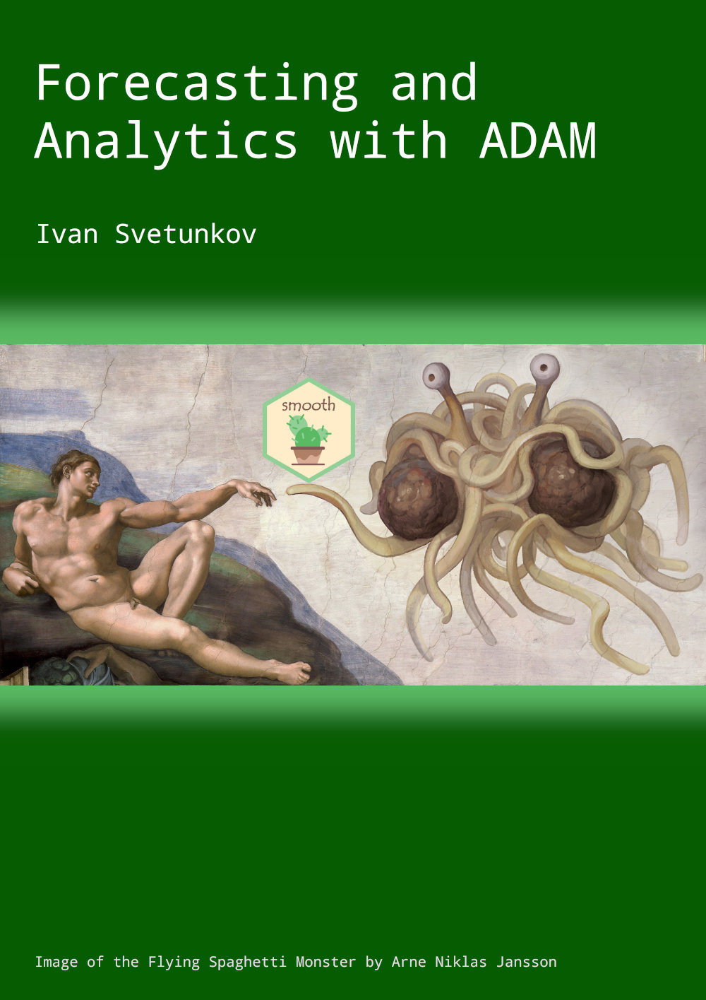

--- 
title: "Forecasting and Analytics with ADAM"
author: "Ivan Svetunkov"
date: "`r Sys.Date()`"
site: bookdown::bookdown_site
output: bookdown::gitbook
documentclass: book
bibliography: [library.bib, packages.bib, websites.bib]
csl: elsevier-harvard.csl
biblio-style: elsevier-harvard.csl
link-citations: true
github-repo: config-i1/adam
description: "This textbook explains how to do time series analysis and forecasting using Augmented Dynamic Adaptive Model, implemented in smooth package for R."
---

# Preface {-}

```{r ADAMFSM, echo=FALSE, out.width='60%', fig.align='center'}

```


What is ADAM?

ADAM stands for "Augmented Dynamic Adaptive Model". It is "Augmented", because it is not just ETS or ARIMA, it is a combination of the two with additional features. It is "Dynamic", because it includes ETS and ARIMA components (dynamic models). It is "Adaptive", because it has mechanism of update of parameters of explanatory variables. It is one framework for constructing ETS / ARIMA / Regression, based on more advanced statistical instruments. For example, classical ARIMA is built on the assumption of normality of the error term, but ADAM lifts this assumption and allows using [other distributions](#distributions) as well (e.g. Generalised Normal, Inverse Gaussian etc). Another example, the conventional models are estimated either via the maximisation of the likelihood function or using basic losses like [MSE or MAE](#errorMeasures), but ADAM has a wider spectrum of losses and allows using custom ones. There is much more, and different aspects of ADAM will be discussed in detail later in this textbook. For now, here is a brief list of features available in ADAM:

1. ETS;
2. ARIMA;
3. Regression;
4. TVP regression;
5. Combination of (1), (2) and either (3), or (4);
6. Automatic selection / combination of states for ETS;
7. Automatic orders selection for ARIMA;
8. Variables selection for regression part;
9. Normal and non-normal distributions;
10. Automatic selection of most suitable distributions;
11. Advanced and custom loss functions;
12. Multiple seasonality;
13. Occurrence part of the model to handle zeroes in data (intermittent demand);
14. Model diagnostics using plot() and other methods;
15. Confidence intervals for parameters of models;
16. Automatic outliers detection;
17. Handling missing data;
18. Fine tuning of persistence vector (smoothing parameters);
19. Fine tuning of initial values of the state vector (e.g. level / trend / seasonality);
20. Two initialisation options (optimal / backcasting);
21. Provided ARMA parameters;
22. Fine tuning of optimiser (select algorithm and convergence criteria);

All these extensions are needed in order to solve specific real life problems, so we will have examples and case studies later in the book, in order to see how all of this can be used.

This textbook uses two packages from R, namely `greybox`, which focuses on forecasting using regression models, and `smooth`, which implements Single Source of Error (SSOE) state space models for purposes of time series analysis and forecasting. The textbook focuses on explaining how ADAM ("ADAM is Dynamic Adaptive Model" - recursive acronym), one of the `smooth` functions (introduced in v3.0.0) works, also showing how it can be used in practice with examples from R.


If you want to run examples from the textbook, two packages are needed [@R-greybox; @R-smooth]:
```{r eval=FALSE}
install.packages("greybox")
install.packages("smooth")
```

Some explanations of functions from the packages are given in my blog: [Package greybox for R](https://forecasting.svetunkov.ru/en/category/r-en/greybox/), [Package smooth for R](https://forecasting.svetunkov.ru/en/category/r-en/smooth/).

A very important thing to note is that this textbook **does not use `tidyverse` packages**. I like base R, and, to be honest, I am sure that `tidyverse` packages are great, but I have never needed them in my research. So, I will not use pipeline operators, `tibble` or `tsibble` objects and `ggplot2`. It is assumed throughout the textbook that you can do all those nice tricks on your own if you want to.

If you want to get in touch with me, there are lots of ways to do that: comments section on any page of [my website](https://forecasting.svetunkov.ru/), [my Russian website](https://ivan.svetunkov.ru/), [vk.com](https://vk.com/isvetunkov), [Facebook](https://www.facebook.com/isvetunkov), [Linkedin](https://www.linkedin.com/in/isvetunkov), [Twitter](https://twitter.com/iSvetunkov).

You can also find me on [ResearchGate](https://www.researchgate.net/profile/Ivan_Svetunkov), [StackExchange](http://stats.stackexchange.com/users/87585/ivan-svetunkov) and [StackOverflow](http://stackoverflow.com/users/5296618/ivan-svetunkov), although I’m not really active there. Finally, I also have [GitHub](https://github.com/config-i1) account.

```{r include=FALSE}
# automatically create a bib database for R packages
knitr::write_bib(c(
  .packages(), 'bookdown', 'knitr', 'rmarkdown', 'smooth', 'greybox', 'vioplot'
), 'packages.bib')
# Load the necessary packages
library("latex2exp")
library("kableExtra")
library("statmod")
library("pracma")
library("greybox")
library("smooth")
library("vioplot")
```

---

You can use the following to cite the online version of this book:

::: adamCitation
- Svetunkov, I. (2021) Forecasting and Analytics with ADAM: Lancaster, UK. openforecast.org/adam. Accessed on [current date].
:::

If you use LaTeX, the following can be used instead:

```{r eval=FALSE}
@MISC{SvetunkovAdam,
    title = {Forecasting and Analytics with ADAM},
    author = {Ivan Svetunkov},
    howpublished = {OpenForecast},
    note = {(version: [current date])},
    url = {https://openforecast.org/adam/},
    year = {2021}
}
```

### License {-}

This textbook is licensed under [Creative Common License by-nc-sa 4.0](https://creativecommons.org/licenses/by-nc-sa/4.0/), which means that you can share, copy, redistribute and remix the content of the textbook for non-commercial purposes as long as you give appropriate credit to the author and provide the link to the original license. If you remix, transform, or build upon the material, you must distribute your contributions under the same CC-BY-NC-SA 4.0 license. See [the explanation on the Creative Commons website](https://creativecommons.org/licenses/by-nc-sa/4.0/).

### Acknowledgments {-}
I would like to thank Tobias Schmidt for his help in refining earlier parts of the textbook and correcting grammatical mistakes.
