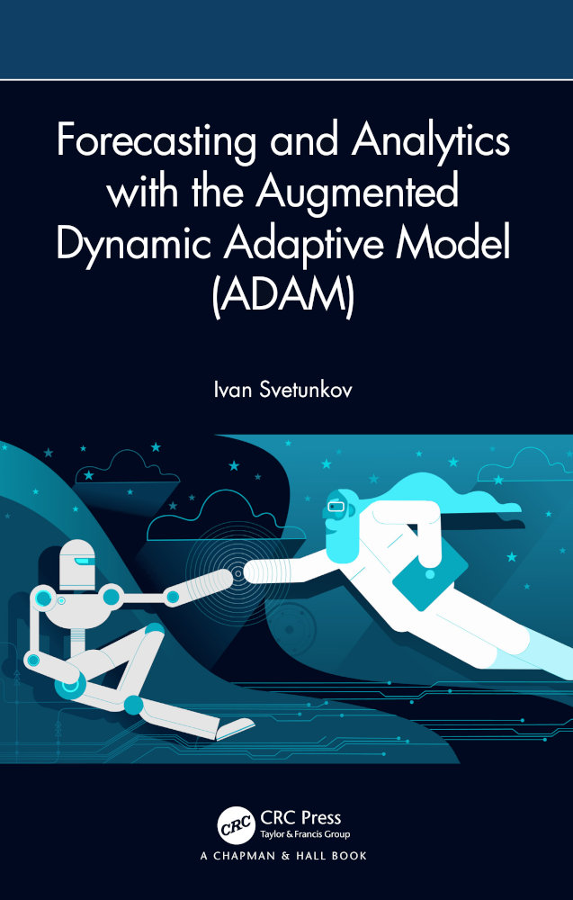

--- 
title: "Forecasting and Analytics with the Augmented Dynamic Adaptive Model (ADAM)"
author: "Ivan Svetunkov"
date: "`r Sys.Date()`"
site: bookdown::bookdown_site
output: bookdown::gitbook
documentclass: book
bibliography: [library.bib, packages.bib, websites.bib]
csl: elsevier-harvard.csl
biblio-style: elsarticle-harv
link-citations: true
github-repo: config-i1/adam
description: "This monograph explains how to do time series analysis and forecasting using Augmented Dynamic Adaptive Model, implemented in the smooth package for R."
---

# Preface {-}

```{r ADAMFSM, echo=FALSE, out.width='60%', fig.align='center'}

```

### Disclaimer {-}

This is the online version of the monograph that will be published by Chapman and Hall/CRC on 8th November 2023. You can find out more about the book and purchase (pre-order) it on the [website of the publisher](https://www.routledge.com/Forecasting-and-Analytics-with-the-Augmented-Dynamic-Adaptive-Model-ADAM/Svetunkov/p/book/9781032590370).


### Who is this book for? {-}

This monograph assumes that the reader has a good understanding of statistics and a good knowledge of regression analysis. Some chapters rely on more advanced topics, including likelihood and information criteria. These are explained, for example, in @SvetunkovSBA. Some parts of the book also use linear algebra to show how various properties of state space models are derived. However, these can be skipped by a reader who is not comfortable with higher maths without losing in the understanding of the main idea of models. Furthermore, while the monograph is self-sufficient to a large extent, it does not contain a detailed discussion of special cases of state space models (e.g. the local level model is only discussed in passing in Section \@ref(SESandETS), while the local trend is covered in Section \@ref(ETSExamples)). The reader interested in knowing more about some special cases is referred to the @Hyndman2008b monograph. Finally, while the monograph starts with the basics of forecasting and explains some of the simple forecasting techniques, it does not cover these in detail. A good book covering the fundamentals of forecasting is @Ord2017.

In a more wide sense, this book is written for data scientists, computer scientists, and data, business, and marketing analysts who work in forecasting or want to learn more about univariate forecasting using statistical models.


### What is ADAM? {-}

ADAM stands for "Augmented Dynamic Adaptive Model". The term "adaptive model" means that the parameters of the model change over time according to some assumed process. The word "dynamic" reflects the idea that the model has time series related components (ETS, ARIMA). Finally, the word "augmented" is included because ADAM is the model that supports additional features not included in the conventional ETS/ARIMA. ADAM is a unified framework for constructing ETS/ARIMA/regression, based on more advanced statistical instruments. For example, classical ARIMA is built on the assumption of normality of the error term, but ADAM lifts this assumption and allows for using other distributions as well (e.g. Generalised Normal, Inverse Gaussian, etc). Another example: typically the conventional models are estimated either via the maximisation of the likelihood function or using basic losses like MSE or MAE (see Section \@ref(errorMeasures)), but ADAM includes a broader spectrum of losses and allows using custom ones. There is much more, and we will discuss different aspects of ADAM in detail later in this monograph. Here is a brief list of ADAM features:

1. ETS (Chapters \@ref(ADAMETSIntroduction), \@ref(ADAMETSPureMultiplicativeChapter) and \@ref(ADAMETSOther));
2. ARIMA (Chapter \@ref(ADAMARIMA));
3. Regression (Chapter \@ref(ADAMX));
4. TVP regression (Chapter \@ref(ADAMX));
5. Combination of (1), (2), and either (3) or (4);
6. Automatic selection/combination of states for ETS (Section \@ref(ETSSelection));
7. Automatic orders selection for ARIMA (Section \@ref(ARIMASelection));
8. Variables selection for regression (Section \@ref(ETSXSelection));
9. Normal and non-normal distributions (Sections \@ref(ADAMETSAdditiveDistributions) and \@ref(ADAMETSMultiplicativeDistributions));
10. Automatic selection of most suitable distributions (Chapter \@ref(ADAMSelection));
11. Multiple seasonality (Chapter \@ref(ADAMMultipleFrequencies));
12. Occurrence part of the model to handle zeroes in data (intermittent demand, Chapter \@ref(ADAMIntermittent));
13. Modelling scale of distribution (GARCH and beyond, Chapter \@ref(ADAMscaleModel));
14. Handling uncertainty of estimates of parameters (Chapter \@ref(ADAMUncertainty));
15. A variety of ways to produce forecasts for different situation (Chapter \@ref(ADAMForecasting)).

All these extensions are needed to solve specific real life problems, so we will include examples and case studies later in the book to see how all of this can be used. The `adam()` function from the `smooth` package for R implements ADAM and supports the following features:

1. Model diagnostics using `plot()` and other methods (Chapter \@ref(diagnostics));
2. Confidence intervals for parameters of models (Sections \@ref(ADAMUncertaintyVCOV) and \@ref(ADAMUncertaintyConfidenceInterval));
3. Automatic outliers detection (Section \@ref(diagnosticsOutliers));
4. Handling missing data (based on the model in Chapter \@ref(ADAMIntermittent));
5. Fine-tuning of persistence vector (smoothing parameters, discussed briefly in Section \@ref(ADAMInitialisation));
6. Fine-tuning of initial values of the state vector (e.g. level/trend/seasonality, see Section \@ref(ADAMInitialisation));
7. Two initialisation options (optimal/backcasting from Section \@ref(ADAMInitialisation));
8. Advanced and custom loss functions (Chapter \@ref(ADAMETSEstimation));
9. Manual parameters for ETS, ARMA, and regression;
10. Fine-tuning of the optimiser (selection of optimisation algorithm and convergence criteria, Section \@ref(ADAMInitialisation));
11. Scale model via the `sm()` method (Chapter \@ref(ADAMscaleModel)).

This monograph uses two packages from R, namely `greybox`, which focuses on forecasting using regression models, and `smooth`, which implements Single Source of Error (SSOE) state space models for time series analysis and forecasting. The monograph focuses on explaining how ADAM, one of the `smooth` functions (introduced in v3.0.0), works, also showing how it can be used in practice with examples from R.


If you want to run examples from the monograph, two R packages are needed [@R-greybox; @R-smooth]:
```{r eval=FALSE}
install.packages("greybox")
install.packages("smooth")
```

Some explanations of functions from the packages are given in my blog: [Package greybox for R](https://forecasting.svetunkov.ru/en/category/r-en/greybox/), [Package smooth for R](https://forecasting.svetunkov.ru/en/category/r-en/smooth/).

An important thing to note is that this monograph **does not use `tidyverse` packages**. I like base R, and, to be honest, I am sure that `tidyverse` packages are great, but I have never needed them in my research. So, I will not use pipeline operators, `tibble` or `tsibble` objects and `ggplot2`. I assume throughout the monograph that you can do all those nice tricks on your own if you want to.

```{r include=FALSE}
# automatically create a bib database for R packages
knitr::write_bib(c(
  .packages(), 'bookdown', 'knitr', 'rmarkdown', 'smooth', 'greybox', 'vioplot', 'pracma', 'legion'
), 'packages.bib')
# Load the necessary packages
library("latex2exp")
library("kableExtra")
library("statmod")
library("pracma")
library("greybox")
library("smooth")
library("vioplot")
```


### How to cite ADAM {-}

You can use the following to cite the monograph:

::: adamCitation
Svetunkov, I. (2023). Forecasting and Analytics with the Augmented Dynamic Adaptive Model (ADAM) (1st ed.). Chapman and Hall/CRC. https://doi.org/10.1201/9781003452652
:::

If you use LaTeX, the following can be used instead:

```{r eval=FALSE}
@book{SvetunkovAdam,
    author = {Ivan Svetunkov},
    isbn = {978-1-003-45265-2},
    publisher = {Chapman and Hall/CRC},
    title = {Forecasting and Analytics with the Augmented Dynamic Adaptive Model (ADAM)},
    doi = {10.1201/9781003452652},
    url = {https://openforecast.org/adam/},
    year = {2023}
}
```


### License {-}

This monograph is licensed under [Creative Common License by-nc-sa 4.0](https://creativecommons.org/licenses/by-nc-sa/4.0/), which means that you can share, copy, redistribute, and remix the content of the monograph for non-commercial purposes as long as you give appropriate credit to the author and provide the link to the original license. If you remix, transform, or build upon the material, you must distribute your contributions under the same CC-BY-NC-SA 4.0 license. See [the explanation on the Creative Commons website](https://creativecommons.org/licenses/by-nc-sa/4.0/).

### Acknowledgments {-}
I would like to thank Robert Fildes for his comments about this book and helping in shaping it into a monograph and J. Keith Ord for his invaluable suggestions for improvement of the monograph. I also would like to thank Tobias Schmidt and Benedikt Sonnleitner for correcting grammatical mistakes.
